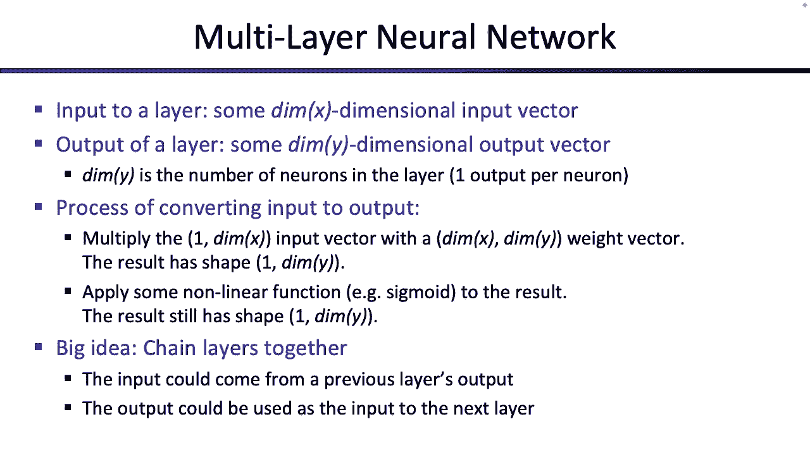

# P27：[CS188 SP23] Lecture 26 - Machine Learning_ Neural Networks - 是阿布波多啊 - BV1cc411g7CM

好的，在我们开始之前，我知道只有两分钟的路程，但我今天不想走得太远，如果有的话，我只想偷几分钟，这不像在范围什么的，我想给你提个醒，在我们开始之前，所以有一点是，呃，今天的很多幻灯片都是全新的。

我只是想做，所以其中一些可能是未经测试的，所以他们的错误，我们会试着一起抓住他们，今天的课看起来也很长，就像如果有人下载了幻灯片，就像将近一百张幻灯片，不是我们加了什么新东西，更重要的是。

有很多事情我觉得我们很快就完成了，或者我们没有花足够的时间谈论，所以如果我们只是这样做了，你知道的，意识到曾经存在，他们矮了很多，但我觉得他们也跳过了很多人们有时会感到困惑的步骤，所以我所做的就是。

我拿了同一套幻灯片，和我们每年在这门课上谈论的内容一样，我只是想把它摊开一点希望能把东西拿起来一点，好的，所以这就是希望，但事情有点未经测试，所以这是一个公平的警告，我们今天在一起，这是第一个警告。

在我们开始之前，我想给你的第二个警告，今天有很多数学，这是神经网络讲座，这就是所有现代人工智能技术的地方，当你看到，你知道所有这些就像大语言，生成模型，比如GitHub，副驾驶或GPT四号或其他什么。

你看到的地方，像图像生成模型，几乎所有的都是由神经网络驱动的，你今天看到的所有花哨的东西就像一个讲座，我们可以谈论它，也只有一节课，因为我们只是要触及它的表面，如果我们要得到更详细的，这将是一种数学。

所以你会看到，这可能是最数学的讲座，我们整个学期，会有很多地图，我们需要你记住，就像一些微积分，一些线性代数，一些概率如此公平的警告，有很多数学，我们会一起努力度过难关，但如果你想知道为什么。

我们没有花整个学期的时间来讨论背后的方法，最先进的技术是因为它背后有很多数学，这不是我们所拥有的先决条件，如果你今天有什么好奇的话，一个99花了一整个学期的时间谈论，我们今天讲的其他一些技术。

然后一八二也花了一整个学期的时间谈论，我们今天讲的一些技术，对呀，这两个类有更重的先决条件，但如果你对更多和最先进的技术感兴趣，这些是要上的课，这就是你的警告，如果我们刚到这里，我们什么都没说。

除了关于这些幻灯片的几个警告之外，有点新，也有点映射，记住，让我们开始吧，让我们完成一些感知器，谈谈如何改进它，然后我们将过渡到优化神经网络，这是感知器，我们以前见过这种东西，它是做什么的。

它接收一些特征向量或一些输入向量，通常我们把它写成F，但今天我们把它写成X，你很快就会看到，这有点有用，但是取一些特征向量或一些输入向量，like x将每个输入特征向量元素乘以权重，所以它就像一个点积。

然后如果点积大于零，然后我们预测第一类，如果点积小于零，我们预测零级，如果是平局谁知道呢，选择决胜局，小东西，这是我们用来分类的，我们详细地讨论了如何训练它，最后一次，所以在我们停止或右边之前。

我们停下来的地方，我们要告诉你几个财产，这些也是人们问的问题，非常好的财产和非常惊人的财产，这个感知器不是一个非常复杂的算法吗，你只要做一个点积，检查它的符号，然而，这个小算法实际上足够强大。

可以分离任何线性可分离的数据，所以我的意思是，如果你有一些数据，比如齿轮，得到一堆加减是，如果有一条线可以分隔数据，感知器会发现它，这有点酷，这就是可分性，对呀，另一个好的性质是收敛。

这意味着它会在有限的时间内找到它，所以如果你运行这个东西足够长的时间，它不停地检查这些数据点，并一遍又一遍地对它们进行训练，你会发现分割线现在已经很好了，那不可分离的案子呢，那么像这样的案子呢。

在你可能明亮的地方，根本不可能画一条线把这两个阶级分开，嗯，感知器确实给了你一些保证，关于你犯的错误的数量，你可以证明，尽管我们不会，但你知道，它将无法完成训练或找到分离线，仅仅因为根本没有。

那么在这种情况下我们该怎么办呢，似乎大多数数据可能没有被一条线分开，那么会发生什么，感知会来回摆动，所以它可能会找到这条线，然后它找到另一个有错误的点，并将切换到这条线，我可能会来回切换。

当您不断传入新的数据集时，总会出错的，因为你永远找不到一条线是零错误的，所以感知器会永远运行，它永远不会停止，那不是很好，一种粗糙的溶液，什么样的作品，但不是真的是，也许只是为了把在两者之间拍打的线条。

把它们的平均值，也许是这样的，这是平均的线之间的拍打，也许这是个不错的答案，但这还是有点古怪，对呀，嗯，所以我们面临的一个问题是，如果数据是不可分割的，这种感觉会永远持续下去，另一个问题是。

即使数据是可分离的，感知器不能保证你的解决方案有多好，我们还没有量化什么是好的，但如果你看看这两条可能的线，这两者都是可能的，感知器可能给你的解决方案，从感知器的角度来看，这两个都可以。

他们达到了百分之百的训练准确率，他们没有犯错，所以你们都很好，但就像其中一个似乎会比另一个更好地概括，对呀，如果我想把这个感知器用在，我从未见过的新数据，在我看来这条线能更好地区分。

然后这条线触及了一堆布鲁斯，只是勉强通过，所以感知器不担心这个，它只是找到了一条分界线，但不知何故，我们想找一条更好的分界线，有一条更好的分离线意味着什么，我们还没有定义，好的，所以我们不想要感知器。

几乎踩到了一个更好的好处，好的，也有过度拟合的问题，就像往常一样，所以如果你训练太刻苦，你可能会发现一条线不能很好地概括，太合身了，但就像往常一样，当你有过度适应的问题时，用一些伸出来的数据来检查。

一旦你注意到持有的数据，你没有训练的开始变得不那么准确，或者你对所持有数据的准确性开始下降，这是你应该停止训练的好兆头，好的，所以我们解决了第三个问题，第一个解决方案有点古怪。

但这些仍然是我们想做得更好的问题，这就是我们要开始的，然后我们将扩展到神经网络，这些都是问题，让我们试着解决它们，所以所有的问题都回到了这个不可分离的案子上，也就是当你不能把数据点分开的时候。

这不是你能做的感知器只是不知道该怎么做，它将不得不犯一些错误，所以也许我们要找的不是一个确定性的决定，我给你一个观点，感知器说这是零级，或者这是一级的，也许我们想要的更像是一个概率决定。

所以也许当有人给你一分的时候，你真正想说的不是这个，或者这是零类，但你想给出类似的概率，你想说什么，如果我在这里给你一分，我们用不同的颜色，但在这里给你一个观点，我就像，你知道这是什么课吗。

它就在边界上，所以与其用一些奇怪的决胜局或猜测零，或者猜一个，也许你想说点什么，我不知道，这个东西有概率，点5的红色和点5的蓝色，所以现在你给出了概率，而不是只给出一个答案。

或者如果有人在这里给你一个点，说嘿，这是什么课，也许你想说点什么，我很确定是蓝色的，百分之七十，但有百分之三十的机会，我想是红色的，对或者可能像在这个区域，我想说事情百分之七十是红色的。

百分之三十的蓝色，好的，你有点继续前进，也许你离边界越远，你就越有信心这是一个或另一个类，所以不是把它们分为红色或蓝色，你真正想要的是，你想要一个你认为点是红色的概率，你认为点是蓝色的概率，所以我们从。

说东西总是红色的，总是蓝色的，给出概率分布，你认为是哪一个，那么这在数学中会是什么样子，当我们做确定性决策时，它是这样的，那么我们该怎么办，这是一遍又一遍地使用相同的感知算法，也就是你把特征。

你用重量取一个点积，你得到一个数字，那部分只给你一个数字，我们就叫这个号码z，我们为什么叫它Z，我不知道这是一封额外的信，然后我们该怎么办，我们说过，如果z为正，然后你分类一个或正类，这里有另一种说法。

另一种说你做了什么的方式是分类器以100%的概率说，我想这是一级的，这就是确定性感知器做对的地方，当我告诉你这是一级的时候，它基本上是在告诉你，这是百分之百的，肯定是一级的，因为我只能告诉你这些。

然后如果Z，也就是点积是负的，那么分类器将猜测负一或负类，另一种说法，那就是当你猜测否定类的时候，你是说它是正类的可能性为零，所以我就带了一个，减去一个猜测，并将其转换为，某种特定的概率。

感知器正在暗示或给予你，我们也可以把这个画成一个图，这是它的样子，那么这个图是什么，这个x轴，这是，这是点积，就在点积为负时，就是这里的整个范围，感知器输出的概率为零，因为它说它不是，不是加一。

它是负1，然后当感知器输出，或者点积输出为正，感知器说这是一个积极的类，加一个，所以加一的概率是百分之百，所以如果我把它画出来，点积的可能输出，感知器告诉你它是类加一的概率，你会得到这样的东西。

就像一个阶跃函数，一切都在零的负值，然后一旦你到零，它立即切换到百分之一或百分之百的概率，所以这里的一切都是零%的概率，然后你一到这里，所有正数都有百分之百的可能性，但我们真的不喜欢这样。

因为这不会给我们任何不确定性，这对我们处理那些东西不能分开的情况没有帮助，所以让我们试着做得更好一点，这不一定是一个步骤函数，我们可以做得更好一点，这就是我们要做的，我们试图设计一个具有以下性质的函数。

这正是我们在之前的照片中展示的，如果点积真的是正的，那么你应该非常有信心这是加一，所以输出或输入是类的概率，加一应该非常接近一点一，你应该有百分之九十九，确定是加一个，或者应该是九十九点。

百分之九的肯定是加一，然后如果点积为负，真的很消极，那么你要非常自信它是负一级，另一种说法，但是加一的概率应该很小，应该像我就像零点零点零百分之一，确定是加一个对吧，因为那意味着我百分之九十九。

当然是另一个班，如果w乘以f，那么点积就接近于零，也许你想说五五开，我不太肯定是百分之五十加一，百分之五十减去一，或者是百分之六十加一，百分之四十减去一，所以当这个点积接近于零时，你想要接近五点的东西。

所以换句话说，我们在寻找的是我们想再次发挥作用，它试图映射实数，对呀，这里的一切都像，是实数，我想把实数映射到零到一之间的数字，也就是概率，但我不想以这样的方式做这件事，里面有如此激烈的一步。

在那里事情从零到一百瞬间切换，我想要更光滑一点的，你可以在这里选择你的函数，你可以用线性函数，你可以用某种曲线，对，实际上有很多功能，你可以用，你只需要一些函数来将实数映射到零和一。

你会喜欢从0逐渐上升到1的东西，你可以选择很多功能，在实践中使用的是一种叫做乙状结肠的东西，它就像我们刚才说的那样，也就是当激活真的是负的时候，这是一种东西在这里，类加一的概率非常接近于零。

我们认为这是一个消极的阶级，然后当概率或点积真的是正的时候，概率接近正一，因为我们真的很有信心这是加号班，然后中间的东西呢，这是我们不确定的地方，所以说，比如说，如果激活正好为零。

那么这个函数将输出点5，上面写着一半一半，我不知道哪个是哪个，或者如果点积像，你知道第一点什么的，那么它可能不会把这样的东西，那里有60%，肯定是正面类，但没有太多的信心，也许是消极的阶级。

因为点积太小了，这就是函数对吧，函数有一个方程，所以它把它当成一个Z，这也是任何实数，它输出看起来很时髦的东西，它总是会给你一个介于零到一之间的数字，你可以试着插入Z来说服自己这是真的，对呀。

如果Z很大，那么这个指数将非常接近于零，1加1 1比1加一个小数会非常接近1，如果z很小，那么这个数字将会很大，然后一比一加上一个巨大的数字将接近于零对吧，你可以自己玩。

所以我们用这个时髦的符号来表示它，我认为这是铁，等式又来了，只是想提醒你，所以现在我们可以做概率决策，所以有一个非常快的例子，也就是有人给你一个重量，他们给你一分，就像感知器一样，你需要分类什么。

你只需要两样东西，你需要与感知器相关联的权重，然后你需要别人给你的特色输入，这就是你所需要的，你不需要别的了，所以一旦有人给你这个，你可以做出和以前一样的决定，但现在按概率做。

所以让我们先想想如果没有概率，你会怎么做，你拿点积，点积是正的，因为5是正的，你会说正面标签有100%的可能性，我认为是积极的，那是概率方法中的确定性方法，你做同样的事情，也就是你取一个点积。

但是一旦你把点积，你把它插入乙状结肠函数，我们以前看到的一个比一个，加e到负点积，点积是五，当我们插上电源的时候，我们得到这个数字点，九九三三，那意味着你百分之九十九，当然这是正面标签，你就像百分之一。

肯定是负面标签，所以现在你有了一个概率决定，好的，这就是我所做的一切，我什么也没做，我所做的一切，我把分类器从做，是积极的吗，那就是加一个，如果是负数，那就是负1。

我只是把它换成了这个看起来更平滑的函数来吐出概率，是啊，是啊，问题，是啊，是啊，有一个问题是如果你想要偏见会发生什么，所以如果你想要一个偏见，您可以通过添加偏差特性来引入一个。

我们可能没有时间谈论这件事，你可以考虑在权重中加入一点偏差功能，如果你想，好的，这是个好问题，虽然，好的，这里有另一个例子，两个D太难了，让我们举一个例子，我们在这里做什么，我们在一维网格上分类点。

如果这是一个确定性感知器问题，那么你的目标就是画一条线把红色和蓝色分开，你不能在这里这么做，就像，不管你怎么画这条线，就是没有地方画一个分开的边界，把红色和蓝色分开，他们形影不离，所以你想要的是概率。

你想要之前的乙状结肠曲线，所以这是你想要的，你想把所有的点都放在这里，其中x为正，您希望分类器给您接近1的高概率，它告诉你它真的确定这东西是红色的，然后对于这里所有负面的东西，你想要非常低的概率。

因为你想说红色的概率接近于零，换句话说，蓝色的概率真的很接近1，然后中间的东西，你想说你不确定，因为我不知道这可能是红色的，它可能是蓝色的，如果我在这里给你一个新的点，我问你那是红色还是蓝色。

你希望分类器诚实地告诉你它不知道，而不是做出可能是错误的猜测，那么你是做什么的，你拟合了我们以前做的同样的乙状结肠曲线，所以你选择一些边界，我们会告诉你如何选择它，然后你拟合这个乙状结肠曲线，这意味着。

如果x真的是负的，就像在这里的这个区域，把负x代入乙状结肠函数，你得到的数字非常接近于零，这就是你想要的，你想让所有这些东西的概率接近于零，对于这个红区中的所有正数。

如果你把这些真正的正数插入到乙状结肠函数中，你得到的数字接近1，这很好，然后是你不太确定的灰色地带的所有东西，你会得到接近五点的数字，尤其是在这里的中点，你得到的数字正好是0。5，好的，这是感知器。

稍微调整一下，这就是我们所改变的，而不是检查正弦正负，我们取输出点积，然后把它转换成概率，就是这样，这就是你对事物的分类，每次我们谈论这些算法，当我告诉你如何分类的时候，我还得告诉你怎么训练它。

所以在这个例子中，我的一个训练就像感知器一样，在感知器中，我不得不在感知器里，我不得不训练举重，我给了你一个训练重量的算法，现在我得给你另一个训练重量的算法，在这种情况下，对呀，如果我用不同的重量。

我会得到不同的曲线或不同的乙状结肠，所以我在这里用了一个不同的w，我可能得到了一个曲线，看起来像这样，或者是这样的曲线，或者像这样的曲线，我不知道对吧，你必须选择最好的乙状结肠曲线和最好的乙状结肠曲线。

由w确定，那么我怎么把这个东西训练好呢，你以前见过的东西，也就是最大似然估计，还记得那个实验吗，从罐子里抓红色和蓝色的果冻豆，我给了你一个样本，我问你我想给你的概率是多少，我想让你给我一个猜测。

关于所有红豆的概率根据样品好的，我们说好，有很多不同的世界，有一个世界，其中一些软糖豆是红色的，所有的软糖豆都是红色的，像2%的软糖豆是红色的，我想选择一个最大限度地提高我的样本出来的可能性的世界。

同样的事情在这里我们要做同样的事情，有一些统计上的小调整，我们不会有太多时间谈论，所以不是一模一样，但大意是一样的，就是你想知道W，你总是试图为W而训练，但是有很多不同的W。

每个W都有自己匹配的乙状结肠函数，它会把点映射到不同的概率，所以你必须选择正确的W，那么你选择哪一个，你可以想到，就像有这么多不同的交替宇宙在那里，每个人都有自己的W。

所以让我们一个接一个地看看每个宇宙，或者像什么区域在一个，所以在一个特定的宇宙中，W被锁定，或者它是固定的，训练数据出来的概率是多少，训练数据从真实分布中掉下来的方式，以它做得很好的方式。

这只是每个单独训练数据点的所有概率的乘积，所以我在这一步所做的就是，我刚说了训练数据泄露的概率，如果我在w是某个特定值的世界里，它只是所有单个点的乘积，因为我可以独立地对每个点进行采样，这是我的假设。

这个训练数据点掉出来的概率是多少，训练数据点掉得很好的概率，这只是标签出现红色的概率，或者标签是蓝色的，所以我真的不在乎训练数据点在哪里，我只关心它们会不会变成红色，或者变成蓝色。

因此对于每个训练数据点，我真正想要的是我想要这个表情，这是我用英语写的，然后把它转换成数学，我想要它是红色的概率，鉴于它坠落的地方，我所处的世界，或者我想要它出现蓝色的概率，如果它真的是蓝色的。

在训练数据集中，基于，在那里它落到了X和世界，我指的是W，好的，所以它是每个点的所有点的乘积，我想知道它出现的概率，它不是红色就是蓝色，给定x，它在哪里，W是我所处的当前世界，和往常一样。

我不喜欢对很多很多的产品求导，因为这很烦人，概率也会变得很小，非常快，把它们繁殖在一起，所以我就拿一根木头，我记得我的数学小技巧最大限度地利用Arg，产品的最大值，一个函数与取Argmax相同。

如果我记录函数，所以我所做的只是拿了这个东西，将其转换为日志，这很好，因为所有的乘积都变成了总和，所有这些可能性都会很快归零并导致底流，现在它们都是对数概率，更容易处理，没关系的。

所以这只是最后的一个小圆木把戏，但总的来说，这是我想要的，你会一遍又一遍地看到这个方程，所以弄清楚是什么是很好的，没关系，所以再一次，这就是你现在所处的世界，这是当前的权重选择。

权重的选择决定了正确的概率，然后x abi，这只是当前的数据点，无论它在网格上还是超平面上，什么的，为什么这是实际的分类，所以我想要一些事情真的出现蓝色的概率，根据它落下的地方，还有我目前使用的重量。

我想最大化这一点，那么我想做的优化问题是什么，我想在我说到那之前，这些概率是什么，概率是我们刚才谈到的乙状结肠函数，标签呈阳性的概率有多大，给定它在当前类中的位置，这就是我们之前说过的乙状结肠函数。

为什么，因为sigma函数输出概率，这就是我们做对的，它接受了一些激活，也就是w乘以x，然后输出它是正类的概率和概率，就是乙状结肠函数，负类的概率是1减去乙状结肠函数，就像我们之前看到的。

所以一旦我们有了这个，我知道我想最大化，我想选W，这最大化了点实际出现的概率，他们做的红色或蓝色，一个点出来的概率，红色是这个，一个点出现的概率，蓝色还是阴性是这个，这些只是基于我用的感知器。

我可以把一切都放在一起，我得到了一个等式，看起来像这样，与之前相同的方程，唯一的区别是我在w上加上了最大值，我们想要最大值超过w的原因是因为想想要改变什么，你不能改变训练数据，因此W不可用于更改。

并且X不可用于更改，如果训练数据告诉你这个点是蓝色的，你不能像，实际上我想让它是红色的，一定是蓝色的，所以你不能改变x和y，但你可以改变W，W是你在感知器中试图学习或调整的东西。

这就是我们如何在所有可能的w上取最大值，所以有很多不同的世界，每个人都有自己的W，你可以选择你想加入的那个，你想选择W，或者训练数据最有可能，训练数据发生的概率是多少，我们之前计算出的这些方程。

那是逻辑回归，所以所有这些东西都有了一个花哨的名字，所以当你用概率决策做感知器时，使用乙状结肠函数，你在取最大W，它只是训练它，以最大限度地提高训练数据的概率，所有这些捆绑在一起得到了一个特殊的名称。

称为逻辑回归，所以只要稍微修改感知器，你得到了一个新的机器学习算法，所以像新算法解锁，这里有一个例子，因为数字或符号有点难，这通常也是人们开始迷失在符号中的地方，所以感觉到这是很自然的事情。

你看到所有这些符号，就像发生了什么，所以我会试着给你们一个纯粹的数字例子，虽然它很小，你就会明白为什么我们喜欢用符号，所以这堂课的一个共同主题，我试着解决一点，有时我们用符号。

因为写出真正的方程真的很麻烦，人们不想这么做，所以我可能会做几次，我要给你们写出真正的方程式，即使他们真的很讨厌，只是想告诉你为什么人们一般不把它们写出来，也许只是为了让你知道发生了什么。

假设有人递给你一堆训练数据，我给你一个训练数据，你知道两个逗号一，就在那儿，这是积极的，给你另一个积极的训练数据，我给你另一个训练数据点，那是否定的，所以我给你一些训练数据，现在。

你可以用这个做任何你想做的事，你可以在上面装一个感知器，可以用上次的感知器算法，找到重量，试着把它分开，感知器可能会找到分离它们的东西这很好，但是假设你想用逻辑回归来分类，这是确定性的感知器做事的方式。

那么你想做什么，您希望找到拆分此数据的W，最好的或将最好的状态分开的，最好地分离数据意味着什么，或者一个W好意味着什么，A W是好的，如果训练数据在其所在的地方着陆的概率很高，所以我想找到最大概率的w。

这实际上是蓝色的，这个其实是蓝色的，这个其实是红色的，这是一种想法，对吧，也许另一种思考方式，就是当你选择一个W的时候，假设我走在W里，所有这些W都在飘来飘去，我挑了一个，这是你一挑W我就想用的W。

你可以为这些点中的每一个点计算一个数字，如果你有一个W，你有一个点，你可以计算概率，这三个下面的概率是多少，他们很好的地方，这只是三者相乘的概率，所以一旦我选了一个W，我可以用W来计算概率。

这是蓝色概率这是蓝色概率，这是红色的，把它们相乘，这就是这些数据点在某个w下出现的概率，我不知道你要尝试一堆不同的W，看看哪一个给你的概率最高，例如，如果我选择了一个非常糟糕的决定界限，比如。

我不知道那种很烂的，如果你选择了这样一个糟糕的决策边界，可能会发生什么，这是蓝色的概率会很低吗，这个是蓝色的概率会很低，刚刚变成红色的概率很低，因为你的界限很烂，你选择了坏的w，所以这将是一个坏的边界。

你知道的方式是因为，根据边界，弹出的概率相当低，你想要一个很好的界限来说这样的话，现在这些是蓝色的概率应该很高，红色的可能性也很高，这就是你想要的，你会喜欢数学计算的方式。

这是你要解决的一个非常严重的优化问题，这是人们不想写出表达式的地方，他们想写一些像这样干净的东西，但我一直觉得这有点难读，所以我会告诉你实际的方程是什么样子的，但请注意这真的很恶心这只是一个玩具问题。

所以你可以想象，如果我这样做是为了更大的问题，我们得到的方程真的增长得很快，这就是为什么人们喜欢用速记，但出于概念上的原因，有时在现实中看到他们真好，所以你一挑一个W我们就说什么。

你可以写出每个点从类中出来的概率，我一挑一个W，我可以写出每个点都是蓝色的概率，或者每个点都是红色的，那么那会是什么样子，我给你举个例子，所以假设我想谈谈这一点，我选了W，它是一个好的吗，是坏的吗。

我不知道，但我选择了它，没有回头路，我一选这个W，我想知道这是蓝色的概率，给定W井，那口井是什么？我们很清楚那是什么，那只是乙状结肠函数，这是蓝色的，或者一个缺口是蓝色的，布鲁斯积极班，对不起。

这是一堂积极的课，所以我们只写乙状结肠函数，就是一比一，加e到负w点积，这个点的w点积是多少，这个点是2乘以w 1加1乘以w 2，这就是等式，根据我选择的w，它有一些未知数w，然后如果我想要对数概率。

我会记录下这个你会在每个数据点做一次，所以总的来说，你得出的方程，我告诉过你这很恶心，这个东西，我的天啊，好的，这是什么是这个点出现蓝色的概率，给定当前权重，分别是w 1和w 2，这个东西是对数概率。

这个点是蓝色的，考虑到你现在的W 1和W 2，然后这个东西有一个负，所以这个是红色的概率，考虑到您当前选择的W一，W2和所有三个都只是乙状结肠的重复应用，因为某物是红色的概率。

或者某物是蓝色的概率是一样的，我告诉过你这很恶心，这就是为什么人们喜欢写总数，因为即使是像这样一个非常小的二维三点玩具例子，等式已经变得有点可怕了，但如果你看看这个，你会注意到只有几个未知数。

还有什么未知数，w 1和w 2，整个粗大函数只是一个很长的粗大函数，和两个修女，w 1和w 2，你的目标是选择最大化这个函数的w 1和w 2，就是这样，所以所有这些训练都归结为一个优化问题。

你想怎么解决这个问题，那由你决定，你可以挑很多W，然后选择一个给你这个粗俗表达最高值的，或者你可以取这个东西的导数，这样做很有趣，让它等于零，然后试着分析一下，最好的一点是什么。

但你可能会发现当地的最佳选择，如果你把这个东西设为零，那是一种选择，对呀，或者你可以做其他数值方法，像梯度上升，我们稍后会讨论，但不知何故，我把我的大训练问题，关于感知器和逻辑回归，和加减分。

我把它转换成了纯粹的优化，你不必了解感知器，在这一点上，你所要做的就是把这个方程，只要做这个方程的人，这是一个有两个未知数w的方程，看起来真的很恶心，但这只是一个方程，就像其他方程一样，有两个未知数。

挑最好的w一w二，就是这样，所以你已经解决了一个非常复杂的感知器机器学习问题，然后归结为这一点上的优化，您所需要的只是您最喜欢的优化技术，你就是这样训练这东西的，所以训练实际上不一定是一个算法。

在这一点上是一个优化问题，挑最好的W，这应该有一个实际的最佳W，这很好，听起来不错，那是逻辑回归，你如何像感知器一样对事物进行分类，除了最后，别光拿牌子，用西格玛得到一个概率，然后你怎么训练这个东西。

你训练的方式，这件事是你解决的，一个优化问题和优化问题在所有权重上的最大值，因为重量是你控制的，也是你努力学习的，你试图优化的是，训练数据点出来的概率，他们这样做的方式，特别是训练数据点为蓝色的概率。

出现蓝色，以及训练数据点为红色的概率，出来红，伟大，所以有一点很好，它解决了我们前面谈到的一堆感知器问题，就像看这两个，从确定性的感知器，这两个都一样好，不在乎，这两个都不错，但从确定性或非确定性。

或者概率感知器，换句话说，Logistic回归模型，其中一个会比另一个更好，它实际上会选择正确的或更好的，因为就像看这里，这两张图都是一样的，这两个都将为方程贡献一个项，我们只是想优化这种东西。

他们两个都将贡献一个日志项，我们想最大化这一点，所以我们喜欢贡献最大的长期可能，所以说，换句话说，这实际上是红色的概率，给定它的当前位置和当前W，这将为优化方程贡献一些项，然后这个也是一样的。

x i和w，他们两个都要贡献一个学期，我们愿意尽可能多地捐款，因为我们想找到一个最大值，嗯，如果你记得你计算的方式，这个东西只是点积上的一个乙状结肠函数，对，如果你好好想想，这个真的很接近这里的边界。

所以这一个可能会得到一个非常低的概率，它是红色的，如果你用这个特定的重量问这个特定的分类器，嘿，你认为这个点是红色的概率有多大，大概是百分之五十一或者百分之五点二，它不太确定，因为它离边界太近了。

所以这对总的贡献概率很低，这很糟糕，当你试图最大化事物时，但是这边这个，它很漂亮，这和你只改变W是一样的，但它离边界很远，所以这会给你更高的价值，它会说我有百分之九十九，当然这是红色的。

这就是数学上证明的方法，左边的比右边的好，弹出来的概率会更高，这是很好的，这就是你想要的，你试图最大化，所以你选择你所看到的一堆不同的W，你选择给你最好概率的，事实证明，界限在你看来更好。

用i测试也会有更好的概率，因为他们对分类更有信心，红色的东西红色的，蓝色的东西蓝色的，但在这里，我们说过的这些线条只是轮廓，或者你知道这条线上的一切都是70年代30的预测是你喜欢的东西，好的。

但我们所做的只是拿分数，把它们转换成预测听起来不错，好的，我们可以用多类二来做这个，所以如果我们用多类来做，让我们记住确定性的方法，首先，确定性的方法是，你每班有一个重量，所以如果你想把最多三个类分类。

你会有三个不同的权重向量，您将用相同的输入特征向量点每个权重向量，然后你挑一个点积最高的，就是这样，这是一个多类感知器，但现在我想把这些转换成概率，因为我想让我的概率感知器输出概率，而不是原始数字。

所以在我开一个生课之前，像这样的是一级，这是二班，这是三班，现在我想要第一类的实际概率，三等，所以这是你要找的东西，我想这破坏了它，好的，这就是你从最初的感知器得到的，所以现在忽略这个。

这是你从最初的感知器得到的，你得到三个数字，都是点积，z 1是具有第一类权重向量的点积，z 2是具有第二类权重向量的点积，z 3是具有第三类权重向量的点积，所以你得到了三个乘积或点乘积。

你是怎么处理它们的，这些可能是积极的，它们可能是阴性的，它们可能是零，这些是实数，但我想从他们身上得到概率，所以我真正想要的是，我想把这三个数字转换成有意义的概率，通过有意义，我是说数字越高。

激活越积极，关联概率越高，或者这个数字真的是负数，我希望概率接近于零，所以和以前一样，我只是用多个类来做，有很多不同的方法可以做到这一点，你可以用线性函数，你可以把它们放大，随便啦。

但人们喜欢用一种特别的方式来做它叫做软极限，这个名字有点奇怪，但你所做的，你拿这三个数字，你把它们指数化，当你指数事物时会发生什么，他们变得积极，所以现在负数没有问题了，因为你不能有负概率，全都没了。

因为你只要取三个的指数，或者你把这三个都求幂，所以你得到三个正数，但这三个正数可能不是概率，它们仍然可能大于一个，所以我正常化，当我归一化时，我只是除以和，现在我得到三个和为一的数字，所以软麦克斯。

你所做的一切，你拿了三个可能是正的数字，负零，无论你拿他们的指数做什么，让他们都是积极的，然后你把它们归一化，除以它们的和，这样你就得到了三个和为一的数字，现在这些是概率，如果你仔细观察并尝试一些例子。

我鼓励你这样做，但我们真的没有时间，你会注意到数字越大，在你把它弄软之后，概率就越接近一个，然后数字越负，概率的接近将为零，这就是你在SoftMax想要的，这里有一个例子，我不打算讲得太详细。

因为它和这个有点相似，呃，单班，但它就在那里，如果你想要的话，所以如果你确定地这样做，你会怎么做，你取特征向量，你会用w一w二w三点缀它，下面是弹出的三个点积，你注意到六个是最好的，因为六和二类有关。

它得到了二级，这是百分之百的可能性，我想是二班的，零概率，我想是一班还是三班，但是看看这些激活，虽然是对的，因为这个是五个，就在不远处，但也许不是总是这么说，我百分之百肯定这是二班，我真正想要的。

我想说的是，我很肯定是二班的，但也许是一级，因为点积并没有落后太多，但绝对不是三等，因为那个太低了，我该怎么做，我把它们塞进软麦克斯，就像我以前做的那样，所以我取5-6和负2的指数，那些不能加在一起。

所以我把它们除以它们的和，然后我把这些拿出来做这些看起来像我们想要的，我想是的对，点积最高的第二类有概率，七点，三个听起来差不多，我很肯定，但不是很肯定，然后我留下一些概率，它是正一，点积是五。

因为它有点像亚军，我不是很确定，但我很肯定不是三等的，所以只有零点零二去了三班，这很好，把我们的分数，把它们转换成我关心的概率，但和以前一样，我只是用多个类做的，你怎么训练这个东西和以前一样。

我想做最大似然的地方，这是同一张幻灯片，我什么话都没改，一点都没有，你想做的一切，就是选择w，它使每个点在类上的概率最大化，就像以前一样，没有任何变化，唯一不同的变化是，概率不再由乙状结肠决定。

由软最大值决定，当你这样做的时候，你得到另一个算法，所以你已经解锁了多类逻辑回归，唯一的变化，我把乙状结肠换成软最大值，这里有一个例子，它基本上是根据你之前看到的改编的，对呀，你有三分，我想选W。

一旦我选了一个W，所以现在W必须分成三个，所以我不知道那是你的W，只要你选了一个W，你在那个W下问自己，这是红色的可能性有多大，这是一个软最大值函数，你可以在W下解，概率有多大，这是绿色的。

那是一台软最大的机器，你可以在W下解，概率有多大，这是蓝色的，那是一个软最大值，你可以解对，它将以你当前的W来表示，现在弹出数字，这三件事的概率以它们所做的方式下降，有很多W，你可以选择最好的一个。

就像优化之前一样，这是一个粗略的方程，就像，我的天啊，这有这么多我不得不喜欢的东西，开始颜色编码，因为这太过分了，但总的来说，这仍然是一个优化问题，如果你很努力地斜视它，唯一的未知数是红色的W一和W二。

一二代表蓝色，一二代表绿色，类有一个权重向量，但这个方程中唯一的未知数是三个W，三个权重向量，所以你所要做的就是在三个权重向量上优化它，找到w一w二红色，一二蓝，一二绿，最大化这个表达式。

然后你就自由了，对呀，就是这样，就像我之前说的，每个项对应于训练点之一的对数概率，你取概率的乘积，换句话说，对数概率之和，这里的每个函数都只是一个软最大值，对呀，它们看起来都很软，归一化的任一指数。

所以看起来很合理，多类与单个类相同，我们只是稍微改变了一下，好的，还有一个类似超参数的你可以调，如果你喜欢，也就是这个乙状结肠函数，这也有点类似于SoftMax函数，它看起来有点光滑。

如果你想让它不那么光滑，你可以用不同的碱基代替e，事实证明，这个东西的性质，乙状结肠或软最大值是这样的，如果你把E调高很多，所以不要用e，而是用e的5到5，所以Z到第五阶的新碱基。

我是说你把它升到Z右边，这东西变得更锋利了，这就是这张幻灯片向你展示的全部，如果你把它调到100，所以你用不同的底座，然后这个东西就变得非常锋利，它开始看起来就像以前的确定性决定。

所以如果你选择用更高的底座，你可以在上面训练或者喜欢，使其成为您可以调优的超参数，那么发生的事情是，如果你的基础较低或较高，你会得到更顺利的决定，或者喜欢更敏锐的决定，如果你有一个高的基础。

如果你的基数这么高，要么一百块，你得到的东西就像以前一样，这边的一切都是百分之百的蓝色，这边都是百分之百的红色，你有点背，由于确定性，所以确定性可以被认为是逻辑回归的一个特例，或者你把那个垒调高了很多。

然后这个东西变得非常锋利，这就是这张幻灯片所说的问题，是啊，是啊，W的值影响曲线的锐度，这是个好问题，我觉得他们会因为如果你有更高的W，你可以迫使点积走得更高，所以你也可以训练，我想W。

它们可能也会影响清晰度，但是如果你想用另一种方法来调整超参数，或者得到一些会影响清晰度的东西，你也可以扔在不同的底座上，如果你喜欢，这是个好问题，所以我认为这可能会影响清晰度，但这取决于你如何训练它们。

好的，这里有一张幻灯片，我们只是有点放大，它只是在那里供你阅读，但是如果你想知道SoftMax是一个多类版本，和乙状结肠这两个类版本是相关的，原来他们之间有很深的联系，如果你做一点代数。

这些都在这张幻灯片上对吧，你实际上可以拿一个袜子麦克斯，直接交换到乙状结肠，这就是上面所说的，所以Sigma是SoftMax的一个特例，因为二元感知器是多类的特例，对呀，所以只是为了你的阅读。

但我不会在这上面花太多时间，好的，感知器就是这样，改进Logistic回归，多类逻辑回归，关于它的最后问题吗，在我们继续讨论神经网络的优化之前，是啊，是啊，是啊，是啊，你如何训练多类。

这只是另一个优化问题，这张幻灯片是这么说的，这就是这道光用符号说的，对呀，完全一样，你只需要拿乙状结肠，用软最大值解它们，如果你想要一个具体的例子，我警告你，你有方程组，它看起来是这样的。

所以就像以前一样，有未知，也就是w，你在W上优化，所以你可以把它简化为一个训练，或者像优化问题，这就是你训练多类版本的方法，好的，还有什么，好的，我不想再看这个了，好的，就像我们说的逻辑回归。

多类逻辑回归，我们把所有的训练问题都归结为一个优化问题，就在那里有一些未知的，通常是W，你只是描绘了最好的W，这最大化了你真正恶心的外观方程，就是这样，所以现在我们可以停止思考感知器和机器学习。

和训练数据集和测试数据集，但你可以把这些都扔了一会儿然后绕个近路，想想你实际上是如何运行这个优化的，所以突然间我们不再与机器学习有任何关系了，就一小会儿，我们将重点关注这样一个事实。

即大量的机器学习训练，包括神经网络训练，我们即将看到的只是与优化有关，你总是可以把它转换成一个看起来很恶心的优化问题，唯一的问题是如何优化，这是一个话题，如果你拿一二七或一二七，这是一整节课的话题。

对吧，我想甚至有两个，两个，七个，如果你想要更多，有一整节课或两节课的主题，只是在优化上，因为它对机器学习至关重要，但当我们谈论它的时候，这实际上与机器学习无关，如果你只是孤立地思考。

所以我们只需要考虑一点优化，但要知道，在这之前，我们还有很多可以谈论的，我们会确保你知道，导数以及如何求点的导数，如果你不，呃，我要说的话，接下来的二十分钟对你来说毫无意义，所以导数是对的，你可以求导。

你可以用点来计算导数，如果你求导，这是一个函数，如果你在某一点求导，就变成了一个数字，对呀，然后如果你在更高的维度上这样做，它就变成了渐变，所以如果你在二维中这样做，这个函数是用x和y表示的。

你想要它的导数，我们称之为渐变，只是高维导数，梯度是数的向量，数的向量，或者方程或表达式的向量，是偏导数，梯度是关于x的偏导数，这就是我们关于x保持y不变的导数，关于Y的部分，在保持x不变的情况下。

它是一个向量，它是表达式的向量，就像以前单词导数是表达式一样，梯度也是表达式的向量，它们变成标量、向量或原始数，当你在某个时候评估它们时，所以我们给你一个点来评估它，变成实际数字，我不给你一分。

这只是一种表达，好的，这些是渐变，它们没有意义，我可能要回来检查一下，但我想把它放在那里，以防万一，好的，就像我们之前说的，有很多不同的方法可以优化，实际上我们已经看到了一种特殊的方式。

也就是从CSP区域爬山参加CSP的讲座，你在CSPS做什么，你有一个任务，但没有成功，然后你决定交换这个，我最后有点像，将节点从红色更改为蓝色或其他，看看会不会好一点，所以当你在给地图上色什么的时候。

把状态从红色变成蓝色，看看你的CSP是否更好看，如果是这样，然后从那里开始做更多的搜索做更多的邻近探索，你就做对了这些，你从某个地方开始，你做出了改变，如果留着它更好，如果不是更好，不要留着它。

然后你不断地做出改变，直到一切都解决了，那是爬山，哇太棒了，我们谈到的CSP是离散的，这意味着你可以去找真正的邻居，把这个红色换成蓝色，或者把这两个，任何权利，有真正的邻居，但是想想在连续空间里这样做。

比如邻居是什么，如果你在连续空间中，所以如果我告诉你你在某个时候，有无限多的邻居你可以去右边，我会告诉你这意味着什么，这里有一个例子，所以我们先做一个D，然后我们就这样概括，就像你爬山之前一样。

但现在你在连续空间里做，所以你在这里，那是你的W零，你想最大化功能，所以你想找到最大化这个d函数的w，有几种方法可以在一个D中做到这一点，你能做到的唯一方法就是，你可以向左走向右走，所以向左一点。

那更糟，往右一点，那更好，让我们向右移动，这就是你要做的，为什么是这样呢？因为在一个D中只有两个方向，你可以向左走向右走，就是这样，你可以减少w零，也可以增加w零，所以你两个都试试，你选一个更好的。

那是一种做事的方式，另一种做事方式，那更有分析性，在这一点上求导，所以方程有点恶心，这只是导数的定义，如果你求导，它告诉你这里的斜率大约是这样的，你注意到导数是正的，所以你朝着积极的方向前进。

或者如果你在这里，你求导告诉你是负的，如果是阴性，然后你想向左移动以获得更高的位置，所以在一维中，你可以求导，导数告诉你往哪个方向走，因为它有点像那个位置的斜坡，这就是你在一个D中做的。

那真是又好又容易，但如果事情我只是要拿DS一个，所以我从一个到两个，现在你在两个D，所以一分为二，这是两个输入参数，然后这个东西的高度是输出参数，所以现在当它把你吹得离题时，你能往多少个方向走。

我会把重点说得更清楚一点，你能往多少个方向走，当我们在一个D，只是左右逢源，但如果你在两个D，有多少个方向可以进去，它从两个变成无限，因为我可以这样走，或者这个方向就像无限多个方向。

我可以从我现在的地方进去，如此突然，一旦维度大于1，我可以移动的方向是无限的，所以我不能用我的小把戏，我只是向左移动，一点点向右一点点，看看哪一个最好，因为我会像任何一样，你知道的。

存在于两个D中的方向，想象三个D或四十或更高的D，方向太多了，我可以进去，我不能全都试，所以这种方法不适用于更高的维度，我得用导数方法，一旦我进入更高的维度，导数法变成了所谓的梯度法。

这就是你收敛在一个叫做梯度上升的东西上的地方，这就是为什么这是很多符号，但你所做的一切都是我们之前说过的，也就是你求导，然后往那个方向走，所以在图片中，如果你在这里，那可能会是什么样子，你拿渐变。

梯度是多少，它是两个表达式或两个数字，如果我在计算梯度，在某一点上，它们变成了实际的数字，所以我可以计算这个东西的梯度，在这一点上，它给了我两个数字，这些数字告诉我该往哪个方向走，所以你可以把它想象成。

如果我拿这个东西的一部分来说，这是这里的W，如果我把这个东西的一部分，它告诉我沿着这个轴，前进的最佳方向是什么，好像是这个方向，如果我取w 2的偏导数，那就会告诉我沿着这个轴，最好的前进方向是那里。

如果我把两个梯度放在一起，他们会告诉我你应该往那个方向走，这就是我要做的，我会朝那个方向迈出一步，所以渐变告诉我可以往哪个方向走，我计算梯度的方法是，我对所有可能的函数求偏导数。

它不像真正奇怪的渐变绘制版本，好的表达是我们刚才说的，也就是，我如何更新W一个，我怎么知道什么是最好的方向，我拿原来的W，然后我添加在一个点上计算的梯度，这是关于W 1的部分，因为我在想一个方向。

我在目前的情况下评估它，也就是w一w二，现在我如何更新W2，这和我取关于W 2的部分是一样的，这是一个表达式，我在某一点上评估它，也就是w一w二，我朝那个方向走去，所以我把这个渐变加到W2上。

在向量表示法中，我们将使用，有时会变成一个倒置的三角形，那是渐变，所以我希望在当前点计算梯度，也就是w，所以我不想要表情，我想要实际的数字很好，梯度是多少，梯度就是偏导数的向量。

我在像W这样的点上计算梯度，那么这些就不会变成这些是表达式，但如果我在某一点上评估它们，它们变成了实际的数字，我可以用这些数字，梯度下降听起来不错，也可以反方向折，如果你想下去，然后它就变得渐变体面了。

这就是梯度，是的问题，什么是阿尔法好问题，我们将用几张幻灯片来讨论它，阿尔法就像一个学习率，所以也许你不想一直朝着，或者你想更进一步，阿尔法就像一个恒定的标量，乘数，可以用来确定每次要走多远，好的。

这是个好问题，因为这是梯度下降的样子，所以你在某个时候开始，这是一个二维网格，我一直在向你展示第三维度，会告诉你每一分有多好，但假设你从这里开始，你确定最陡峭的下降方向在这里。

所以坡度告诉你坡度是这样的，往那边走，所以你迈出了一步，你走到这里，摊位更大，坡度就像越陡，方向越大一步，你最终会接受的，当你开始喜欢靠近山顶，事情开始变得顺利，你采取的步骤变得越来越小。

最终你会到一个地步，希望梯度为零的地方，你知道的，如果你完成后达到了局部最大值，也可能你还没说完，你只是不停地走啊走，最终你认为自己足够优秀，你放弃了，你在很高的维度上做了这个，像四百维梯度下降。

或者像两千维梯度下降，你可能永远无法停下来找到一个局部最大值，但你可以不停地走，走，走，直到你像没有时间，这有点恶心，所以我就跳过它，如果你们不介意的话，这是一个奇怪的数学证明。

它给了你一些我认为很直观的东西，所以如果你觉得有意义，我想我不必花太多时间和你争论，基本上它告诉你当你沿着渐变方向行走时，那是正确的路，当你想把一分钱做对的时候，所以看起来真的很直观，事实证明。

有一个数学证明告诉你，介入的正确方向，渐变的方向似乎有点合理，对呀，所以我不打算在这上面花太多时间，但所有这张幻灯片都在说，你知道，小星星们不应该像考试一样知道这一点，只是想告诉你。

你要移动的方向恰好是渐变的方向，这是将增加你的目标功能的方向，所以往那个方向走，没关系，就像我们之前说的，如果你有一个很高的维空间，梯度变得越来越大，其中每个元素是关于其中一个输入的偏导数，好的。

它是梯度上升，如果我把它从加到减就变得体面了，有人给你一个函数，这个函数是什么，嗯，我们之前看到的似然函数，它可能是一个损失函数，就像我们在机器学习和神经网络中谈论的那样。

但这可以像你想要的任何功能一样，有人想让你找到最好的W，所以最终你的目标，所有这些东西总是这样，你的目标永远是，有很多W，你想选择使w的g最大化的w，W可能是非常高维的，就像我们之前看到的。

可能是巨大的W矢量什么的，但这总是你想要的，对呀，你想要的最大值可能是arg最大值除以g到w，你是怎么做到的，就像我们说的，有很多不同的方法，这不是你唯一可以喜欢的，尝试一堆W，把你评价到W，挑最好的。

你可以试着对这个求导，令它等于零，然后这就是你最好的，分析地做，但对于非常高维的W，方程变得巨大而粗糙，你经常能做的最好的事情是所谓的梯度上升，你在导数的基础上采取一些小步骤，试图达到你的最佳点。

所以它看起来是这样的，你永远迭代，或者直到你累了，一个或另一个，但你迭代直到你快乐，或者直到你累了，或者直到你用完计算时间，你的论文用完了，但你尽可能地迭代，只要你能，每次你做什么。

你把当前的W放在你所在的地方，你想改进一下，你如何改进它，当它是超高维的时候，你怎么知道该向哪个方向移动，你采取渐变梯度告诉你进入哪个方向，认为数学，除了之前和你的直觉，渐变将是你想要移动的方向。

最大程度的提升，加上阿尔法，阿尔法是，如果你想学的快一点或者慢一点，那是你能做的事，你可以自己调整，这是一个超参数，你可能要尝试多个，但你可以想象如果alpha很高，你将迈出非常大的一步，那很好吗。

我不知道，也许你喜欢大步走，也许大的一步会让你喜欢超调，的，最大，我不知道你得检查你的特定问题，在那里你可以选择低阿尔法，会导致你的学习有点慢，但也许现在你不喜欢迈出巨大的步伐，跳过最大值，类似的东西。

所以提供一些你必须选择的东西，它告诉你W更新的速度有多快，或者每次更新有多激烈，所以更新的大小取决于，坡度有多陡，更陡，会给你一个更大的更新，而且更大的alpha会给你更大的更新，如果你想。

这是你必须自己弄清楚的事情，好的听起来不错，呃，让我们把这个问题拉回到逻辑回归上来，记住逻辑回归，你在最大化对数可能性，依赖于w的函数我给了你一个w，你吐出这么大的一些vlog。

我想让你优化一下这个表情，你可以取等于零的导数，或者你可以做梯度上升，你做梯度下降的方式就像我们前面说的，这是w的g，就是我们前面提到的大和函数，你拿渐变，你往那个方向走，把这个渐变，你往那个方向走。

这就是我们正在做的一切，这个对数可能性的一个好处是，而不是纯粹的可能性，它有一个总和而不是一个乘积，多亏了我们的日志，我们对导数和梯度了解多少，嗯，如果你对like求导，你知道如果你对a加b求导，嗯。

这和a的导数加上b的导数不是一样的吗，所以像导数一样可以拆分，当你把它们加在一起的时候，这就是我们在这里所做的，所以不是一次求总和的导数，我实际上可以一个接一个地测量每一个的梯度，然后这告诉我。

我把它们加在一起，他们帮了我，整体的坡度，所以总数还不错，我可以把钱移到外面，然后一个一个的，对，但整体算法是一样的，我只是利用了导数的小特性，好的，这是你能做到的一种方法，但你可能会注意到的是。

想象一下，如果你有一百万个训练数据点，那么这将是一种缓慢，因为你要浪费很多时间计算梯度，的所有梯度之和，就像一百万个不同的训练点，如果到了那个时候，你计算第一个，或者前五个，或者前十个。

你不是已经知道该往哪个方向走了吗？对呀，如果我用前十个训练点计算梯度，前十个训练点已经给了我一个线索，至于我想往哪个方向走，它们可能不是真正正确的渐变，但是有一些信息，所以为什么不利用这些信息来改进W。

一旦我有了消息，所以我不会浪费时间计算一百万个不同梯度的总和，在我迈出一步之前，如果你想这么做，这就变成了所谓的随机上升，这意味着你选择了一个数据点，你只在一个数据点上计算梯度，所以总数就没了。

你只是在一个数据点J上这样做，然后你根据数据点J所说的采取一步，平均来说，这是一个很好的步骤吗，我们认为这是对的，因为梯度下降试图把你带到更高的方向，它不会像第一批那样准确，但现在你可以很快做到这一点。

你可以一次做一个点，所以我在这里所做的唯一不同是，而不是对整个和的梯度求导，然后朝着那个方向迈出一步，我只是每学期都这么做，一次一个，然后每次更新w，所以我在融入我的改进，那就太好了。

但是就像说你有一些并行处理，所以也许在，你知道你有四核处理器，你可以一次计算四个不同的梯度，好吧，对你也有好处，而不是一次一个，你可以一次做四个，它成了快乐的媒介，我们称之为迷你批，因为你没有一次做完。

但你在做一组分，所以说，不管你有多少核心，或者你能做多少相似之处，无论您可以并行执行多少操作，你拿那么多数据点，你计算它们，你知道尽快，然后朝那些方向迈出一步，只要你在做梯度上升的时候能批量处理东西。

这就是我要说的，这是有效的，因为再次，你试图最大化的东西碰巧是很多的总和，许多不同的术语和梯度加在一起，很好那是渐变上升，这是我们喜欢绕道，我们花了15分钟进入优化的世界，在这里你可以做很多其他的事情。

我们不会有时间谈论一件事，我们确实有一点时间，我们下周可能会讨论的，如果我们有时间，就是你如何计算这些导数，就像你从玩具例子中看到的方程，他们已经有点可怕了，对呀，即使你想在这个东西上做梯度上升。

你必须从分析中推导出这个，并在当前点对其进行评估，不管你现在的W是什么，然后朝那个方向迈出一步，然后当你再走一步，你得再开一次，然后朝那个方向迈出一步，你必须继续推导这个，比如你怎么开这玩意儿。

我不知道，我们必须想出一种方法来有效地推导这些，有一些算法叫做反向传播和自动差异，我们会好好谈谈的，如果我们有时间，但这些涉及更多的数学，所以现在我们谈论他们太多了，但要知道。

用所有这些导数来采取步骤也更容易，让他们完成，并采取一些算法来做好的，当，我时间不多，好的，好吧，这里来了一种全新的幻灯片，好像我还没有测试这些值1，但希望他们没事，我将向你们快速介绍一下神经网络。

所以我会告诉你不同的方法，你可以建立一个神经网络，是什么使某物成为神经网络，以及为什么您可能想使用这样的东西，但这是使所有花哨算法的老黄牛，所有花哨的新闻标题，GPT的东西，想法是这样的。

有点像你在照片里看到的，有几种方法可以思考深度学习和神经网络，所以一种想法是，你知道我们在机器学习单元度过了过去的两周，告诉你有人会给你特征，你可以根据它们学习，除了像谁在做这件事，嗯，你可以做到。

您可以编写一小段代码来提取特性，但这需要你提前了解你的问题来提取特征，我不停地对你说嘿，别担心，我们会想出办法的，这就是我们要想出办法的地方，而不是自己编写代码来计算特性，如果你把数据。

然后你要求你试着从数据中学习特征，所以你要求一些算法从数据中学习或提取特征，现在你有了一种叫做深度学习的东西，所以这和我们以前见过的所有其他算法的区别在于，而不是拿走你的数据，就像你的电子邮件。

或者你是数字的图片，并试图自己提取特征，对你分类有帮助的东西，你只是要把它外包给别人，他们会利用这些数据为你找出特征，他们将学习他们认为有帮助的功能，然后这些特性进入分类器，挺酷的，对呀。

让我们看看那是什么样子，这是一种想法，我也会告诉你其他的想法，让我们看看那是什么样子，这是我们的积木，感知器，好的，我们以前见过这个小家伙，它做什么点积，所以它需要一个输入向量，这就是它的重量。

这个重量是特定于这个感知器的，对呀，所以每个感知器都有自己的重量，把它总结在一起，检查它是阳性还是阴性，输出1或零，那是感知器，好的，我们的老朋友，记得我们是如何给它做一点升级的。

所以这里就像感知器的豪华版，这是一回事，除了我所做的，我改变了大于或等于零，检查到乙状结肠函数，所以现在不是只输出一个或零，它输出一比一，一比一，加e到负点积，但是点积是你计算的东西，好的。

那是你的积木，好的，所以一种思路是，或者即将看到，是你第一次想到的，我在努力学习这些特征，并用这些小感知器来学习特征，思考你即将看到的东西的另一种方式，我们要把感知器锁在一起，一旦我们把它们锁起来。

他们有了一个新名字，所以我要停止调用这些感知器，除非我犯错，我要开始称它们为神经元，为什么我不知道，因为它听起来很酷，但我们将开始称它们为神经元而不是感知器。

所以你比以往任何时候都准备好了你的第一个神经元，我们去看看，这是一个非常小的，但这里是神经网络，好的，那么这是怎么回事，嗯，这真的只是很多感知器链在一起，这里没有太多的新事物。

让我们一个一个地分解并检查它们，所以让我们放大这个感知器，这只是感知器，我们以前见过这个小家伙，让我们开始称它们为神经元，这是一个神经元对吧，是神经元利用乙状结肠激活，它在做什么，它接受输入。

我们开始叫x 1 x 2 x 3，我们以前叫他们F，但现在我们要试着学习这些特征，所以我们叫它x 1 x 2 x 3，我们用特定于这个特定神经元的权重来点缀它们，他们会得到所有这些奇怪的亚群。

但别担心他们，它们只是这个神经元特有的重量，我把它们的点积，然后这里出来的任何点积，我用乙状结肠函数把它转换成零到一之间的概率，我得到了一些输出，那是我的感知器，那是我的神经元。

它只是做了普通感知器会做的同样的事情，接受x一x二x三，输入向量用一些特定于感知器的权重来点缀它，我们必须学习计算乙状结肠输出，不管乙状结肠说什么，零到一之间的数字，我要把这件事叫做，哈一。

因为我需要一些符号，你如何计算，哈一，你只需通过感知器运行输入，第一，下面发生了什么，这是另一个感知器，这个感知器将接收与以前相同的输入，所以输入是一样的，但我把它们传递给第二个感知器。

但是第二个感知器可以有另一组权重，但这些重量可能不同，从第一个感知器的重量到第一个神经元，每个神经元都有自己的重量，对呀，或者他们会有相同的重量，由你决定，但这里我们要让它们有不同的重量。

所以x一x二x三，它们点缀着一个不同的权重向量，这是特定于这个神经元的，你得到一个点积，你用乙状结肠，就像我们一直做的那样，你得到另一个输出，也就是H 2，所以我把我的投入。

我把它们通过两个不同的神经元，每个神经元输出为我一个数字，因为这是神经元接受输入的东西，他们计算点积，它们应用乙状结肠函数，然后他们输出一个很棒的数字，我该怎么处理H 1和H 2，一种解释方式。

这是H一两个是你的特征，为什么它们的特征，因为它们是组合，你知道应用于x 1 x 2 x 3的函数，我们希望更有趣，这给了我们线索，所以对这部分网络的一种思考方式，你学到了两个特点。

每个感知器帮助您学习一个特征，现在我们可以把这些特征传递给另一个感知器或另一个神经元，另一种思考方式，只是这两个是我下一个神经元的输入，所以我把神经元链接在一起，那么我现在该怎么办。

这是我在网络中的第三个也是最后一个神经元，我把前面两个神经元的输出，那个，如果你喜欢，你可以把它们看作是功能，为什么它们的特征，因为还有更有趣的事情是通过结合x 1来决定的，x 2 x 3加上一些重量。

所以它们有点像有趣的特征，你希望这些功能，你把它们和另一组特定于这个神经元的权重相乘，它们和其他所有的都不一样，现在一切都是标量，这些是重量，我做点积，就像，我总是应用乙状结肠函数，获取输出。

那个输出是我的最后一个，y，听起来不错，所有的权利，我所做的一切，我取了三个神经元或他们感知器的三个副本，我把他们锁在一起，每个感知器都有不同的权重向量，你可以在第一层学到的东西在这里输入。

也就是x 1 x 2 x 3，您可以只突出您的输入，以最简单的方式，你可以喜欢像素或字数，你把它们发送到两个神经元，每个神经元都有一定的重量，乙状结肠输出的计算，两个数字或两个神经元输出。

你几乎可以想到类似的特征，它们是x 1 x 2 x 3的组合，你希望有趣，然后你把它们传递到第二层，这是另一个神经元，神经元试图利用这两个特征来学习关于输出的一些有趣的东西，给你一个为什么。

这是一个很好的分类，或者一个好的预测，那不是很酷吗？所以没有更多的学习功能，你把一堆神经元链在一起，神经元为你学习特征，这有点酷，这不是一个神经网络吗？你的第一个神经网络。

我也可以把这整件事写成一个函数，所以当你在图片中看到这个东西时，这很好，每当你有一个神经网络，你总是可以把它写成一个非常粗略的函数组合，这就是我们在这里所做的，所以实际上你所做的就是把这个点积。

它与这里的感知器相对应，然后你取这个点积，它对应于下面的神经元，然后你应用一个乙状结肠函数，就像你一直做的那样，所以这对应于这两个对吧，然后这些是你期末考试的输入，呃，神经元，神经元，那么你是做什么的。

你拿着这两个，你把它们点缀成W和W两个，然后你取最后一个w，1，w，2，就是这个点，取最后一个乙状结肠，那是你的输出，所以每当你看到这样的大网络，它实际上只是点积和乙状结肠的重复应用。

以有趣的方式链接在一起，所以如果我想，我总是可以把这些写成非常粗略的方程，这个玩具已经快装不下这个幻灯片了，所以你可以想象这些变得很大，真的很快，但是写这个有点恶心，如果你盯着这个看一点，不会。

感觉可能有一种更紧凑的方式来写这个，代数上，原来有这么多，这里有一种写得紧凑的方法，在代数上是使用矩阵和向量，我们已经知道在感知器中，而不是逐项写出点积，有点恶心，你已经习惯了把它们写成向量。

x的右w点f，其中x的f是向量，w是向量，就像我们如何将感知器写成向量形式一样，我也可以用矩阵形式写出神经网络，矩阵，矩阵和向量，所以我要这么做，所以在这张幻灯片上，这里的一切都是标量。

所有这些都只是数字，整数或实数，我将开始使用矩阵和向量，当我这么做的时候，我会试着用大写字母，但要知道，就像矩阵和向量，好的，所以这一切就像操纵一样，试着让我的计算更干净一点，这个等式很恶心。

但我实际上可以重写这个方程，那就干净多了，看看这里的这个术语，它指的是点积，这个术语也是点积，如果我单向有两个点积，我可以用向量矩阵乘法来表示它们，看一下这里的向量矩阵乘法，这会有什么作用。

它将点x 1 x 2 x 3，用这个特定的权重向量点积会给我这个，这就是我在上面的，然后这个点缀着这个的东西会给我这个术语，我做了什么没什么特别的，我只是把这个非常粗略的方程。

开始用矩阵向量的形式写出来，因为它对我来说更干净，然后最后一个神经元呢，它取了特征或h值，然后把它们组合成点积，我也可以用矩阵向量形式来写，那个看起来更简单一点，你可以看到这个矩阵向量。

用这个矩阵向量点积计算完全匹配，所以我只是用向量和矩阵来写这些，所以我不必单独写每一个重量，但是一旦我写出向量和矩阵，你也必须开始考虑它们的尺寸，我们接下来要做的，所以不写x的向量。

我只是写作为我的输入矢量，而不是写这些权重，这是两个神经元权重，对呀，第一个是第一个神经元的所有权重，这是第二个神经元的权重，我只是把它们放在一个矩阵里，变成了一个很大的旧w矩阵。

里面所有的w都对应于不同神经元的权重，我必须学会输出，这个h是一个向量，我可以把那个矢量，我可以用期末考试来点缀，我的第二层权重矩阵，这里只是一个向量，那个点积给了我一个Y，这是我的最终输出。

在这种情况下，它只是一个数字，所以这里没什么特别的，除了我把我的粗略方程用了很多标量，我对其中的一堆进行了矢量化和矩阵化，试着弄点干净一点的东西，所以好消息是，这个干净多了，我喜欢这个。

因为它只是两个很短的方程，好消息，坏消息是一旦你引入矩阵和向量，尺寸也变得相当重要，所以当我们经历，我们想开始思考这些东西的维度，对吧，它是逐行的，所以x有一行三列，三列表示三个输入向量值中的每一个。

像x一x二x三，这个w是一个三乘二的向量，为什么一个三乘二，有三个，因为每个感知器或每个神经元有三个权重，三个输入向量值的三个权重，所以这三个匹配，这三个我的输入有三个特征值。

所以我的权重向量也需要每个神经元有三个特征值，我有多少神经元，我有两个神经元，所以这个维度告诉我两个神经元，对呀，从这东西里出来的是什么，记住你的矩阵乘法规则，如果你拿一个一乘三，你把它乘以三乘以二。

你会得到一个接两个和一个接两个，这两个表示你有两个神经元，所以你得到两个输出，取这个输出，你把它链到下一层神经元中，我的下一层神经元得到同样的两个神经元输出，把它们乘以重量，每个神经元有多少重量。

每个神经元有两个权重，因为有两个输入，与之前的神经元相反，这个维度是一个，仅仅因为这一层只有一个神经元，如果我一个接两个，把它乘以二乘以一，我一个接一个。

这样我就可以确保所有的维度都匹配并思考它们代表了什么，很多机器学习实际上只是把这些维度磨出来，确保它们匹配，好的，我们会做得更多，所以坚持你的问题，当我们做得更多，看看这些维度，呃。

体操开始变得更有意义，这是我们有史以来第一个神经网络，但我们实际上可以做得更好，所以我们看到了这个，我们该怎么办，我们只是拿了砝码，或者取了最初的重量，或者最初的特征，对不起，不是重量。

我们把它们输入两个不同的神经元的最初特征，两个神经元输出，然后我们链接到最后一个神经元，这给了我们一个最终的输出，但我们不必在两点停下来，对呀，如果它会让你大吃一惊呢，我们用三个更大的神经网络，三个。

而是，这里什么都没变，我所做的唯一改变是这里的这一层，而不是用两个两个神经元，我用三个，所以我加了第三个神经元，第三个神经元仍然接受相同的三个输入，x相同的三个输入，但他们用自己的重量使他们倍增。

所以这个新神经元也有自己的重量，所以我在网络中引入了更多的权重，我必须以某种方式学习，对呀，我应用同样的乙状结肠函数，就像我现在一直做的那样，我有三个神经元，我有三个输出，所以我可以发送所有三个输出。

我几乎可以想象出我希望在最后一个神经元中学习到的特征，它结合了，学习一些有趣的东西，就像它总是很酷一样，就像以前这可以写成一个粗略的方程一样，因为这里的一切都是乘积的总和，比如点乘积和乙状结肠函数。

一遍又一遍地应用，这样我就可以把它写出来，但真的很恶心，我的时间不多了，所以我不会，但我会告诉你，每次你这样做，你可以把你的总方程改写成矩阵向量形式，这就是我在这里所做的。

所以第一个神经元将对应于这个的点积，第二个神经元，也就是这个，对应于点，对应于这个神经元的点积，第三个神经元对应于这个的点积，这三个都弹出来了，所以你得到点乘积点乘积，您将乙状结肠应用于每个元素。

所以这些点积中的每一个都在上面得到一个乙状结肠，就是这里的这个东西，然后得到中间输出，在这一点上，我几乎称之为功能，所以也许我应该叫这些F音符给未来的自己叫这些F好的，最后在你的最后一层你取特征或h值。

你把它们乘以最后一组重量，与这个特定神经元相关的权重，最后你把那个点积，你在最后做乙状结肠，因为你把它弄成乙状结肠，把最后的Y弄出来，所以它是方程的矩阵表示，你总是可以像这样拍一张照片。

并且用非常粗大和非常长的标量术语来写它，如果你想和以前一样，当我有这些矩阵，我可以用这种干净的形式重写它们，这些是相同的方程，尺寸刚刚改变了，所以哪些尺寸变化得很好，这个维度改变了。

因为我有三个神经元而不是两个，所以我需要额外的一列或行，叫一排，我不记得是哪排了，可能是柱子，但你需要一套额外的感知器，你看，我几乎不知道，如果这些是行或列，因为当你习惯了这些。

真正小的低级细节不再重要了，高水平的维度开始变得更加重要，所以我甚至不记得哪些是行，哪些是列，我只关心有一个输出，那是一个形状，某事某事某事三，这意味着有三个神经元，然后我把这三个神经元输出。

我把它们传递到我的最后一个向量问题中，是啊，是啊，有一个问题是关于你如何学习重量，所以坚持这个问题，我们可能下次再谈，但事实证明，学习重量，这些都是非常长的粗略方程，对呀。

所以事实证明学习重量实际上只是在进行梯度下降，关于这些表达式的算法，所有这些表达式都只有未知数w，你知道X是你的训练数据，你知道你的训练数据，所以最终所有这些实际上都是在学习，在W上做梯度下降和优化。

结果发现你有很多很多的W要学，即使在这个玩具网络中，就像看看这个，有十二个W，你必须学会，你得挑一套最好的十二个W，但我们下次会讲到，权重的学习都只是梯度下降或梯度下降。

所以所有这些都可以外包给一个两个，七或任何优化类，你所要做的就是弄清楚你的网络的实际结构，好的很好，这是两个神经元，这两层，三个神经元，所以我在最后五分钟要做的是。

你总是可以加速跑这些或者看着它们慢一点，如果你喜欢，我要把我们做的一些假设，把它们分解，并推广给你一个通用的结构化神经网络，你可以玩弄自己，我要一个一个地打破障碍，尽可能快地概括，好的。

所以以下是我可以概括的事情，我最初加入了真实的数字给你一个看起来合理的例子，但我要开始用类似的变量来代替它们，变量的数量也会很快开始建立，它将向你展示神经网络有很大的自由度，你如何构造它们。

我只给你看了最基本的结构，我也是，我要告诉你在哪里，外面有这么多其他的东西，你可以学习一般的关系，第一名，我有两个神经元，我有三个神经元，如果我有N个神经元呢，我想在这里放多少神经元是没有限制的。

所以我真的可以把它们堆在一起，这就是我在这里所做的，而不是两三个，或，不管我要在这里放多少，如果我再把N放在这里，您可以在这里为每个输出写方程，所以你可以在这里写一个方程，也就是一些点积。

你可以在这里写一个方程，就是一个乙状结肠，不是点积，你可以在这里写一个方程，但那些会很恶心，然后把它们转换成矩阵向量形式，最终你会得到一些看起来和以前一样的东西，但是尺寸会改变。

所以这个维度告诉我有N个不同的神经元，这就是为什么我的输出是长度为n的向量，在这个W矩阵中有n个神经元，有一行或一列，1。我记不清楚哪个是对的，W的每一行或每一列表示一个神经元的权重，所以我需要N个。

这是什么我要弄清楚，n列，好的，大柱和N柱，每一列对应于一个神经元的权重，一个神经元有多少重量，因为我的神经元有三个输入，所以每一个都需要三个砝码，我有N个神经元，这就是三乘n的由来。

所以我拿了我的两个，我的三个神经元，我把它推广到n个更广泛的推广，他说这里只需要三个输入，嗯，没有人，那又怎样，如果我真的把它说得更笼统，我可以有多少输入就有多少输入，我的信快用完了，我要叫它。

x的维数，我发明了它可能不是最好的名字，如果你有更好的就告诉我，但是您可以在这里有任意多的输入，不一定要三个，所以我再概括一下，我写了方程，得到了一些矩阵向量形式，它是这样概括的。

所以这个输入以前是一个接三个，因为你有三个输入，对呀，你的输入报价未报价的特征向量过去有三个井，现在它有x维，我不知道你选了多少，这也意味着在你的体重向量中，每个神经元都需要有更多的重量。

在每个神经元有三个权重之前，每个输入一个权重，但是现在你的尺寸必须有暗淡的x个重量，x的每维一个，对呀，所以如果你输入一百个维度，可能就像你的10乘10像素，或者它有一百个维度的输入。

那么你的每个感知器都需要有一百种不同的权重，所以这个权重向量变高了，对呀，就像你每列需要一百个，然后就像以前我们有N个神经元一样，一共有N列，所以我又概括了一遍，酷，准备好进行更多的推广，这是另一个人。

他说你只需要有一个输出，我可以有两个或三个输出，或，不管我想要多少，所以在这里，没人说，我只需要用一个感知器把它们锁在一起，但我想学两样不同的东西，我可以在这里插入两个输出。

或者两个感知器或者两个神经元，所以我只要把这一层的输出，就在这里，然后再一次，我把它们都吃进每个神经元，所以这有点像一个完全连接的东西，就像这里的神经元接收两个特征输出，然后这个神经元也吸收了两者，或。

无论您有多少特性输出，这是一个完全相连的权利，这如何很好地改变我们的矩阵方程，而不是这个输出，只是一个接一个，我只有一个最后的答案，现在是一个暗淡的Y，DIY在哪里，不管有多少，可能有十万对吧。

因为这个更大，这也意味着你在最后一层有更多的神经元，因为你在最后一层有更多的神经元，这也意味着这个权重向量或权重矩阵，它以前只有一个，所以如果你一直回到我们的一个小家伙身上，你在最后一个里面看到了。

我所需要的只是一个小专栏，它告诉我最后一个小神经元的重量，但如果我有另一个神经元坐在这里，我把所有这些都连接到另一个神经元上，然后我需要另一套砝码，然后我在这里有另一个神经元。

然后我需要把这些连接到这里我需要另一组砝码，神经元中的路线，所以这个也长了，所以这个神经网络中的几乎所有东西都可以适应你的需求，那很酷，我在做什么，输出特性的数量也是可变的，就像输入功能的数量一样。

这很酷，这可能应该设置输出，对不起，再陪我五分钟，当我一路给你的时候，将军，然后我们就可以回家了，好的，对不起，我告诉过你这会有点长，好的，这就是当你完全概括时的样子，一旦你概括得足够远。

你可能不会第一次看到它，好像我不认为我做了，但一旦你把它推广到足够远的地方，事情几乎开始变得像维度游戏，这就是我对这些的看法，所以最终你的目标不再是，比如W是什么，我的网络结构是什么。

最终你的目标几乎就像让尺寸匹配，一个矩阵乘法和很多痛苦，我已经做了，试图建立这些网络就像弄清楚维度是如何匹配的，它会变得很烦人，有时是对的，但就像我们之前说的，这个w是什么，这个w把尺寸x变成了n。

为什么是因为这一层有N个神经元，对呀，我们把一堆神经元堆在一起，他们一个也没有，所以我们需要每个神经元一列，每个神经元有多少重量，每个神经元都有暗淡的，x，权重数，每个输入的一种方式，所以我可以做点积。

这样它们就匹配了，这两个必须匹配，因为我必须让点积真正发生，一旦我这样做，我得到n个输出，n个输出对应于这一层的每个神经元，另一种看待这个的方式，如果你缩放得很远，这整个方程，包括乙状结肠函数。

你所做的一切，你把一个暗淡的x形输入转换成n形输出，你就做了这么多，你取一个dimx输入数的向量，然后将其转换为n的向量，希望这些n看起来像很好地代表MX输入的特性，所以这可能是这样的。

如果你有一张10乘10的照片，这可以像一百个形状，你想学习15个最好的特征，所以这可能是一个乘十五，所以这层权重需要你的100个输入，然后试图找出其中15个最好的特征，这些都是应用乙状结肠的加权组合。

然后第二层也是一样的，第二层，你从前面得到的n个神经元输出，你把它们推到另一个重量矢量中，这个权重向量也有你有多少神经元堆叠在一起，你有多少个神经元，你想要的每个输出都有一个暗淡的Y神经元。

每个神经元有多长，每个神经元，或者每个神经元有多少重量，每个神经元必须有N个权重，因为你输入了n个输入，你需要点积来计算，然后最终输出出来的是成型的DIY，所以另一种放大并真正观察这一点的方法是。

你已经传递了N个特征，利用这些N个特征，你想知道为什么不同的事情，你怎么学它们，权重向量会告诉你，所以当你真正缩小的时候，这些事情真的开始像，将一个长度的特征转换为另一个长度的特征。

或者一个长度的向量和另一个长度的向量，真的很酷给你，我必须向你展示我必须概括最后一件事，然后我们就完成了，最后要概括的是，他说你的训练必须在两点停止，忘了那个，让我们继续把这些锁在一起，让我们疯狂。

哦看看这个，这些的输出是这些的输入，然后这些的输出就是那个的输入，所以我所做的就是加深这个网络，我把它们锁在一起，所以以前我只有两层的链子，变成了这些，然后那些变成了这个。

所以你穿过两层堆叠在一起的神经元，但没人说你不能穿过堆叠在一起的三层神经元，你完全可以做到，有很多话，如果你想读一遍又一遍地告诉你如何正确地工作，你可以看到尺寸在一个非常高的水平上匹配。

你知道在第一层发生了什么，X映射到一些维度，我一个，当我用完符号的时候，维度二层或二层映射，你知道一个一维向量，二维向量和第三层映射，L2D向量到，然而，你有很多输出，所以你真的只是在某个时候玩维度。

有点酷，但谁说你必须在三点停下来，嗯，忘了那个，让我们疯狂地分层网络，所以现在你想要多少层就有多少层，向这个方向，你可以把这些神经元链在一起，只要你想，你也可以在任何一层有任意多的神经元。

所以这个东西可以长到你想要的程度，你想要多大就有多大，这个东西越深，它学到的有趣的东西就越多，我们下次也会更多地讨论这个问题，所以我得把这个包起来，但这是很酷的事情，对吧，这些事情变得越深。

你能学到的就越多，在某个时候，它几乎变得难以理解，这些东西在学什么，但如果你把这些东西越锁越深，越锁越深，它几乎开始像人脑，因为所有这些神经元一起变化，好的，在我让你走之前，还有什么最后的问题吗。

我们下次也会讨论这个问题，好的，这就是神经网络的体系结构，我们下次再讨论怎么训练他们，但我不想让你太晚，好的，再见，对于您的项目文件来说，这也应该足够了，所以只要你有架构，应该可以走了，或者对不起。

你的项目。

