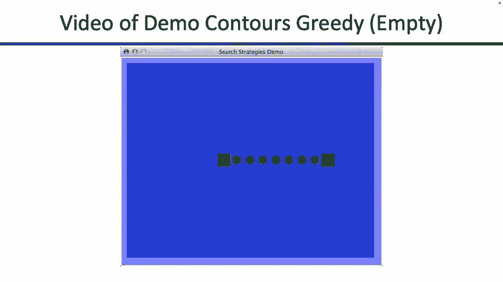
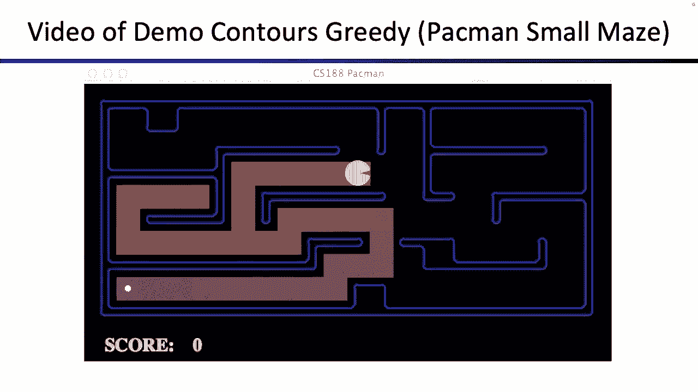
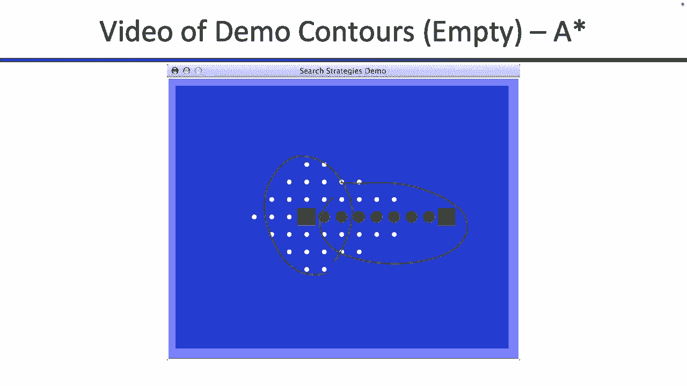
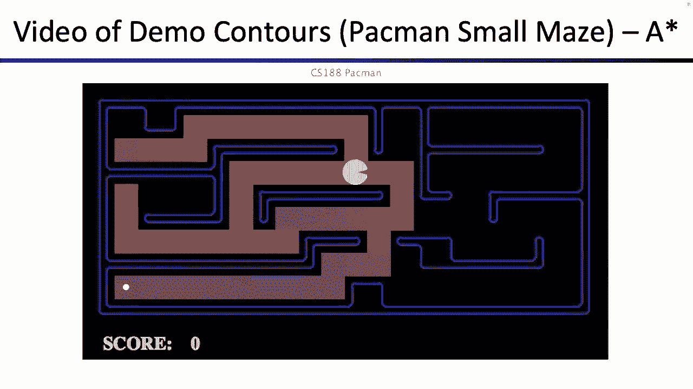
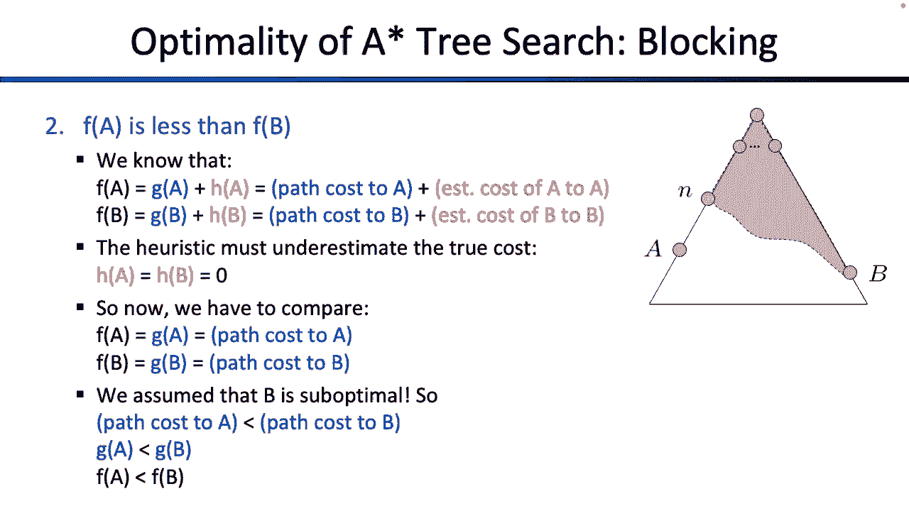
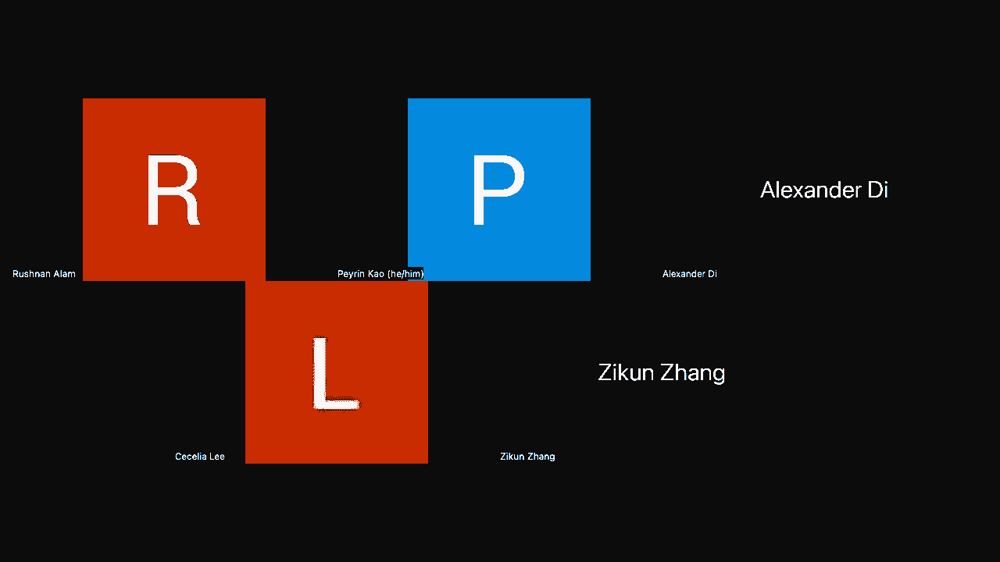

# P3：[CS188 SP23] Lecture 3 - Informed Search_ A_ and Heuristics - 是阿布波多啊 - BV1cc411g7CM

我按下录音键。

很抱歉占用了你十秒钟的时间，但这些都是和上周一样的公告，所以我们为你准备了一些家庭作业，然后项目一出来了，我想是其中一个较长的，所以也许开始吧，如果你还没有，下周五就要交作业了，所以没关系。

现在是五点十分，我可以开始谈论搜索，搜索快结束了，今天是我谈论搜索的最后一天，我想罗素教授可能会再谈谈搜索，但是让我们回顾一下我们上次讨论的内容，然后尝试扩展搜索，然后今天我们将进行恒星搜索。

这有点像所有的顶峰，我们正在构建的搜索算法，那么什么是搜索，记住我们定义搜索的方式，这个非常具体的数学概念，这是当您定义搜索问题时，你得给我美国，就像一个世界可能是什么样子的所有配置的列表。

你得给我行动和成本，哪种构成了后继功能，它告诉我从这个状态，我能到达的其他州是什么，与之相关的成本是什么，然后你给我一个开始状态，给我一个目标测试，这就是如何定义搜索问题。

然后我们开始讨论解决这些搜索问题的通用方法，其中大多数都围绕着搜索树的想法，搜索树代表了你可能制定的所有可能的计划，因此，这些是您可能采取的解决搜索问题的操作序列，这可能是个好时机。

也许说些我应该早点说的话，就是这个搜索树，这是计划，所以它不像，你是机器人，你真的要出去，你在尝试迷宫的每一个角落，你就像，哦，我卡住了，我得回来，所以这个机器人，你不喜欢出去探险，活着看看发生了什么。

你用的是这种模式，有人递给你的，所以有人定义了搜索问题，交给你了，你要用这个模型来喜欢，提前在脑子里好好想想，并为你之前要采取的行动制定一个计划，你真的把它们，所以当你解决这些搜索问题时。

你不是真的出去尝试世界上的事情，你只会在脑子里使劲想，然后希望能想出一系列在现实生活中奏效的行动，所以我想把它拿出来，这就是我们解决这些问题的方法，我们在想这棵树，我们在脑子里建立这些想法。

但我们实际上并没有走出去尝试所有这些可能的道路，然后我们讨论了一堆不同的搜索算法，它们都使用相同的搜索树的思想，唯一的区别就是，我想他们的共同点是，您不想构建整个搜索树，这东西可能很大。

可能是无限巨大的，你不想建造它，所以取而代之的是，您构建了尽可能多的搜索树，以找到解决方案，搜索算法唯一不同的地方是什么顺序，您是否构建搜索树，这就是我们所看到的，所以我们说有一个边缘的想法，这个流苏。

你仍然要探索的所有路径的列表，你仍然需要扩展的部分，昨天或上周所有搜索算法的唯一区别，本周所有的搜索算法是什么顺序，你把刘海上的东西拿下来了吗，这是唯一的区别，其他一切都一样好，关于上次我们讨论的内容。

你还有什么想知道的吗？有点快，好的，这也是搜索的重点，人们开始考虑搜索，就像吃豆人穿过迷宫一样，或者机器人解决所有这些迷宫问题，因为那是很自然的，你知道，解释搜索的方式，所以你开始想，哦。

每一个搜索问题都是一个迷宫，或者就像在罗马尼亚旅行，你还可以把其他问题表述为搜索问题，只要符合这个数学定义，你可以用我们做的任何搜索算法来解决它，所以甚至有看起来不像搜索问题的问题。

但你可以把它们变成搜索问题，所以这里有一个与迷宫无关的例子，和煎饼有关，这是你的煎饼看起来不恶心，看来你没有这么漂亮的一叠，一切都井井有条，你有一些煎饼有点不正常，也许你想翻转一些煎饼。

所以也许你拿着你的抹刀，你把它放在两个煎饼之间，你把上面的两个煎饼翻过来，或者你把它放在第二个和第三个煎饼之间，或者第三次和第四次煎饼，把前三名翻过来，或者你把四个都翻过来，或者你只翻转上面的一个。

所以以下是你可以做的事情，你可以把上面的两个翻过来，你可以翻转前三名，它给你这个漂亮的堆栈，我们会说这是我们的目标，或者你可以把四个都翻过来，所以看起来不像是搜索问题，但是如果定义状态空间。

告诉我煎饼的所有构型，告诉我后继函数是什么样子的，告诉我成本是多少，所以说，也许在这种情况下，我们会说成本是翻转煎饼的数量，但你也可以说，成本和煎饼的大小有关，由你决定。

但是如果你能为我定义所有这些参数，拿着这个煎饼的问题，并按照我们定义搜索问题的方式写出它，你的煎饼问题也可以用深度优先搜索来解决，广度优先搜索，或者我们今天看到的任何东西。

所以这里有一个完全不是迷宫的例子，但它仍然可以用搜索算法求解，你就像，谁会关心这个看起来很琐碎或愚蠢，那么会有人关心这个吗，这里有两个人关心它，所以他们的名字是一个叫威廉·盖茨的家伙，与微软相关联。

从没听说过他，一个叫克里斯托斯爸爸的家伙，是真的，这张幻灯片以前是这样的，更有趣，因为我想他以前教过CS 170，所以这是一对奇怪的思想，但现在有没有人见过这个人或和他们交谈过。

因为我还没有几个很酷的人告诉他们，我向你问好，好的，所以我猜他们关心煎饼的问题，然后我们谈到了，如果你有所有这些状态和后继函数，你可以用几种不同的方式来画，可以把它画成状态空间图，它和树是不一样的。

这棵树是你可能想出的所有部分计划的列表，状态空间图更像是所有存在状态的列表，它告诉你后继函数是什么，你知道就像，后续函数如何将所有的停留连接在一起，所以再一次，很容易看到一个图表或一棵树。

并把它们混合在一起，但在搜索单元中，我们有一个图表和一棵树，它们不是一回事，所以有时会让人困惑，我们讨论了你如何解决这个问题，所以我不打算在这个算法上花太多时间，但你以前见过。

这个想法是你要把这棵树建出来，你不想一下子把它建出来，因为那是超级昂贵和巨大的，您只想构建足够多的树，这样您就可以找到解决方案，和边缘，这是他们圈起来的，以下是树中尚未展开的部分。

所以保留一个你还没有扩展的列表，有条不紊地循环，拿起一个，你拿哪一个，取决于你的算法，你检查一下，你选择的这条路，满足目标，如果它做得很好，你完蛋了，如果它没有，所以就像把树长出来一样。

所以它在那里找到了一个目标，好的，这都是上次的事了，但如果你还想看什么，请阻止我，上次我们谈到深度优先搜索，广度优先搜索，统一成本搜索，他们都很棒，但他们有一个小问题，我意识到这些幻灯片上没有，啊。

这有点可悲，但也许你还记得星星或八星的问题，从统一成本搜索，它向四面八方探索，所以记得我们看到了水演示或搜索演示，你看到了广度优先搜索和统一成本搜索，他们会开始向迷宫的各个方向探索。

尽管这看起来有点浪费时间，如果你知道解决方案是在一个方向上，那你干嘛浪费这么多时间，看着其他方向，所以这就是问题所在，我们今天会花很多时间解决，所以说，而不是从各个方向寻找解决方案，尝试所有不同的路径。

你不想试着寻找过去吗？你知道更有前途，可能会有你要找的目标方向，那就太好了，所以我们要试着为此设计一些东西，基本上所有的设计，或者我们将使用关于目标的信息的所有方式，归结为这个特定的数学函数。

这叫做搜索启发式，单词启发式在CS 1 88之外有一些定义，我不够聪明，不知道，但在CS中，零八，启发式有一个非常具体的定义，这是一个数学定义，它的作用是这样的，它接受一个输入。

所以你还记得你有一个巨大的州名单，和世界的所有配置，你给出启发式，其中一种状态，启发式给你一个实数，是个数字，单数，这个数字告诉你离目标有多近，所以它几乎有点像一个更热的冷机器，所以也许你小时候喜欢。

你玩得就像，哦，我是不是越来越暖和了，我是不是越来越冷了，或者如果你在海滩上，你看到人们拿着金属探测器，他们在寻找宝藏什么的，我想看看，他们离宝藏越来越近了，对呀，所以这个启发式的，从数学上讲。

它是一个函数，接受一个状态并输出一个实数，这个实数代表的是你离目标有多近，所以接近于零的数字可能意味着你非常接近，离零很远的数字，好像你真的很冷，你离目标还差得远呢，启发式的特别之处在于。

这不像我们以前做的搜索算法，所以还记得我们是如何进行深度优先搜索的吗，我们说第一个搜索是一个通用算法，只要你能把你的问题，不管是罗马尼亚旅行还是煎饼翻转，或者解谜。

如果你能把你的问题从数学上定义为搜索问题，那么深度优先搜索可以解决它，广度优先搜索可以解决这个问题，启发式并不完全像启发式，你必须为你的特定问题设计，所以一个对煎饼问题很有效的启发式。

它可能不会告诉你任何关于你在罗马尼亚有多近的事情，或者你在迷宫里的哪里，所以对于你的来说，你必须设计它，取决于您试图解决的搜索问题，所以你可以把搜索看作是一个由两部分组成的谜题。

第一部分是找出有效的通用算法，然后第二部分是针对你的具体问题，告诉我问题在搜索词中是什么样子的，也告诉我你的启发式是什么样子的，所以你必须设计这种每次搜索的问题，所以我们可以尝试设计一个。

让我们尝试为经典的pac man pathing问题设计一个搜索问题，吃豆人来了，吃豆人必须到点，如果我想知道吃豆人是怎么穿过这个迷宫的，我得解决搜索问题，我得去检查所有的小路，如果我只是盯着这个。

我真的不知道吃豆人该走哪条路，最好的方向是什么，所有这些墙挡住了我的去路，所以这很难计算，但也许有一个更容易计算的启发式，所以你不必告诉我通往目标的整个道路，这将是搜索问题的域，但你能给我一个猜测吗。

至于喜欢，这是一个好状态吗，就像我接近，还是我不接近，说了一些我们可以做的事情，有人有办法测量我们有多近吗，不一定要精确，只是一种猜测，是啊，是啊，像这样，是啊，是啊，比如你离点有多远，所以也许忘了墙。

让我们画一些线，看看你有多远，你可以把它们画在与墙壁平行的地方，我们称之为曼哈顿距离，因为你就像在曼哈顿的道路上，你会得到十五个，所以这是一种将状态映射到一个数字的方法，15是15。

实际成本可能不是实际成本，你必须用一堆搜索问题来计算，但15是一个合理的估计，你有多接近，所以你选了一个州，得到了一个很好的数字，就像你说的，你也可以用其他的，你可以画一条直线，然后测量它。

这个想法是希望你的发棒是好的，给你一个信号，你离得有多近或有多远，所以也许你有另一个州，吃豆人就像，我不知道，也许吃豆人就在那里，这种启发式可能就像一个，这是一个低得多的数字，因为你离目标更近了。

或者你知道，你有一个位置或状态，帕克·本就在那里，你的启发式现在将是一个非常大的数字，与11。2相比，因为吃豆人真的很远，所以这是我们在数量上的一种方式，说说这个状态有多好，这是一个有希望的州吗。

我想继续检查，因为我很接近，还是这是一个完全没有希望的状态，因为我走错了方向，好的，这是启发式的，在我们继续前进之前，你还想知道什么吗？这是罗马尼亚的问题，你以前见过，这里有另一个启发式。

我们可以再次使用，如果您想解决实际的搜索问题，告诉我你要走哪条路，这将涉及到整个搜索算法并检查所有不同的路径，但如果你只是想给我一个猜测或启发式，你离得有多近，你可以这样做，所以在这里。

他们只是拿走了你所在的任何城市，画了一条直线到布加勒斯特，告诉你它有多远，这是出来的数字，注意我们是如何处理这种每个问题的，所以你努力计算的数字，吃豆人的问题可能不适用于靴子布加勒斯特的问题。

它们可能不适用于煎饼问题，所以对于每一个问题，你都必须设计自己的启发式，这是你必须解决的一个挑战，当你建立这些问题时，这个似乎更不言自明，这里有一个时髦的，你如何为煎饼问题写一个启发式。

现在不那么明显了，如果我给你一叠煎饼，我问你离这里有多远，就像一叠美丽的煎饼，你怎么给我一个数字来代表，你走了多远，这个更像是脑筋急转弯，这不是立即明显的，所以也许为了时间的利益。

这里有一个可能的启发式，也就是，最大的煎饼有多少个不合适，例如，如果你看这个，最大的煎饼还没放好，所以我们说这里有四个，也可能是这个，不合适的最大的煎饼，我想是两个，所以我们会说是两个。

对你可以对黑板上所有不同的煎饼都这样做，重要的是不是怎么玩这个煎饼游戏，或者如何计算这些启发式，也许放大看看这些启发式，不会，他们似乎在给你一些关于去哪里看的提示，因为所有这些更接近目标的状态。

它们有较低的启发式，如3、2和0，所有真正遥远的都有更高的启发式，也就是四个，所以这个启发式似乎给了我一些关于，我关门了吗，我不是很接近吗，我应该往哪个方向找，这就是我们认为有帮助的，好的。

这就是启发式，取一个数字或取一个状态，将其映射到实数，这个实数告诉你你有多接近，较低的数字意味着你很接近，很高的数字意味着你很远很好，这是启发式的，现在我们得弄清楚如何使用它。

所以这里有一个可能的使用方法，我们可以用我们的启发式建立一个搜索算法，我们称之为贪婪搜索，还记得我们说过所有的搜索算法都是一样的吗，唯一的区别是你把刘海去掉了什么，你可能会尝试的一件自然的事情是你就像。

我花了这么多时间建立这个启发式，它告诉我哪些状态是好的和接近的，哪些州又坏又远，所以当我可以在我的刘海上选择东西的时候怎么样，我想看看，我来选一个离你最近的，根据我的启发式，所以在我的刘海。

我有所有这些计划带我去所有这些不同的地方，或者所有这些不同的状态，我问启发式，这些州中哪一个是最好的，哦，就是那个，我要先把那个扩展一下，然后我又看了看我的刘海，我选择了启发式最好的。

那是一种可能性对吧，唯一不同的是我把刘海去掉了，所以我想我们可以试试，呃，所以他们会在，就像漂亮的印刷图片，我会试着写，因为我喜欢写罗马尼亚语，所以让我们试着做到这一点，好的，所以你身陷困境，就在那里。

你没事，我只是要用一个棍子，好的，所以就像你看棍子之前一样，你把它捡起来，是一根棍子，呆在那里，实现目标的计划，它不是想去布加勒斯特，所以你刘海上的一根棍子，你划掉它，你把所有的继任者都放在边缘。

那么米拉的继任者是什么，你可以去，哦孩子，你可以去某个以Z开头的城市，还有一个是以s开头的，有一个是以“太好了”开头的，所以现在这些在你的边缘，好的很好现在是揭晓真相的时刻。

你要把这些中的哪一个去掉刘海，第一次深度第一次搜索会说，深吸一口气，第一次搜索显示，采取最浅的一个统一成本搜索说，拿目前成本最低的，贪婪搜索说，取启发式值最低的一个，到目前为止。

我意识到尿检不在幻灯片上，谢谢幻灯片，所以我猜，我只能依靠照片了，所以我会努力，尽我最大的努力，好的，走开，好的，所以有一个，我们划掉了，我们有一个2，5，3的启发式，我是怎么得到这个的。

记住那个启发式列表，有人帮我计算，我就是这样得到它的，我必须为这个特殊的问题设计它，对呀，所以有一个二，五，三，有一个三，二，九，有一个Z和374，好的，根据贪婪搜索，嗯，2。你想先走哪一条？

哪一个看起来最有希望，或者如果你有问题，哪一个让你离目标最近，是呀，大问题，这就是这些数字是从哪里来的，所以你必须根据每个问题来设计这个，所以在这种情况下，我们只是让某人把这些数字交给我们。

我想他们只是测量了到布加勒斯特的直线距离，但这肯定取决于你的问题，你必须自己设计这些，所以是的，这是个好问题，但回到我们的问题上，我有，你知道通往S的道路，它把我带到一个状态，那是二，五，三。

把我带到一个状态，那是三、二、九，它把我带到一个状态，离这儿有374公里，你想成为哪个州，你想去哪一个贪婪的喜欢作为两个，因为它带你到最近的状态，所以我们把它划掉，对呀，我想我们不能把它划掉。

但我们把它捡起来，我们检查它是否是目标，这不是目标，所以我们把它划掉，那么我们有什么，我们有一个S表演，有点傻，但这是一条可能的道路，有一个AS F，也就是，有一个所以，也就是，有一个R是。

有很多不同的城市，我认为他们看起来很合理。好的，所以现在我们走了我们的路，我们检查了它不起作用，所以现在我们做同样的事情，我们回去，我们检查和贪婪的搜索，说，选一个看起来最近的。

那么其中哪一个使它达到最接近，根据这个启发式，这个猜测可能不完全准确，这只是猜测，所以看起来最好的是，好像我想说，所以说，我们把那个从队列里拿出来，然后我们再放两个排队。

所以我们会有一个f b他们在那里，然后你选一个最近的，碰巧有一个零的英雄棒，你划掉它，你很快乐，你快乐吗，让我们来看看你刚刚建造了什么，或者贪婪的搜索刚刚给了我们什么，所以贪婪的搜索说，从一根杆子开始。

去那里，然后贪婪的搜索说它说了什么去阿加斯，然后去布加勒斯特，这就是阅读研究给你的道路，这是你可能要眯着眼睛看的最好的路径吗，还有比这条更好的路吗有人看到了吗看起来没有稍微好一点，所以与其这样做。

然后是这个这是我本可以走的更好的路，所以你还是要去CU，然后你做什么下去，如果你这么做了呢，这实际上是更好的道路，如果你把数字加起来，那条路更好，为什么贪婪的搜索选择了上面的路而不是下面的路。

那么这个错误发生的选择点是什么，所以让我尽力倒带回到那个选择点，事情发生的地方，所以两个人或两条路都同意去CPU，所以让我们试着做到这一点，好的，所以就在这里，所以两条路都同意去CU。

这就是贪婪者走上最高道路的时候，然后去泡沫，但更好的路是走较低的路，用三个不同的步骤而不是两个步骤去布加勒斯特，所以最好从这里下去，应该和这个相对应，但是贪婪的搜索没有选择贪婪的搜索，选了哪个不对。

这就是为什么你在向人们展示东西之前要排练，好的，所以两个人都同意去suu，所以那很好，所以我们有一个F，如果你去法拉斯，那是一些数字，然后如果你去，那是一些数字，好的，号码是多少，数字是对的吗，好的。

我想他们是对的，所以ASF带你到176 ASR，带你到一八十三，贪婪的搜索选择了走这条路，它对应于这个上面的路径，整体比较贵，但贪婪的搜索为什么选择它，因为雾的那一步进步最大。

贪婪的搜索说总是不断扩大最有希望的东西，所以贪婪的搜索有点像短视，我就是这么想的，所以如果你想到贪婪搜索的特点，它目光短浅，它选择了这条大路，因为第一步给了它最有可能的进步，即使贪婪的搜索再耐心一点。

这实际上是更好的道路，即使每一个单独的步骤都没有取得那么大的进展，这有道理吗，我意识到演示有点JK，但我想我修好了，好的，所以再一次，我认为阅读研究是一种短视，它探索事物的方式是探索看起来最近的东西。

启发式最低的，经常发生的是，它选择任何部分路径，进步最大，即使这条路径，或者如果它选择了一条更耐心的道路，可能每次都采取更多的步骤或取得更少的进展，这会给你一个更好的整体路径。

但贪婪的搜索看不出它是贪婪的，它现在想要一切，所以它选择了现在进步最大的道路，即使从长远来看这并不好，好的，聊天中的好问题，今天会再次出现，这就是为什么这些到处出现的数字。

为什么这些与城市之间的距离不一致，所以希望我能清除这个，就像，为什么弹出的数字与地图上的这些数字不一致，所以在这个地方你会看到很多数字，它们可能意味着不同的东西，你要确保不要混淆他们。

上周你已经在图表上看到了数字，那些是什么意思，这些是行动费用，这就是你在这里看到的，所以如果你在棍子上，你走这条路去CPU，它的成本，你一四十，那是行动成本，告诉你采取那个行动要花多少钱，启发式。

也就是我们现在刚刚设计的，这和行动成本不是一回事，这些是我们的猜测，解决方案的未来成本是多少，所以你会看到一堆数字漂浮在图表上，对吧有时我们把数字标在这些边缘上，它指的是行动成本。

有时我们把数字写在州上，这是指启发式，这是对你有多近的猜测，这是个好问题，虽然，是啊，是啊，所以在，抓住你了，所以问题是贪婪的，到启发式最低的一个，你问的是哪个选择点，是这个吗。

那你为什么选了有2个5个3的而不是其他的，所以这些都是启发式的，对，启发式告诉你你有多接近，这里的图表是说，如果你去CU，你还差2，5，3，大概这是我的猜测，如果你去这里，你还差3，2，9。

大概这是我的猜测，如果你去这里，你还有374岁，那是我的猜测，贪婪说最好走带你去某个地方的路，那是二，五，三，所以一旦他们带你走上小路，这是最接近于最接近的状态，那有帮助吗，是呀，这是个好问题。

就是贪婪搜索，把你到目前为止所花费的费用加起来，答案是否定的，我想有人在聊天中也有这个，贪婪搜索考虑到目前为止的成本吗，没有研究只是寻找目标的成本，启发式的，它不在乎你到目前为止花了多少钱。

所以贪婪的搜索只是向前看，哪个州让我离目标最近，贪婪的搜索并没有真正考虑到目前为止发生了什么，这是个好问题，我们将用另一个算法来修复它，是啊，是啊，是啊，是啊，选择顶部路径而不是底部路径有什么问题。

是启发式的吗，还是贪婪的搜索本身，这是个好问题，我想我们绝对可以设计一个启发式，做一些不同的事情，或者让它做正确的事情，但这是你在贪婪搜索中经常看到的一个普遍模式，它总是试图迈出进步最大的一步。

即使现在取得所有这些进展不如，现在有一点点进步，然后以后做一条更好的路，这就是我对贪婪搜索的看法，所以在前面的很多贪婪的搜索示例中发生了一些事情，那么这怎么可能呢，还是你得到了。

那么你为什么选择步数最少的路径，所以你确实可以建立更多的例子，也许我们以后会有更多的，我也是，嗯，这将使研究，做不同的事情，但我想说总的来说，贪婪的搜索要选择的方式，边缘的东西之一，因为这一切都归结为。

你想把刘海去掉什么，贪婪的搜索总是会把你带到某个地方，那真的很接近，所以它只是看路径在哪里结束，哪一个让我离目标最近，那是贪婪想要继续探索的，如果有帮助，好的，你还想知道什么关于贪婪的搜索方式在后面。

得到了一个，呃，那么这是什么尝试，这试图解决的是什么问题，也是一个很好的问题，这是试图以最短的距离到达布加勒斯特，所以它使用启发式，这是对距离的猜测，试图以最短的距离到达那里，是啊，是啊，抓到你了。

好的，所以抓住你了，我想你在看这些数字，对呀，所以要记住，这些数字不是启发式的，这是非常常见的事情，喜欢混淆，有时我把它搞混了，这些数字是真正的行动成本，它最终会告诉你这条路径实际上值多少钱。

我希望我们在这张幻灯片上，但可能没有足够的空间，这些是启发式，这些是通过取一条直线距离来计算的，所以贪婪的搜索甚至不看图表上的数字，它只是看你能靠多近，根据您的客人启发式，就是这样，贪婪的搜索不够聪明。

没有真正考虑到所有这些成本，但我们设计的下一件事将足够聪明，所以请继续关注，为什么路是分开的？我想最后一次对吧，为什么小路，或者为什么路径会分叉，路径发散，因为我们在寻找贪婪的搜索。

试图在一步中取得最大的进步，它看到了雾，因为这里的启发式碰巧更低，就像你离布加勒斯特更近了，如果你沿着这条路走下去，这就是贪婪搜索选择首先探索顶级路径的原因，因为这条道路会朝着目标取得更大的进展。

还有什么，好的，我现在要继续走，但你可以阻止我，好的，这里有一个卡通贪婪搜索，所以如果你想想贪婪的搜索，你想想，是不是感觉更像宽度第一，还是感觉更像深度第一，也许感觉更像是深度第一，至少在我看来是这样。

感觉更像深度第一的原因是因为它一直沿着一条路走，所以一旦它选择了路径，它一遍又一遍地探索这条道路，而且在很高的水平上，就像一旦你选择了一条要走的路，启发式开始越来越低，因为你一直在进步。

所以每次你去边缘挑东西的时候，你正在探索的是这条道路，一遍又一遍地从边缘下来，并不断扩展，所以感觉首先是深度，从某种意义上说，它采取了一条道路，并探索到最后，如果它到达了目标，太好了。

如果它没有到达目标，也许你会尝试其他途径，这就是我对贪婪的看法，它带你走上一条路，那可能是错误的道路，也许你的启发式不好，或者贪婪做了我们刚才看到的错误的事情，也许贪婪会直接把你带到错误的目标。

但它确实使用了关于哪一个最近的信息并试图继续探索，什么让我最接近，什么让我最接近，如果它到达那里，它到达那里可能不是最好的解决方案，但这将是一个解决方案，好的，有点像卡通版的贪婪，好的，在最坏的情况下。

可能你的发卡真的很糟糕，它带你走上所有这些不同的道路，这可能不会发生在你的启发式，但如果你在设计启发式方面做得很差，也许会发生这种情况，这里有一些卡通片，也许他们会有帮助，所以这里是贪婪的搜索。

记住贪婪的搜索走在边缘采取似乎最接近的东西，或者根据启发式，所以这里是贪婪的搜索，有点做你所期望的，所以你知道它扩展了这个节点，然后最接近的节点是什么，所以它又膨胀了，然后最接近的是那个。

所以它又膨胀了，所以它向下扩展，先亮起来。

好的，这里贪婪，也许是一个更有趣的问题，好的，所以这里发生的一切都是突出的，是一个被探索的节点，这里是贪婪的探索所有的节点，首先探索了红色较亮的节点，灰色的节点是后来探索的，以下是吃豆人探索的。

吃豆人探索了这个节点，为什么吃豆人选择探索左边的这个，而不是右边的那个，因为左边的那个似乎比右边的更接近目标，那么我怎么能先探索那个呢，所以吃豆人探索的是这个节点而不是右边的节点。

然后吃豆人接下来探索什么，什么让你离目标更近，所以吃豆人探索了，什么让你离目标更近，向左，或者往右边走，向左，所以吃豆人一路向下探索，有趣的事情发生在这里，吃豆人在这里探索，有一个选择点。

吃豆人探险家应该离开吗，还是吃豆人和探险家对吗，吃豆人探险家离开了，为什么吃豆人探险家离开了，因为这就是启发式说要做的，启发式说向左，让你更接近点就像直线距离，所以吃豆人选择向左探索。

它沿着这条路探索得更近更近，就在这一点上，无事可做，而是向上，这里的背景调查，在这里检查，在这里检查，在这里检查，死胡同，没关系，还有更多需要探索，然后吃豆人在这里探索，在这里探索，在这里探索。

只有这样吃豆人才会向球门进发，贪婪的搜索就是这么做的，所以贪婪搜索有趣的选择点是，我觉得吃豆人可以走对的第一步，或者可能向左，吃豆人选择了左边因为那会让你更接近点，根据我们的直线启发式。

第二选择就在这里，吃豆人可以选择向左或向右，吃豆人选择向左，因为向左会给你更多的进步，根据我们的启发式，在这里做什么最好，最好的办法可能是走右边，即使一开始这会让你离目标更远，但总体成本还不错。

但研究没有发现，贪婪的搜索总是试图朝着目标取得最大的进展，这就是为什么我错过了这个更好的解决方案，是的，纯粹是利用利润状态的函数，是啊，是啊，最大的问题是启发式，只是状态的函数，是呀，在数学上。

启发式得到一个状态，并告诉你一个数字，关于你有多亲密，它对路径一无所知，是啊，是啊，抓到你了，那么你是在问这个选择点，或者你在问哪个选择，好的，这会很棘手，呃，是像这里这样的选择点吗，死胡同，最后一个。

哦就像这里，你回头前的最后一个，好的，3。我会在你回来之前先吃最后一个，有人知道这是哪个吗，是我想开始画的那个吗，你告诉我是哪一个，是那个吗，好的，你是，你是我的启发式，告诉我那条路怎么走，向右边。

就像最初的那个，死胡同，一个善良，那个，我们有不同的课率吗，那个好的，伟大，好的，我们做到了，好的，就在那里，那么这里发生的事情，我们把这东西从队列中拿出来，我们把它捡起来，是目标吗，这不是目标。

它有后继者吗，它没有后继者，所以我们把它扔掉，我们不把其他任何东西放在边缘，但在边缘还有其他东西我们想探索，是啊，是啊，是啊，是啊，我是说，没有，因为周围都是墙，那么我们就会增加一个继任者。

也许剥削是最接近的事情，但在这种情况下没有成功，这就是为什么我们把它扔掉了，好的，如果墙上有个洞，好的，当然喜欢，就像这堵墙不存在一样，那么这将取决于哪一个的启发式较低，这条路。

或者我想这个我们还没有探索过的，那么哪一个离得更近呢，我也说不准，但无论哪一个离得更近，将是下一个要探索的，一个问题，但我们到了那里，是啊，是啊，还有什么，更多地点欢乐哪一个，哪一个，抓到你了。

抓到你了，所以在这一点上，为什么它往上走而不是往右走，所以说，是啊，是啊，我猜，有可能它向右，重新检查这个节点，我想也许这呃，搜索所做的只是做图形搜索，我们以后再谈，所以它避免了无休止的循环。

这就是为什么它选择检查第一个未检查的东西，就是往上走的那个，嗯，我得看看搜索到底做了什么，但是是的，好问题，是啊，是啊，所以我的意思是，就像这里，它知道重新扩展状态吗，是啊，是啊。

所以我想发生的事情就像，同样，把整个事情写出来更有帮助，如果你不太确定，所以会容易得多，如果我有一个完整的刘海，我写出来，我没有，但我想发生的事情就在这里，你把这东西拿下来，你把它捡起来了。

目标不是目标，你可以暗示那个，也许你和提示这个，也可能你不知道，因为这是一个重复，我们将在这节课的最后讨论这个问题，如果你没有提示这个，因为这是一个重复，你可能会陷入循环，如果你不那样做。

因为这不是重复，还是因为它是重复的，你可能会把下一个摘下来，是啊，是啊，呃，嗯哼，好的，我想一号计划说不要那样做，所以是的，也许项目一使用图搜索，但我们会在最后讨论这个，所以也许保持这种想法，好的。

你想用这个迷宫来折磨我吗，还是我们继续前进，好的，不要再在这个空间里搜索了，好的，所以每个人都在朝着正确的方向思考，贪婪搜索一直告诉我什么是最有希望的，并试图告诉我如何最接近目标，根据启发式。

但贪婪的搜索缺少了一个成分，也就是，它没有说明到目前为止我做了多少工作。

或者到目前为止我付出了什么代价，所以我们要用另外一个搜索算法来解决这个问题，然后我们离开这里，所以这是一个恒星搜索，所以告诉你一个恒星搜索，这里有点像它的隐喻，所以也许你听说过乌龟和头发。

一个经典的故事，那么乌龟是从哪个搜索算法，就像昨天上周或者今天，就像最初的制服，第一或统一成本权，是那些缓慢的人探索着一切封闭的东西，然后探索更远的一切，然后探索更远的一切，所以它真的又慢又稳。

它探索一切，即使方向错误，但它会向各个方向探索并确保找到最优的，那是乌龟，哪个算法是兔子还是兔子，从上次和这次，就是那个跑得很快的，但可能会发现错误的东西，贪婪的人只是下去寻找看起来最好的东西。

即使是错误的事情，所以这似乎真的很好，让我沿着这条路走下去，即使是错误的事情，所以头发很棒，因为它很快，但它可能会把我带到错误的目标，乌龟是好的，因为它保证了最优，它会找到最便宜的东西。

但它必须向四面八方看，所以我真的不记得这个故事最初的寓意是什么，但我可以告诉你这个故事的一个寓意是，我们只是要去继续和喜欢，把它们放在一起，做这个怪异的东西，这是一个明星搜索，一个明星搜索是头发。

因为它真的很快，但里面也会有一些乌龟的味道，它也会检查各个方向，就像对冲赌注一样确保一切看起来都是正确的，希望能想出一些最优和快速的东西，这是我们要看的最后一个，好的，所以这里有一个图表，我希望呃。

搜索树还没有，不过没关系，好的，这是一个搜索图，我们将在左边看，希望我能有空间，如果我不这样做，我待会儿会腾出一些空间，但这里有一个搜索图，一次又一次，这就是像双数字这样的数字开始绊倒人们的地方。

所以边缘有数字，边缘的数字代表动作成本，所以他们告诉你，如果你采取这个行动，它实际上花了你多少钱，然后你看到这些h等于美国的数字，这些是你的启发式，这些都是你的猜测，至于我是否在D州，我大约有多远。

如果我在E州，我大约有多远，所以这里有两组不同的数字，它们都代表着不同的东西，所以千万不要喜欢，把它们调过来，有行动成本，还有启发式，它们的意思是不同的，所以一定不要把它们换掉，好的。

所以我们可以用很多不同的方法来解决这个问题，我们可以解决它的统一成本，我们以前做过，所以我不会在这上面花太多时间，但你以前见过制服成本，我想他们用蓝色来支付制服费用，那么制服要花多少钱，做统一成本。

我会感谢你的，在那里，它是好的，所以统一成本会走这条路，我们可以证明，我会试着快点做，所以统一成本取s为否，目标把它扩展成一个，我想只要说对就行了，好的，所以均匀成本扩展循环。

统一成本扩展为统一成本与优先级相关，那么与，这是目前的总成本，所以统一成本是看到目前为止的成本，统一成本决定了A已经花费了一个，因为这是到目前为止的成本，是啊，是啊，明白了谁决定h等于e。

做这个习题集的人，h等于1，他们是怎么做到的，你得问问泰格·格雷纳格，他们想出了什么对吧，但这取决于你的具体问题，所以这只是玩具的问题，它并不代表什么，但如果这是一个现实世界的问题。

你必须以某种方式把h弄对，这是个好问题，虽然，就像那个数字是从哪里来的，你得根据问题来决定，所以我们在Q A我们拿起一个，这就是目标，这不是目标，所以你把一些其他的东西放在队列上，所以有A到E。

也有A到B，这是统一成本搜索，所以它在看到目前为止的成本，那么S到A到E的总成本是多少，现在是九点，因为你走对了八号路，从s到a到b的总成本是多少，它是二，因为你把s到a，然后把a到b，太伟大了。

你一遍又一遍地这样做，所以你买了下一个最便宜的东西，这是对的，你把它展开，B能去什么，我想一共是3英镑，就像这样继续下去，所以看起来统一成本搜索所做的是，它在寻找所有便宜的东西，在看所有昂贵的东西之前。

它不考虑方向，统一成本搜索不知道它完全走错了路，目标就在那边，但制服成本不知道，它只是向各个方向看，慢慢地，就像乌龟检查一切，直到它找到统一成本搜索的目标，你以前见过，现在我们可以做贪婪的搜索。

研究做什么，做贪婪的搜索，忽略行动成本，看看启发式就知道，我能做的最接近的事情是什么，2。我怎样才能最接近目标？所以这里有一个贪婪的，我想是红色的，所以我会试试，所以这里是伟大的，我把它捡起来。

是目标吗，这不是目标，这是目标吗，这不是目标，所以我给后继者排队，现在这是一个有趣的点，它有b，它有E和SD，我之前可能错过了，不过没关系，贪婪做了什么，贪婪必须优先考虑所有这些权利。

那么贪婪给S的优先级是A到B，它给出了六个，我怎么得到六个，因为一个标签人告诉我启发式是六，从b到a到e，有启发式的，我怎么知道，因为告诉我的问题，至于a到d说h等于2，再一次，那是因为告诉我的问题。

然后贪婪说拿一个似乎最近的，所以它会起飞，E似乎最近，展开那个，从那里继续下去，所以贪婪的搜索甚至没有看那些行动成本，它只是看了启发式，看看什么贪婪的搜索，它是不是有点加速了，奔向目标，但它可以。

即使它不是最好的，呃小路，所以它去了一个，然后它并没有真正意识到，有一条比你在这里看到的更好的路，但它看到了，哦，我可以从一个，我可以一直走到E，我离目标很近，所以我要这么做，这就是贪婪搜索想做的。

这里最好的路是什么，有人看到了吗，不是这个，从A到D到G，那是更好的路对吧，就会一直往这个方向走，那是最好的路，呃，经过大量的计算，统一成本会找到它，贪婪的人只会错过它，因为它会看到这八个。

真的被诱惑了，直奔目标，所以让我们做一个恒星搜索，让我们把它们组合在一起，所以让我们找出将这两者结合起来的最明显的方法是什么，我可以加上它们似乎不太容易，因为这就是我们要做的，我们只是把它们加在一起。

所以现在当我们把一个队列或一个节点放在队列上时，我们将优先考虑它的成本，优先级成本将是，我要把成本加起来。这是每人的统一费用。我还要加上成本或启发式，目标的估计费用，这就是贪婪的部分。

所以当我排队的时候，它将是两个值的和，这是我要优先考虑的，所以让我们再试一次恒星搜索，希望我不会搞砸任何事情，所以我们开始了，这里有，我可以优先考虑，如果我想，到目前为止费用是多少？是零。

因为我什么都没做，在S上的启发式是什么，如果我大约是s，我还要走多少，大约还有六个，我拿起，因为这是目标，这不是目标，所以我要扩大，因为A得到了优先级二，它是两个数字的和，是成本，到目前为止，这是一个。

因为我旅行了一个去一个，这是启发式的，它说一旦你在一个，离目标还有大约五分钟，那是我的猜测，好的，接下来我学到的是，目标是，它不是，所以我把它的所有继任者都放在队列中，有三个，有b，这里是d，这里是e。

我做同样的事情，我看b，它必须有优先权，优先级是什么，到目前为止的成本，所以从S到A到B，我不得不花两块钱，一旦我到达B，我大约6分钟路程，D也是一样，如果我去D，到目前为止的成本，S到A到D。

那是四个，一旦我到了D，我大约2分钟路程，S到A到E，费用是多少？那是九点，一旦我到了E，我大约在一个地方，所以你可以看到这些优先事项都在尽最大努力平衡到目前为止的成本，如果到目前为止成本真的很高。

我要尽量避免，因为这意味着到目前为止我花了很多钱，但它也解释了启发式，所以启发式真的很高，它把我带到了错误的方向，把我带到一个非常遥远的州，你知道的，从恒星搜索中也将试图避免这种情况。

所以它试图平衡他们两个在一起，事实证明，把它们加在一起实际上很有用，所以这就是我们在这里做的，那很好吗，我看到几只手就像，上去再下来，所以希望我能照顾好他们，是啊，是啊，他们离开的星星。

如果h等于另一个单词，等龄状态，所以你是在问发生了什么，如果有时间，是啊，是啊，所以如果有泰国宏碁，只是必须有某种打字机构，就像广度优先深度优先，也有断路器，这有点武断，但是嗯，一般来说。

如果有一颗星星，我们就想办法打破它们，导致恒星有最优性问题的原因，我不这么认为，我们会有证据的，就像几张幻灯片，希望能回答你的问题，还有什么，是啊，是啊，嗯哼。

所以问题是一颗星就像贪婪一样有不同的启发式，所以请记住，只有当你离开州时，启发式才会告诉你，你大约有多远，一颗星星是不同的，因为它不仅考虑了启发式，它也考虑成本，就是这样，它带你到那里这么远。

所以你到目前为止所花费的额外费用，这就是星星K与贪婪的区别，因为这不是一个启发式的，它不是猜测你有多远，它告诉你到目前为止你承担了多少成本，问题是我们在h上加了什么，就像这些中的第一个数字是多少。

第一个数字是统一的成本优先级，就像到目前为止你花了多少钱才达到那个状态，所以一颗星是到达那里需要多少钱的总和，加上你还要大约走多少，是啊，是啊，是啊，是啊，问题是我们为什么要添加它，事实证明。

因为我认为你可以证明它是有效的，如果你把它加进去，这是我最好的十秒钟回答，你可能可以尝试其他东西，但事实证明，添加它是有效的，所以这已经足够好了，好的，快工作，呃，嗯哼，是啊，是啊，所有的，抓到你了。

那么如果启发式与路径相比非常大会发生什么，所以我们要有，我们将向你展示启发式的真实之处，就像几张幻灯片，所以也要抓住那个，是啊，是啊，谢谢你是，我们假设成本不是负的，我想这个讲座。

现在最容易假设他们都是积极的，如果你想消极的，你可以在之后这样做，我想其他的很快，好的，所有这些像寻路一样花费了我的时间，但我想我们会及时完成的，我们可能要跳过休息，虽然，呃，关于一颗星的问题和最优解。

汉克，我做到了，就像两个滑梯，所以我向你保证我会做到的，所以再次进行恒星搜索，唯一的区别是你所选择的每一条路径的优先级，优先级现在是到目前为止成本的两个数字的总和，目标的估计费用，根据你的启发式。

这是实际的路径，一家商店在这种情况下找到了它，好的，非常快的侧记，我想在上面花更多的时间，但你可能无法，这个搜索算法有一个非常小的小字，很容易错过，但如果你错过了，你的算法爆炸了，让我给你看一个例子。

整个算法爆炸，如果你错过了，所以我很快就会做这个，希望不会搞砸，所以优先级是零，因为到目前为止你什么都没做，加上三，因为这是启发式的，我把它捡起来，这不是目标，我再提示两个，有一个，一切都结束了。

对一个来说是什么，这是有代价的，涉及两件不同的事情，或者优先级二，因为这是s到a和2的成本，因为这是在a和s到b的启发式，到目前为止，总成本是二加一，加上对目标的启发式估计。

一颗星总是取两者之和最小的一颗，因为你想离目标更近一点是好的，所以较低的启发式，总成本较低是好的，所以一颗星取下较低的一颗，在这种情况下是b，所以取b，这不是Q的目标，下一件事，也就是g，总费用是多少？

s到b到g，是五加零，在这一点上，你们中的一些人可能会像，好的，2。我知道我该走了，该回家了，但看看这条路，S到P到G，正确的答案是通过这件事的最佳途径，不是明星搞砸了，我们是不是设计了错误的算法。

我是怎么把G弄到这棵树上的，即使这不是最好的答案，这是你必须非常小心的小字，仅仅因为你在搜索树中的边缘看到G，不代表你就完了，你看到了吗，真的很诱人，哦，我明白了我完蛋了，但你还没说完。

唯一一次你在恒星或这些搜索算法中完成，就是当您实际出列或拾取该节点时，并检查它是否达到目标，只有这样你才能宣告胜利回家，所以仅仅因为你把你放在边缘的队列上，不代表你就完了，你还没说完。

你可能还是要排队买不同的东西，这是细则，所以如果我们按照小字，就因为我让你排队，不代表我就完了，我得继续前进，冰箱里下一个最便宜的东西是什么，我还没有扩展，是给一个，所以我拿起S到一个，这就是目标吗。

这不是目标，所以我把G放在边缘，只有现在，我拿起正确的G，我拿起它，我意识到这很好，只有现在我才能说我做得如此渺小，小字，真的要小心，很容易错过，很高兴我把这件事解决了，大家都很好。

所以当你编码这个的时候，确保只宣布成功，当你把刘海上的东西拿下来的时候，是啊，是啊，如果你检查会发生什么，如果在你把它放在边缘之前，谁是目标，或者如果你喜欢早点结束，我想你可能会打破最优性保证。

就像我们刚才看到的，你可能会得到一个解决方案，那是不对的，或者这不是最佳的，因此，对于其余的最优性被证明是正确的，你需要确保只有在有东西从队列中出来时才宣布成功，不在上面，对不起，你是在问这些数字吗。

或，哦，我搞错了吗，我不知道，可能是我加错了，但基本上你添加它们的方式是到目前为止的成本，无论你在哪里，加上预期的成本，抓到你了，那么为什么S的优先级是三加零呢，这个是二加一，就像我做的一样。

那是个问题，那我为什么去B，它有三个，而不是有四个的，问题是，我为什么呆在S，我为什么不去B对不起，我感觉我没有跌倒，为什么我没有留在S是因为我从S井过渡到B，我拿起S，这不是目标。

所以我在边缘加上a和b，然后我拿起B，因为这是边缘的下一个最好的东西，如果你有更多的问题，你可以之后再来，我也会尽量多画一些，不管我们从缩放中使用什么搜索算法，当队列为空时，我们是否停止搜索，是啊。

是啊，所以你一直寻找直到找到目标，或者直到整个边缘清空，这意味着你已经检查了整棵树，没有任何有用的东西，现在我没时间了，罗斯教授会生我的气，因为我要吃掉他的演讲，没关系，这些都是很好的问题。

伟大的一个更多的明星运行，然后我们会开始做一些有趣的事情，证明和其他东西，所以再来一次明星跑，这可能会回答你的问题，是星型最优，让我们来看看，所以我会再做一次，我让我们排队，到目前为止我什么也没做。

今年是七岁，我把它捡起来，这不是目标，所以我登记了两件不同的事情，这是一个好的，所以有什么对不起的，S DG花了五个，这是棍子，从0到A花费了1英镑，启发式花费了6英镑，我拿什么，我接下来拿什么。

优先级最低的那个，也就是G，我把它捡起来，我宣布胜利，我就像，我做到了，这就是我发现的道路，正确的道路不是，确实，我搞砸了，他们开始搞砸了吗，这里似乎有什么问题，启发式似乎搞砸了，这个启发式的。

为什么对我来说，为什么启发式对我撒谎，这个启发式告诉我，如果你去一个，真的很远，看看六号，它很大，所以这个启发式告诉我，如果你去一个，真的很远，启发式是六，别去，这就是为什么我没有去，我直接去了G。

这里有一个恒星出错的例子，这不是算法的错，这不是我的错，我希望这是启发式的错，因为它给了我不好的信息，把我从什么地方吓跑，真正的解决方案是这样的，首先给你最优的解决方案，有一件事，还有一件事必须是真的。

这就是我们要添加的最后一个条件，以确保一颗星给你正确的解决方案，你不会最终陷入这种境地，而且在很高的水平上，你不会太想要关于这些启发式的谎言吧，非常具体地说，就像数学上一样，你需要这些启发式才能被接受。

专门的新词，你需要估计数低于实际成本，所以这是我们必须添加的最后一个东西，作为一个最佳的开始，这个想法是，您需要目标的估计成本小于或等于真实成本，所以你的估计，你猜它可能比真实成本低。

但如果你回到这个例子，它不能再高了，这个例子是这样的，估计费用是6英镑，但真正的成本是三个，所以估计更高，这就是破坏这个算法的原因，我认为我有的直觉，为什么这样做是，如果你低估了，那么发生的事情很好。

你知道你不会，我想也许让我从高估开始，如果你高估了，然后你看到发生了什么，你走了一条很好的路，最佳，你把一家商店吓跑了，因为你分配了一个很大的启发式，机管局太害怕了，不敢看它，尽管这是很好的解决方案。

所以如果你高估了，这就是你的危险所在，你可能会有一条很好的路，但你从来不看它，因为启发式会把你吓跑，如果你所有的启发式估计都低于真实成本，他们都被低估了，那么可能发生的事情很好。

你可能会在边缘留下一些好的道路，因为启发式，启发式不准确，但你永远不会吓跑，那些实际上很好的道路，所以我是这么想的，如果你有一个高估的启发式，并说这对目标来说真的很贵，当它真的很近的时候。

那你就会把那个计划困在边缘，它将永远留在那里，因为它有如此巨大的启发式，一颗星星太害怕了，不敢看它，这将打破她的旋律，所以这是我直觉上的想法，是啊，是啊，我想那是下一张幻灯片，这是下一张幻灯片。

希望能回答你的问题，在数学上，可受理性的定义是，你的启发式需要低估目标的真正成本，对于每一个州，所以对于所有可能的状态，如果你通过启发式函数传递这个状态，得到一个数字。

这个数字需要小于或等于目标的真实成本，如果每个州都是这样，你有一个可接受的启发式，如果一个州都不是真的，你有一个州在那里，启发式高估了真实成本，你有麻烦了，你的启发式失败了，这是不可接受的。

这就是数学定义，以下是可容许启发式的一些例子，这就是启发式设计变得棘手的原因，当有人给你那些号码，那些启发式的数字，你希望他们给你可接受的启发式，因为这将使你的复活节算法最优，我给你们看一些例子。

希望在这个证明之后，我花了很多时间在这个屋顶上工作，让它变得容易理解，现在我希望能加快速度，所以请原谅我，这是你要找的证据，有些人在问哪个是，我们如何知道存储树搜索是最优的，所以我要提出的主张是。

如果我使用可接受的启发式，我总是低估，我不诱捕，我在边缘有计划，否则我不会把好计划放在边缘，把一颗星星吓跑，我将有一个最佳的开始研究，所以证据来了，好的，这是我的搜索漫画，你以前见过这个。

有两种解决办法，有a和有b，我们要说A是一个很好的解决方案，因为它在树上有点浅，降低成本，我们假设B是最坏的解，成本比较高，我们将对这个问题进行明星搜索，有两个解决方案，我们要看看哪一个被发现。

我们发现了第一个，还是我们先发现B，我声称因为我想声称一颗星是最佳的，我想声称A是第一个被发现的，被发现意味着什么，还记得我们说过的小字吗，你发现了解决方案，当你把它从刘海上拉下来的时候。

所以我真正想要的是真的，对于一颗恒星来说是最优的，我想在B之前把A从刘海上拉下来吗，那是我的计划，好的，我有一个样本搜索问题，我有两个解决方案，一个是最优的，一个不是最优的，我想证明最优解。

在次优解之前，好的，准备证明这一点，让我们做吧，证据来了，好的，假设b在边缘，所以你有刘海，一定有什么东西在那里，现在你害怕了因为你，呃，哦，如果B现在被从边缘拉下来怎么办，那我就有麻烦了。

我会得到错误的解决方案，因为B先掉下来，所以我们处于危险地带，现在蜜蜂在边缘，也许在边缘，如果A不在边缘，可能是某个处于边缘的A的祖先，所以如果你把边缘看作是一个部分路径的列表，那么要么你有一条通往。

或者你有一条路，就像去一个，所以会把你带到边缘的东西，也许它会带你去一个，所以它就像树上的祖先，或者它把你一直带到一个，但基本上在这一点上发生的是，你在边缘有几个不同节点的对偶，所以你有B坐在边缘。

你不会想成功的，因为这意味着搜索，恒星搜索，返回错误的解决方案，您也有一个路径到一个或一个路径，去A的路的一部分，现在我们想看看哪个掉下来了，先把边缘，所以我真正想要的是真的，我不想让B从边缘掉下来。

我想先从刘海上下来，因为A是最优解，所以我想知道这些节点中的哪一个脱落了，先把边缘，所以我需要写一些比较，根据我们计算的优先级，在a和b的祖先之间谁先离开边缘，我很想让A的祖先先离开边缘。

因为这意味着B没有脱落，这意味着我仍然安全，所以这就是我要试着清理的，但如果我问你哪个先从刘海上下来，n先脱落吗？还是B先掉下来，使用这样的成本和启发式，我不知道我真的看不出一个清晰的方法来比较他们。

但也许我可以比较一下，看看谁先离开边缘，也许我可以比较A和B，看看谁先离开边缘，看看会发生什么，所以让我们做一些比较，基本上我们想的是，谁先从边缘出来，就像赛跑，边缘有两件事，他们都有不同的优先事项。

谁先从边缘下来，谁有更高的优先级，我真的不想让B离开边缘，因为那会打破我的最佳状态，这就是我想考虑的，好的，所以我们来比较一下，这些是旧幻灯片，这是我想清理它，所以我想比较N a，我想知道谁先离开边缘。

N是先从边缘下来的吗，还是先从刘海上下来，这就是我想知道的，我不知道，但我可以把优先级写出来，我知道N有优先权，我知道A有优先权，所以让我们把它写在这里，我们去那里，它是用符号写的，那里是用英语写的。

记得我们说过，到目前为止，优先级是路径成本，加上目标的估计成本n，到目前为止，这将是结束的成本，然后从n到目标的估计成本，这将是到目前为止的路径成本，然后是目标的估计成本，我看着这个，我很好。

我还是不知道如何比较n的f和a的f，我不知道哪个更重要，我真的不知道如何把这些术语联系起来，但其中一个术语看起来需要简化，这些术语中哪一个看起来真的需要简化，A到A似乎真的应该简化。

那么和A到A的估计成本是多少，这就是我要用我的启发式，低估可受理性事实，还记得我们说过启发式总是低估真正的成本吗，八到八零的真实成本是多少，我怎么会低估零呢零就在这里这不可能是负数，应该早点提到的。

对不起，如果你的，这不可能是负面的，我不得不低估，那么这个估计的八英镑的费用，一定是零，因为我在用一个可接受的启发式，所以我们得到了一个号码，让我们把那个数字插进去，现在我们有了更简单的东西。

虽然我们还是要眯着眼睛，所以让我们看看这两个中哪一个优先级较低，它是n的真实成本，然后是估计成本吗，剩下的路，这是一个，还是一个，一路，谁更便宜，谁更低，我声称，希望如果你看到这个。

然后你就像把你的头缠在一颗星星上，路径成本为n，所以用真实的成本去n，然后估计剩下的路，这将低于真实成本，一直到一个，为什么是这样呢？因为这里的估计是低估了，所以如果我对这条腿有一个真实的估计。

然后我低估了这条腿，它会低于，如果我有真正的代价，一路向下，有点跟随，开始把你的头缠在上面，所以我想弄清楚N和A谁先离开边缘，利用这一可受理事实，我发现n有较低的优先级或较高的优先级，我想先从边缘下来。

在A这样做之前，如果我有到n的部分路径，它会在通往一个，这就是这张幻灯片用很多不同的话说的，我不得不利用可受理性效应来使其成为真的，再来一次，这里的真实成本，加上这里低估的成本必须低于整个真实成本。

因为那个估计低估了，大家都很高兴，所以我想出了，在比赛中，N在一个，但我还没说完，我想比较N和B，所以我们现在就做吧，让我们比较n和b，开始，我想知道A和B谁在比赛中第一个离开边缘，所以这个没那么糟。

我觉得，但我们要做同样的事情，我要写出来，我对A优先级的定义和我对B优先级的定义，他们在那里，一次又一次，如果你看到这些条款，你真的不知道该怎么处理它们，如何比较它们，寻找容易击倒的。

看起来真正容易的是什么，当我能击倒他们的时候，a a b至b，让我们击倒那些，我知道A的估计费用，估计费用b对b，必须低估真实的成本，所以他们一定都是零伟大，我淘汰了两个学期。

所以现在我只需要将真实成本与，B的真实成本，哪一个成本更低，我怎么知道我怎么能在我的证明中说那是真的，因为我以为A是更好的解决方案，记得一路回来，我说A是更好的解决办法，所以我在看这两个人谁是最佳的。

A是最优的，所以必须降低真实成本，所以在A和B之间，一个种族将首先离开边缘，这张幻灯片是这么说的，我是怎么做到的，因为我说A是更好的解决方案，好的，所以现在我已经证明了两件事，我会喜欢现在。

把它们放在一起，得到我的整体证据，所以现在我们在N和A之间进行一场谁赢谁赢的比赛，因为可受理性，我刚刚在A和B之间做的证明谁赢了，因为最优性，如果你拿走那些东西，证明我刚才做了，把这两件事放在一起。

打a a打b，你也知道在这场比赛中，n将是b对的，1。他是第一个被淘汰的，然后A被骗了，然后B最后被骗了，所以所有这些都是在说，如果你在n和b之间赛跑，n总是先从队列中出来，它总是会先被捡起来。

所以如果B在边缘，它将首先脱落，所以你得先把这东西弄掉，这个东西先离开法国，包括a在内的所有这些都将在b之前从边缘脱落，这就是你如何知道次优计划，B不会从最佳计划的边缘出来，好的，有点棘手的证据。

完全可以随意喜欢，坐上去，稍后再看这个，试着把你的头缠在上面，但在我看来，因为我想谁先离开边缘，我如何写出优先级，我如何比较优先级，如果你考虑如何比较优先级，你会看到最优路径总是会从边缘出来。

在任何次优路径之前，这就是你如何知道恒星是最佳的，实际上是一个有趣的证明，对此有什么问题吗，是啊，是啊，是啊，是啊，是啊，是啊，是呀，所以所有的祖先都喜欢所有的部分路径，包括到自身的实际路径。

他们都会在B之前离开边缘，这就是你如何确定，A将在B之前被分解，也是典型的，也可能是访问，所以它也可能是P的祖先，它可能，我猜，但会发生的是，你知道吗，所有的祖先都先从边缘下来，包括通往自身的路径。

所以这里的一切都从B之前的边缘开始，所以是的，也许n是b的祖先，还有一些其他的事情被骗了，但重要的是，在通往a的道路上，所有的东西都先于b本身离开，所以你永远不会拿起B宣布胜利，你要拿起第一个。

我就是这么想的，那是回到，是啊，是啊，是啊，是啊，所以这是一个事实的结合，事实上是两个，你需要意识到n和n在a之前，对于所有的n，所以他们都在一个，然后A在B之前脱落，所以在比赛中。

最终更好的一个先从法国人身上下来，是啊，是啊，因为它在那里与Add一起工作，有没有一种情况是我先去B再去N，这是个好问题，这是我把这两个事实结合在一起的地方，如果n在比赛中击败a，a在比赛中击败b。

你也可以说n在赛跑中打败了b，所以如果你用这个事实，那你应该没事，好问题，一种有趣的证明，是啊，是啊，是啊，是啊，为什么这个证明中的估计总是低估，呃，为了这个证明，因为我在回来的路上一直这么说。

我假设我用的是可接受的启发式，所以我所有的估计都被低估了，这是以某种迂回的方式显示的，星形搜索的最优性依赖于可采性效应，如果这个事实在这里，如果我喜欢把这个划掉，我没有用那个假设。

那么这个证明就无法完成，所以这个事实就是恒星最佳的原因，所以你需要这个假设，如果没有这种假设，这个证明不成立，它就坏了，所以你不会有最优性，我们已经看到了一个例子，或者它不具备多大的最优性。

如果你高估了，是啊，是啊，抓到你了，所以说，当我们说h是可容许的权利时，根据定义，h可受理，意味着对于每一个州，如果我采取那种状态，我问你你猜，你的客人目标成本是多少，你的猜测总是低估了。

它总是小于或等于真实成本，这就是不可能的定义，这就是我们必须用来使整个证明通过的事实，更多问题，是啊，是啊，是啊，是啊，大问题，你怎么知道，如果年龄可以接受，我有20张幻灯片，我们会试着尽可能多地通过。

可能会溢出到下次，我们将告诉你如何进行可接受的启发式，还有什么，是啊，是啊，这可能会溢出来，对不起，斯图尔特，好的，让我们最后谈谈恒星的性质，然后也许下次，我会告诉你如何设计可接受的启发式。

这些都是很好的问题，虽然，所以我很高兴我放慢了速度来回答他们，这里有一幅漫画，只是因为我们一直在做很多不同的卡通片，再次抱歉，这是统一成本和贪婪的平衡，所以它很贪婪，从某种意义上说，它试图瞄准目标。

它不是在所有不同的方向上探索，统一的成本是，这有点像瞄准目标，对呀，那是一颗星星贪婪的味道，但它不会直奔球门，像贪婪一样，它仍然在对冲它的赌注，想想其他便宜的东西，所以它试图平衡探索廉价的东西。

这是统一的成本和探索接近目标的事情，这就是贪婪的部分，这就是这幅漫画所说的，太好了，这是它的另一张照片，所以再一次，统一成本向四面八方扩展，它不会真正考虑目标在哪里，所以它看起来有不同的方向。

明星知道目标在哪里，但它并不贪婪，它不只是直奔目标，也许走错了路，它仍然有点像思考附近的东西，所以如果你看看这种正在探索的东西的图片，它是在探索那些主要是在思考接近目标的事情的事情。

但它仍然在考虑便宜的东西，所以它在尽最大努力平衡两者，这就是总结发挥作用的地方，在那里你把到目前为止的成本和目标的总成本相加，和，希望这种平衡，他们两个给你最好的东西，我们刚刚做的证据表明。

表明它确实给了你最佳的东西，这是伟大的，是啊，是啊，你可以得到一颗星，明白了，就像一个被证明是最好的启发式，这可能要等到下一次，对实际成本本身有一个很好的启发式，这是你能给的最好的一个，我们会告诉你。

是啊，是啊，好的，没有别的了，好的，这里有一些卡通片，如果你想看明星动画片，所以我想幻灯片顶部的这些破坏了你的答案，所以我想我不能问你它们是什么，但不管怎样，让我们看看他们，这是统一成本，你怎么知道。

那是统一成本，因为它在向四面八方探索，没有真正考虑到目标是那样而不是那样的事实，贪婪又来了，直奔球门，到目前为止，我并没有真正考虑成本，幸运的是在这种简单的拼图中，它发现了，这里有一颗星星。

这就是有趣的一个哦，看看那个，所以这是一种平衡，尽最大努力朝着目标的方向看，但它不仅仅是直奔目标，它也试图考虑便宜的东西，所以这是一个明星的平衡，东西是便宜的，有点像这个区域，也是接近目标的东西。

有点像那个区域，所以这是贪婪和统一成本的混合。

有点酷，这是它的迷宫版本，你以前见过一次又一次，它仍然在做统一的铸造，向四面八方看，所以它看起来像是在附近的任何东西里，但它的大部分工作都是朝着目标的方向进行的，所以这是一种平衡，是啊，是啊。

这是星树的星图吗，我想这可能是一个星图，只是为了避免愚蠢的循环。

但我得再检查一下，这里有更多的图片，好贪心，直奔球门，但也许是以错误的方式，各个方向的统一成本非常慢，但到达目标时，一个两者兼而有之的明星，所以寻找目标试图朝着那个方向前进，而且也是，你知道的。

对冲赌注，寻找附近的东西，以防万一，如果你用乘法把成本放在一起会发生什么，而不是添加，如果你那样做了，我想重写十张幻灯片，因为这个证明依赖于添加，请注意，在这个证明中，我用加法把它们放在一起。

如果你用乘法，这个证据看起来会很不一样，我也不是很确定，它看起来会有什么不同，你可能会想出所有这些花哨的财产，现在你会得到一个关于它的考试问题，有点开玩笑，但是呃，你知道得看情况。

所以你绝对可以玩你自己的A星变体，但是我们使用的变化和被证明是最佳的变化，这将被证明是最佳的，就是你把优先级加在一起，这是个好问题，虽然你绝对可以变得有创造力，最后一张幻灯片，然后我可能会让你走。

我想再来几张幻灯片，我就放你走，所以在星期四之前我们不会在这里谈论太多关于设计的事情，我想这里有一些应用程序，它到处都是，有时你会选修自然语言处理之类的研究生课程，有人会说星星，你就像，是啊，是啊。

我知道那件事，这就是这张幻灯片所说的，在我们离开之前，我再给你看几部动画片，所以让我们看看这是什么，呃，试图探索，或者它想做什么，所以在这里，它在思考，我想它在吃东西，所有的点，对呀。

所以在这里它吃掉了所有的点，伟大，我想我想那是一颗星星，所以我想了一会儿得到最优解并不是很有趣，依我看，好的，最后一张幻灯片，别走，我有两分钟，我要利用它们，好的，所以我们开始了，呃，播放按钮在哪儿？

好的，你有两分钟看着我，摸索播放按钮，好的，别走，我想给你看这个，因为它有点酷，好的，所以这是我们上次看到的深的和浅的，还记得我们说过，深水是深蓝色的，它更贵，浅水是浅蓝色的，它更便宜，所以看看这些。

想想它们代表了什么算法，如果你把这个记下来，那么你对不同的搜索算法有很好的直觉，好的，开始了，哪个是这个，我听到了什么，dfs，为什么是BFS，它没有考虑深浅，它只是向各个方向探索，好的。

让我们继续前进，找到了一个直接穿过深水的解决方案，没有考虑成本，又来了一个，哦，这是什么乐趣，这是ucs，它向四面八方走去，所以它没有考虑探索的理想方向，但它探索得更浅而不是深，所以它在考虑成本。

而成本告诉它探索更多的是浅而不是深的有趣，下一个怎么样走，那是什么那是贪婪，直奔球门，到目前为止，它没有考虑成本，所以它不假思索地直接穿过了深水，这就是贪婪的味道下一个，我想只剩下几个了，呃。

这是我们的最爱，就是这个，好的，第一次搜索直接下去，发现了一些东西，这个是什么，星星，你看多漂亮啊，它会寻找附近的东西，但也真正知道该朝着什么方向去达到目标，看看我们要探索的节点有多少，来解决这个问题。

那真的很酷，那是一颗星，好的，现在，现在是六点半，所以我们星期四见，拜拜，我没看到你iPad上的信息，是啊，是啊，所以我们使用一个课程网站，是啊，是啊，我不知道怎么为你写作，嗯，我继续寻找，我谷歌一下。

但我只是有一个缺点，二十二，但它没有弹簧二十抓住你了，也许它还没有出现在谷歌上，但是拿一个二二，用三个代替，然后得到你要找的网站，所以拿着你之前得到的URL，等等，我得走了，我没有回来。

但你只要拿一个2和p23交换，你得到了，做喜欢的事很好，是呀，我会试着把它们寄出去，就麻烦我吧，如果我不，我想我就把幻灯片扔到谷歌驱动器上什么的，但我们绝对可以把它们贴在，是啊，是啊，但是关于讨论。

是的，首先，嗯，就像我可以去任何课程，是的，网站上有，但你可以去任何你想去的地方，好的，当然，如果讨论，真正领先于大脑，嗯，我们给你一点额外的出席学分，一点也不多，所以如果你不能在学校。

但基本上就是这样，好的，我想是一个，是啊，是啊，我只是取这些值，然后我是一个机场，星星，是啊，是啊，那么最后是什么样的，这是，这是这个分支机构的行动价值和成本，那个分支是相等的，那个权利，哪一个。

我们要选择正确的，所以如果有一条领带呢，对呀，是啊，是啊，所以你是对的，我想这个证明确实照顾到了领带，所以出现了，但它是第一位的，是啊，是啊，所以我想嗯，如果你在问，两种解决方案都有联系的事实，是啊。

是啊，那是个陷阱，所以通常当我们谈论最优性证明时，我们只关心一个最优的解决方案出来，所以我们只关心这意味着，也许换句话说，我们只需要确保不会出现次优解决方案，这就是证据所表明的，我有一个更好的。

我有一个更糟糕的，我只想证明最糟糕的那个没有出现，我想如果你有两个同样好的，我想你仍然可以说明星是最佳的，因为它不会给你更糟糕的东西，你能做的最好的，这是有道理的，好的，是啊，是啊，那是有道理的。

那是个问题，是啊，是啊，我的专业是数学，我想知道这门课，有名字的作业和考试。

因为我对科学一无所知，说C语言，是啊，是啊，我会在课程网站上看看，如果转到策略页面，我们有一个必修部分可以回答你的问题，只是开玩笑捕捉，所以我们在这个背景上做了一些工作，我没说我们有，所以说。

我不会说这是为什么，我会说这非常，如果你没有必要的背景，你可能得回到这些课程，看看他们的材料。

迎头赶上，好的。