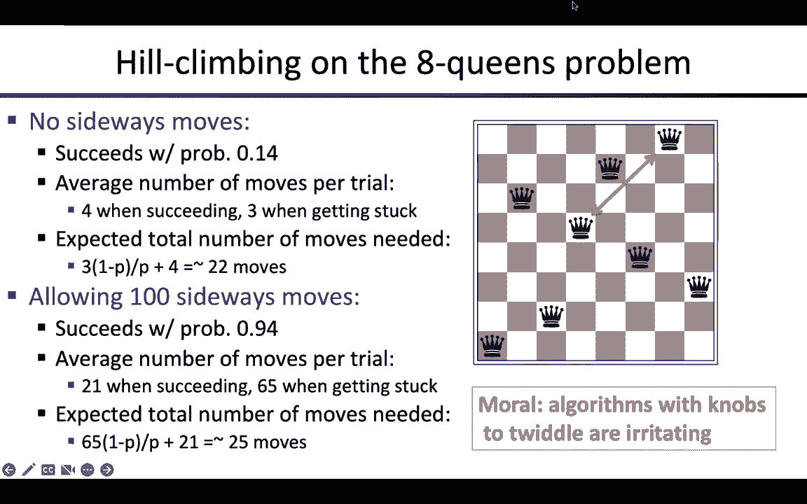
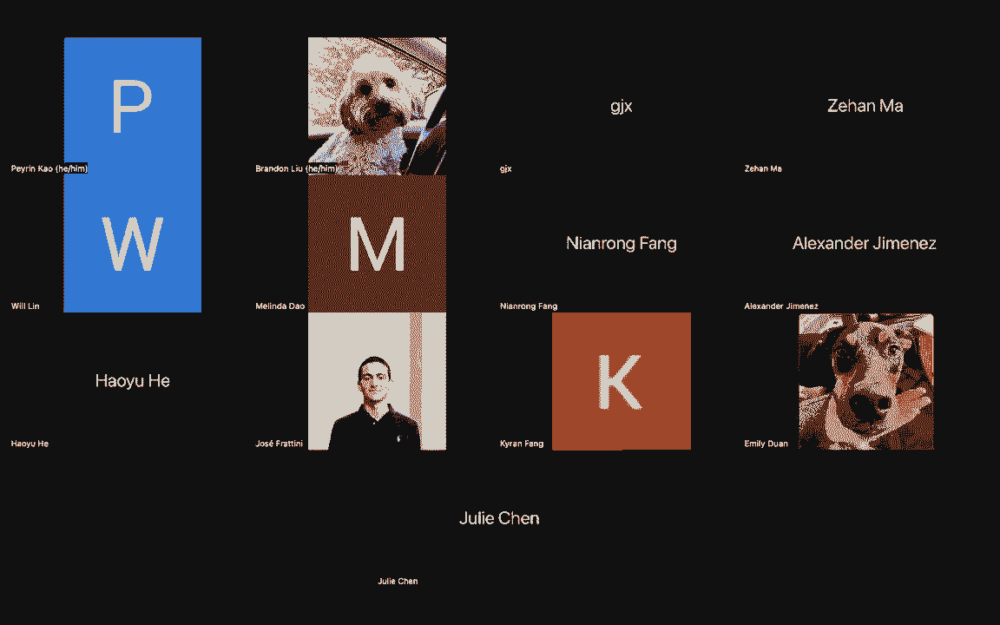
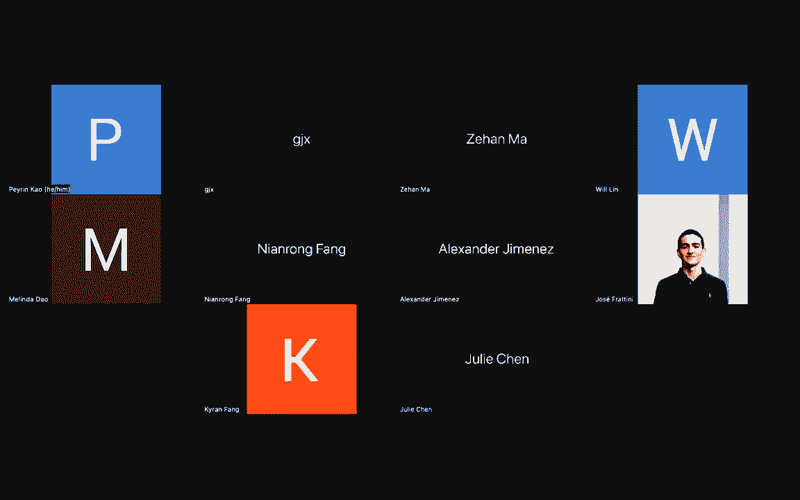

# P4：[CS188 SP23] Lecture 4 - Local Search - 是阿布波多啊 - BV1cc411g7CM

当我回去的时候，我在黑暗中呆了五天，所以他们好几年没做那么多了，一百个，呃，好的，所以我以前经常这么做，你知道吗，十年前在AI教书，每个月左右，会有一个标题，呃，感谢第72页的AI，呃，是啊，是啊。

当然啦，艾几乎每天都在学习表和说，呃，我想给你指出几个，呃，就在过去的几年里，有趣的事情出现了，这是一次行动，然后呃，丝绸男，国会不确切在哪里等等，在那边的某个地方，这是一个很好的选择，不只是我漂亮。

这正是我们如何监管，他声称在国会几乎结束了，比任何技术都了解人工智能，呃除了那些，所以很难通过任何明智的，那么你做对了什么，嗯，一个传统的方法是等待大公司留下来，然后照他们说的做，呃，另一组，呃。

美国紧随其后的是核能，呃也是人们不明白的问题，阿蒙将权力移交给机构，这样我们就创造了人工智能和代理，我们给它一个力量，这样它就可以在几周内完成事情，而不是几十年，这就是在商业中获得它所需要的，呃。

所以我认为这是个好主意，我写信给他说，谢谢。那是一个很好的喜欢，你知道，呃，好的，还有一件事更不对，嗯，我们最近的主题是找到问题的最佳解决方案，所以我们假设图表中的所有成本都大于，你不能有负成本。

花了这么多钱，我们说当你在车里过渡的时候，你真的找到了一些工作，所以当然有一个消极的问题，呃，图表成本，你可以找到一个负成本的移动，你永远地走进欢乐，所以你从来没有真正达到目标，呃，所以这是个问题。

但是呃，这些人会确保你能设计出什么，呃，在类中寻找最优的高效算法，无负成本的移动方式，但仍有许多成本链接，令人惊讶的是，它花了，你知道，六十年，呃，有人设计任何合理的算法，呃，对于这个问题。

它实际上是一个相当复杂的算法，所以呃，事实上，我并不为我们没有弄清楚而感到难过，呃，当我们在，大家都出来找我，有多少人真的试图发短信并继续给一些亲戚，是啊，是啊，所以很酷，呃。

你不允许边走边用水龙头工作，嗯，所以我的朋友卡萨特是一个，呃，俄勒冈州立大学的教授寄给我一些歌，这是不对的，现在该离开什么，它并不比另一个大，所以呃，所以这是一幅画，不是用真正的数学意义来指出的，不会。

当通常不总是，但通常当你想要人类的问题时他们已经有了一些内在的知识，然后他们就回答了，有时候，当你和达比城要去的时候，向鼹鼠将军问好，你好吗，如果你说相当有价值，但你甚至没有提到你的内部对话，就说。

大多数时候，你指的是一些连贯的小组，他们非常努力地保持连贯，聊天，连那样的东西都没有，数字里没有什么，他猜测，实际上是九百万，九百万，九，那些，一些东西，但二十年，也许十美元或。

这就是Tise无限钱罐的队长，所以当一个人再次或一百米时，但我不能给你讲它是如何工作的，因为没有人有这个想法，包括你认识的人，所以需要，呃，让能走动的人担心，好的，所以这就是，呃，让我们。

让我们回到第三个，所以嗯，我们谈到了搜索，呃，我们在不知情的情况下进行了搜索，然后我们做了知情的搜索，星型算法，恒星选择膨胀，f值最低的边缘节点，f是g加上h g是到达节点的成本。

然后h是从节点到最近目标的成本估计，状态，呃，如果你有H可受理的权利，意思是它是一个，嗯，这是真实成本的下限，所以这是一个乐观的估计，那么呃，树上的星星会给你，呃，最优解，所以我今天要讲三件事，首先呃。

这些H的东西，这些启发式，H代表启发式，他们从哪里来，呃，第二次，嗯，树木很好，图表呢，右边和图表实际上是你真正需要搜索的，我们很快就会看到什么原因，我们今天要讲的第三件事。

所以局部搜索对寻找解决方案的路径不感兴趣，产生解决方案不是一系列的行动，它只是对，我能想出一个解决的办法吗？通常你只是想出一些不是解决方案的东西来做到这一点，然后摆弄它，直到它是一个解决方案，对吗。

这就是我们所说的本地搜索，所以我会更多地解释这一点，好的，呃，在我们开始之前，有什么问题吗？所有的权利，呃，所以做启发式，他们从哪里来，所以说，发明这些启发式最常见的方法，就是思考一个不同的问题。

与你必须解决的问题有关的问题，而是，呃，以一种非常具体的方式更容易，所以这叫做放松问题，在轻松的问题中，意味着对你可以采取的正确行动的限制更少，所以在每个州你可以做更多的事情。

或者至少你能在一个里面做的所有事情，也许还有更多的动作，所以让我们给你一个简单的例子，对呀，所以在罗马尼亚寻找最短的路径，好吧，好吧，如果我能直接从我所在的地方开车到我要去的地方，绕过所有介入的城市。

对呀，那是个比较容易的问题，因为现在，呃，每个问题都可以一次解决，幸运的是，因为我们对欧几里得空间有所了解，我们可以说好，从起点到目的地直线行驶的费用是多少，所以直线距离，给你一个原始问题的启发式。

它不允许你从一个直线行驶到另一个，好的，所以你只是为每对城市添加一个，你在增加一个额外的动作，直接把它们连成一条直线，吃豆人中的另一个例子，对呀，吃豆人是不允许穿墙的，也许他可以穿墙。

所以我们就让他直接穿过墙，嗯，但他还是要坚持网格，所以对于这个问题，又是对的，我们就能找到通往他目的地的最短路径，只要把他要走的x和y距离加起来，因为它被称为曼哈顿距离，因为那是在曼哈顿开车，好的。

这是两个启发式，很容易得到这些权利，你只要想想，好的，我如何放松这个问题以使它更容易，更容易的问题需要是，我可以瞬间解决，在这两种情况下，我们可以立即解决更容易的问题，这很重要，否则，你要花很长时间。

计算启发式的值，这实际上可能会浪费时间，好的，所以这里是正式的部分，对呀，所以问题p2是p1的一个放松版本，如果对于每个州，问题P中可用的操作，2是问题p 1中可用操作的超集，好的，所以这就是。

这是正式的定义，所以根据这个定义的每一个问题，每一个问题都是一个轻松的版本，因为每个州都是平等的，嗯等等对吧，的，最不容易的问题是在任何地方都不允许行动，最轻松的问题将是在每个州，你什么都能做。

很容易证明这个定理，如果你在松弛问题中找到最优解的代价，那是成本的下限，所以这就是，这是松弛问题最优解的代价，对呀，它是最佳的，因为它有一颗星星，那么这就是原问题最优解的代价的下界。

这意味着我们可以在松弛问题中使用最优解的代价，作为原始问题的可容许启发式，有道理一次又一次，那真的很有帮助，如果我能瞬间计算出h中的两个s，对呀，如果我必须拿出另一个算法来解决问题，求出s的h二星。

那可能就没那么有用了，原来这是另一个小题外话，但你实际上可以建立一个完整的层次，轻松的问题，实际上做对了，所以即使你不能瞬间计算出H 2星，你可以制造另一个问题，你解不出p3，所以你制造了另一个问题。

第4页，瞧啊，你一路向上，然后你一直用这些启发式，你仍然可以从正确的做法中获得巨大的胜利，所以这些轻松的问题有各种各样很酷的代数，但我们不打算讨论这个，好的，所以让我们通过一个例子，呃。

我们故意试图创造，呃，一些启发式，呃，用这些简单的想法，好的，所以这个例子，我用了，呃，我们已经说了八个谜题了吗还没有，我们还没谈过八个谜题，好的，所以八字谜，嗯。

可能你们中的许多人小时候都看过15个谜题，对吧，就是这个四乘四的版本，有小瓷砖，你可以移动它们，你可以，就像一片空白，你可以把一个瓷砖移到空白的地方，你的目标是，呃，让它们进入某种有序的状态，呃。

比如说，都在增加或减少，或者实际上你选择的任何东西，然后嗯，这被称为AI的果蝇，嗯，所以生物学中的果蝇，他们只是随机选择了一种简单的有机体，他们都同意，所有人都在做实验，并相互比较结果。

同样的事情也发生在8个谜题和15个谜题上，许多研究搜索算法的人把它作为他们的实验有机体，可以这么说，呃，这样他们就可以比较结果和共享实现，非常非常简单。

实际上这些问题的推广形式是np-hard-right，所以找到最优解和滑动瓷砖拼图是NP难的，嗯好吧，所以各州是对的，状态只是瓷砖的配置，好的，有多少，有多少州，九阶乘提前九阶乘去去去，是呀。

卖给有九个阶乘的人，是啊，是啊，因为你的第一块瓷砖，你可以把任何一个放在九个地方中的任何一个，所以开头会有一个九，然后是一个八，然后一个七六对，嗯，你知道吗，事实证明，实际上从任何给定的状态。

只有一半的州可以到达，所以实际上可达状态空间是9乘2，除非你撕下一块瓷砖，切换循环，嗯好吧，所以九阶乘大于二，所以动作，嗯，我们通常想到的动作，空白向哪个方向移动，这样空白就可以向左或向右向上移动。

所以最多四个动作，向左或向右，在一些州只有两个，有些州是三个，好的，步骤成本只是每个动作的一个，所以这很简单，这就是八字谜，现在我们要试着找到一些启发式，所以猜猜要走多少步才能把你从。

让我们把这里的这个状态和那边的那个状态，好的，这就是启发式函数的工作，所以让我们从一个非常简单的启发式函数开始，错位的瓷砖数量，第一个问题是，实际上一个可接受的启发式。

它能保证永远不会高估解决问题的成本吗，嗯，是的，去吧，应该是对的，因为它们两者都没有负数，那么所有不合适的东西都是最不合适的，是的，所以这是一种思考的方式，实际上是，呃。

想想你知道要解决它实际上需要多少步，然后启发式说了什么，并表明一个总是比另一个少，是啊，是啊，所以每一块不合适的瓷砖都要移动，嗯，然后你可以提醒自己，当我移动空白，一次只有一块瓷砖移动，所以这很好。

对呀，另一种思考的方式是说，嗯，它是一个轻松问题的解决方案吗，当然是放松的问题，我只需要把任何瓷砖，它应该在哪里，所以有点像这样直，你知道的，在罗马尼亚直奔球门，对，相同的基本想法。

如果允许我把任何瓷砖放在任何其他方块上，那么错位瓷砖的数量是这个轻松问题的最佳成本，所以它是有保证的，因此可予受理，好的，嗯所以好吧，所以如果我看这个特定的初始状态，所有的瓷砖都错位了，所以h是8。

这是一个下限，我不知道这里的正确答案是什么，但我甚至不需要知道，我敢肯定，它将花费超过八个，或者至少八步才能到达那里，好的，所以当你对一颗星使用启发式时，呃，这很有帮助，对吧，所以这里有一些数字，呃。

看起来更有趣，好的，所以对于有十二步解的问题，好吧，如果我只是运行嗯统一成本搜索，也就是h等于零的恒星，所以那种空洞的启发式，对呀，这是三百六十万次手术，360万节点扩展。

如果我只是用这个难以置信的愚蠢的启发式，才二百二十七，好的，所以我们得到了一个，你知道，一万五千倍加速，呃从那个非常，非常简单的启发式，嗯，所以它并不总是这样工作的，对呀，很多真正的问题。

人们想解决正确的，你知道统一的成本搜索会让你花10到500次手术，你知道，一个愚蠢的启发式会让你减少到10到400个操作，这是一个巨大的加速，对，那是100的10次方加速，但是十到四百还是很多。

所以对于许多真正的问题，你必须努力工作才能得到足够准确的启发式，呃，把你带入可行的愤怒，对呀，嗯，让我们尝试一个稍微复杂一点的轻松问题，所以不仅仅是让你把每个瓷砖放在目的地。

我们仍然允许每个瓷砖一次只移动一步，但它们可以在其他瓷砖上移动，那么现在要走多少步，如果它能在其他瓷砖上移动，每块瓷砖都必须到达它要去的地方，它要去咚咚咚，所以从曼哈顿到目的地的距离是正确的。

所以你把每个瓷砖从目的地到曼哈顿的距离加起来，这就是启发式，所以这被称为曼哈顿总距离启发式，为什么它是可以接受的，因为我只是在添加动作，我通常不被允许把一块瓷砖放在另一块瓷砖上，我补充说，行动。

所以它是可以接受的，我甚至不需要做任何正确的思考，我不需要通过，好吧，我是，我重复了一下这里的一些步骤或任何这些东西，对吗，这样想容易多了，如果你想想放松的问题，对吧，而不是有点狡猾，呃，你知道的。

你脑子里的簿记，对呀，好吧，如果我在这里应用这个函数，然后它来到，你知道十八岁对吧，所以同样的问题，但现在不是八个，我有十八个，好的，所以这意味着八离得很远，因为真正的成本至少是十八，呃，可能更多。

我想可能是22岁左右，好的，所以当你使用这个启发式的权利，你从227下降到73，也许我应该在这张桌子上多做几列，当你有20个步骤的问题时，你是，你又得到了，你知道一百万倍加速，与瓷砖启发式相比，它让你。

你知道，速度比，呃不，根本没有启发式，嗯，有趣的是对的，你可能会觉得，好的，这只是个玩具，嗯，但实际上很难为两个五的谜题找到最优的解决方案，二四拼图，对呀，所以这个五乘五的版本，呃，它有很多州，我忘了。

就像十之八九到二十几岁的州，我觉得，嗯马马虎虎，即使是这个五乘五的版本，呃，其实真的很难解决，好的，好的好的，嗯，所以那是，呃，那是食谱，它仍然需要独创性来弄清楚，好的，嗯，我如何放松这个问题。

同时确保我能立即解决轻松的问题，对呀，但一旦你有了正确的想法，我们可以展示，比如说，在这种情况下，曼哈顿距离总是至少一样好，几乎总是比错位的瓷砖数量更好的近似，好的，所以如果嗯，如果他是呃。

曼哈顿和H 2是瓷砖权利，和，我们知道曼哈顿总是至少和，由于瓷砖数量错位，因为任何不合适的瓷砖都必须移动至少一个，所以曼哈顿距离将至少是一个刻度盘，嗯马马虎虎，如果你能证明这一点，那么我们称之为优势。

所以总数，Manan和距离主导了瓷砖启发式，在几乎所有的情况下，如果你有一个启发式支配另一个启发式，你更喜欢使用优势启发式，好的，你可以，你可以构建某种病理病例，在那里。

愚蠢的主导启发式只是偶然地选择了正确的移动，对呀，但这需要您有目的地构造该实例，为了让坏的算法变得容易，最糟糕的启发式，对呀，完全不给你信息的那个，呃，是零或任意，任意常数函数。

这就是UCS做得对的地方，我们希望有完美的启发式，对呀，准确地估计了所有P的成本，因为这样一个明星就会径直走向球门，Right只查看解决方案加上兄弟节点，嗯，但通常我们不能得到确切的启发式，因为太贵了。

所以我们试图尽可能接近精确的启发式，嗯，但通常我们不能一路走下去，因为我们通常在解决NP难题，如果我们有一个精确的启发式，这将需要指数级的时间，呃实际上计算正确，好的，所以这里有一个有趣的问题。

如果我有两个启发式，但都不支配另一个呢，对了，我用哪一个，也许我试试一个，看看我是否有解决办法，试试另一个，5。也许我该在这两个人之间分配时间，看看谁先赢，其实有一个简单得多的方法来做这件事，是啊。

是啊，你最多采取两次启发式，因为它们都保证低估了成本，所以无论哪个高，对那个特定的状态更好，所以你选择，你认识的人愿意给你更高的数字，呃，这必须更接近事实，好的，因为他们两个都不是，他们两个都没有高估。

所以我们取两者的最大值，所以我们取n中的h，n的h二，然后从中做一个新的启发式，呃，只要取最大值，既然它们都是可接受的权利，那么最大值也必然是可接受的，你可以用它，会成功的，好的，根据定义。

max支配h1，它支配h2，好的，所以你可以自动构造一个高级启发式，如果你有两个不一致的启发式，有时候，所以我给你一个简单的例子，呃，这很酷，也许还有更多，我已算出这道题的三种解答方法。

那么有什么问题呢，对呀，从一个方块到另一个方块需要一个晚上和国际象棋走多少步，所以呃，这里有一个骑士，骑士以L形移动，对呀，所以它有一个去，然后一个在，呃，直角，对呀，所以如果它在角落里。

然后它可以去这两个位置，如果它在中间，它有多达八个可能的动作，但每一步都只是一个L形，好的还有，所以问题是，摩西从木板上的一个地方到另一个地方需要多少时间，然后嗯，其实，你知道的。

即使对经验丰富的棋手来说，这有时是相当痛苦的，呃，去弄清楚，所以我们要帮助那些可怜的棋手，呃，一些启发式，有人知道我们怎么想出，这个问题的一些可接受的启发式，顺便说一句，曼哈顿距离三，是啊，是啊。

那是个好主意，因为每次移动消耗的曼哈顿距离总和是三个，对呀，曼哈顿距离的总和，你必须消耗才能达到目标，所以你把它除以三，至少会有那么多动作好，所以这实际上是第一个，呃，首先看到的是，我就知道你会这么说。

所以这是你可能想到的第一件事，曼哈顿被三分割，好的，所以我们可以改进它，所以你实际上可以做到，接受启发式，然后让它更准确一点，是呀，哦，因为每晚的移动让你走对了曼哈顿的三步，好的，我们还得加上。

也许如果你是个棋手，这更容易发现，所以我给你一个线索，夜是什么颜色，1。晚会是什么颜色的，白色的方块是什么颜色的，当夜晚移动时，颜色会发生什么变化，好的，所以如果它需要改变颜色，必须是奇数步。

如果它需要得到相同的颜色，必须是偶数的动作，所以无论你的启发式给你什么，你需要把它四舍五入，好吧，你可以把它四舍五入到，你知道从，假设你有，嗯2。7，它需要是偶数，然后你把它一直四舍五入到四，好的。

你仍然安全，那是因为你知道不是两个就是四个，不可能是两个，所以必须是四个，所以我们要准备一个，h 1四舍五入到正确的奇偶校验吗，好的，所以这很可爱，你能想出的任何其他启发式，哦，均等。

所以奇偶校验只是表示偶数或奇数，好的，好吧，所以，如果我从一个白色的正方形到一个黑色的正方形，需要奇数步，如果我从一个白色的正方形到一个白色的正方形，需要偶数个动作，因为每一步都会改变正方形的颜色。

对呀，好的，不如去想想罗马尼亚，欧几里得空间中的直线距离，好的，在欧几里得空间中，骑士的移动带你走多远，它需要你五的平方根对吧，所以我们取欧几里得距离，我们需要去，我们把它除以五根，这也是一个启发式的。

这也是一个可接受的启发式，我们再次四舍五入以获得正确的奇偶校验，对于一些目的地，作为启发式，这实际上比曼哈顿距离更好，好的，对一些人来说，好的还有，只是为了惹恼你，你还可以加上另一个。

注意到在x或y方向上你能得到的最大位移是两个，而是通过一个动作，所以如果你拿最大的，所以我要右转1 2 3 4 5 6 7 8 9右转，所以我需要朝Y方向走九步，所以我至少需要五个骑士动作。

因为骑士的移动在任何一个方向上最多只能让我得到两个，所以你需要最大的轮班，你把它除以二，然后你把它四舍五入到正确的奇偶校验，这是另一个启发式，在某些情况下，这比H1和H2更准确，好的，所以我有三个。

实际上概念上不同的思考问题的方式，它们中的每一个都给了我可接受的启发式，现在我可以施展魔法，对呀，我只拿这三个中的最大值，我有更好的启发式方法，对，实际上这解决了这个节目，解决骑士的招式。

超大棋盘上的问题，非常高效，好吧，很好，是的，我想在期中考试的时候，我们可能会给你一些乐趣，为你的问题发明可接受的启发式，实际上在项目中也是如此，那么现在关于第二个话题，呃，星图搜索的最优性。

我很快就会看完的，对呀，有点复杂，嗯，但这真的很重要，因为实际上在现实世界中，你总是想搜索一个图表，嗯，而不是一棵树，好的，所以让我让我回去，我想你已经说过这件事了，状态之间的差异，呃。

树搜索和图搜索在树中，您可以生成相同的节点，很多很多次，好的，嗯，所以如果我有一个网格，对吧，如果你玩过电子游戏，那么那些电子游戏里的AIS就在做一大堆，大量的网格搜索，查找权，那叫标准杆，如果你得到。

如果你得到一本视频游戏开发者教科书，有一章又一章关于网格的解析，有各种各样的非常非常呃，高效地做到这一点的高度工程算法，让我们看看这个非常简单的网格，有多少州，在开始状态的步骤中，对呀，只是更大，对呀。

不一定要精确，或乘以d，呃，仅此而已，或对等，不知道里面有多少个州，不是搜索树中有多少状态，有多少州是对的，所以让我们假设d是对的4，这意味着网格上的所有状态都可以到达，所以是的，是啊，是啊。

是d的平方的顺序，因为事实上你可以用一毛钱，d级，你可以达到一个钻石半径，我是，它是d的平方，我忘了它是像两个d的平方还是类似的东西，好的，所以d平方的顺序，深度搜索树中有多少状态，d。

所以这就是你说的右四D，或者点一个四到，好的，所以如果你只是想在网格中找到一条简单的最短路径，可能会有障碍坑洞怪物之类的东西，嗯，如果你在做树搜索，你会倒霉的，到D大约十点的时候，好的。

那已经是十分之四了，也就是二的二十分之一，对呀，呃，也就是一百万，所以你知道你开始对你的系统征税了，如果你在移动很多物体，呃，如果d是20，那么你说的是一个二到四十，对呀，太多了，好的。

所以这有很大的不同，不管你是在做图形搜索还是树搜索，好的，图搜索的基本思想是什么？嗯，呃，基本思想是不要再展开已经展开的节点，对，如果你发现自己在一个节点上，你已经到了，然后说，好的，我一直在这里。

不需要做任何事，好的，所以这是基本的想法，我们会看到的，比那复杂一点，但你可以，当然，你知道的，广度优先深度优先搜索，只要记下你以前去过的所有州就行了，每当你发现一个新的状态，你要扩大它，你说，哦好吧。

我以前见过这个，不需要扩展，因为我已经扩展了，我已经把所有的路都走完了，那么再跟着他们有什么意义呢，所以这是基本的想法，你可以想象，这需要额外的内存，这真的很重要，所以如果你，如果你使用深度优先搜索。

试图避免从readfirst或star获得的内存爆炸，就那件事而言，那么您将尝试使用图搜索来避免这种重复，这种重复的巨大指数爆炸，你得填满你的记忆，这也可能是个问题，对吧，而不是永远，它会填满你的记忆。

完全炸毁你的算法，所以这些其实很重要，呃，当你解决真正的问题时的考虑，好的，所以让我们来看看，一颗恒星会发生什么，我们只是不扩展我们已经看到的节点，所以这是我们的嗯，一个简单的状态空间图。

你可以看到有两种方法可以看到，你会找到一条路，然后当你找到第二条路的时候，你说我已经去看过了，不需要做，不用担心那个，好的，这些是启发式值，嗯，让我们开始一个明星，好的，所以嗯，开始的边缘有一个节点。

f是二零加二，所以我们将扩展它，我们在五点得到A，在两点得到B，所以我们要展开b，我们得到了C C的成本是g成本是3 1加2，然后是一个H的成本，所以它有四个，好吧，4比A好，也就是五个。

所以我们要再次展开c，我们得到g是6，好的，但我们没有，我们还没完呢，记住，只有当我们从边缘中选择g时，我们才停止，所以现在呃A是5，比六下的g好，所以我们展开一个，以防球门旁边有一个，我们又得到了c。

好吧，如果我们用的规则是好的，如果您生成另一个您已经看到的节点，那就不要再膨胀了，好的，然后我们会，呃，我们不会再走那条路了，好的，现在我们会说，好的，现在边缘上唯一剩下的是g在6，我们会说，好的。

我们结束了，g是6，所以哪里出了问题，我们没有得到最优解，因为我们实际上上面的解决方案更快，那么哪里出了问题，让我们看看我能不能去掉所有的潦草和，所以问题实际上是，嗯，不仅仅是谁能看到，先赢对。

我们实际上关心这样一个事实，即有多种路径可以看到，我们想确保我们实际上使用的是最短的路径，不是更长的路要看，所以上面的路径只有两个成本，下面的路径是三个，但由于启发式，我们先把底部的路径展开。

如果你只是检查重复，那你就得到了错误的答案，现在你可能会说好吧，让我们看看这个新的C，并将其与旧的C进行比较，让我们说好吧，新的C实际上有三个成本对二加一，比旧的C好，旧的C是三加一，因此。

我们应该扔掉旧的c，保留新的c，问题是你必须，好吧，那你是，那就没问题了，但给你给你正确的答案，但后来，你必须重新计算C的所有后代的成本，因为现在我找到了一条通往C的更短的路径。

所有c的后代的f值都必须更新，脖子上有巨大的疼痛，这是最初的A星算法的一个版本，星形纸，嗯，然后呃，它不是，你知道的，在实践中效果不是很好，因为整个子树，你知道的，必须重新计算，重新插入刘海。

它会让事情变慢，难以置信地，但事实证明，实际上，这里的启发式有一个缺陷，导致我们犯那个错误的原因，对呀，它导致我们实际上找到了一个次优的路径来查看，在找到最佳路径之前，实际上是启发式把我们引入歧途。

所以我们必须更深入地研究这个问题，当我们解决这个问题时，我们会看到我们不必做那么大，可怕的重新计算和重新插入边缘，对呀，我们实际上总是可以相信我们得到了正确的答案，没有额外的工作。

所以这就是一致性的概念，所以我们在可接受算法中的基本属性，估计费用低于实际费用，好的，所以一切都很乐观，对呀，这是一个原则，它给了我们可见性的定义，但我们也可以从，不仅仅是为了达到目标而付出的代价。

但是图中任意对节点之间的成本，对所以嗯，所以一致性实际上是比可采性更强的条件，它基本上说我们想，我们想要这种乐观的性质，呃，到处申请，好的，所以我们可以做对，而不是我们不想检查每对节点。

我们可以在当地强制执行，用单步，所以这次的问题是我们一开始花了4英镑，说好吧，从A到G的路径至少要花四个，好的，然后我们走了一步看，对然后好，我们说过，c的h的h是1，好的，这怎么可能是对的。

如果从A到G至少要花四个钱，然后你迈出了一步，现在只有一个能到达G，就在那时，根据这个启发式权利，从A到G有一条成本之路，但没有，因为启发式已经告诉你有一个，至少有四个。

所以这意味着h等于1是过于乐观的，不仅仅是乐观，太可笑了，因为A已经告诉你了，我至少还有四个小时，然后我向球门移动一个，现在我就差一个了，那不可能是对的，我至少得离开三个小时，好的，如果我离开四个。

我移动一个，我至少得离开三个小时，所以问题是h等于1误导了我们，因为我们希望我们的启发式是一致的，我们基本上可以不允许h等于1的值，好的，因为它本身不一致，嗯，所以说，一致性的定义是。

如果你把A和C之间的成本之差，如果你看a的h是4，c的h是1，好的，必须小于或等于弧线的成本，这是这里的一个，好的，这里有这个四和一，它不是，所以这个例子违反了一致性，这个启发式是可以接受的，但不一致。

另一种看待一致性的方法就是重新排列等式，好的，所以如果我把c的h移到另一边，像这样，那么我得到a的h小于或等于从a到c的成本，加上从C到目标的启发式，好的，所以如果我把它看成一个三角形。

它基本上是说启发式必须，满足三角形不等式，因为h是三角形的长边，然后成本从A到C，加上c的h是三角形的两条短边，好的，所以一致的启发式必须满足三角不等式，关于每个节点及其成功，和，很容易看出。

每颗星都必须满足三角形不等式，因为如果没有，这意味着从A到C再到G的路线，实际上比到达目标的最短路径要短，是的，你不能短于通往目标的最短路径，所以每个恒星必然满足三角形不等式，嗯，事实上，事实证明。

几乎所有合理的启发式，以及所有源于放松问题的启发式，必然满足三角不等式对，所以如果它是从一个放松的问题中衍生出来的，这意味着它是松弛问题的最优成本状态星，所以在有相同状态空间的松弛问题中。

它将满足三角形不等式，所以它是，它也会在原始状态空间中满足它，所有的权利，所以我们可以去掉h等于1，所以让我清理一下，所以我们可以去掉h等于1，因为我们知道从h等于4，C必须离目标至少三步。

然后用三步代替它，现在我们已经恢复了一致性，一致性有一些非常可爱的后果，我最喜欢的一个事实是，如果算法抱歉，启发式是一致的，如果你走任何一条路，沿这条路径的f值永远不会减小，如果你仔细想想。

F值向右减小是错误的，你在浪费信息，因为如果我已经知道没有解决方案通过这个节点，对呀，通过此节点的最优解决方案的成本低于此金额，对呀，然后扔掉这些信息，说好，好的，我以前以为是，我确信至少有十个。

现在我告诉你，至少八点了，好吧，好吧，那太傻了，因为我已经知道至少有八个了，事实上，我知道至少有十个，好的，所以你想要的不会沿着路径减少，并以一致的启发式，它保证了它，而且很容易做到。

我不打算通过数学来理解它，但基本上这证明了如果你看后继值，它总是至少一样大，载荷本身的f，嗯，从沿着路径的f值永远不会减小的事实来看，几乎紧接着一颗恒星，呃，对于图搜索总是最优的，是的。

我们没有得到我刚才给你看的那种bug，呃，用这个例子，所以这里有一个证据的粗略草图，对呀，我不打算细说了，但这张照片对吧，如果f从不沿路径递减，明星真正做的是，这有点像广度搜索，对呀。

早餐搜索加起来都是深度一，或者有一个深度二，所有有一个深度三，像夹层蛋糕一样分层，星星就像摇摇晃晃的夹层蛋糕，而不是深度，我们在增加F值层，所以所有有这个f值的节点，或者下一个f值更大的。

下一个较大f值的所有节点，我们只是一次一层地添加这些，明星就是这么做的，好的，所以只需一层一层地添加层，最后你要添加具有正确f值的层，以及最优解，好的，就是这样，所以这就是，证据就是这么说的。

所以总结一下，只要h是可容许的，树上的星搜索总是最优的，只要h是一致的，图上的星形搜索总是最优的，一致性更强，呃，可受理性的要求，但你发明的启发式几乎总是一致的，尤其是所有来自轻松问题的。

所以我们所看到的都是一致的启发式，你得很努力地工作，实际上是为一个真正的问题发明了一个不一致的启发式，所有的权利，在我们进入今天的第三个话题之前，有什么问题吗，h a，嗯不。

因为我们已经假设H是可接受的，对呀，以防你没听到问题，问题是我们为什么要修复，右c的um h，我们为什么不解决这个问题，使h等于2，就像那是一个，这是个好问题，嗯，我们不这么做的原因是因为H是可接受的。

所以我们知道A的成本至少是4，对所以这意味着，所以如果a的h是4，这意味着a的h星至少是4，好的，所以把h从4降到2就等于，我们已经知道的信息，好的，所以从a的h星至少是4的事实来看，事实上。

我们只朝着目标迈出了一步，我们知道实际上，C星至少三对，那是一个，那是一个定理，H的可受理性所引起的，好的我们应该用这个，其他问题，是啊，是啊，好的，所以弧线是从a到c的弧线，启发式告诉你。

知道H A-H C是在告诉你成本是多少，是啊，是啊，所有的权利，所以这个，当你进行转换时，h减少了多少，然后将其与转换的实际成本进行比较，对呀，这两件事必须保持一致，好的，你不能。

你减少的实际成本不能超过实际成本。好的很好，行了行了，所以我只想说几句关于实用性的事情，呃，从呃，嗯，部分来自痛苦的个人经历，嗯，部分来自于与试图使用这些算法的工业界人士的交谈，并试图给他们更好的算法。

嗯对，你，你有点进退两难，就像我说的，如果你是，如果你使用图形搜索权，所以你避免重新扩展状态，以避免指数级的爆炸，那么这意味着您生成的每个节点都必须存储在内存中，好吧，如果你懂电脑。

它们生成节点的速度非常快，对嗯，你知道的，你可以，比如说，八字谜，我想你可以为八个谜题创造下一代，在大约一百个计算机操作中，对呀，所以你可以很容易地生成，呃，笔记本电脑上每秒1亿个节点，对。

如果你每秒产生1亿个节点，你会在几秒钟内填满你的笔记本电脑，好吧，所以你在无聊之前很久就用完了内存，所以实际上杀死你的不是计算复杂性，这些算法的记忆会先杀死你，几乎总是，好的，嗯，那么你擅长什么呢。

你不想回去，你知道的，在树上的深度优先搜索，因为你知道，那么你就把你的状态空间放大了一个因子，你知道的，万亿，那是没有希望的，所以我们在这里似乎有点不开心，对呀，我们要做好什么，如果我们回想迭代深化。

对呀，ITA深化是一个很酷的算法，因为它保证了至少找到最短的解，步数最少的那个，嗯，它只使用线性空间，对，因为这是深度优先算法，所以这是一个想法，对呀，我们能不能有一个使用启发式函数的深化版本。

答案是肯定的，对呀，我们可以，我们可以先进行深度搜索，当我们超过深度限制时，我们不能停止，但是当我们超过f极限时，所以你设定了f极限，你先进行深度搜索，当你到达极限时你就停止了，你只记得，好的。

下一个f值是什么，我们在下一次跑步时必须做的，好的，所以你看f值，刚刚超过了你当前的f极限，然后在下一次迭代中成为新的f值，那是极限，八个谜题和十五个谜题都可以，和两个四个谜题，效果很好。

因为启发式值都是整数，所以f极限总是在每次迭代中至少增加一个，所以你永远不会有那么多的迭代，好的，嗯，但只是为了惹恼发明明星的人嗯，我发明了一个版本的八字谜，其中启发式值添加了一个小的随机扰动。

所以它们不再是整数了，然后呢，当然啦，每次星型迭代只向树中添加一个节点，所以你最终得到了二次数的迭代，这完全是一场灾难，好的，所以只是对原始问题的一个微小的随机扰动，从可行到完全不可行，所以星星有问题。

如果，它不能处理启发式值中的微小随机扰动，所以那个在IDE Star的人回来说，好的，我有一个新算法，递归最佳优先搜索，嗯，这是一个有点复杂的解释，但这就像递归深度优先搜索。

所以它只是用更小的深度限制来称呼自己，好的，但它所做的是，它记得当它到达深度极限并展开时，它会记住沿着右边分支的最佳可达f值，然后当它回来，然后想重新扩展，它已经知道那根树枝有多好了。

或者至少是这个分支有多好的下限，所以这实际上给了你一个相当有效的搜索，但它仍然只是一个线性空间对吧，因为它是一个，这是一个递归，基本上是深度优先搜索，这是一个线性空间算法，当你想到它的时候，这有点疯狂。

因为，嗯，你知道，让我们在一个二四拼图上，解可能是长度的，我不知道70岁左右，所以你只使用了70种记忆状态，好的，当你的笔记本电脑有空间，假设有十亿个州，所以你让自己，对呀，你，你无法避免树指数爆炸。

您没有使用足够的内存来避免RE，我们一次又一次地扩展同一个状态，所以最好的解决方案，我想是一个叫做星号的算法，基本上是说，然而，你的机器里有很多内存，我要把它都用上，好的，所以我要尽可能地避免再膨胀。

为了避免，通过记住一切，我可能记得，唯一的诀窍是，当你填满所有内存时会发生什么，你做对了什么，答案是你扔掉内存中最糟糕的节点，对呀，F成本最高的那个，所以呃，这个想法是，如果那是记忆中最糟糕的节点。

它不太可能成为最好的节点，最好的节点是我想展开的节点，所以我不太可能想扩展那个节点，所以通过忘记它，我可能不会花很多额外的工作，好的，所以这是一个非常简单的想法，嗯，但据我所知，它给了你。

使用内存的最佳组合，以避免重新扩展，但内存不足，因为它知道当它装满时该怎么办，好的，这就是一些实用的指导要点，呃，使这些算法在真实机器中的真实问题上工作，好的，所以我们，我不需要再说一遍，对呀。

明星就是这么做的，呃，如果你有很好的启发式，它会更好地工作，然后呃，它找到最优解，然后你需要摆弄它，让它在实践中发挥作用，所以在过去的二十分钟里，十八分钟，我将谈谈局部搜索算法，在许多方面要简单得多。

在某种程度上也要酷得多，对吧，我的意思是，冷却器，从某种意义上说，他们不会费心做很多簿记，对吧，所有这些其他算法，他们很有系统，他们在状态空间中行进，他们跟踪他们去过的任何地方。

他们把所有的东西都列在一个清单上，他们对一切进行排名，很多本地搜索算法，别费心做那些无聊的事，但有时被称为新时代算法，很多真正的问题实际上不需要，我们不需要解决方案路径，我们只想要解决方案本身。

所以让我们给你一些呃呃的例子，一个很酷的例子是n皇后问题对吧，所以在皇后区是，我有一个棋盘，所以这里我有一个四乘四的棋盘，我要在黑板上放四个皇后，以这样的方式，四个女王都没有攻击。

其他四个皇后中的任何一个，实际上是高斯，你还记得高斯是谁吗，如高斯高斯，写了一篇关于这件事的论文，他以为他已经找到了所有的解决办法，原来他错过了一些，嗯，但你知道这是这是，它是，这是一个非常古老的谜题。

但这里的重点是，女王是怎么到那里的并不重要，我只是想找到一个满足约束的配置，我不在乎，我把它们放在哪个订单上，还是我把它们搬来搬去，或者任何东西，我只想得到答案，嗯和旅行推销员的问题一样，对呀。

一个解决方案是参观租赁费用，每个城市只访问一次，对呀，我不在乎我是怎么做对的，我只想得到最佳的旅游，和很多非常实用的算法给旅行推销员，他们从随机参观开始，然后他们试着把它修好。

通过在序列中交换成对的城市来使事情变得更好，好的，所以这些是本地搜索算法，好的，嗯，所以基本的，这些都非常，非常简单，简单算法，有时称为迭代改进，他们有一个状态，他们试图让它变得更好，就是这样。

这些算法的一个明显的优点是，因为他们只有一个州，它们有恒定的空间，您可以使用它们进行在线搜索，所以在线搜索实际上是你在离线搜索中的位置，和一颗星星，我可以从这个状态展开一个节点。

然后我可以从这个状态展开节点，然后是来自该状态的节点，然后是来自该状态的节点，对呀，我不必在他们之间旅行才能做到这一点，对呀，如果我在网上搜索，那么我实际上在环境中，对呀。

我不能到世界的另一端去看看会发生什么，如果我做这样那样的事而不去世界的另一边，嗯，所以这些算法，它们有点像你在物理世界中移动的直接类似物，所以你可以用，如果你能找到一个好的本地搜索算法。

你可以在现实世界中使用它进行物理搜索，现实世界中的物理搜索是学习，对呀，你现在正试图找到一个更好的自我配置，如果我想这么做，用一颗星星，那就是，哦耶，我可以复制一万两千份自己，然后对每一份进行调整。

看着它变得更好，然后我有两万四千美元，我会调整这些，我有四万八千，否，你不能那样做，你只有一个，所以你有一个州，对呀，也就是你自己，你可以在本地调整，所以你是一个一直在运行的本地搜索算法。

努力让自己变得更好，好的，所以我们今天使用的大多数学习算法都是局部搜索算法，因为他们负担不起，复制成千上万个他们正在训练的巨型神经网络，好的，所以我们称之为爬山的最简单的想法是对的，无论你在哪里。

你都从某个地方开始，你试着上坡，通常当我们谈论爬山时，人们谈论梯度下降，这就是向下好的地方，是的，这就是物理学家喜欢谈论的，好好的，呃，呃，低能量态，对呀，下坡的东西等等，但是从事优化工作的人。

想起来就好，对呀，他们想找到全球最优，你只需要记住不要把你的标志弄混了，好吧，那么你，你反复移动到最好的邻近州，向上向上向上，好的，所以如果我试图攀登珠穆朗玛峰，我到这边来，爬到椅子上很好，到这边来。

爬到桌子上很好，到这边来好，我不会在空中攀爬，因为我可能会弄坏我的，呃，弄坏我的iPad，但我可以爬上去，那我就会在所谓的，对，因为我在上面，如果我在讲台上，我不能再走本地的一步，让我更高。

我没有到达珠穆朗玛峰的顶端，好的，所以本地搜索，这是个大问题，就是，呃，你可能会被卡住，嗯，我们将学会如何让自己摆脱困境，呃，各种招式，所以让我们开始思考，但让我们首先看一个很好的例子，对呀。

我们需要一个启发式函数，一个函数告诉我们哪个方向是向上的，就像嗯，路径问题求解的启发式，我们通常会知道，一个解决方案对，它具有启发式的某些特殊价值，比如零，好的，所以如果我们最终测量违反约束的数量。

女王的问题对吧，然后我们试着往下走，在这种情况下，向下是好的，我们想摆脱违反的约束，所以h等于零意味着我们解决了这个问题，好的，所以如果我们从这个配置开始，我们可以看到有五次攻击一二三四五对。

我们可以移动实际上被另外三只蜂后攻击的蜂后，所以让我们把它搬到一个安全的地方，所以现在它就在那里，只剩下两次攻击了，然后我们把这个往下移，呃到这里，现在我们结束了，好的，所以爬山。

其中启发式函数是被违反的约束数，然后我们就爬山，把它修好，把它修好，通过做一个动作来修复它，我们得到了一个解决方案，在这种情况下，正确的人一直试图解决结束女王的问题，用嗯，基本深度优先搜索算法。

所以他们会一次增加一个蚁后，你知道吗，再加一个皇后，好的，那没用，让我回溯一下，去别的地方试试没用的，他们会被收回，对呀，所以他们基本上使用树搜索算法，你知道他们甚至可以。

非常花哨的启发式和额外的选择方法，下一个把女王放在哪里，他们可以解决大约一千个皇后，就像，你知道，计算的一天，我接到一个电话，嗯，这应该是1990年左右，我想从我的一个朋友那里，史蒂夫·明顿，他说。

你看，我一直在尝试这个，这个非常简单的算法，对呀，你知道他描述了这个算法，你只是试图减少冲突的数量，移动皇后违反约束的次数，一次一个，他说有什么不对劲，我就像，我可以在一秒钟内解决一百万皇后的问题。

对呀，这有点奇怪，对呀，你有这个巨大的权利，被认为是，你知道的，硬组合问题对，就像八字谜或者十五字谜一样，二四拼图，但这是百万皇后的问题，对吧，所以比任何人解决过的任何N皇后区问题都大一千倍。

他一秒钟就解决了，对呀，只要使用这个本地搜索的想法，好的，加上几个额外的技巧，好的，这一发现实际上引发了一系列调查，进入三集随机实例的困难，正确的结束，规范NP难题，嗯，所以说。

所以这些局部搜索算法实际上在我们理解，事实证明，几乎所有三个SAT问题都很容易，对呀，因为他们要么处于一个不受限制的制度中，几乎所有的事情都是一个解决方案，或限制过多的制度，在那里。

它几乎保证根本没有解决方案，只有一个非常小的区域，问题实际上是困难的，好的，这是一个非常有趣的，呃和重要的，找到它与，嗯，热力学和临界行为，固体相变，各种各样的东西，反正我也不会进去的，我跑题了。

我喜欢这东西，嗯好吧，所以这说明了爬山，你知道，即使有这个非常简单的启发式，呃似乎做得很好，这就是代码，再简单不过了，对呀，只有几行代码，嗯对，你只有一种状态，这是当前的，呃，您可以变异当前状态。

如果你买不起副本，但如果你买不起副本，有两个州，然后你可以用那个副本，嗯，并称之为最好的邻居，然后嗯，你停下来，如果邻居值不优于当前值，否则你就继续这样，只要你在进步，你继续走，如果你停止进步。

你停下来，好的，现在，你可能会说嗯，如果邻居也一样好呢，但不是更好很好，然后你可以决定，我想让这种情况继续下去吗，还是我想停下来，对，这是一个变体，所以你所做的事情有很多不同的细节，好的。

但就像我告诉你试图爬上珠穆朗玛峰，对呀，你不仅想攀登珠穆朗玛峰，你知道没有地图，只是在浓雾中看得很近，但你也有健忘症，因为你甚至不记得你以前去过哪里，好吧，所以，呃，比如说。

如果你真的允许自己去邻近的一个费用相同的州，嗯，有什么能阻止你回到你刚来的地方，所以你可以看到，当你到达一个地方时，那里有两个相邻的州，相同费用的，你只会永远循环对吧，所以你不想那样做。

所以你必须仔细考虑这些终止条件，所以这里有一个基本上所有不同的，把爬山的问题放在一个例子里，对所以嗯，所以基本的想法是，我遇到了一个状态，这是，这就是我要爬的山，这是一片崎岖不平的风景。

如果我在这种状态下，我要上山，我要到这里，这是当地的最大权利，局部最大值，我想达到全球最大值，还有其他类型的地方我可以卡住对吧，有一个肩膀，这是一个平坦的区域，实际上有一个出口，它确实继续上升。

或平坦的局部最大值，这是一个没有出口权的平坦区域，所以这些实际上是不同的，所以你可能有一个想法，发生了什么，如果我卡在本地最大值上，你可能会说，哦，我应该重新开始对吧。

所以随机重启实际上是一种非常有效的技术，我会告诉你为什么，好的，所以你只要到一个局部最大值，所以你可能并不总是知道这是当地的最大值，对呀，我的意思是它没有一个标志上说我是当地的最大值。

那边有个更好的地方，对呀，没有一个标志说，所以在一些问题，如N皇后区问题，你知道你还没有解决它，因为你没有解决对，但如果我在找旅行推销员，对呀，我要去参观一下，我怎么知道这不是最好的，我不对，所以呃。

所以你可能会继续尝试找到一个更好的旅行和随机重启，随机重启，随机重启，在20次随机重启后，你知道我已经受够了，我很高兴我所拥有的可能不是最佳的，但我相信这很好，好的，所以再一次，这些是旋钮。

你可以玩弄这些算法，所以随机重启总是找到一个全局最优，相当惊人，有人愿意给我证据吗，是啊，是啊，我想我认为你说的是对的，对呀，是呀，你就会，你会继续运行它。

最终随机重启将简单地生成全局最优作为其初始状态，所以最终你会把全局交给他们，只需随机生成它作为第一个状态，好的，如此琐碎，至少在有限状态空间中，它会找到全局最优，是啊，是啊，好吧，所以我的意思是随机的。

所以，有附加的技术条件，随机是什么意思，对呀，状态空间中的每个状态都有可能，要生成等等，但是呃，你知道为了呃，如果你想八个谜题，比如说，如果我一直产生随机的八个谜题，最终我会生成一个有序的，我做得对。

嗯，和N个皇后一样，最终我会让皇后上场，他们已经在解决问题了，好的，所以这不是一个有帮助的，对呀，我是说，这是真的，但不是特别有帮助，嗯嗯，那么增加允许这些随机的侧向移动呢。

所以我的第一个版本的算法不允许侧向移动，如果它只是一个侧身移动，它会说看，我受够了，但是如果我们允许侧向移动，我们想让它们随机，这样我们就不会到处走了，一遍又一遍地重复同一组随机状态。

就在那时发生了什么，有一件事是好的，如果你在肩膀上，就像这个地方，好的，然后允许随机的侧向移动，把你从肩膀上拿下来，对呀，因为最终你会到达上升的出口，好的，所以这很好，好吧，如果你在不。

因为如果你不允许下坡，我们仍然只是，我们只考虑好的上坡动作，现在我们允许侧身移动，所以增加侧身动作的缺点是，如果你在这里，然后你就会进入一个无限循环，因为你一直在侧身移动，但没有出口，但你不知道。

因为你没有记忆，所以你将永远循环，好的，所以它有一个问题，对呀，所以这很糟糕，这是我最喜欢的小宝贝，好的，嗯，所有的权利，我想我们，我们快没时间了，所以我就给你，呃，更多关于当。

我们把这个应用到八皇后问题上，你能解决哪八个皇后，合理有效地使用深度优先搜索，几秒钟内在现代笔记本电脑上的模型上，对，但一旦你有一百个皇后，你是，你可能不走运，嗯好吧，所以如果我们不允许侧身移动。

我们只是爬山，使用该数量的冲突启发式，发生了什么对吗，我们有14%的成功率，好的，另外86%的时间我们被困在局部最大值，在那里不动让它变得更好，我们还没有解决这个问题，好的，那么我们要做好什么。

我们只允许一些随机的补货，所以如果我们成功了很好，如果我们不成功，只要做另一个随机的初始状态，再运行一次，如果我们有14%的机会解决它，然后在大约七次试验中对吧，一点四，呃，我们会解决这个问题，好的。

如果你只是做，呃，如果你做实证，呃，做记录其实很神奇，平均只需要四次调整就能解决问题，对呀，所以这就是为什么你知道，当史蒂夫·明顿说我在一秒钟内解开百万皇后的时候，这是因为即使大多数时候有一百万只女王。

你只需要几百个调整就能解决它，因为它很受限制，对嗯和嗯，然后被卡住了，你会发现我们平均从三个动作开始，所以你可以计算，算算就行了，对呀，这是呃的号码，几何级数中的试验，所以是3乘以1减去p/p。

其中p是成功的概率，所以每次失败需要三次，所以是3乘以1减去p除以，然后成功的试验，四点了，原来如此，所以平均大约是两个两步，所以你说的是两个两个月亮，你知道一微秒，对呀。

所以这是解决八个皇后问题的一种非常有效的方法，与深度优先搜索相比，如果你允许，呃，侧身向右移动，你需要把一个上限，否则你可能永远不会终止，所以假设我们给他们一百个侧身动作，然后呢，呃，用一百个侧身动作。

你可以在一次试验中以百分之九十四的概率成功，好的，其实挺好的，这告诉了你侧身移动的力量，当呃，但需要更长的时间对吧，所以每次成功尝试的步数是21，每次失败的尝试的移动次数是65次。

所以如果你计算移动的次数，你会得到，所以平均需要两步五步，对呀，但这两种方法都很有效，这实际上告诉你的是，呃，当你开始添加这些额外的旋钮来旋转时，对这些算法来说是一个巨大的痛苦。

因为现在你花了几个小时摆弄旋钮，为了解决一个需要一微秒才能解决的问题，所以这有点，有点烦人，所以它们在某些方面不那么优雅，我的意思是一个明星没有任何旋钮可以旋转，对呀，呃，即使是明星也没有任何规范。

我们只是在它内存不足的时候使用它，它知道它，它解决了问题，对呀，嗯很好，好的，所以我们下次会讨论更多的本地搜索算法，呃。

