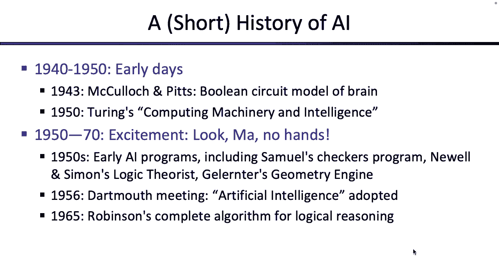
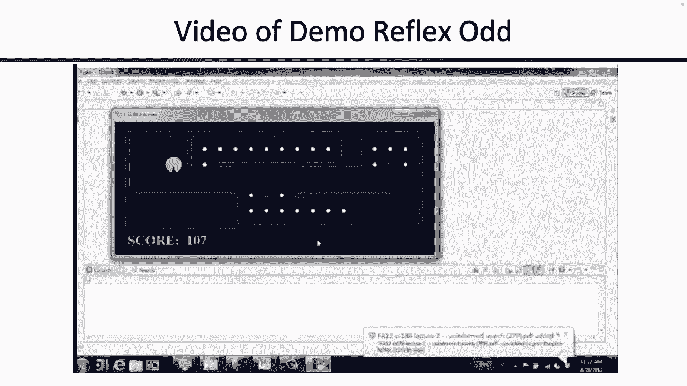
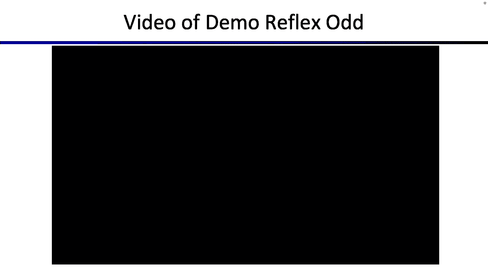
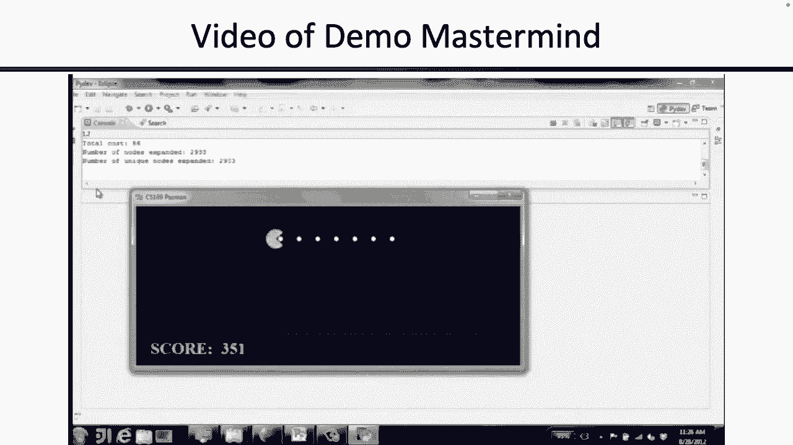
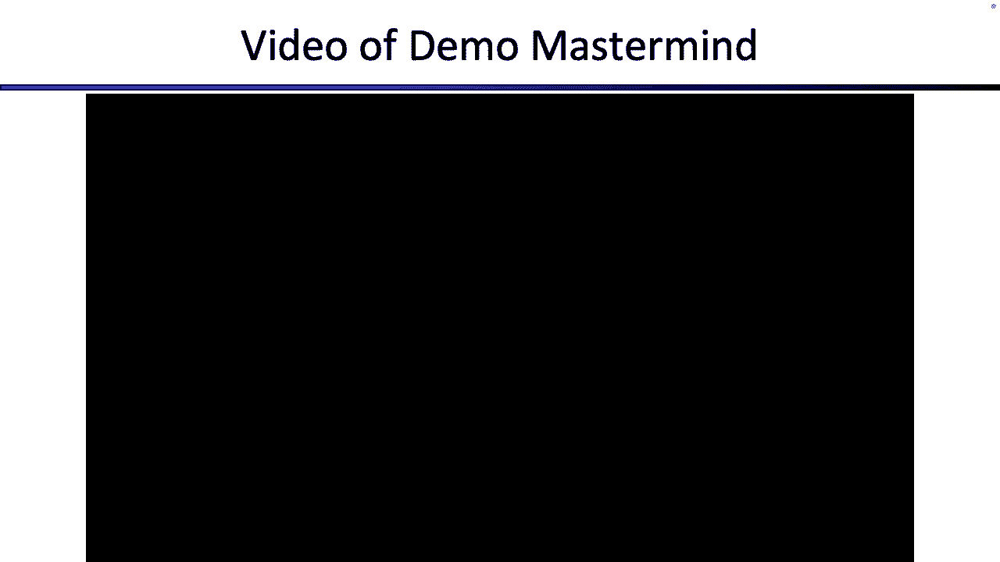
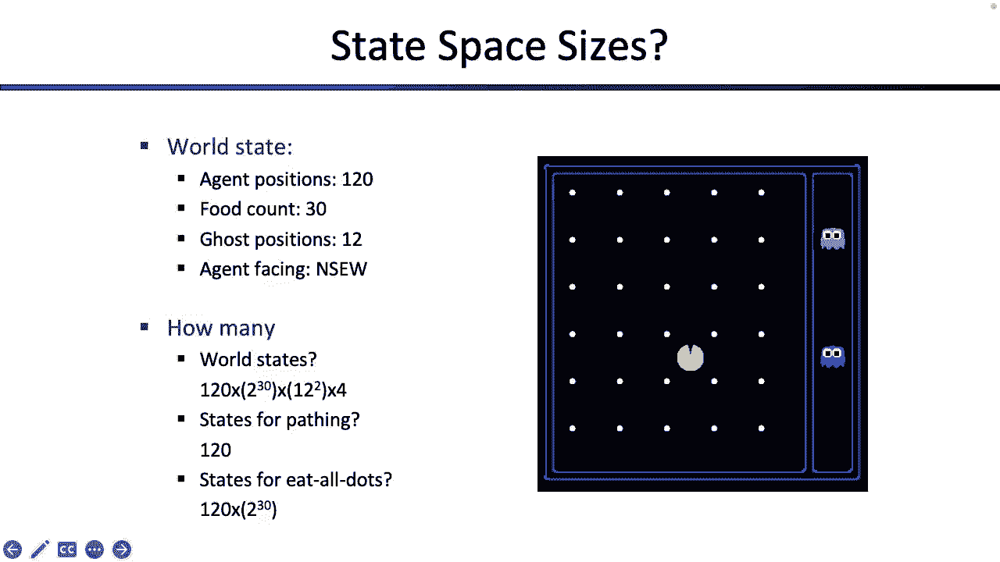

# 1：人工智能导论与理性智能体 🧠

在本节课中，我们将要学习人工智能的基本概念，特别是理性智能体的定义，并初步了解如何将现实世界问题建模为搜索问题。我们将从人工智能的流行文化形象和历史发展开始，逐步深入到其核心定义和课程结构。

## 📜 人工智能的定义与历史

上一节我们介绍了课程的基本信息，本节中我们来看看人工智能的定义及其发展历程。

人工智能是一个模糊的术语。一种定义方式是：**人工智能是制造能够像人一样思考的机器的科学**。另一种定义则关注结果：**人工智能是制造能够产生与人类相同结果的机器的科学**。我们还可以从逻辑推理的角度定义：**人工智能是制造能够理性思考的机器的科学**。在本课程中，我们将主要关注：**人工智能是制造能够理性行动的机器的科学**。

人工智能的概念在流行文化中不断演变。从70年代《星球大战》中乐于助人的C-3PO和R2-D2，到21世纪初《黑客帝国》中控制人类的AI，再到近年《西部世界》中难以与人类区分的AI，反映了社会对AI认知的变化。

人工智能的学术发展经历了几个阶段：
*   **早期（50-70年代）**：人们尝试将世界运作的所有逻辑规则编写成程序，让计算机进行推理。
*   **AI寒冬（80-90年代）**：编写所有规则的难度导致进展缓慢，资金和兴趣减少。
*   **现代（近期）**：重点转向利用大量数据建立统计模型，让AI从经验中学习并做出预测。

人工智能发展中的里程碑事件包括：
*   **1997年**：IBM“深蓝”计算机击败国际象棋世界冠军加里·卡斯帕罗夫。
*   **2011年**：IBM“沃森”在智力竞赛节目《危险边缘》中击败人类冠军。
*   **2016年**：谷歌“AlphaGo”击败围棋世界冠军李世石。

## ⚙️ 理性智能体与核心概念

上一节我们回顾了AI的历史，本节中我们来看看本课程的核心框架：理性智能体。

我们使用“智能体”一词来指代程序、机器人或任何试图根据指令行事的实体。一个**理性智能体**的核心目标是：**最大化其预期效用**。

让我们分解这个定义：
*   **最大化**：意味着我们试图在某种度量上做到最好。我们需要算法来寻找函数的最大值。
*   **你的**：指代智能体服务于谁或什么目的。这定义了智能体的目标。
*   **预期**：世界不是确定性的。智能体必须对未来不确定性进行建模。
*   **效用**：是对智能体成功程度的度量，类似于奖励。我们需要定义如何衡量智能体的表现。

这个公式 `最大化预期效用` 是本课程的核心。

## 🗺️ 将问题建模为搜索

上一节我们定义了理性智能体，本节中我们来看看如何让智能体通过“计划”来理性行动，这引出了“搜索问题”。

智能体有两种基本类型：
1.  **反射型智能体**：仅根据当前对世界的观察（感知）立即决定行动。
2.  **计划型智能体**：会考虑采取行动后可能发生的未来状态，从而选择能带来更好结果的行动序列。

为了进行计划，我们需要将问题形式化为**搜索问题**。一个搜索问题需要精确定义以下几个部分：

*   **状态空间 `S`**：世界所有可能状态 `s` 的集合。
*   **后继函数 `Succ(s, a)`**：给定状态 `s` 和行动 `a`，返回下一个状态 `s'`。它编码了状态间的转换规则。
*   **开始状态 `s_start`**：问题的初始状态。
*   **目标测试 `IsGoal(s)`**：一个函数，判断给定状态 `s` 是否为目标（满足）状态。

**解决方案**是一系列行动 `<a1, a2, ..., an>`，使得从 `s_start` 开始，连续应用后继函数，最终能到达一个满足 `IsGoal(s)` 的状态。

### 建模示例：罗马尼亚旅行问题

假设我们的问题是：从城市 Arad 出发，到达城市 Bucharest。

以下是我们如何将其建模为搜索问题：
*   **状态空间 `S`**：我们关心的只是智能体位于哪个城市。因此，状态就是城市名，如 `"Arad"`, `"Sibiu"`, `"Bucharest"` 等。我们**抽象掉了**汽油、交通、天气等细节。
*   **后继函数 `Succ(s, a)`**：如果当前状态是 `"Arad"`，行动 `a` 是“去Sibiu”，那么下一个状态就是 `"Sibiu"`。该函数编码了地图上的道路连接。
*   **开始状态 `s_start`**：`"Arad"`。
*   **目标测试 `IsGoal(s)`**：判断状态 `s` 是否等于 `"Bucharest"`。

通过这种形式化，我们可以设计通用的搜索算法（如BFS、DFS）来解决任何符合此模型的问题。

### 状态空间的设计

设计状态空间是关键，也是难点。我们需要包含解决问题所必需的**所有相关细节**，同时忽略不相关的细节以控制状态空间的大小。

*   **吃豆人路径问题**：状态只需包含吃豆人的 `(x, y)` 坐标。状态空间较小。
*   **吃豆人吃光所有点问题**：状态需要包含吃豆人的 `(x, y)` 坐标 **以及** 每个点是否已被吃的布尔值列表。状态空间变得非常大。

## 📚 课程概述与总结

在本节课中，我们一起学习了人工智能的多种定义，理解了理性智能体的核心是**最大化预期效用**。我们探讨了AI的历史与现状，并初步学习了如何将现实世界问题抽象并形式化为**搜索问题**，这涉及定义状态空间、后继函数、开始状态和目标测试。

本课程的前半部分将聚焦于**来自计算的智能**，即设计算法（如搜索、约束满足、博弈）使智能体理性行动。后半部分将转向**来自数据的智能**，即利用数据训练模型以实现理性行为。我们还将探讨AI在机器人、自然语言处理等领域的应用。

请记住，AI技术存在于现实社会，伴随伦理和责任问题。构建智能体时，严谨的建模和对其潜在影响的思考至关重要。