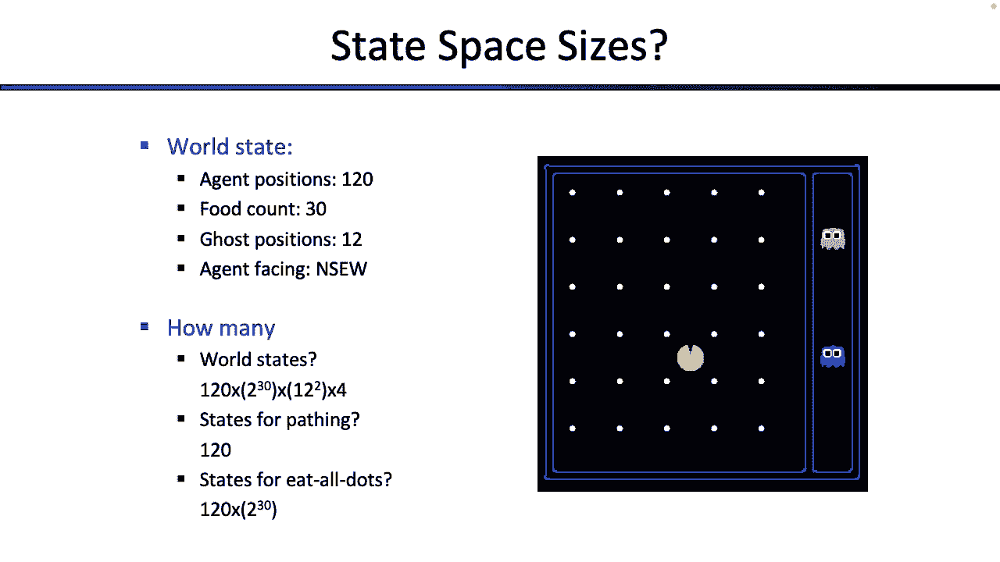
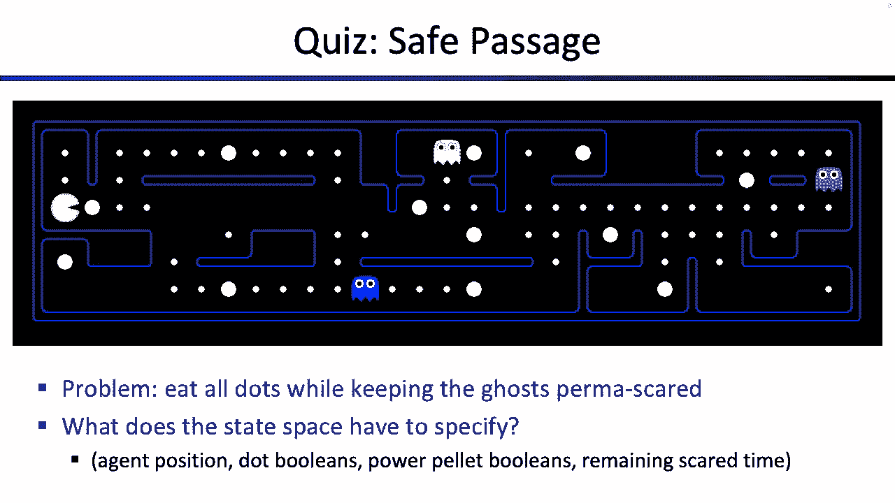
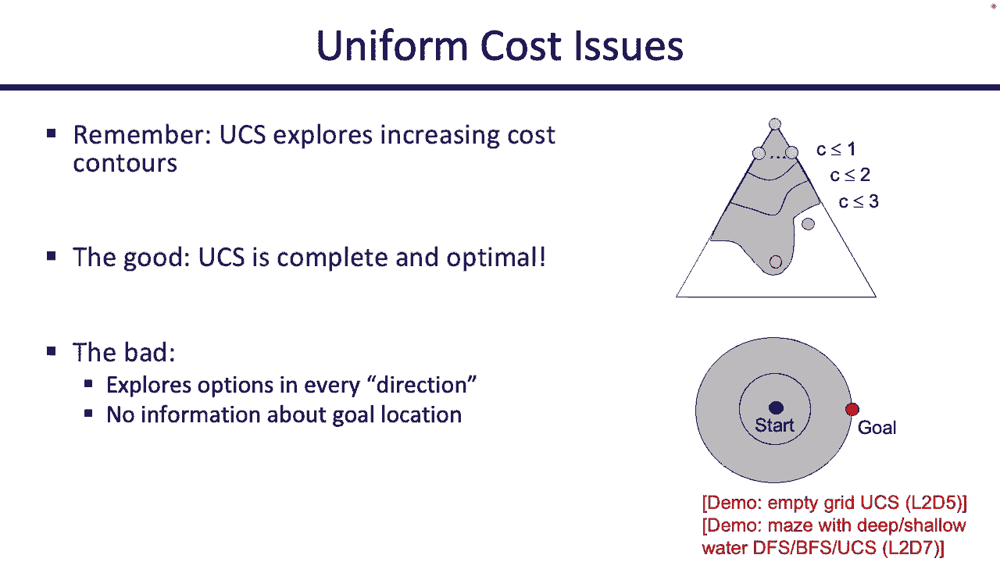
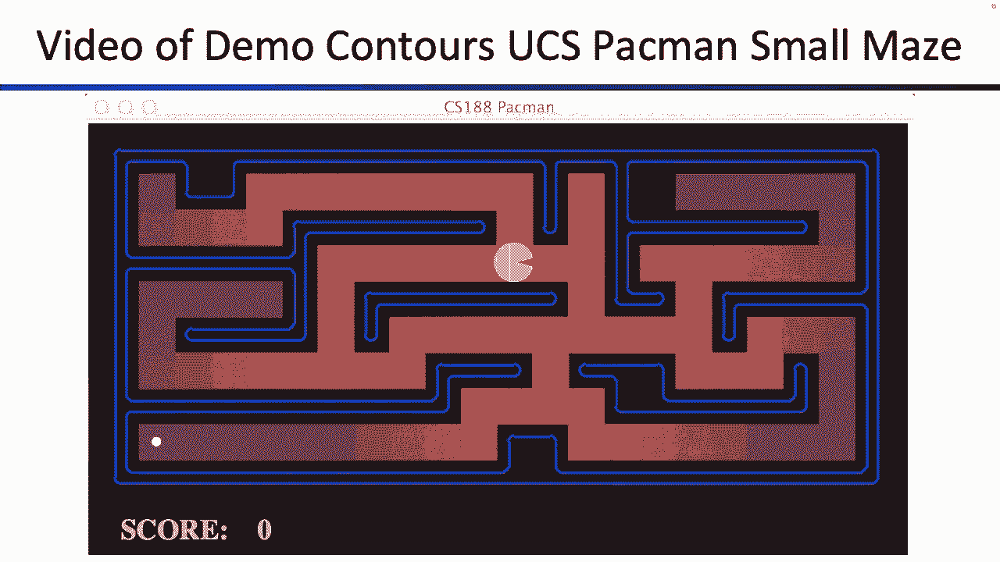
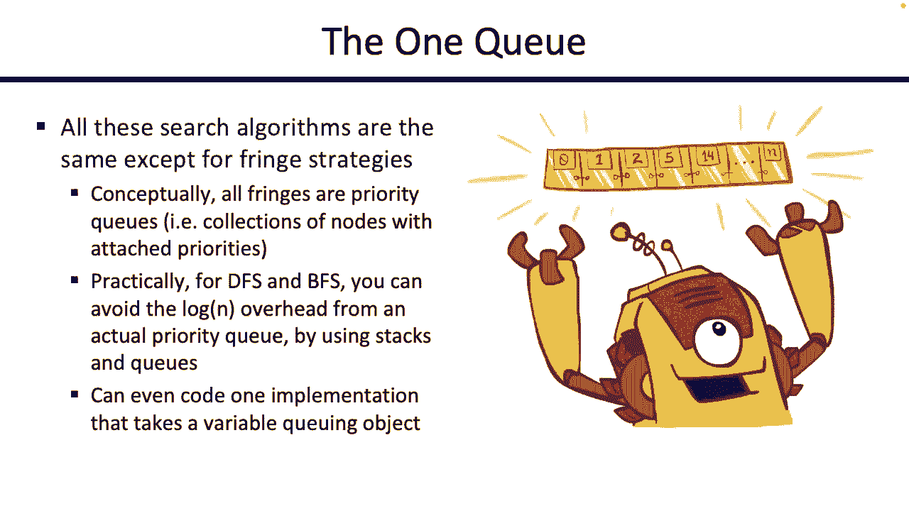

# 2：状态空间与无信息搜索 🧠

在本节课中，我们将学习如何将问题形式化为搜索问题，并探索几种基础的搜索算法。我们将从定义状态空间和搜索问题开始，然后逐步了解深度优先搜索、广度优先搜索和一致代价搜索的工作原理及其特性。

---

## 📋 概述：什么是搜索问题？

搜索问题是一个具有精确定义的数学概念。为了本课程的目的，我们将搜索问题定义为一个包含以下组成部分的结构：

*   **状态空间**：所有可能的世界配置的集合。
*   **后继函数**：给定一个状态，该函数返回所有可以从该状态直接到达的状态列表。
*   **初始状态**：搜索开始时的状态。
*   **目标测试**：给定一个状态，该函数判断该状态是否满足问题解决条件。

我们的目标是找到一系列动作，从初始状态出发，经过一系列中间状态，最终到达一个通过目标测试的状态。

上一节我们介绍了搜索问题的基本定义，本节中我们来看看如何具体地构建一个搜索问题。

---

## 🗺️ 状态空间与问题建模

状态空间包含了世界所有可能的配置。然而，对于特定问题，并非所有细节都是必要的。关键在于，状态中只需包含与解决问题相关的信息。

例如，在吃豆人游戏中：
*   若要解决“从A点到B点”的路径问题，状态可能只需要吃豆人的坐标。
*   若要解决“吃掉所有豆子”的问题，状态就必须包含豆子的分布信息。

如何确定状态中需要包含什么？一个有用的技巧是“反向思考”：考虑你的目标测试需要什么信息来判断是否完成。状态中必须包含这些信息。

以下是计算状态空间大小的一个例子：

假设一个简单的吃豆人世界：
*   吃豆人可能位于 `120` 个不同位置。
*   有 `30` 个豆子，每个豆子可能存在或不存在，因此有 `2^30` 种配置。
*   两个幽灵，每个可能有 `12` 个位置，因此有 `12 * 12 = 144` 种配置。

那么总的状态数大约是 `120 * 2^30 * 144`，这是一个巨大的数字。但如果我们只关心路径问题，状态数可能就只是 `120`。这直观地反映了不同问题的难度差异。

---

## 📊 两种重要的图表示

在讨论算法前，我们需要区分两种容易混淆的图表示：**状态空间图**和**搜索树**。

### 状态空间图
*   **节点**：代表一个**状态**（世界的具体配置）。
*   **边**：代表**后继函数**，表示通过一个动作可以从一个状态到达另一个状态。
*   这个图展示了所有状态是如何连接的。它通常非常庞大，我们不会实际构建它，但它是一个有用的概念模型。

### 搜索树
*   **节点**：代表一个**从初始状态出发的完整计划（或路径）**，而不仅仅是某个状态。节点上的标签（如‘A’）表示通过该计划到达的状态是A，但节点本身代表的是“如何到达A”的整个动作序列。
*   **边**：代表**执行一个动作**。
*   这棵树系统地枚举了从初始状态开始，所有可能采取的动作序列（计划）。它可能会非常巨大（甚至无限，如果存在循环），我们的算法将尝试只构建所需的部分。

**核心区别**：状态空间图中每个状态只出现一次；搜索树中，同一个状态可能通过不同的路径（计划）多次到达。

---

## 🔍 通用搜索算法框架

所有搜索算法都遵循同一个高层框架，它们之间的唯一区别在于如何从“边缘”中选择下一个要探索的节点。

**算法框架如下：**

1.  初始化：将代表初始状态（零动作计划）的节点放入`边缘`（也称为开放列表或前沿）。
2.  循环：
    a. 如果`边缘`为空，则搜索失败。
    b. 从`边缘`中**移除并选择一个节点**。
    c. 如果该节点代表的状态**通过目标测试**，则回溯路径，搜索成功。
    d. 否则，**扩展**该节点：将其所有后继状态（新计划）加入`边缘`。
3.  重复循环。

**关键**：步骤 `2b` 中**从边缘选择节点的策略**，决定了搜索算法的类型（如深度优先、广度优先）。

---

## 🌲 深度优先搜索

深度优先搜索的策略是：总是从边缘中选择**深度最大**（即路径最长）的节点进行扩展。

### 算法特性
*   **时间复杂度**：在最坏情况下，可能需要探索整个搜索树，因此是 `O(b^m)`，其中 `b` 是分支因子，`m` 是最大深度。
*   **空间复杂度**：由于只需要存储从根节点到当前叶节点的路径上的兄弟节点，因此空间复杂度为 `O(b*m)`，相对较低。
*   **完备性**：在**有限状态空间且避免重复状态**的情况下是完备的。在无限状态空间或存在循环的图中，可能永远找不到解。
*   **最优性**：**不是最优的**。它找到的解不一定是最短路径或代价最小的解。

### 直观理解
DFS 会沿着一条路径“一头扎到底”，直到无法继续，然后回溯，尝试下一条最深的路径。它探索的形状像一条“蜿蜒的溪流”。

---

## 🌊 广度优先搜索

广度优先搜索的策略是：总是从边缘中选择**深度最小**（即路径最短）的节点进行扩展。

### 算法特性
*   **时间复杂度**：`O(b^s)`，其中 `s` 是最优解的深度。在最坏情况下，需要探索到深度 `d` 的所有节点。
*   **空间复杂度**：需要存储每一层的所有节点，因此空间复杂度为 `O(b^s)`，通常远高于 DFS。
*   **完备性**：**是完备的**（如果解存在且分支因子有限）。
*   **最优性**：**当所有动作代价相同时，它是最优的**。因为它按层探索，首先找到的必定是动作最少的解。

### 直观理解
BFS 像“水波荡漾”一样，从起点开始，一层一层地向外探索所有可能的路径。

---

## ⚖️ 一致代价搜索

当动作具有不同的代价时，我们需要一致代价搜索。其策略是：总是从边缘中选择**总路径代价最小**的节点进行扩展。

### 算法特性
*   **时间复杂度**：与 BFS 类似，但代价 `C` 取代了深度 `d`，复杂度约为 `O(b^(1 + ⌊C*/ε⌋))`，其中 `C*` 是最优解代价，`ε` 是最小动作代价。
*   **空间复杂度**：与 BFS 相同，为 `O(b^(1 + ⌊C*/ε⌋))`。
*   **完备性**：**是完备的**（假设所有动作代价 `> ε > 0`，即无负代价环）。
*   **最优性**：**是最优的**。它是 UCS 的核心优势，可以找到全局代价最小的解。

### 直观理解
UCS 不再是按“层”探索，而是按“代价等高线”探索。它先探索所有代价低的区域，再逐步探索代价高的区域。可以把它看作“戴着眼罩、只关心花费的寻路者”。

---

## 🔁 迭代加深搜索

迭代加深搜索结合了 DFS 的空间效率和 BFS 的完备性/最优性（在单位代价情况下）。

**其思想是**：
1.  以深度限制 `l = 0` 开始。
2.  运行**深度受限的深度优先搜索**，只探索深度不超过 `l` 的节点。
3.  如果找到解，结束；否则，增加深度限制 `l++`，回到步骤2。

虽然看起来重复探索了浅层节点，但由于搜索树指数增长的特性，深层搜索占用了绝大部分时间，因此总时间复杂度与 BFS 同阶，而空间复杂度与 DFS 同阶。

---

## 📝 总结

本节课我们一起学习了人工智能中搜索问题的基石。

1.  **问题形式化**：我们学会了如何将现实世界问题抽象为包含状态空间、后继函数、初始状态和目标测试的搜索问题。
2.  **核心框架**：所有无信息搜索算法都遵循“选择-扩展-检查”的通用循环，区别仅在于从边缘选择节点的策略。
3.  **三大算法**：
    *   **深度优先搜索**：选择最深节点。空间效率高，但不完备，也不最优。
    *   **广度优先搜索**：选择最浅节点。当动作代价相同时，完备且最优，但空间消耗大。
    *   **一致代价搜索**：选择代价最小节点。在动作有不同代价时，完备且最优，是更通用的算法。
4.  **权衡与组合**：我们看到了在时间、空间、完备性和最优性之间的权衡，并介绍了迭代加深搜索这种折中方案。

这些无信息搜索算法虽然基础，但它们是构建更智能、更有导向性的搜索算法（如下节课要学的启发式搜索）的必备知识。它们都面临一个共同挑战：在不知道目标方向时，需要探索大量看似无用的状态。如何利用问题本身的额外信息来引导搜索，将是我们下一步要探索的内容。