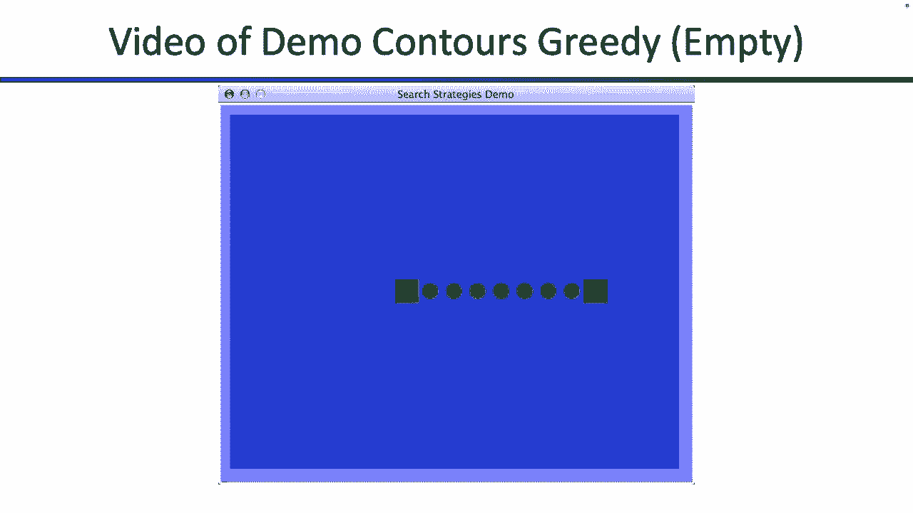
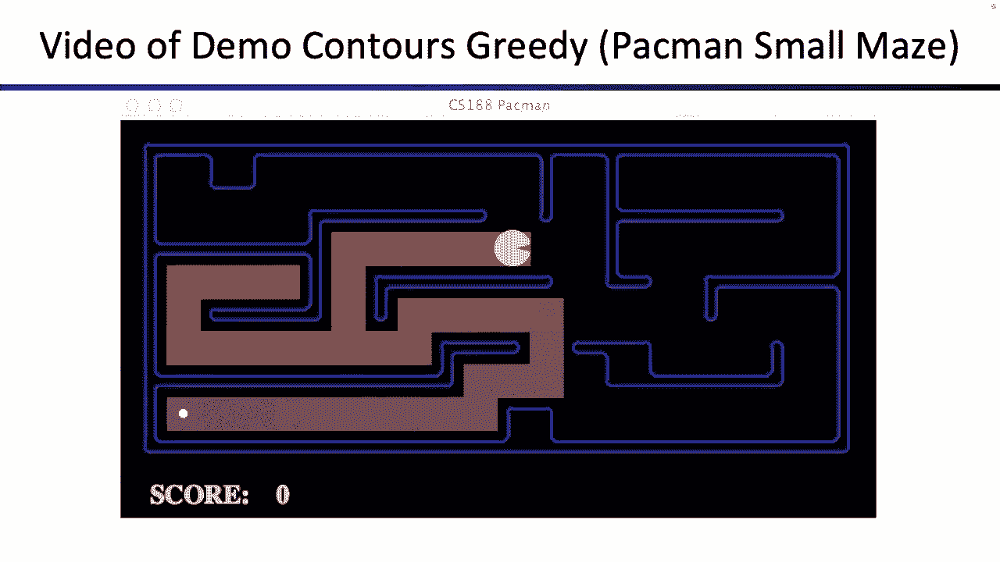
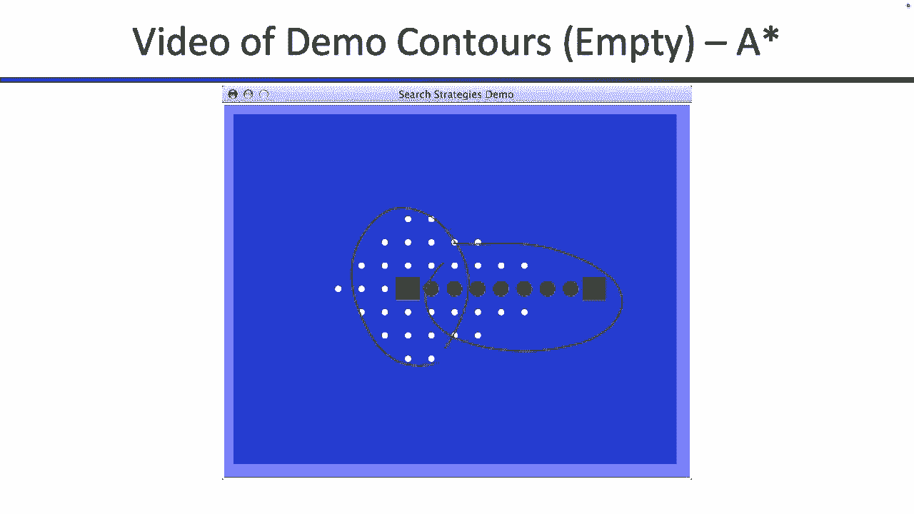
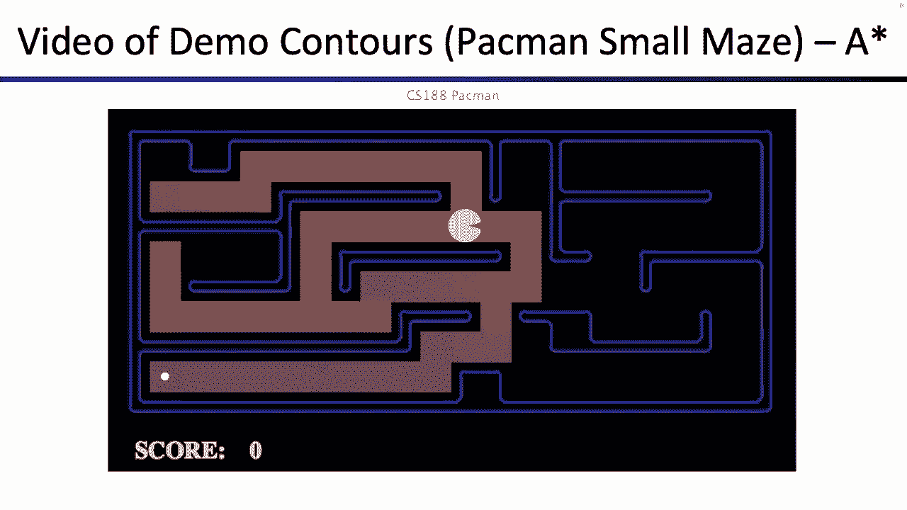
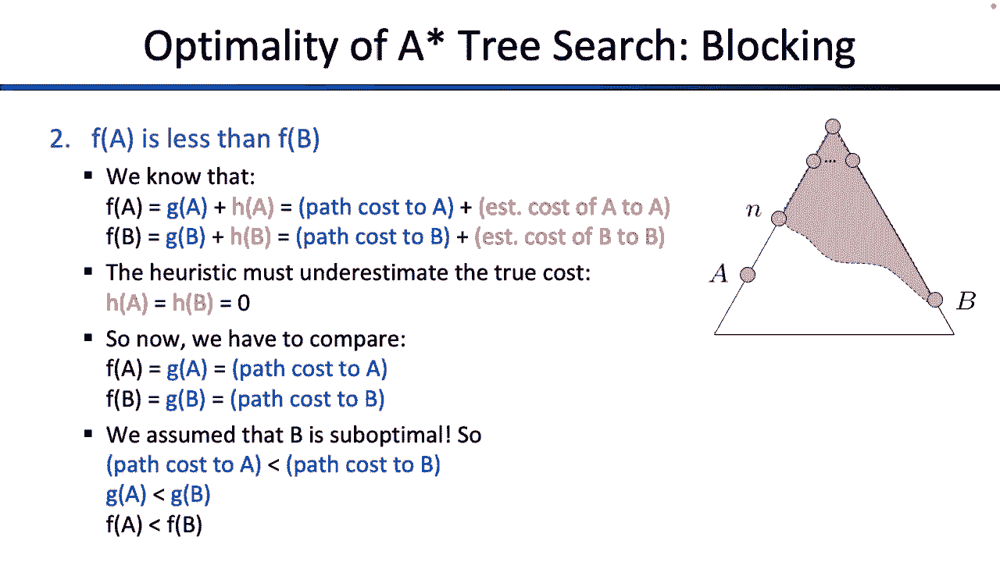

# 3：启发式搜索与A*算法 🧭

在本节课中，我们将学习如何利用关于目标的额外信息来改进搜索算法。我们将重点介绍**启发式**的概念，以及如何将其与搜索成本结合，形成强大且最优的**A*搜索算法**。

---

## 概述

搜索问题的核心是：给定一个状态空间、后继函数、起始状态和目标测试，我们需要找到一个从起点到目标的行动序列（即一个计划）。之前我们学习了深度优先、广度优先和一致代价搜索，它们都是“盲目”的，会向所有方向探索。

本节我们将引入**启发式**——一种对当前状态到目标距离的“猜测”。我们将看到如何利用启发式进行**贪婪搜索**，并最终学习如何将启发式与已付出的代价结合，形成**A*搜索**，从而在保证找到最优解的同时，大幅提升搜索效率。

---

## 回顾：搜索问题与搜索树

上一节我们介绍了搜索问题的通用数学定义：一个状态空间、一个后继函数（包含行动和成本）、一个起始状态和一个目标测试。

解决搜索问题的通用方法是构建**搜索树**。这棵树代表了所有可能的计划（行动序列）。关键在于，我们并非让机器人在真实世界中尝试所有路径，而是在“脑海”中（即模型中）预先计算和评估这些计划，最终只执行找到的有效序列。

所有搜索算法的共同点是，它们都维护一个**边缘**（或“前沿”）——一个待探索的部分路径列表。算法的唯一区别在于从边缘选取下一个扩展节点的**顺序**。

---

## 引入启发式

为了更智能地搜索，我们希望算法能“感知”目标的方向，而不是盲目地向四周探索。这就需要**启发式**。

### 什么是启发式？

启发式是一个数学函数，记作 **h(n)**。它接收一个状态 `n` 作为输入，输出一个实数。这个数字代表了从状态 `n` 到目标的**估计代价**。
*   **数值小**：意味着估计很接近目标。
*   **数值大**：意味着估计距离目标还很远。

可以将启发式想象成一个“热度探测器”：数字越小，你离“宝藏”（目标）越“热”。

**重要提示**：启发式是针对**特定问题**设计的。一个对迷宫问题有效的启发式（如直线距离），对煎饼排序问题可能毫无意义。因此，解决搜索问题通常分为两步：
1.  设计一个通用的搜索算法。
2.  为你的具体问题设计一个合适的启发式函数。

### 启发式示例

1.  **吃豆人迷宫**：一个简单的启发式是忽略墙壁，计算吃豆人当前位置与目标点之间的**曼哈顿距离**（网格上的直线距离）。这给出了一个“有多近”的快速估计。
2.  **罗马尼亚旅行问题**：启发式可以是当前城市到目的地布加勒斯特的**直线地理距离**。
3.  **煎饼排序问题**：一个可能的启发式是“尚未就位的最大煎饼的编号”。例如，如果最大的煎饼（5号）不在最底部，则启发式值为5。

这些启发式的共同点是：**越接近目标的状态，其启发式值通常越低**。

---

## 贪婪搜索

有了启发式，一个最直接的想法是：总是优先探索**当前看起来离目标最近**的节点。这就是**贪婪搜索**。

### 算法逻辑

贪婪搜索与之前算法的框架相同，唯一区别在于**从边缘选取节点的策略**：
*   **深度优先搜索 (DFS)**：选取最新的节点（栈）。
*   **广度优先搜索 (BFS)**：选取最旧的节点（队列）。
*   **一致代价搜索 (UCS)**：选取**累计路径代价 g(n)** 最小的节点。
*   **贪婪搜索**：选取**启发式值 h(n)** 最小的节点。

它完全根据 `h(n)` 做出决策，而忽略到达当前状态已花费的实际代价 `g(n)`。

### 贪婪搜索的局限性

贪婪搜索是“短视”的。它总是选择能带来**最大单步进展**的路径，即使从长远看，这条路径可能并非最优。

**示例**：在罗马尼亚问题中，贪婪搜索可能因为某条路径的第一步启发式值降低很多（显得很近）而选择它，却忽略了另一条每一步进展稍小，但总代价更低的路径。因此，贪婪搜索**不能保证找到最优解**，并且可能因为启发式的误导而陷入死胡同。

---

## A*搜索：结合代价与启发式

为了克服贪婪搜索的缺点，我们需要一个既考虑“已付出代价”又考虑“预计剩余代价”的算法。这就是**A*搜索**。

### 算法核心

A*搜索在选取边缘节点时，使用的评估函数是：
**f(n) = g(n) + h(n)**
其中：
*   **g(n)**：从起始状态到状态 `n` 的**实际已花费代价**。
*   **h(n)**：从状态 `n` 到目标的**估计剩余代价**（启发式）。

A*总是优先扩展 **f(n)** 值最小的节点。这巧妙地平衡了：
*   **g(n)**（一致代价搜索的考量）：倾向于探索代价低的路径。
*   **h(n)**（贪婪搜索的考量）：倾向于探索靠近目标的路径。

### 一个关键细节

在实现A*（或其他搜索算法）时，有一个至关重要的细节：**只有当节点从边缘中被取出（出队）并检查时，才能判断它是否为目标状态**。仅仅因为目标节点被加入（入队）到边缘，并不意味着搜索可以结束。提前结束可能导致返回一个非最优解。

### 可采纳启发式与最优性

A*搜索要保证找到最优解，其启发式函数必须满足一个条件：**可采纳性**。

**定义**：一个启发式 **h(n)** 是**可采纳的**，当且仅当对于**所有**状态 `n`，`h(n)` **从未高估**从 `n` 到达目标的**真实代价** `h*(n)`。即：
**h(n) ≤ h*(n)** （对于所有状态 `n`）

**为什么需要可采纳性？**
如果启发式高估了真实代价（即 `h(n) > h*(n)`），A*可能会因为 `f(n)` 值过大而“吓跑”那些实际上是通往最优解的道路，转而去探索更差的路径。可采纳性保证了A*不会忽略任何可能的最优路径。

**定理**：如果启发式 `h(n)` 是可采纳的，那么使用该启发式的树搜索A*算法是**最优的**。

（证明思路：通过比较最优路径上的节点与次优路径的优先级 `f(n)`，利用可采纳性 `h(n) ≤ h*(n)` 和最优路径代价更低的事实，可以证明最优路径上的节点总会比次优路径的节点先被从边缘中取出。）

---

## 总结

本节课我们一起学习了如何利用启发式信息来引导搜索：
1.  **启发式 h(n)** 是对状态到目标距离的估计，需针对具体问题设计。
2.  **贪婪搜索**仅使用 `h(n)`，虽快但短视，不保证最优。
3.  **A*搜索**结合了实际代价 `g(n)` 和启发式估计 `h(n)`（`f(n) = g(n) + h(n)`），在方向上更智能。
4.  为保证A*找到最优解，启发式必须是**可采纳的**（永不超估真实代价）。

A*搜索在人工智能中应用极广，从游戏路径规划到自然语言处理，它都是平衡效率与最优性的强大工具。下一节课，我们将更深入地探讨如何设计有效的启发式函数。