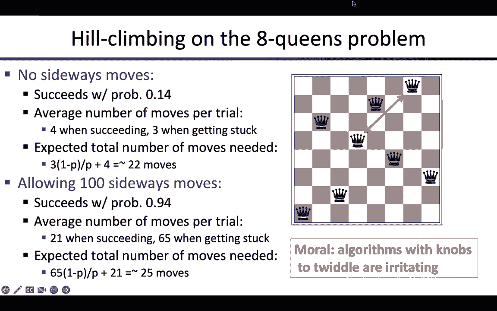
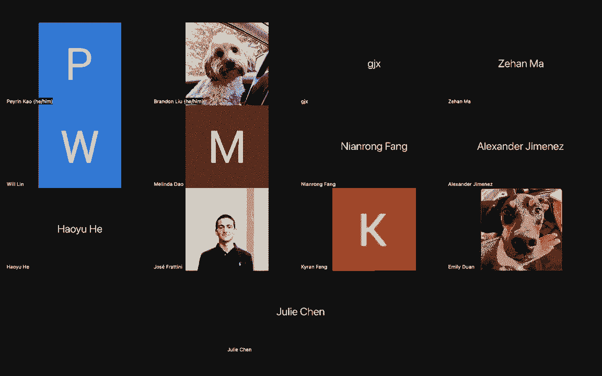
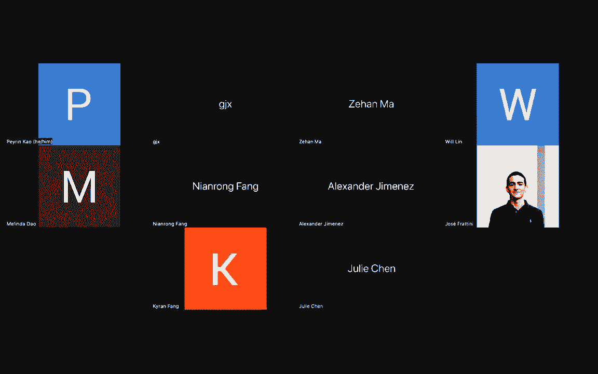

# 4：启发式搜索与局部搜索 🧭


在本节课中，我们将学习启发式搜索（A*算法）的进阶概念，以及一种全新的问题求解范式——局部搜索。我们将探讨如何设计有效的启发式函数，理解图搜索与树搜索的区别，并学习如何通过“爬山”等简单策略来直接寻找问题的最优解。

---

## 启发式函数从何而来？💡

上一节我们介绍了A*算法，它使用启发式函数 `h(n)` 来估计从节点 `n` 到目标的代价。本节中我们来看看这些启发式函数是如何被设计出来的。

发明启发式最常见的方法是思考一个与原问题相关但更简单的“松弛问题”。在松弛问题中，对可行行动的限制更少，因此更容易求解。原问题最优解的代价是松弛问题最优解代价的下界，因此我们可以用松弛问题的解作为原问题的**可采纳启发式**。

以下是两个经典例子：
*   **罗马尼亚路径规划**：如果我们允许“直线飞行”绕过所有中间城市，那么两点间的直线距离（欧几里得距离）就是一个可采纳启发式。
*   **吃豆人游戏**：如果我们允许吃豆人“穿墙”，那么从当前位置到目标的曼哈顿距离（`|Δx| + |Δy|`）就是一个可采纳启发式。

**正式定义**：问题 `P2` 是问题 `P1` 的松弛版本，如果对于每个状态，`P2` 中可用的行动集合是 `P1` 中可用行动集合的超集。

**关键定理**：松弛问题最优解的代价是原问题最优解代价的下界。因此，我们可以用松弛问题的最优解代价作为原问题的可采纳启发式。

---

## 实例：八数码拼图 🧩

让我们通过八数码拼图这个“AI界的果蝇”来实践如何构造启发式。在这个问题中，状态是瓷砖的排列，行动是将空白格向四个方向移动，每一步代价为1。

以下是两种启发式的设计思路：

**1. 错位瓷砖数**
*   **思路**：松弛问题是“允许将任何瓷砖直接移动到其目标位置”。在这个更简单的问题中，最优解代价就是错位瓷砖的数量。
*   **性质**：这是一个可采纳启发式，因为每移动一次只能改变一个瓷砖的位置，所以实际所需步数至少等于错位瓷砖数。

**2. 曼哈顿距离和**
*   **思路**：松弛问题是“允许瓷砖穿过其他瓷砖移动”。每个瓷砖到达其目标位置所需的最少步数就是其当前与目标位置的曼哈顿距离。将所有瓷砖的曼哈顿距离相加即为启发式值。
*   **性质**：这也是一个可采纳启发式。它几乎总是比“错位瓷砖数”更准确（即值更大），我们说它**支配**了前者。

**启发式的优势**：使用启发式能极大提升搜索效率。例如，在某个需12步解的问题中：
*   无启发式（`h=0`，即UCS）需扩展 **360万** 个节点。
*   使用简单的“错位瓷砖数”启发式，仅需扩展 **227** 个节点。
*   使用更优的“曼哈顿距离和”启发式，仅需扩展 **73** 个节点。

如果我们有多个互不支配的启发式，一个简单而强大的方法是取它们的最大值：`h(n) = max(h1(n), h2(n), ...)`。这个新启发式同样是可采纳的，并且支配所有原启发式。

---

## 图搜索与一致性要求 🔄

之前我们讨论的A*算法是在搜索**树**上进行的，但实际问题中的状态空间往往是一个**图**，同一状态可能通过不同路径被多次访问。简单地“不扩展已访问状态”的图搜索策略，在与A*结合时可能无法保证找到最优解。

**问题根源**：问题出在启发式可能**不一致**。一致性是比可采纳性更强的条件。

**一致性定义**：对于每个节点 `n` 及其后继节点 `n‘`，启发式函数需满足三角不等式：`h(n) ≤ cost(n, n’) + h(n‘)`。这意味着从 `n` 到目标的估计代价，不能超过走到 `n‘` 的实际代价加上从 `n‘` 到目标的估计代价。

**重要性**：如果启发式是一致的，那么沿着任何路径，A*算法中的 `f(n) = g(n) + h(n)` 值是非递减的。这保证了A***图搜索**总能找到最优解。几乎所有从松弛问题推导出的启发式都是一致的。

**总结**：
*   **树搜索A***：只要 `h(n)` 可采纳，就能保证最优。
*   **图搜索A***：需要 `h(n)` 一致，才能保证最优。

---

## 局部搜索算法 🧗

前面我们关注的是找到从起点到目标的**行动序列**（路径）。现在，我们转向**局部搜索**算法，它只关心最终的**解决方案状态**，而不关心如何到达。这类算法从一个猜测的解决方案开始，然后通过局部修改（“摆弄”）来逐步改进它。

**为何使用局部搜索？**
1.  **内存效率高**：通常只维护当前状态，占用恒定内存。
2.  **适用于在线或物理搜索**：类似于在现实世界中通过试错学习，你无法复制多个自己进行并行探索。
3.  **解决只需最终状态的问题**：如N皇后问题（找到一种互不攻击的布局）、旅行商问题（找到最短环路），我们只关心结果，不关心步骤顺序。

### 爬山算法（最速上升法）

这是最简单的局部搜索算法。

**算法描述**：
1.  从随机初始状态开始。
2.  循环：考察所有“邻居”状态（通过一次局部修改得到的状态），移动到**评估函数值最好**的那个邻居。
3.  如果所有邻居都不比当前状态好，则停止，返回当前状态。

在N皇后问题中，我们可以定义评估函数 `h(state)` 为**互相攻击的皇后对数**。我们的目标是**最小化**这个值（即“下坡”）。

**代码框架**：
```python
current = initial_state
while True:
    neighbor = highest_valued_successor(current) # 找最好的邻居
    if value(neighbor) <= value(current):
        return current # 没有更好邻居，停止
    current = neighbor
```

**局限性**：爬山算法很容易陷入**局部最优**（一个小山峰），而非**全局最优**（最高峰）。地形中还有“山肩”（平坦区域）和“高原”等复杂情况。

---

## 改进局部搜索的策略 🛠️

为了逃离局部最优，有以下几种常见策略：

以下是几种改进策略：
*   **随机重启**：陷入局部最优后，随机生成一个新的初始状态重新开始爬山。在有限状态空间中，只要时间足够，这**保证**能找到全局最优。如果单次成功率是 `p`，则平均需要 `1/p` 次重启。
*   **允许侧向移动**：当没有上坡路时，允许移动到评估值相等的邻居状态。这有助于逃离“山肩”。但需设置侧移次数限制，以防在“高原”上无限循环。
*   **随机选择**：不一定总选择最陡的上坡路，可以按一定概率随机选择邻居，这增加了探索的多样性。

**以八皇后问题为例**：
*   单纯爬山（不允许侧移）成功率约 **14%**，平均约4次随机重启可解决。
*   允许最多100次侧向移动后，单次成功率提升至 **94%**，但平均步数增加。

这些策略引入了需要调节的参数（如侧移次数上限），使得算法不如A*那样“优雅”，但在许多实际问题中非常高效。

---

## 总结 📚

本节课中我们一起学习了：
1.  **启发式设计**：通过构造原问题的**松弛问题**来获得可采纳的启发式函数，这是A*算法高效的关键。
2.  **图搜索最优性**：为了在状态图（而非树）上使用A*并保证最优，启发式需要满足更强的**一致性**条件。
3.  **局部搜索新范式**：引入了不关心路径、只寻找最终解的**局部搜索**算法，并以**爬山算法**为例，说明了其原理、优势（内存小、适用于在线学习）和局限性（易陷入局部最优）。
4.  **改进策略**：学习了通过**随机重启**、**允许侧向移动**等方法来帮助局部搜索算法逃离局部最优。







从系统性的树/图搜索，到注重局部改进的搜索，我们拥有了解决不同类型优化问题的多样化工具。