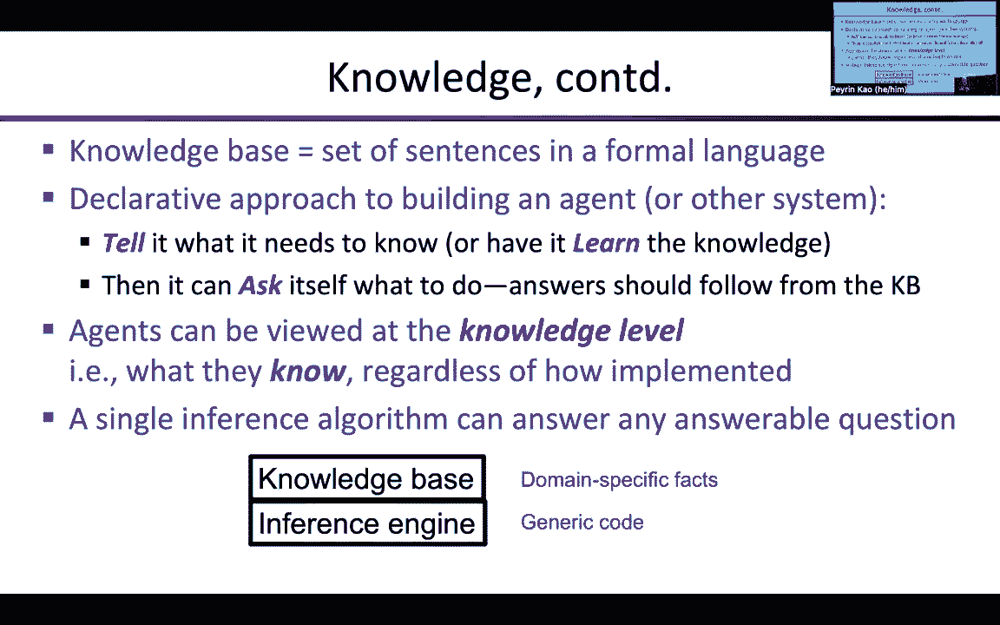
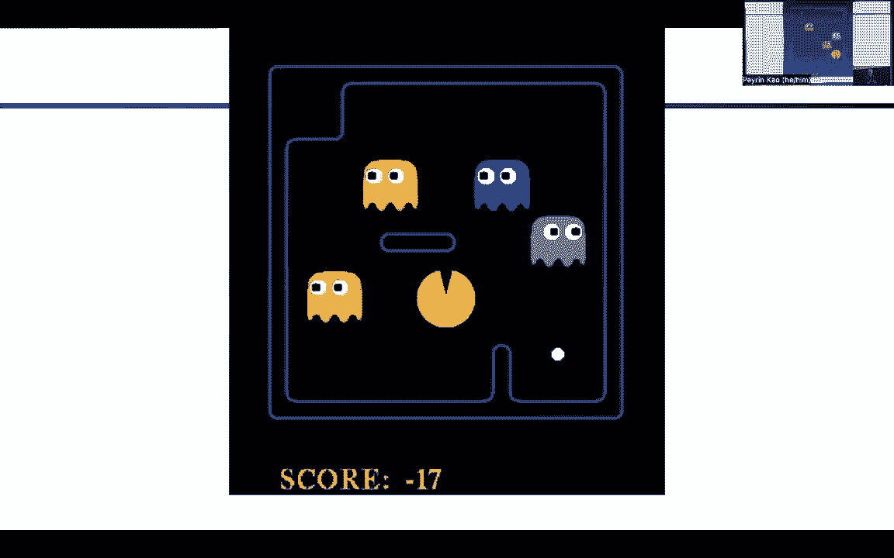
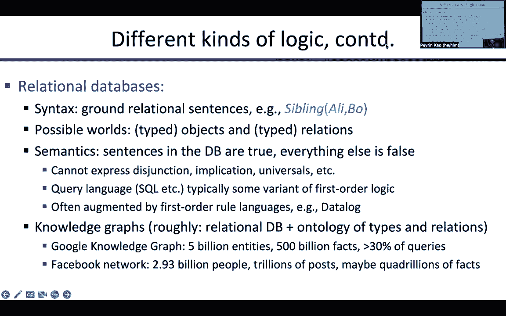

# 5：局部搜索、命题逻辑与规划 🧭

在本节课中，我们将要学习两种重要的算法思想：**局部搜索**和**命题逻辑**。局部搜索用于在状态空间中寻找最优解，而命题逻辑则为知识表示和推理提供了数学基础。我们将从模拟退火算法开始，探讨其在连续和离散空间中的应用，然后转向命题逻辑的基本概念及其在人工智能中的意义。

***

## 局部搜索与模拟退火 🔥

上一节我们介绍了在状态空间中寻找路径的搜索算法。本节中我们来看看另一种思路：**局部搜索**。局部搜索不关心到达目标的路径，只关注最终状态的质量。它从一个初始状态出发，通过移动到“邻居”状态来逐步改进解的质量。

### 模拟退火算法

模拟退火算法灵感来源于冶金学中的退火过程。金属通过缓慢冷却，使其原子排列整齐，达到低能量状态，从而变得更坚固。算法将这一思想应用于优化问题。

算法维护一个“温度”参数 `T`。温度 `T` 随时间逐渐降低。在高温时，算法可以接受使解变差的移动，有助于跳出局部最优；在低温时，算法行为更像爬山法，主要接受改进解。

以下是算法的核心步骤：

1.  从当前状态 `S` 开始。
2.  随机生成一个邻居状态 `S‘`。
3.  计算能量差 `ΔE = E(S’) - E(S)`。这里 `E` 是状态的值（例如成本或收益）。
4.  根据以下规则决定是否接受新状态 `S‘`：
    *   如果 `ΔE > 0`（新状态更好），则总是接受。
    *   如果 `ΔE <= 0`（新状态更差或相同），则以概率 `P = exp(ΔE / T)` 接受。其中 `exp` 是指数函数。

随着温度 `T` 从高逐渐降低到接近零，算法从随机探索逐渐转变为局部改进。

### 算法的理论性质

尽管模拟退火看起来启发式，但它有坚实的理论基础。可以证明，如果温度下降得足够慢，在每个温度下运行足够长时间以达到平衡，那么算法处于某个状态 `S` 的概率服从**玻尔兹曼分布**：

`P(S) ∝ exp(E(S) / T)`

当温度 `T` 趋近于0时，概率分布会集中在全局最优解上。这个性质通过考虑两个相邻状态 `x` 和 `y` 之间的概率流平衡方程得以证明。

### 算法的实践与局限

收敛保证是在“温度无限缓慢下降”和“每个温度下运行无限长时间”的理想条件下成立的。在实际应用中，如何设计**冷却计划**（即温度 `T` 随时间下降的速率）是一门需要经验的“艺术”。模拟退火被成功应用于超大规模集成电路（VLSI）芯片布局等复杂组合优化问题。

***

## 其他局部搜索算法

除了模拟退火，还有其他有效的局部搜索策略。

### 局部束搜索

局部束搜索同时维护 `k` 个状态（即 `k` 个搜索进程），而不仅仅是单个状态。在每次迭代中，它从所有 `k` 个状态的邻居中生成所有可能的后继状态，然后从中选出最好的 `k` 个作为下一轮迭代的起点。

这个过程允许搜索进程之间进行“通信”：表现差的搜索区域会被放弃，计算资源被重新分配到更有希望的区域。这比独立运行 `k` 次爬山搜索更高效。

### 遗传算法

遗传算法是受生物进化启发的搜索算法。它将状态编码为字符串（类似于基因序列）。算法维护一个种群（一组状态），通过**选择**（偏好适应度高的个体）、**交叉**（组合两个父代状态的部分）和**变异**（随机改变状态的某些部分）来生成新的种群。

遗传算法是进化计算领域的一部分，并被用于神经网络架构设计等复杂优化问题。

***

## 连续空间中的局部搜索

许多优化问题的状态空间是连续的（例如，设计参数是实数）。我们以在罗马尼亚放置三个机场以最小化总旅行成本为例。

### 问题形式化

设三个机场的坐标为 `(x1, y1), (x2, y2), (x3, y3)`。每个城市归属于最近的机场。目标函数 `f` 是每个城市到其归属机场的**欧几里得距离的平方和**。

我们希望找到使 `f` 最小化的机场坐标。

### 梯度下降

当目标函数可微时，我们可以利用**梯度**。梯度 `∇f` 是一个向量，其每个分量是 `f` 对相应变量的偏导数。例如，对于机场1的x坐标：
`∂f/∂x1 = 2 * Σ (x1 - x_c)`，其中求和针对归属于机场1的所有城市。

梯度方向是函数值上升最快的方向。因此，**梯度下降**算法通过反复沿负梯度方向移动一小步来寻找最小值：
`x_new = x_old - η * ∇f(x_old)`，其中 `η` 是学习率。

对于这个特定问题，在固定城市分组的情况下，最优解是将机场置于其所属城市的**质心**。但全局最优解还需要考虑改变城市分组的情况。对于更复杂的问题（如神经网络训练），我们无法直接求解梯度为零的方程，梯度下降及其变体（如随机梯度下降）是核心优化工具。

**自动微分**技术使得计算机能够自动计算任何数值程序的梯度，这是现代机器学习框架（如TensorFlow, PyTorch）的基石。

***

## 命题逻辑基础 🧠

现在，我们从优化转向知识表示与推理。为了让AI系统能基于知识进行规划，我们需要一种形式化语言，**逻辑**正是为此而生。

### 知识、推理与智能体

智能体（如吃豆人）需要几种知识：
1.  **过渡模型**：行动如何改变世界。
2.  **传感器模型**：世界状态如何产生感知信息。
3.  **初始状态信息**。

利用这些知识，智能体可以进行**状态估计**（追踪世界状态）和**规划**。逻辑方法允许我们**声明式**地陈述知识，然后由通用的**推理引擎**来回答问题，而无需为每个问题编写特定的过程代码。

### 逻辑的构成：语法与语义

一个逻辑系统由两部分定义：
*   **语法**：规定了语言中合法句子的构成规则（哪些符号串是有效的）。
*   **语义**：定义了如何确定一个句子在某个“可能世界”中是真还是假。

**命题逻辑**是一种简单的逻辑。
*   **语法**：由**命题变量**（如 `P`, `Q`, `Rains`, `Sunny`）和**逻辑连接词**（与 `∧`， 或 `∨`， 非 `¬`， 蕴含 `⇒`， 当且仅当 `⇔`）构成。
*   **语义**：一个“可能世界”为每个命题变量分配一个真值（True或False）。复杂句子的真值通过连接词的语义规则递归确定。例如，`A ∧ B` 为真当且仅当 `A` 为真且 `B` 为真。

### 数据库与知识图谱

关系数据库可以看作是一种受限的逻辑系统。它包含一系列**关系事实**（如 `WorksFor(John, CIA)`）。查询语言（如SQL）具有一阶逻辑的表达能力。

**谷歌知识图谱**是一个超大规模的关系数据库，包含数百亿实体和数千亿事实，用于直接回答搜索引擎的查询，展示了基于逻辑的系统在现实世界中的巨大价值。

***

## 总结

本节课中我们一起学习了：
1.  **局部搜索算法**，包括模拟退火、局部束搜索和遗传算法，它们专注于寻找最优状态而非路径。
2.  **模拟退火**通过引入温度和概率接受机制来逃离局部最优，其理论收敛于玻尔兹曼分布。
3.  在**连续空间**中，可以利用目标函数的**梯度**信息进行优化，梯度下降是核心方法。
4.  **命题逻辑**为知识表示提供了形式化基础，通过**语法**和**语义**来定义句子的合法性及其真值条件。
5.  逻辑方法允许**声明式**编程：将知识输入通用的推理引擎，即可回答领域内的问题，这是实现高级AI推理能力的关键一步。

从优化搜索到逻辑推理，这些工具构成了人工智能处理复杂问题的基础。