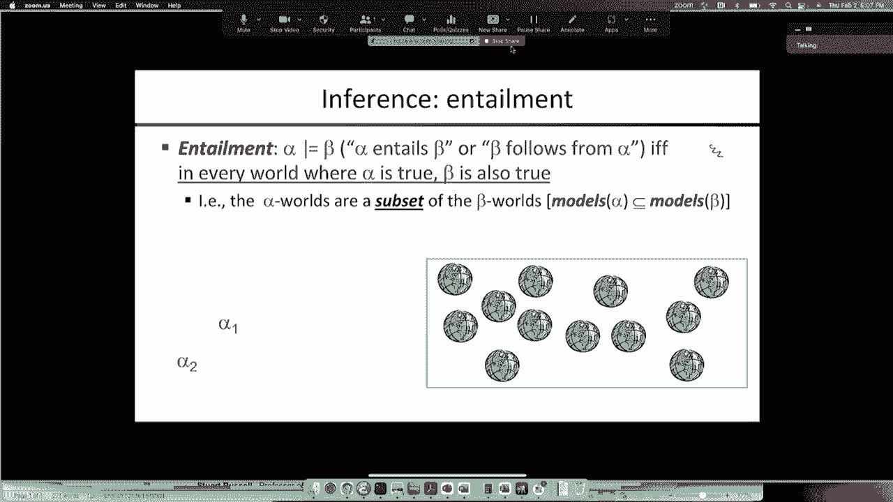
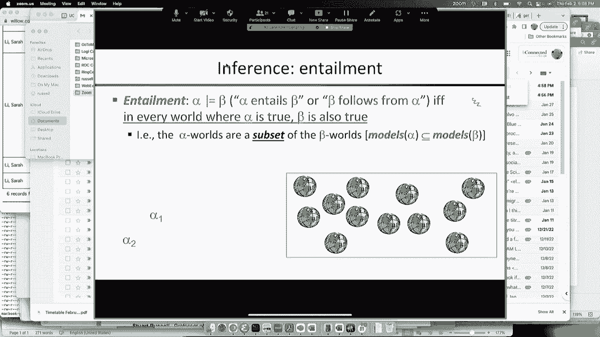
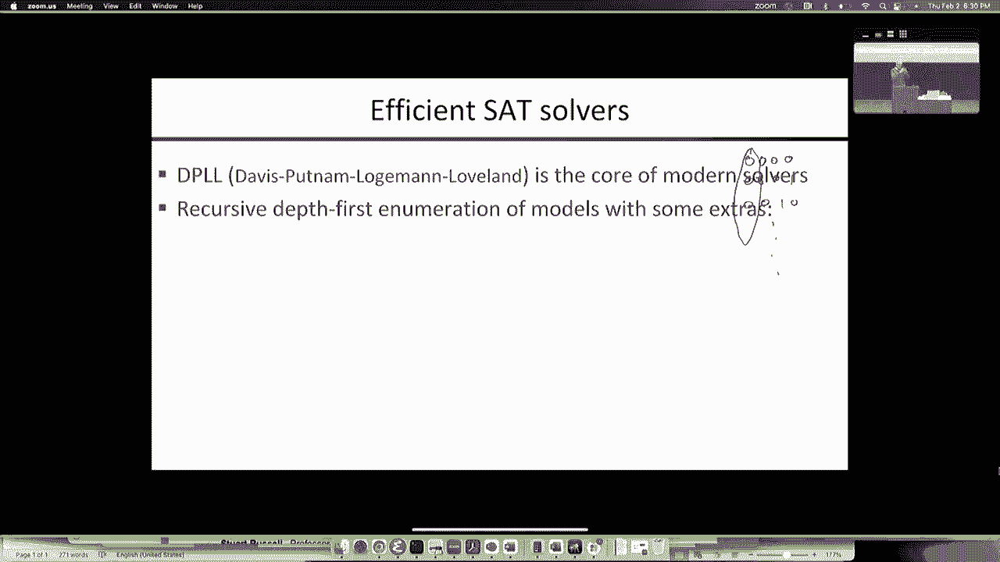

# 6：布尔可满足性与DPLL算法 🧠






在本节课中，我们将学习命题逻辑的核心概念，特别是如何判断一个逻辑句子是否可满足。我们将介绍一种名为DPLL的高效算法来解决这个问题，并探讨如何将其应用于构建一个能进行逻辑推理的智能体（如吃豆人）。

---

## 逻辑蕴涵与可能世界 🌍

上一节我们介绍了命题逻辑的基本语法和语义。本节中，我们来看看逻辑推理中的一个核心关系：逻辑蕴涵。

逻辑蕴涵定义了一个句子如何必然导致另一个句子为真。其定义如下：句子α逻辑蕴涵句子β（记作 α ⊨ β），当且仅当在**每一个**使α为真的可能世界中，β也为真。

**公式**：α ⊨ β ⇔ 在所有模型 M 中，若 M ⊨ α，则 M ⊨ β。

更强的断言会排除更多的可能世界。例如，断言“A为真且B为真”比只断言“A为真”更强，因为它只在更少的可能世界中成立。因此，α₂ ⊨ α₁ 意味着使α₂为真的世界集合是使α₁为真的世界集合的子集。

---

## 推理算法：模型检查与定理证明 ⚙️

从逻辑蕴涵的定义，我们可以直接得到一个算法：枚举所有可能世界（即对所有命题符号的真值赋值），检查是否在每个α为真的世界中β也为真。这就是**模型检查**。

另一种方法是**定理证明**，即应用一系列推理规则（如假言推理 Modus Ponens）从前提推导出结论。这两种方法都追求两个关键属性：
*   **可靠性**：如果算法说α蕴涵β，那么它一定是正确的。
*   **完备性**：如果α确实蕴涵β，那么算法最终一定能证明它。

命题逻辑的模型检查是可行的，因为可能世界的数量是有限的（2^n个）。而对于一阶逻辑，可能世界是无限的，这使得完备的判定算法不存在（哥德尔不完备定理）。

---

## 为吃豆人构建知识库 🎮

现在，我们将逻辑应用于一个具体问题：为部分可观察环境下的吃豆人构建一个知识库，使其能通过推理进行定位、建图和规划。

首先，我们需要定义命题符号（变量）：
*   `Wall_xy`: 位置(x,y)处有一堵墙。
*   `Blocked_W_t`: 在时间t，吃豆人西侧感知到墙。
*   `Pacman_xy_t`: 在时间t，吃豆人在位置(x,y)。
*   `Action_N_t`: 在时间t，吃豆人执行“向北”动作。

知识库由描述世界如何运作的“公理”句子组成。以下是核心部分：

**1. 地图知识**
我们需要断言墙在哪里，以及墙不在哪里。
```
Wall_00, Wall_01, ..., ¬Wall_11, ¬Wall_12, ...
```

**2. 初始位置知识**
吃豆人知道自己在一个且仅在一个非墙格子上。
```
(Pacman_00_0 ∨ Pacman_01_0 ∨ ...)  // 他在某个地方
¬(Pacman_00_0 ∧ Pacman_01_0)        // 他不同时在(0,0)和(0,1)
... // 对所有位置对进行类似断言
```

**3. 感知公理**
感知信号的值由世界的真实状态决定。例如，“在时间t西侧被阻挡”当且仅当吃豆人当时在一个其西邻格有墙的位置上。
```
Blocked_W_t ⇔ (Pacman_00_t ∧ Wall_(-1)0) ∨ (Pacman_01_t ∧ Wall_(-1)1) ∨ ...
```
**代码**：这可以通过循环所有位置(x,y)来生成。

**4. 转移公理（运动模型）**
描述状态如何随时间变化。例如，吃豆人在时间t位于(3,3)有两种方式：
*   **保持**：他上一刻就在(3,3)，且没有执行使他离开的动作。
*   **移动**：他上一刻在邻格(如(3,2))，并执行了进入(3,3)的动作（如向北移动）。
```
Pacman_33_t ⇔
    [Pacman_33_{t-1} ∧ ¬(Action_N_{t-1} ∧ ¬Wall_N) ∧ ...] // 未离开
    ∨
    [Pacman_32_{t-1} ∧ Action_N_{t-1} ∧ ¬Wall_N] ∨ ...    // 从邻格移入
```
这些公理构成了完整的“吃豆人物理学”。虽然句子数量庞大（位置数×时间步数），但可由程序自动生成。推理机将利用这些知识，从感知和行动历史中推断出吃豆人的位置（定位）、地图（建图）或达成目标的行动序列（规划）。

---

## 可满足性（SAT）与推理 🔗

上一节我们为吃豆人建立了知识库。本节中我们来看看如何让机器利用这些知识进行自动推理，核心是**可满足性**问题。

一个句子是**可满足的**，当且仅当存在至少一个可能世界（一组真值赋值）使其为真。检查可满足性的算法称为SAT求解器。

我们如何用SAT求解器进行蕴涵推理呢？利用**演绎定理**：
α ⊨ β 当且仅当 句子 (α ∧ ¬β) 是**不可满足的**（即存在矛盾）。

**推理流程**：
1.  知识库（已知事实）记为 α。
2.  想证明的查询记为 β。
3.  将知识库与查询的否定组合：α ∧ ¬β。
4.  将该句子送入SAT求解器。
5.  如果求解器说“不可满足”，则证明 α ⊨ β 成立（因为假设β为假会引发矛盾）。
6.  如果求解器找到一个满足的模型，则该模型就是α为真而β为假的反例，证明蕴涵不成立。

---

## 合取范式（CNF）📝

大多数高效的SAT求解器要求输入是**合取范式**。任何命题逻辑句子都可以机械地转化为CNF。

**合取范式**定义：它是多个**子句**的合取（∧），每个子句是多个**文字**的析取（∨）。文字是命题符号或其否定。
**公式**：CNF = (literal₁ ∨ literal₂ ∨ ...) ∧ (literal₃ ∨ literal₄ ∨ ...) ∧ ...

**转换示例**：
将句子 (A ⇒ W) ⇔ B 转换为CNF。
1.  消除⇔： (A ⇒ W) ∧ (W ⇒ A) ⇔ B 变为 [(A ⇒ W) ⇒ B] ∧ [B ⇒ (A ⇒ W)]？更正：应拆分为两个方向：(A ⇒ W) ⇒ B 以及 B ⇒ (A ⇒ W)。更标准的方法是： (P ⇔ Q) 等价于 (P ⇒ Q) ∧ (Q ⇒ P)。所以原句变为：
    ( (A ⇒ W) ⇒ B ) ∧ ( B ⇒ (A ⇒ W) )
2.  消除⇒：用 (X ⇒ Y) ≡ (¬X ∨ Y) 替换。
    ( ¬(A ⇒ W) ∨ B ) ∧ ( ¬B ∨ (A ⇒ W) )
3.  再次消除内层的⇒：
    ( ¬(¬A ∨ W) ∨ B ) ∧ ( ¬B ∨ (¬A ∨ W) )
4.  应用德摩根定律：¬(¬A ∨ W) ≡ (A ∧ ¬W)
    ( (A ∧ ¬W) ∨ B ) ∧ ( ¬B ∨ ¬A ∨ W )
5.  分配律：将(A ∧ ¬W) ∨ B 转化为 (A ∨ B) ∧ (¬W ∨ B)
6.  最终CNF：
    (A ∨ B) ∧ (¬W ∨ B) ∧ (¬B ∨ ¬A ∨ W)

转换过程可能使句子变长，但它是自动化的。在我们的应用中，直接以接近CNF的形式书写公理可以避免复杂的转换。

---

## DPLL算法 🌳

最后，我们介绍一个经典且高效的确定性SAT求解算法：**DPLL算法**（Davis-Putnam-Logemann-Loveland）。它本质上是对所有可能真值赋值进行深度优先搜索，但加入了两个关键的优化。

算法基本步骤如下：

**代码**（递归框架）：
```python
function DPLL(CNF句子 S, 赋值 partial_assignment):
    if S 在 partial_assignment 下已为真:
        return SATISFIABLE
    if S 在 partial_assignment 下存在假子句:
        return UNSATISFIABLE

    // 优化1：纯文字消除
    literal = 找到在S中只以一种形式出现的纯文字
    if literal 存在:
        return DPLL(S, partial_assignment ∪ {literal=true})

    // 优化2：单元传播
    unit_clause = 找到只有一个未赋值文字的子句（单元子句）
    if unit_clause 存在:
        literal = unit_clause 中的那个文字
        return DPLL(S, partial_assignment ∪ {literal=true})

    // 分裂：选择一个未赋值的变量
    var = 选择一个未赋值的命题符号
    // 尝试赋值为真
    if DPLL(S, partial_assignment ∪ {var=true}) == SATISFIABLE:
        return SATISFIABLE
    // 尝试赋值为假
    else:
        return DPLL(S, partial_assignment ∪ {var=false})
```

**关键优化**：
1.  **单元传播**：如果一个子句只有一个文字未赋值，为使该子句为真，该文字必须被赋值为真。这可以强制推导出许多赋值，避免不必要的分支。
2.  **纯文字消除**：如果一个文字在整个CNF句子中只以正形式或只以负形式出现，那么可以立即将其赋值为真（如果以正形式出现）而不影响可满足性，因为这只会使包含它的子句变真，不会导致矛盾。

通过结合深度优先搜索和这两种强大的推导规则，DPLL算法能够极大地剪枝搜索空间，从而高效地解决许多大规模的SAT问题。

---

## 总结 🎯

本节课中我们一起学习了：
1.  **逻辑蕴涵**的定义及其与可能世界集合的关系。
2.  基于知识的智能体框架：通过**知识库**（公理）和**推理机**来回答问题。
3.  如何为吃豆人世界构建详细的命题逻辑知识库，包括感知、运动和初始状态公理。
4.  利用**可满足性**问题进行推理的核心方法：将蕴涵查询转化为`KB ∧ ¬Query`的不可满足性检查。
5.  命题逻辑句子可以标准化为**合取范式**。
6.  **DPLL算法**作为高效的SAT求解器，通过单元传播和纯文字消除来优化对真值赋值的搜索。



这为我们提供了强大的工具：一旦用逻辑公理描述了一个领域（如吃豆人游戏），我们就可以使用通用的SAT求解器来自动解决该领域内的规划、定位和建图问题，而无需为每个任务编写特定算法。