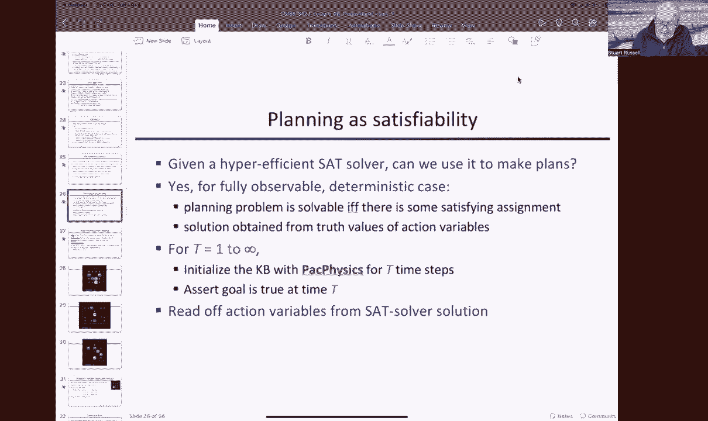
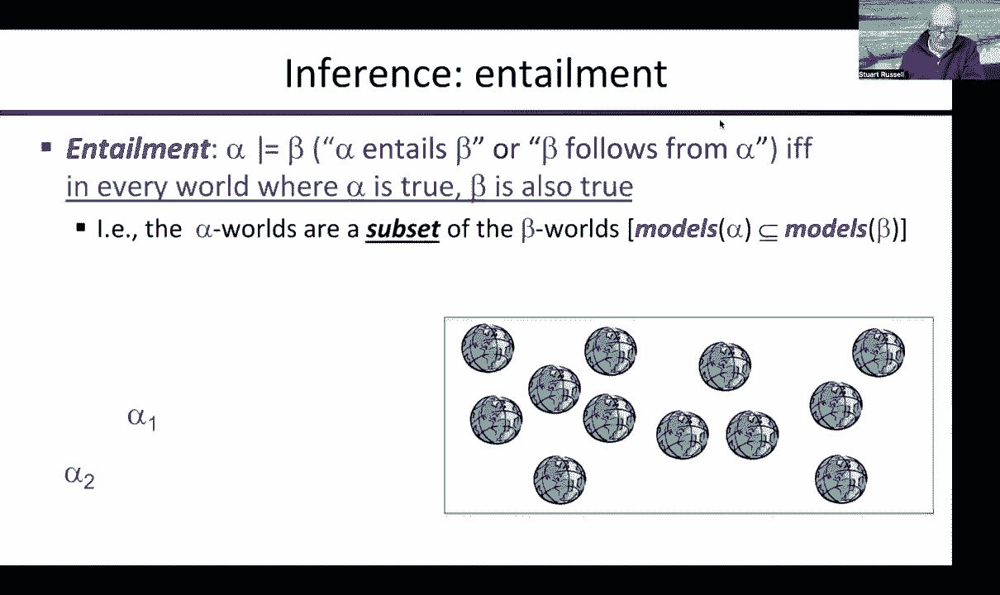
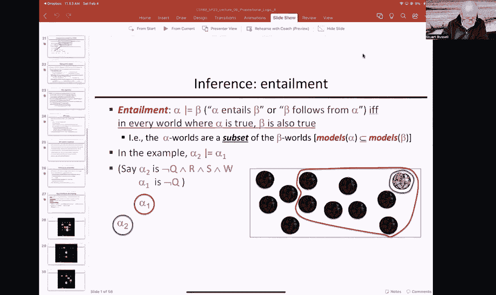
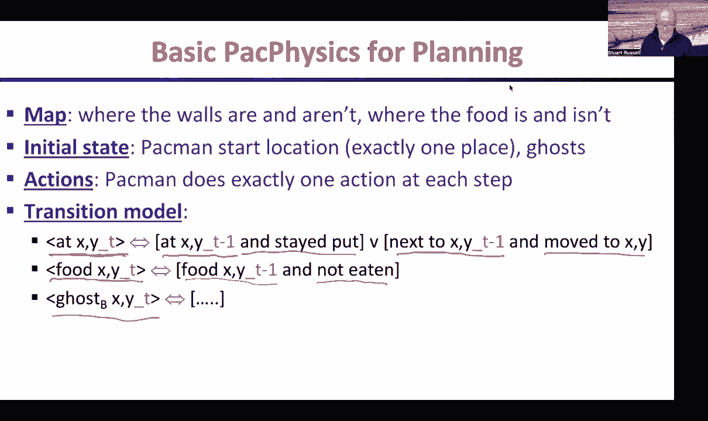
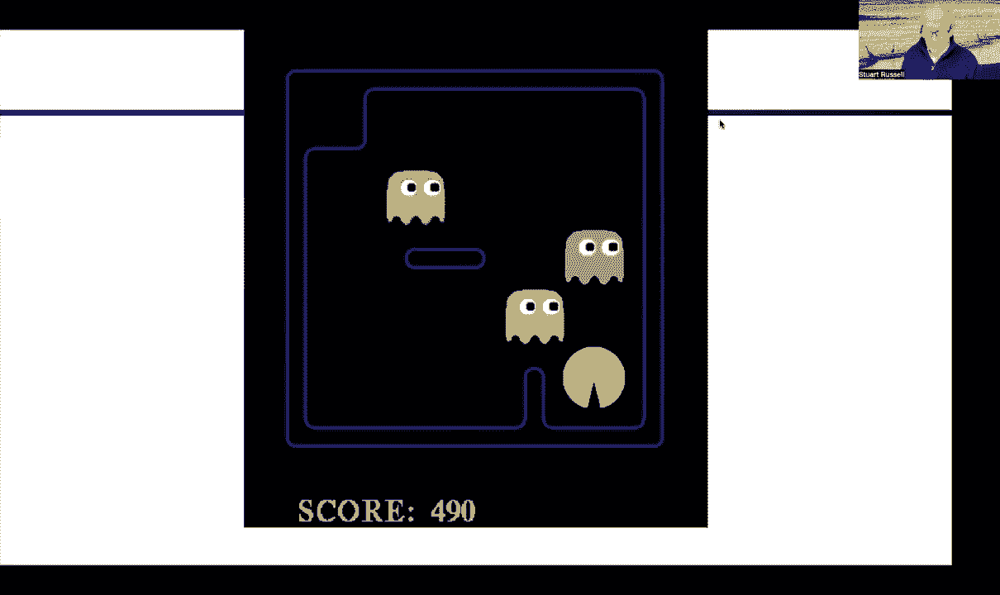
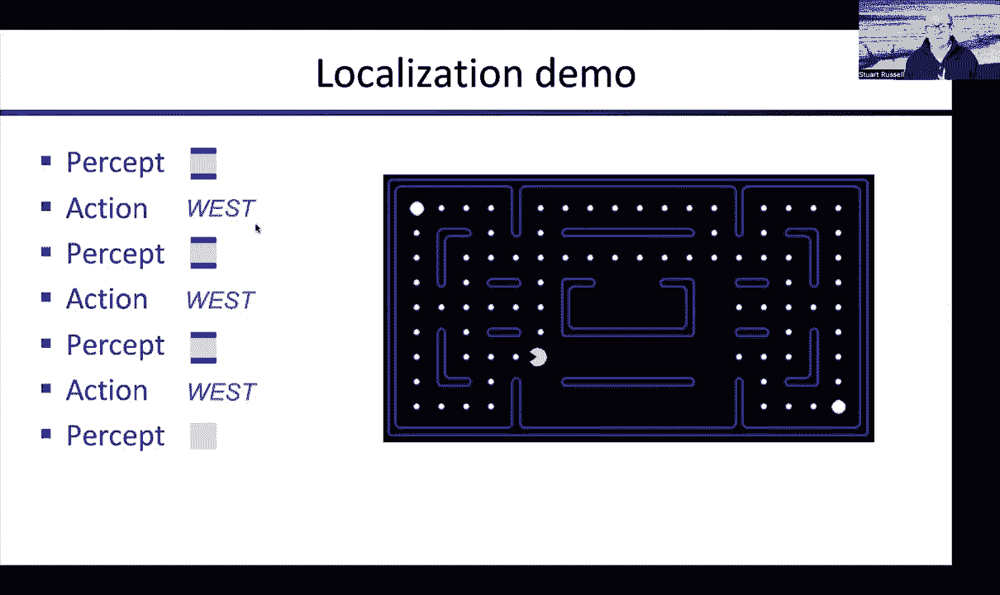
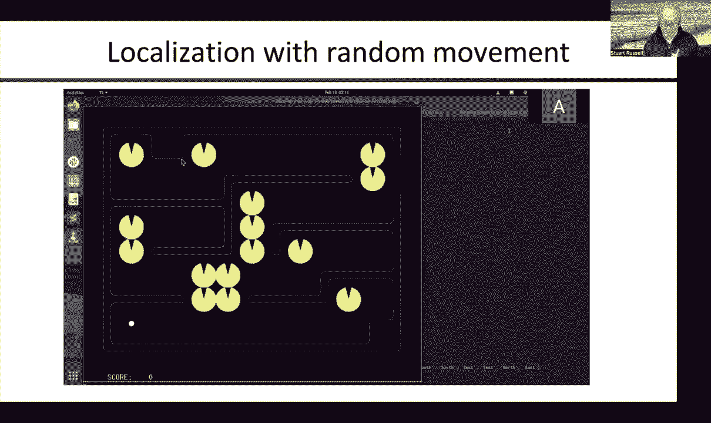
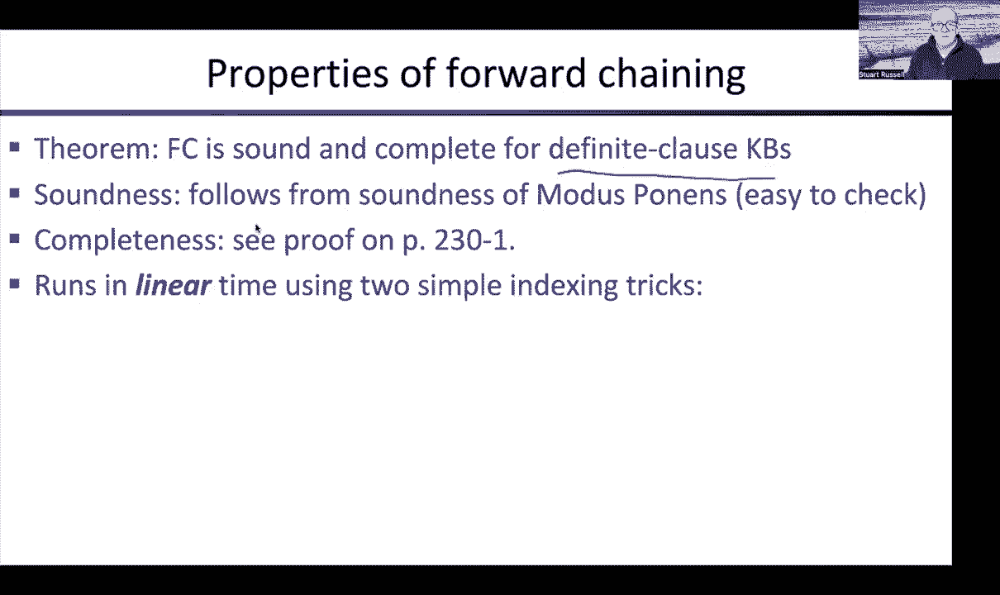

# 7：使用命题逻辑进行规划与状态估计 🧠

在本节课中，我们将学习如何利用命题逻辑和可满足性求解器来解决规划、定位和地图构建等任务。我们将从基本的规划问题开始，逐步深入到在部分可观察世界中进行状态估计和同步定位与建图的复杂问题。

---

## 规划问题：使用逻辑求解器寻找路径 🗺️

上一节我们介绍了命题逻辑及其推理方法。本节中，我们来看看如何利用可满足性求解器来制定计划。

基本思想是：我们首先写下描述世界物理规则的所有命题逻辑语句。然后，我们询问求解器：**在给定的时间步数 `T` 内，是否存在一个动作序列可以实现目标？** 这本质上是在询问，在给定的物理约束下，整个语句集合是否可满足。

更详细地说，我们采用迭代加深的方法：
1.  从 `T = 1` 开始，尝试在一步内解决问题。
2.  如果不可行，则 `T = T + 1`，增加允许的时间步数。
3.  重复此过程，直到找到解。第一个找到解的 `T` 值对应的就是最短计划。

对于每个 `T` 值，我们需要生成：
*   **初始状态**：描述吃豆人和鬼魂的初始位置。
*   **目标状态**：断言目标（例如，吃掉所有食物）在时间 `T` 为真。
*   **转移模型**：定义每个时间步状态如何变化，由动作和物理规则决定。

以下是转移模型的核心逻辑示例：
*   **吃豆人位置**：`PacmanAt(x, y, t) ⇔ [PacmanAt(x, y, t-1) ∧ StayAction(t-1)] ∨ [PacmanAt(x', y', t-1) ∧ MoveActionTo(x, y, t-1)]`
*   **食物状态**：`FoodAt(x, y, t) ⇔ FoodAt(x, y, t-1) ∧ ¬Eaten(x, y, t-1)`
*   **鬼魂位置**：由固定的策略决定。

求解器运行后，如果计划存在，我们可以通过查看满足所有约束的**动作变量**在每一步的真值，直接读出具体的行动计划。

---

## 状态估计：在部分可观察世界中定位自己 🧭

上一节我们讨论了在完全已知世界中的规划。本节中，我们来看看当吃豆人不知道自己初始位置，只能通过局部感知（如感知四个方向的墙壁）来获取信息时，如何进行**状态估计**。

状态估计是指，根据历史行动和观察，推断当前世界状态中哪些事实必然为真。这是一个所有智能系统都需要解决的核心问题。

我们依然可以使用逻辑推理来解决。知识库 `KB` 包含：
*   世界物理规则。
*   **传感器模型**：将感知与可能的位置关联起来。例如，“西边被阻挡”这一感知为真，当且仅当吃豆人位于所有西边有墙的方格之一。公式上，这是一个包含所有可能位置的析取式：`BlockedWest(t) ⇔ (PacmanAt(1,1,t) ∧ WallAt(0,1)) ∨ (PacmanAt(1,2,t) ∧ WallAt(0,2)) ∨ ...`

要进行状态估计，代理可以不断询问 `KB` 两类问题：
1.  `KB ⊨ PacmanAt(x, y, now)`? （能证明我在 `(x, y)` 吗？）
2.  `KB ⊨ ¬PacmanAt(x, y, now)`? （能证明我不在 `(x, y)` 吗？）

有两种实现方式：
*   **惰性估计**：仅在需要回答问题时，才基于全部历史进行推理。
*   **积极估计**：在每一步行动和感知后，主动对所有状态变量进行上述两类查询，并将能证明为真或为假的事实加入 `KB`，作为后续推理的“垫脚石”，从而提高效率。

通过这个过程，可能的位置集合会随着新的感知而不断缩小（单调不增），最终可能确定唯一位置。

---

## 地图构建：在已知自身位置时探索环境 🗺️➡️📝

如果吃豆人**知道自己的确切位置**（例如，通过航位推算，从定义的 `(0,0)` 点开始，根据动作和是否被阻挡来精确计算相对位置），那么它就可以利用感知来**构建地图**。

方法与状态估计类似：
1.  初始化 `KB`，包含物理规则和传感器模型，并固定初始位置为 `(0,0)`。
2.  在每个时间步，根据当前位置和感知到的阻挡信息，对**墙变量**进行推理。
3.  如果能证明 `WallAt(x, y)` 或 `¬WallAt(x, y)`，就将该结论加入 `KB`。
4.  选择可行的动作继续探索。

通过不断探索和推理，吃豆人可以逐步建立起整个可达区域的地图。

---

## 同步定位与建图：解决“鸡与蛋”问题 🐔🥚

在更现实的情况下，航位推算可能失效（例如，轮子打滑导致位置不确定）。此时，吃豆人面临**同步定位与建图**问题：不知道地图，就无法定位；不知道自身位置，就无法正确建图。

解决方法依然是逻辑推理，但同时对**位置变量**和**墙变量**进行推断：
1.  同样初始化 `KB`（物理规则 + 传感器模型，例如感知可能简化为“相邻墙的数量”）。
2.  仍然可以定义初始位置为 `(0,0)`。
3.  在每个时间步，用动作和感知更新 `KB` 后，尝试推断：
    *   关于墙：`WallAt(x, y)` 或 `¬WallAt(x, y)`？
    *   关于自身位置：`PacmanAt(x, y, t)` 或 `¬PacmanAt(x, y, t)`？
4.  即使信息非常有限（如仅知道相邻墙的数量变化），通过交叉推理，智能体通常也能逐步同时确定自身位置和地图结构。

---

## 前向链接算法：高效的定理证明方法 ⚙️

最后，我们补充介绍一种用于知识库推理的算法——**前向链接**。它属于定理证明算法，通过应用推理规则（如**肯定前件**）从已知事实推导出新事实。

肯定前件规则形式为：`(A₁ ∧ A₂ ∧ ... ∧ Aₙ) ⇒ B`。如果已知 `A₁, A₂, ..., Aₙ` 都为真，则可推出 `B` 为真。

前向链接算法持续应用此规则，直到没有新事实可被推出。它特别适用于知识库全部由**定子句**组成的情况。定子句是形如 `(A₁ ∧ A₂ ∧ ... ∧ Aₙ) ⇒ B` 的蕴含式，其中 `B` 是单个命题符号。一个普通事实 `A` 可看作 `True ⇒ A`。

为了使算法高效，需要两个关键技巧：
1.  **索引**：为每个符号建立索引，记录它作为前提出现在哪些定子句中。
2.  **计数器**：为每个定子句维护一个计数器，记录尚未被满足的前提数量。当计数器归零时，即可推出结论。

对于定子句知识库，前向链接算法是可靠且完备的。

---

## 总结 📚

本节课中，我们一起学习了如何将命题逻辑和可满足性求解器应用于一系列AI核心任务：
1.  **规划**：通过迭代加深和逻辑编码，寻找实现目标的最短动作序列。
2.  **状态估计（定位）**：在部分可观察环境中，通过逻辑推理逐步缩小可能状态的集合。
3.  **地图构建**：在已知位置时，通过感知和推理建立环境模型。
4.  **同步定位与建图**：在位置和地图均未知时，通过交叉推理同时解决两者。
5.  **前向链接**：一种针对定子句知识库的高效、可靠且完备的推理算法。

这些方法展示了逻辑表示和推理在构建理性智能体中的强大能力和通用性。