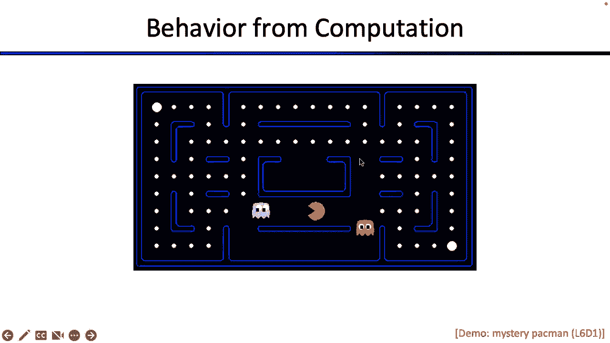
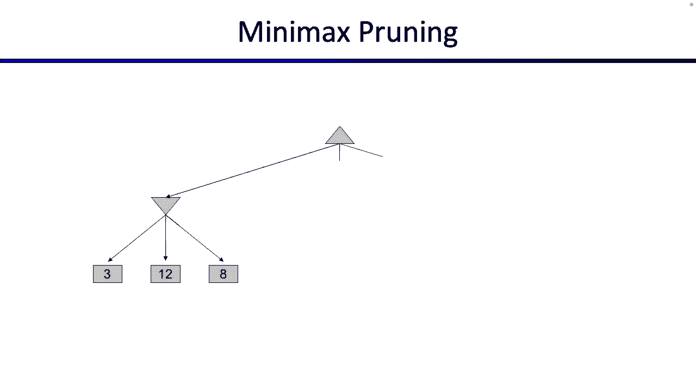

# 10：游戏：树、极大极小、剪枝 🎮


在本节课中，我们将学习如何将搜索算法扩展到多人游戏中。我们将探讨确定性、零和、完全可观察的两人游戏，并学习如何通过构建游戏树、使用极大极小算法以及应用剪枝技术来为智能体（如吃豆人）制定最优策略。



---

## 概述 📋

到目前为止，我们讨论的搜索问题都只涉及一个玩家。今天，我们将放松这个限制，看看当搜索问题涉及多个玩家时会发生什么。我们将学习解决这类问题的算法，并理解如何推理它们。这通常被称为对抗性搜索或游戏搜索。

---

## 游戏的定义与分类 🧩

上一节我们介绍了搜索问题的基本框架。本节中，我们来看看如何将其扩展到多人游戏中。

一个确定性游戏可以形式化地定义为以下组成部分：

*   **状态空间 S**：游戏中所有可能配置的集合。
*   **玩家列表 P**：参与游戏的玩家，例如 `[1, 2, ..., N]`。我们通常假设玩家轮流行动。
*   **动作函数 A(s)**：在状态 `s` 下，当前玩家可以采取的所有合法动作的列表。
*   **转移函数 Result(s, a)**：给定状态 `s` 和动作 `a`，返回执行动作后到达的新状态 `s‘`。
*   **终止测试 Terminal-Test(s)**：判断状态 `s` 是否为游戏结束状态。
*   **终局效用函数 Utility(s, p)**：对于终止状态 `s` 和玩家 `p`，返回一个数值分数，表示该玩家在游戏结束时的收益。分数越高越好。

与单智能体搜索不同，游戏的解决方案不是一个动作序列，而是一个**策略**。策略是一个从状态到动作的映射，它告诉玩家在任何可能遇到的状态下应该采取的最佳行动。

游戏可以根据不同参数分类：
*   **确定性 vs 随机性**：游戏规则是否包含随机因素（如掷骰子）。
*   **玩家数量**：单人、双人或多于两人。
*   **合作 vs 对抗**：玩家目标是相互竞争还是可以合作。
*   **完全可观察 vs 部分可观察**：玩家是否能完全了解游戏状态（如扑克中看不到对手的牌）。

今天我们主要关注**确定性、零和、完全可观察的两人游戏**。在零和游戏中，一个玩家的收益恰好是另一个玩家的损失，即 `Utility(s, 玩家1) = -Utility(s, 玩家2)`。

---

## 从单人到多人：构建游戏树 🌳

上一节我们定义了游戏。本节中我们来看看如何通过构建游戏树来分析游戏。

首先，回顾单智能体（如吃豆人独自吃豆）的搜索树。这棵树代表了智能体对未来所有可能行动序列的“想象”。在树的叶子节点（终止状态），我们根据游戏规则（如步数惩罚、吃豆奖励）赋予一个效用值。对于非叶子节点，其值定义为：从该状态出发，采取最优行动序列所能获得的最佳效用。由于是单智能体，它总是选择最大化自身效用的行动，因此通过从叶子节点向上传播**最大值**来计算非叶子节点的值。

现在，引入对手（如幽灵）。我们构建一棵交替行棋的游戏树。根节点是吃豆人（最大化玩家）的回合，其后继节点是幽灵（最小化玩家）的回合，以此类推。这棵树仍然是吃豆人对未来可能性的推演。

在叶子节点（终止状态），我们根据终局效用函数赋值（例如，吃豆人获胜得高分，被抓住得低分）。关键区别在于如何计算非叶子节点的值：
*   如果轮到**最大化玩家**（吃豆人），节点值是其所有后继节点值中的**最大值**。公式表示为：`V_max(s) = max_{a in A(s)} V(Result(s, a))`
*   如果轮到**最小化玩家**（幽灵），节点值是其所有后继节点值中的**最小值**。公式表示为：`V_min(s) = min_{a in A(s)} V(Result(s, a))`

这个过程就是**极大极小算法**。它基于一个核心假设：对手也是理性的，并且会采取对其自身最优（即对吃豆人最不利）的行动。

---

## 极大极小算法详解 ⚖️

上一节我们了解了游戏树和值传播的基本思想。本节中我们深入看看极大极小算法的具体过程。

考虑一个简单的两步游戏树。从根节点（吃豆人）开始，递归地计算每个节点的值：
1.  到达终止状态时，直接返回该状态的效用值。
2.  在最大化节点，遍历所有子节点，接收它们返回的值，并返回其中的最大值。
3.  在最小化节点，遍历所有子节点，接收它们返回的值，并返回其中的最小值。

以下是用伪代码描述的算法核心：

```python
def max_value(state):
    if terminal_test(state):
        return utility(state)
    v = -∞
    for action in actions(state):
        v = max(v, min_value(result(state, action)))
    return v

def min_value(state):
    if terminal_test(state):
        return utility(state)
    v = +∞
    for action in actions(state):
        v = min(v, max_value(result(state, action)))
    return v
```

算法最终会为根节点计算出一个值，并隐含地确定了一条最优行动路径。例如，在井字游戏中，通过极大极小算法可以推导出双方最优玩法会导致平局。

需要注意的是，与单智能体搜索找到目标即停止不同，极大极小算法需要检查游戏树中**所有**可能的终止状态，才能确定根节点的确切值，因为对手的选择会影响最终结果。

---

## 优化：Alpha-Beta 剪枝 ✂️

上一节我们介绍了基础的极大极小算法，但它需要搜索整棵树，在复杂游戏中（如国际象棋）是不现实的。本节中我们来看看如何通过剪枝来大幅减少需要搜索的节点数。

**Alpha-Beta 剪枝**的核心思想是：在搜索过程中，如果能够断定某棵子树不会影响根节点的最终决策，就可以跳过这棵子树的搜索。

这通过维护两个值来实现：
*   **α**：在当前路径上，最大化玩家**至少**能保证得到的效用值（下界）。初始为 -∞。
*   **β**：在当前路径上，最小化玩家**至少**能保证得到的效用值（上界）。初始为 +∞。

剪枝规则如下：
*   在**最大化节点**，如果某个子节点返回的值 `v >= β`，则可以立即停止搜索该节点的其他子节点（**β 剪枝**）。因为最小化父节点（其β值）永远不会允许选择这个会导致 `v` 或更高值的分支。
*   在**最小化节点**，如果某个子节点返回的值 `v <= α`，则可以立即停止搜索该节点的其他子节点（**α 剪枝**）。因为最大化父节点（其α值）永远不会允许选择这个会导致 `v` 或更低值的分支。

让我们看一个例子。假设在搜索过程中，一个最小化节点当前的 `β = 3`（意味着其父最大化节点至少能保证得到3）。当探索该最小化节点的第一个子节点时，发现它是一个最大化节点，并且其第一个子节点返回了值 `10`。由于这个最小化节点会取子节点中的**最小值**，所以它的值**最多是10**，但更重要的是，它**肯定小于或等于10**。然而，这并没有提供足够信息，因为10 > 3 (`β`)，我们还不确定父节点是否会选择这个分支。

继续探索。假设该最大化节点的下一个子节点返回值 `2`。现在，这个最小化节点的值**最多是2**（因为2 < 10）。此时，因为 `2 <= β (3)` 成立，我们可以触发**α 剪枝**。为什么？因为父最大化节点（其 `α` 可能为3）知道，如果选择这个分支，它最多只能得到2（由于最小化对手会选择2而不是10）。既然它已经有把握在其他分支上得到至少3，它就绝不会选择这个最多得2的分支。因此，这个最小化节点剩下的未探索子节点都无关紧要了，可以全部剪掉。

Alpha-Beta 剪枝能极大提升搜索效率，最优情况下可以将搜索深度加倍，但它依赖于子节点的探索顺序。好的顺序（先探索可能更优的分支）能触发更多剪枝。

---

## 总结 🎯

本节课中我们一起学习了对抗性搜索的基础。
1.  我们首先将搜索问题扩展到**多人、零和、确定性游戏**，并给出了形式化定义。
2.  我们学习了通过构建**游戏树**来表示玩家对未来的推演，并在树上定义节点的值。
3.  我们掌握了**极大极小算法**，该算法通过递归地在最大化节点取`max`、在最小化节点取`min`，来计算每个状态对当前玩家的价值，并假设对手总是采取最优行动。
4.  为了应对游戏树的指数级复杂度，我们引入了**Alpha-Beta 剪枝**技术。它通过维护 `α`（下界）和 `β`（上界）来识别并跳过那些不会影响最终决策的子树搜索，从而显著提高算法效率。



理解这些概念是构建能够玩转吃豆人等游戏的人工智能代理的关键第一步。