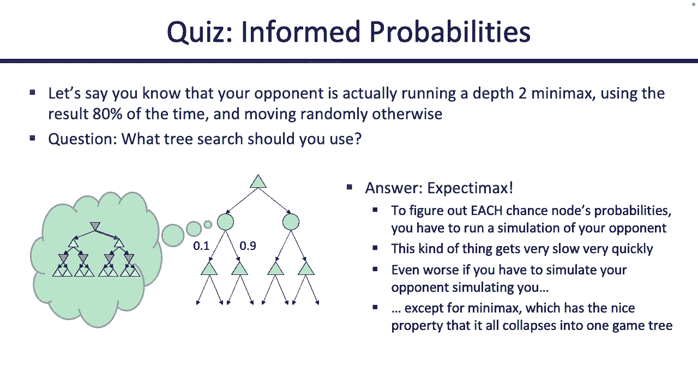

# 11：游戏算法 - 期望最大化和蒙特卡洛树搜索 🎮


在本节课中，我们将学习两种用于游戏决策的算法：期望最大化和蒙特卡洛树搜索。我们将从回顾Alpha-Beta剪枝开始，然后探讨在对手行为不确定时如何调整我们的模型，最后介绍一种更高效的搜索方法。

## 回顾：Alpha-Beta剪枝 🔍

上一节我们介绍了极小化极大算法，本节我们来看看如何通过Alpha-Beta剪枝来提高其效率。Alpha-Beta剪枝的核心思想是，在搜索过程中，如果发现某些分支不可能影响最终决策，就跳过对这些分支的探索。

以下是一个简单的Alpha-Beta剪枝示例：

```python
def alpha_beta(node, depth, alpha, beta, maximizing_player):
    if depth == 0 or node.is_terminal():
        return node.evaluate()
    if maximizing_player:
        value = -infinity
        for child in node.children:
            value = max(value, alpha_beta(child, depth-1, alpha, beta, False))
            alpha = max(alpha, value)
            if alpha >= beta:
                break  # Beta剪枝
        return value
    else:
        value = infinity
        for child in node.children:
            value = min(value, alpha_beta(child, depth-1, alpha, beta, True))
            beta = min(beta, value)
            if beta <= alpha:
                break  # Alpha剪枝
        return value
```

通过剪枝，我们可以避免探索整棵树，从而显著减少计算量。

## 深度限制搜索与评估函数 📏

由于游戏树可能非常庞大，我们无法进行完整的搜索。因此，我们需要在某个深度停止搜索，并使用评估函数来估计当前状态的价值。

评估函数接受一个游戏状态作为输入，并输出一个数值，表示该状态的好坏。例如，在国际象棋中，评估函数可能会考虑棋子数量、棋盘控制等因素。

设计评估函数时，我们需要提取状态的特征并为其分配权重。公式可以表示为：

**评估值 = w1 * f1 + w2 * f2 + ... + wn * fn**

其中，`f1, f2, ..., fn` 是特征值，`w1, w2, ..., wn` 是对应的权重。

## 期望最大化：处理不确定性 🎲

在之前的模型中，我们假设对手总是采取最优行动。然而，在现实中，对手可能会犯错，或者游戏本身包含随机因素（如掷骰子）。为了处理这种不确定性，我们引入了期望最大化算法。

期望最大化与极小化极大类似，但在对手的回合，我们不再假设对手采取最小化我们效用的行动，而是假设对手按照某种概率分布行动。我们计算每个可能结果的期望值，而不是最坏情况。

以下是一个期望最大化的伪代码示例：

```python
def expectimax(node, depth):
    if depth == 0 or node.is_terminal():
        return node.evaluate()
    if node.is_max_node():
        value = -infinity
        for child in node.children:
            value = max(value, expectimax(child, depth-1))
        return value
    elif node.is_chance_node():
        value = 0
        for child in node.children:
            prob = child.get_probability()
            value += prob * expectimax(child, depth-1)
        return value
```

在期望最大化中，机会节点代表不确定性，我们计算其子节点的加权平均值。

## 蒙特卡洛树搜索 🌳

蒙特卡洛树搜索是一种基于随机模拟的搜索方法，特别适用于那些状态空间巨大或评估函数难以设计的游戏。它通过多次随机模拟来评估每个行动的价值，并逐渐聚焦于更有希望的分支。

蒙特卡洛树搜索包含四个主要步骤：

1.  **选择**：从根节点开始，根据一定的策略选择子节点，直到到达一个未完全展开的节点。
2.  **扩展**：为选中的节点添加一个或多个子节点。
3.  **模拟**：从新添加的节点开始，进行随机模拟直到游戏结束。
4.  **回溯**：将模拟结果反向传播到路径上的所有节点，更新它们的统计信息。

通过不断重复这些步骤，蒙特卡洛树搜索能够逐渐逼近最优策略。

## 总结 📚



本节课我们一起学习了游戏决策中的两种重要算法：期望最大化和蒙特卡洛树搜索。期望最大化通过引入概率模型来处理对手行为的不确定性，而蒙特卡洛树搜索则通过随机模拟来高效地探索巨大的状态空间。这些算法为我们在复杂游戏中做出智能决策提供了强大的工具。