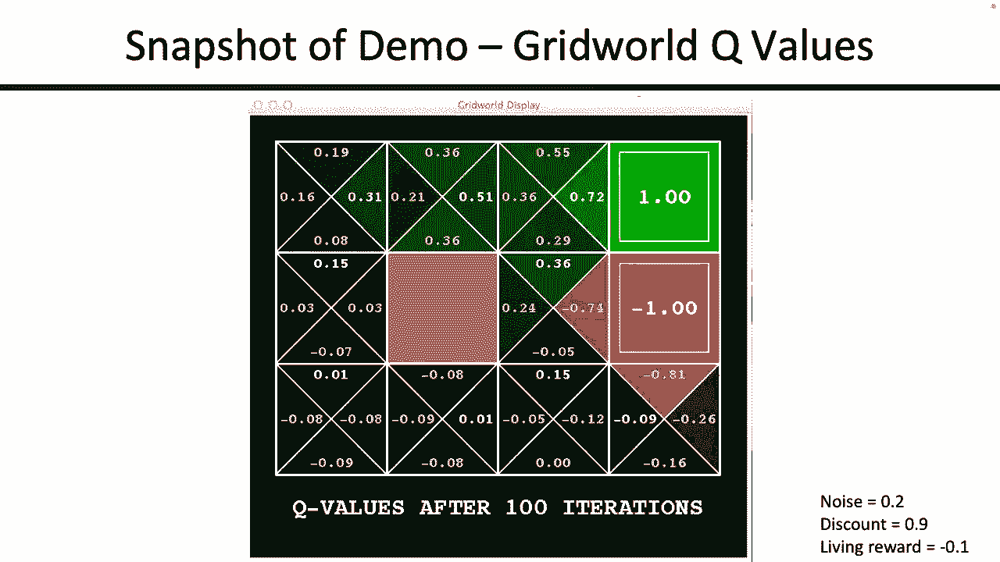
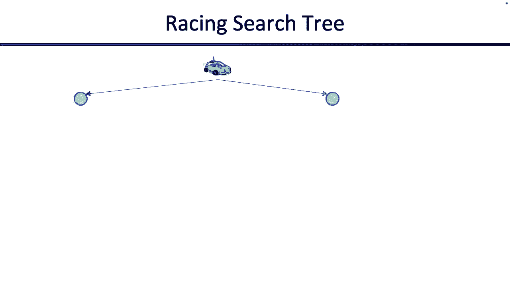
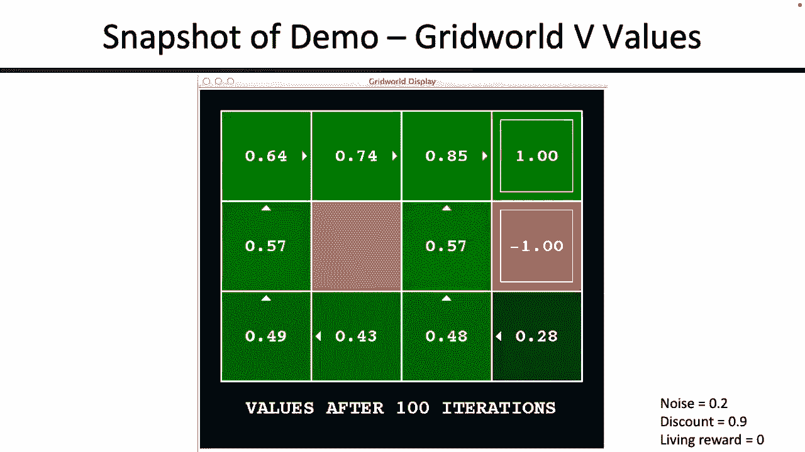
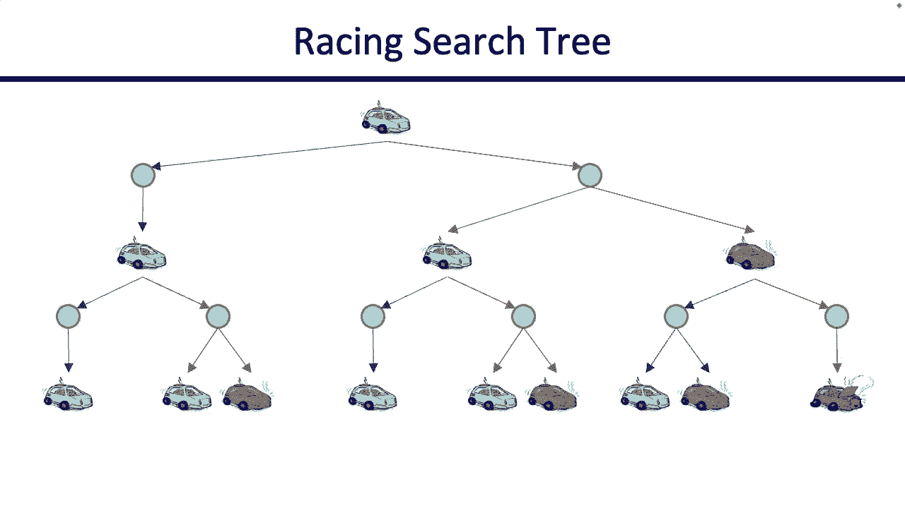

# 12：马尔可夫决策过程 (MDP) 入门 🎯


在本节课中，我们将学习**马尔可夫决策过程**。这是一种用于解决**非确定性搜索**问题的框架。我们将了解其核心组成部分、如何形式化问题，以及如何计算最优策略。

---

## 概述：什么是非确定性搜索？

上一节我们介绍了确定性搜索。本节中，我们来看看当**行动结果不确定**时会发生什么。

在确定性搜索中，选择一个行动会直接导致一个确定的结果。但在许多现实问题中，行动的结果是**不确定的**。例如，一个机器人试图穿越悬崖，它选择“前进”时，可能成功，也可能因为地面崩塌而掉入火坑。这种不确定性就是**马尔可夫决策过程**所要解决的问题。

---

## MDP 的核心组成部分

以下是定义一个 MDP 所需的元素：

*   **状态集合 (S)**：所有可能情况的集合。
*   **行动集合 (A)**：在给定状态下可以采取的所有行动。
*   **转移函数 (T)**：定义了在状态 `s` 采取行动 `a` 后，转移到状态 `s'` 的概率。公式表示为：`T(s, a, s') = P(s' | s, a)`。
*   **奖励函数 (R)**：定义了在状态 `s` 采取行动 `a` 并转移到状态 `s'` 后，所获得的即时奖励。公式表示为：`R(s, a, s')`。
*   **起始状态 (s₀)**：代理开始时的状态。
*   **终止状态**：游戏或任务结束的状态（可能不止一个）。

---

## 运行示例：网格世界

为了便于理解，我们使用一个**网格世界**作为运行示例。但请记住，并非所有 MDP 都是网格世界。

在这个网格世界中：
*   一个机器人位于迷宫中。
*   机器人可以选择向北、南、东、西移动。
*   **关键的非确定性**：当机器人选择一个方向（例如“向北”）移动时：
    *   有 **80%** 的概率成功向北移动一格。
    *   有 **10%** 的概率意外地向东移动一格。
    *   有 **10%** 的概率意外地向西移动一格。
    *   向相反方向（南）移动的概率为 0%。
*   如果移动方向是墙，则机器人停留在原地。
*   奖励分为两种：
    1.  **存活奖励**：每存活（移动）一步获得，可能是正数或负数（例如 -0.1）。
    2.  **终止奖励**：到达终点（如宝石 `+1` 或火坑 `-1`）时获得。**注意**：进入终点格子不会立即获得奖励，必须执行“退出”动作后才能获得。

我们的目标是：**最大化累计奖励**。

---

## 策略：解决方案的形式

在确定性搜索中，解决方案是一个**行动计划**（一系列动作）。但在 MDP 中，由于行动结果不确定，一个固定的行动计划可能无效。

因此，MDP 的解决方案是一个**策略 (Policy)**。
*   **策略**是一个从**状态**映射到**行动**的函数。
*   对于每一个可能的状态，它都告诉我们**最优的行动**是什么。
*   这就像给机器人一张“地图”，告诉它在每个位置应该怎么做。

---

## 折扣因子：未来的价值

在比较奖励时，我们通常认为**立即获得的奖励**比**未来获得的奖励**更有价值。为了量化这一点，我们引入**折扣因子 γ**。

*   γ 是一个介于 0 和 1 之间的数（通常接近 1，如 0.9）。
*   如果现在获得奖励 `r`，其价值就是 `r`。
*   如果 `t` 步之后获得奖励 `r`，其**当前价值**为 `γ^t * r`。
*   这样做有两个好处：
    1.  符合人类“尽早获得回报”的直觉。
    2.  即使游戏可能无限进行，折扣后的累计奖励总和也会收敛，使得计算成为可能。

因此，我们的目标正式定义为：**最大化期望折扣奖励总和**。

---

## 价值函数与 Q 函数

为了找到最优策略，我们需要定义两个核心概念：

1.  **状态价值函数 V*(s)**：表示从状态 `s` 开始，并在此后一直遵循**最优策略**所能获得的**期望折扣奖励总和**。
    ```math
    V^*(s) = \max_{a \in A} Q^*(s, a)
    ```

2.  **Q 函数 Q*(s, a)**：表示在状态 `s` 下**选择并锁定行动 `a`**，然后在此后一直遵循**最优策略**所能获得的**期望折扣奖励总和**。
    ```math
    Q^*(s, a) = \sum_{s'} T(s, a, s') [ R(s, a, s') + \gamma V^*(s') ]
    ```

**Q 状态**是一个中间概念，表示“已决定行动但结果尚未发生”的时刻。

---

## 贝尔曼方程：价值的核心关系

将 `V*` 和 `Q*` 的定义结合起来，我们可以得到著名的**贝尔曼最优方程**：

```math
V^*(s) = \max_{a \in A} \sum_{s'} T(s, a, s') [ R(s, a, s') + \gamma V^*(s') ]
```



这个方程是 MDP 理论的基石：
*   它表达了**一个状态的最优价值**与**其后续状态的最优价值**之间的关系。
*   方程中包含了**最大化**（选择最佳行动）和**期望**（对非确定性结果取平均）。
*   对于每个状态 `s`，我们都有这样一个方程，它们共同构成了一个方程组。

---

## 求解 MDP：从方程到算法

贝尔曼方程本身是一个复杂的方程组（因为含有 max 操作）。我们无法直接解析求解，但可以通过迭代算法来逼近解。

一种基础的思考方式是将 MDP 视为一个**期望最大化搜索树**。然而，直接展开这棵树效率极低，因为状态会重复出现。

我们将从“期望最大化”的视角出发，推导出更高效的算法（如下一节课将介绍的**值迭代**和**策略迭代**）。这些算法的核心思想是反复应用贝尔曼方程来更新状态的价值估计，直到它们收敛到最优值。

一旦我们计算出了最优价值函数 `V*` 或 `Q*`，最优策略就很容易得到了：
*   在状态 `s`，选择能使 `Q*(s, a)` 最大化的行动 `a`。
*   或者，选择能导向最高价值后续状态的行动。

---

## 总结

本节课中，我们一起学习了马尔可夫决策过程的基础知识：





1.  **MDP 是什么**：用于建模**顺序决策**问题，其中**行动结果具有不确定性**。
2.  **核心组件**：状态、行动、转移函数、奖励函数、折扣因子。
3.  **解决方案**：一个**策略**，它告诉我们在每个状态下应该采取什么行动。
4.  **优化目标**：最大化**期望折扣奖励总和**。
5.  **关键工具**：**状态价值函数 (V*)** 和 **Q 函数 (Q*)**。
6.  **核心方程**：**贝尔曼最优方程**，它建立了状态价值之间的递归关系。



理解这些概念是学习后续 MDP 求解算法（如值迭代、策略迭代、Q-Learning）的关键。在接下来的课程中，我们将探讨如何实际计算这些价值函数并找到最优策略。