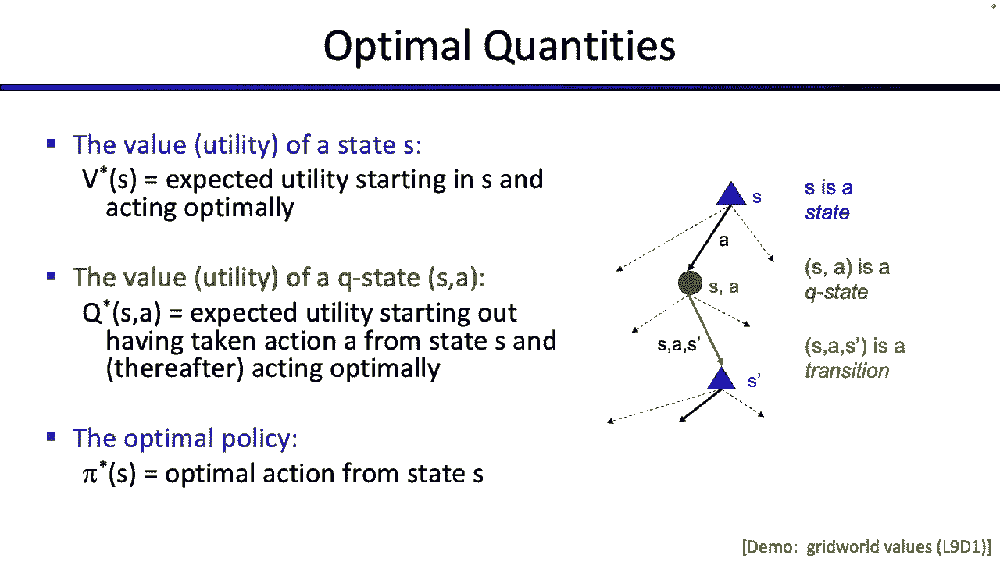
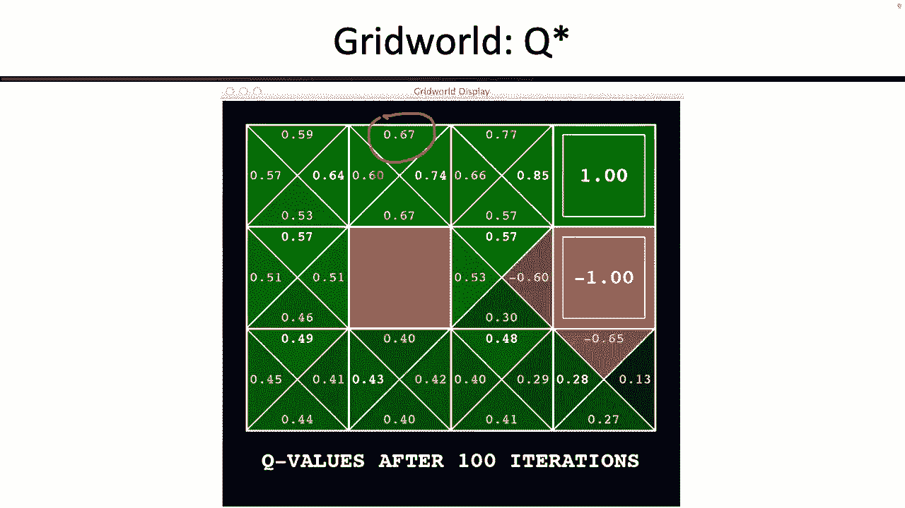
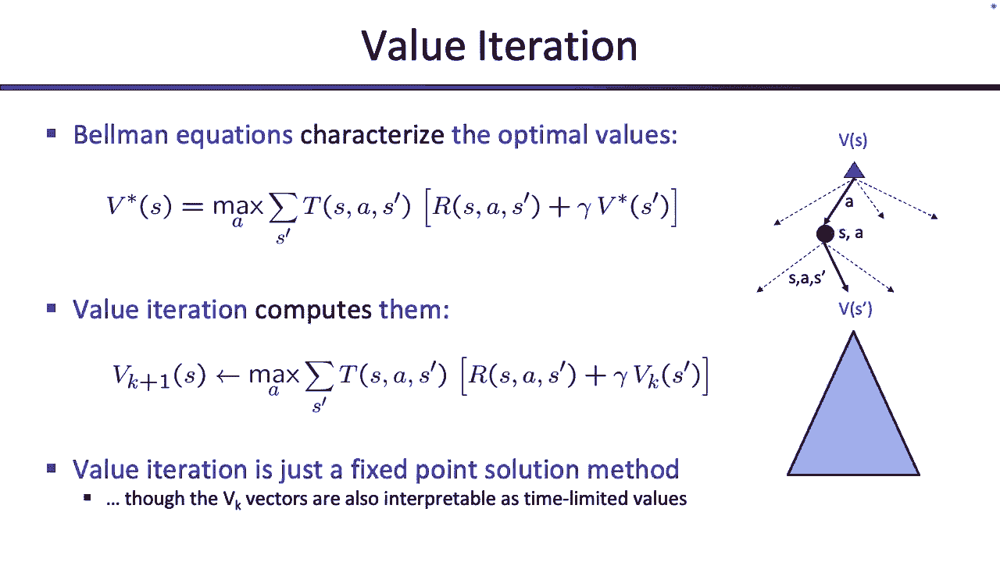
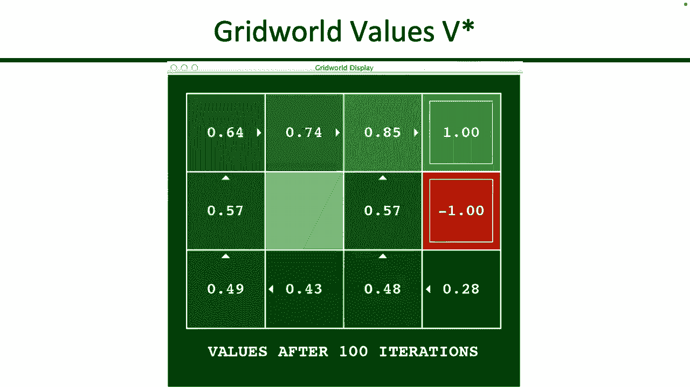
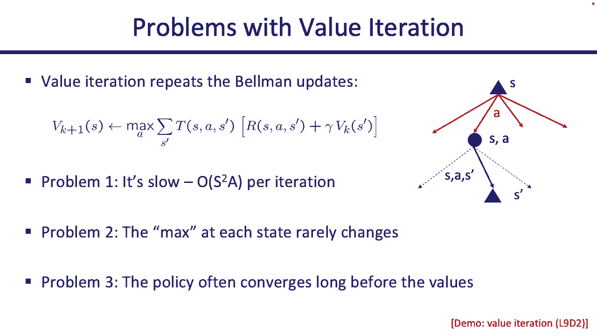
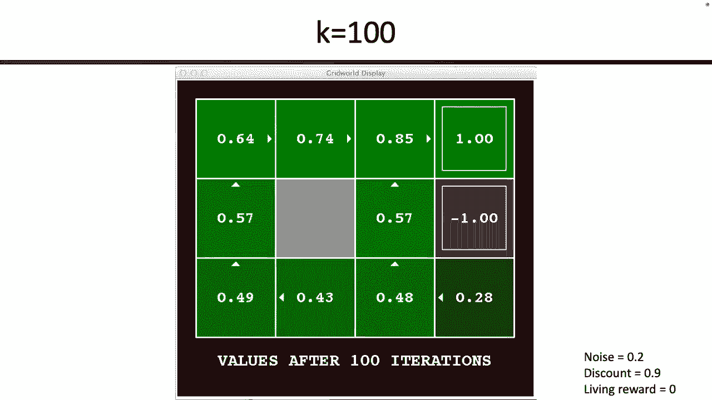
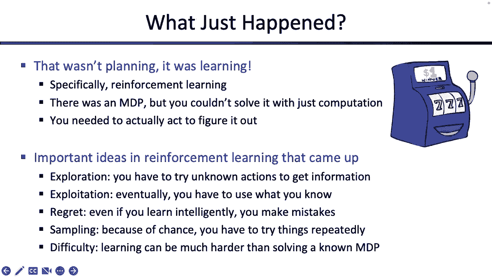

# 13：马尔可夫决策过程与动态规划 🧠


在本节课中，我们将学习马尔可夫决策过程的核心概念，并深入探讨如何使用动态规划方法（特别是值迭代和策略迭代）来求解MDP。我们还将初步了解强化学习的基本思想。

---





## 📚 概述与回顾

上一节我们介绍了马尔可夫决策过程的基本框架。MDP是一类更广泛的搜索问题，其特点是行动具有不确定性。当你采取一个行动时，会有一个概率分布决定你转移到其他状态的可能性。

每个时间步都可以用三元组 `(s, a, s')` 来刻画，其中 `s` 是当前状态，`a` 是采取的行动，`s'` 是转移后的状态。转移概率 `P(s'|s, a)` 和即时奖励 `R(s, a, s')` 是MDP的核心组成部分。

我们的总体目标是最大化**期望折扣奖励总和**。由于未来具有不确定性，并且我们希望未来的奖励价值稍低，因此引入了折扣因子 `γ`。

在MDP中，目标不是获得一系列确定的行动，因为结果是不确定的。因此，我们通常需要一个**策略** `π`，它告诉我们在每个特定状态下应该采取什么行动。

到目前为止，我们讨论了**状态值函数** `V(s)` 和**动作值函数** `Q(s, a)`。
*   `V(s)` 表示从状态 `s` 开始，在剩余时间内**最优行动**所能获得的期望折扣奖励总和。
*   `Q(s, a)` 表示从状态 `s` 开始，**已经选择了行动 `a`**，然后在剩余时间内最优行动所能获得的期望折扣奖励总和。

---

## ⚙️ 贝尔曼方程与值迭代

本节中，我们来看看如何计算这些值函数。连接最优行动与未来价值的关键是**贝尔曼方程**。

思考贝尔曼方程的一个有效方式是：要采取最优行动，你需要做对第一步，然后在剩余时间里继续保持最优。这形成了一个递归定义。

最优状态值函数 `V*(s)` 的贝尔曼方程如下：

```
V*(s) = max over a ∈ A(s) [ Σ over s' [ P(s'|s, a) * ( R(s, a, s') + γ * V*(s') ) ] ]
```

这个方程的含义是：在状态 `s` 下，我们尝试所有可能的行动 `a`，对于每个行动，我们计算其期望回报（即转移到各个状态 `s'` 的概率加权平均，加上即时奖励和未来折扣价值），然后选择能带来最大期望值的那个行动。

然而，这个方程本身只定义了最优值应满足的条件，并没有告诉我们如何计算出这些值。为此，我们引入了**值迭代**算法。

值迭代通过迭代更新来逼近最优值函数：





```
V_{k+1}(s) = max over a ∈ A(s) [ Σ over s' [ P(s'|s, a) * ( R(s, a, s') + γ * V_k(s') ) ] ]
```

我们可以从 `V_0(s) = 0`（假设零时间步长无奖励）开始，反复应用上述更新规则。随着迭代次数 `k` 的增加，`V_k(s)` 会收敛到最优值 `V*(s)`。

值迭代可以理解为：
1.  **逐步展开期望树**：`V_k(s)` 可以看作是仅考虑未来 `k` 步的“最优”期望回报。
2.  **不动点迭代**：将贝尔曼方程视为一个不动点问题，通过迭代逐步减少估计误差。
3.  **有限时域优化**：`V_k(s)` 是在有限时域 `k` 内的最优值，通过迭代延长时域。

**收敛性**：当折扣因子 `γ < 1` 时，值迭代保证收敛。因为未来深层的奖励会被 `γ^k` 严重折扣，使得迭代更新间的差异呈指数级缩小至零。

---

## 🔍 策略评估

上一节我们介绍了如何计算最优值，本节中我们来看看如何评估一个给定的策略。假设现在不是寻找最优策略，而是有人给了我们一个策略 `π`（可能不是最优的），我们想知道遵循这个策略能获得多少期望奖励。

这被称为**策略评估**。它与值迭代的关键区别在于，我们不再最大化 over actions，而是直接执行策略规定的行动。

策略 `π` 下的状态值函数 `V^π(s)` 的贝尔曼方程如下：

```
V^π(s) = Σ over s' [ P(s'|s, π(s)) * ( R(s, s, π(s), s') + γ * V^π(s') ) ]
```

注意，方程中的 `max` 操作符消失了，因为我们固定了行动 `a = π(s)`。

与值迭代类似，我们也可以通过迭代来求解 `V^π(s)`：

```
V_{k+1}^π(s) = Σ over s' [ P(s'|s, π(s)) * ( R(s, π(s), s') + γ * V_k^π(s') ) ]
```

由于去掉了 `max` 操作，这个方程变成了**线性方程**。理论上，我们可以将其写成线性方程组的形式，并用标准线性代数方法（如高斯消元法）直接求解，这通常比迭代更快。

**计算优势**：策略评估比值迭代计算量小，因为它省去了对所有动作的遍历和最大化操作，运行时复杂度降低了一个因子（动作数 `|A|`）。

---

## 🧭 策略提取与策略迭代

我们已经学会了如何计算值（最优值或给定策略的值），但最终我们往往需要的是一个可以执行的**策略**，而不是一堆数字。本节介绍如何从值函数中提取出策略。

### 策略提取
假设有人已经给了我们最优状态值函数 `V*(s)`。我们如何得到最优策略 `π*(s)`？答案是利用贝尔曼方程，但这次我们关心的是哪个行动导致了最大值：

```
π*(s) = argmax over a ∈ A(s) [ Σ over s' [ P(s'|s, a) * ( R(s, a, s') + γ * V*(s') ) ] ]
```





这里我们使用 `argmax` 而不是 `max`。`max` 给出最大的数值，而 `argmax` 给出导致这个最大值的行动。

如果拥有的是最优动作值函数 `Q*(s, a)`，那么策略提取将变得非常简单：

```
π*(s) = argmax over a ∈ A(s) [ Q*(s, a) ]
```

因为 `Q*(s, a)` 已经包含了“采取行动 `a` 后最优表现”的期望值，我们只需选择 `Q` 值最大的那个行动即可。

### 策略迭代
策略迭代是一种结合了策略评估和策略改进（提取）的高效算法。它交替进行以下两个步骤，直至策略不再改变：

1.  **策略评估**：给定当前策略 `π_i`，计算其值函数 `V^{π_i}`（通常运行几次迭代直到接近收敛）。
2.  **策略改进**：根据 `V^{π_i}`，利用策略提取（argmax）得到一个**新策略** `π_{i+1}`。

策略迭代的直观理解是：我们从一个策略（即使是随机策略）开始，评估它有多好，然后基于这个评估结果尝试改进它（选择在评估中看起来更好的行动），得到一个新策略，再评估这个新策略……如此循环。

**为什么比纯值迭代更高效？**
在值迭代中，每一步都需要对所有状态、所有动作计算最大值，计算量大。而在策略迭代中，大部分时间花在**策略评估**上，这一步没有 `max` 操作，计算更快。只有当策略稳定后，我们才需要进行一次涉及 `argmax` 的策略改进。实践中，策略往往比值函数收敛得更快。

---

## 🎰 从MDP到强化学习：一个预览

到目前为止，我们讨论的所有方法（值迭代、策略迭代）都属于**规划**范畴。我们拥有MDP的完整模型（即所有的 `P(s'|s, a)` 和 `R(s, a, s')`），在“离线”状态下通过计算来找出最优策略，然后再到环境中去执行。

但现实中，我们可能无法提前获得环境的完整模型。例如，走进一个赌场，面对两台老虎机（蓝色和红色），你并不知道拉动每台老虎机的奖励概率分布。

以下是两种不同的情景：

*   **情景一：已知模型的MDP（规划）**
    *   你提前知道：拉蓝色机器固定得1美元；拉红色机器有0.25概率得0美元，0.75概率得2美元。
    *   通过计算，你得出拉红色机器的期望回报更高。
    *   你走进赌场后，会一直拉红色机器。这是在执行**离线计算**好的最优策略。

*   **情景二：未知模型的强化学习**
    *   你走进赌场，但对老虎机的奖励机制一无所知。
    *   你不能提前计算。你必须通过**实际尝试**来学习。
    *   你可能会先拉几次红色机器（**探索**），以了解它的回报情况。
    *   根据尝试结果（比如连续几次得到0美元），你可能会推断红色机器不好，转而一直拉蓝色机器（**利用**）。
    *   你是在**在线互动**中边学边做决策。

**核心思想对比**：
*   **MDP/动态规划**：拥有完整环境模型，**先思考，后行动**。核心是“规划”。
*   **强化学习**：环境模型未知或不全，**在行动中学习**。核心是“探索”与“利用”的权衡，以及如何从经验中学习。

强化学习引入了新的挑战，例如：
*   **探索**：为了获取信息而尝试可能非最优的行动。
*   **利用**：根据当前知识选择最优行动以最大化收益。
*   **遗憾**：由于探索而未能一直采取已知最优行动所损失的潜在收益。

---

## 📝 总结

本节课中我们一起学习了：
1.  **贝尔曼方程**：定义了MDP中最优值函数或给定策略值函数必须满足的自洽条件。
2.  **值迭代**：一种通过迭代更新来求解最优值函数的动态规划算法。
3.  **策略评估**：计算某个给定策略的期望回报，计算上比值迭代更简单。
4.  **策略提取**：如何从最优值函数（`V*` 或 `Q*`）中推导出最优策略。
5.  **策略迭代**：一种交替进行策略评估和策略改进的高效算法，通常比纯值迭代更快。
6.  **强化学习预览**：当环境模型未知时，我们需要从与环境的在线交互中学习，这引入了探索、利用和遗憾等新概念。



所有这些方法都植根于相同的核心思想：通过考虑即时奖励和未来状态的折扣价值，来评估当前行动的好坏。区别主要在于我们拥有多少信息（是否已知模型？），以及我们想要输出什么（是最优值还是最优策略？）。理解这些算法的共同点和细微差异，是掌握MDP求解的关键。