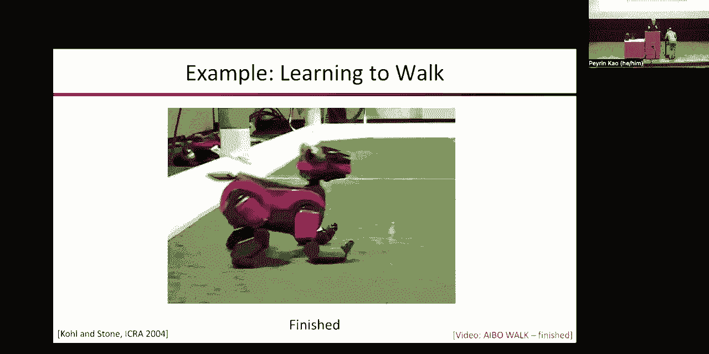
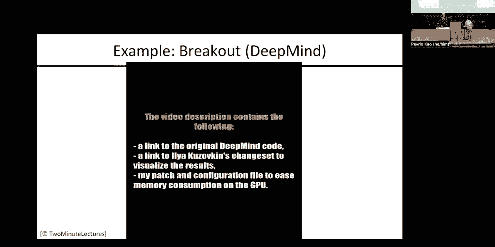
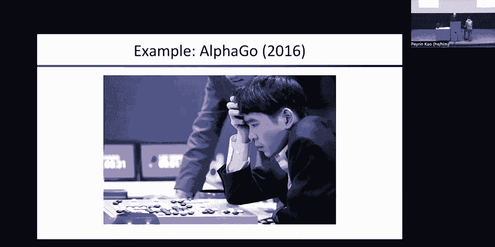
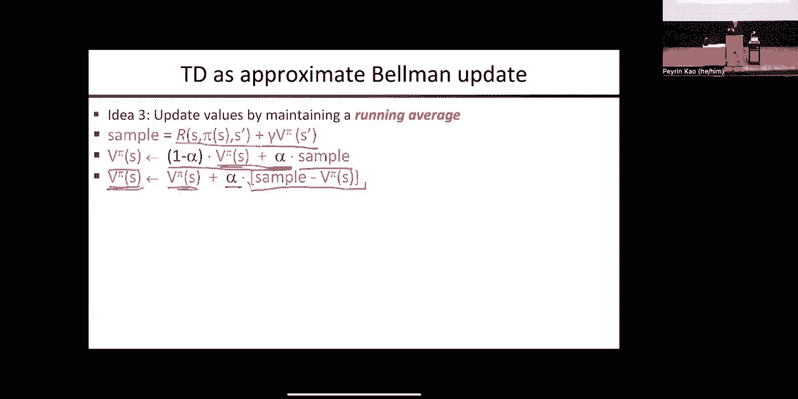

# 14：强化学习 I 🧠

在本节课中，我们将学习强化学习的基础概念。强化学习是智能体通过与环境的交互来学习如何做出决策，以获得最大累积奖励的过程。我们将从马尔可夫决策过程（MDP）开始，探讨如何在不完全了解环境的情况下进行学习。

---

## 概述 📋

强化学习的核心在于智能体通过尝试不同的动作来了解环境，并根据获得的奖励调整其行为。这与我们之前学习的MDP算法（如值迭代和策略迭代）不同，因为强化学习假设我们不知道环境的转移模型和奖励函数。

---

## 强化学习的基本概念 🔄

上一节我们介绍了强化学习的整体目标，本节中我们来看看其核心挑战。

### 探索与利用的平衡 ⚖️

在强化学习中，智能体需要平衡探索（尝试新动作以了解环境）和利用（根据已有知识选择最佳动作）。这是因为智能体最初对环境一无所知，必须通过尝试来学习。

以下是探索与利用的几个关键点：
*   **尝试未知动作**：为了了解MDP，智能体必须尝试那些结果未知的动作。
*   **利用已知信息**：同时，智能体也需要利用已知信息来获取奖励。
*   **最佳平衡**：最优策略需要在探索和利用之间找到最佳平衡点。

### 遗憾与最优性 😔

由于智能体对环境了解有限，其行为可能并非全局最优。我们使用“遗憾”来衡量智能体因知识不足而损失的回报，即与完全了解环境时的最优策略相比的差距。

### 从样本中学习 📊

智能体只能通过观察动作的结果（样本）来估计环境的转移概率，而不是直接获得概率分布。这意味着学习是基于有限的经验进行的。

### 泛化能力 🌐

在状态空间巨大的MDP（如围棋）中，访问所有状态是不现实的。因此，智能体必须能够从有限的经验中归纳出一般规则，并将其应用于未见过的状态。

---

## 强化学习的交互循环 🔁

智能体与环境的交互遵循一个基本循环：智能体执行一个动作，环境转移到新状态，并给予智能体一个奖励。一次完整的交互经验可以表示为 `(s, a, s', r)`，其中 `s` 是当前状态，`a` 是执行的动作，`s'` 是转移后的新状态，`r` 是获得的奖励。

---

## 强化学习的历史与应用实例 📜

强化学习有着悠久的历史和广泛的应用。

### 历史里程碑 🏆
*   **亚瑟·塞缪尔的跳棋程序（1956）**：这是第一个重要的机器学习程序，它通过自我对弈学习值函数，并超越了其创造者的水平。
*   **索尼Aibo机器狗**：研究人员使用强化学习改写了机器狗的行走算法，使其行走速度更快、更稳定。
*   **DeepMind的Atari游戏AI**：系统仅通过像素输入，学会了玩《打砖块》等游戏，甚至发现了“挖隧道”等高级策略。
*   **AlphaGo**：通过强化学习，AlphaGo掌握了围棋，并击败了人类世界冠军。

### 示例：爬行者学习行走 🐛

在一个模拟环境中，一个名为“爬行者”的智能体学习使用其肢体爬行。它通过尝试动作并获得关于向右移动进度的奖励信号来学习。经过数万步的探索和学习，它最终能够有效地行走。

---

## 强化学习方法分类 🗂️

强化学习有多种方法，主要可以分为以下几类：

### 基于模型的强化学习 🧩

这种方法试图通过学习环境的转移模型来解决问题。

以下是基于模型RL的步骤：
1.  **收集经验**：通过执行策略观察状态转移。
2.  **学习模型**：根据观察到的转移数据，估计转移概率 `T(s' | s, a)` 和奖励函数 `R(s, a, s')`。
3.  **求解MDP**：使用学到的近似模型，应用值迭代或策略迭代等规划算法来求解最优策略。

**优点**：类似于人类通过科学理解世界的方式。
**缺点**：对于大型或连续状态空间，学习精确模型非常困难；且求解大规模MDP本身计算成本高昂。

### 无模型强化学习 🚀

这类方法不显式学习环境模型，而是直接学习值函数或策略。

以下是三种主要的无模型方法：
*   **直接评估**：通过多次运行策略，直接平均每个状态获得的累积奖励来估计状态值 `V(s)`。
*   **时差学习**：通过使相邻状态的值满足贝尔曼方程的样本近似，来更新值函数。
*   **Q学习**：直接学习状态-动作对的值 `Q(s, a)`，从而便于选择动作。

### 策略搜索方法 🎯

这类方法直接参数化策略 `π(a | s)`，并通过梯度上升等方法优化策略参数以最大化期望回报。本课程不深入讨论此方法。

---

## 被动强化学习 vs. 主动强化学习 🆚

另一个重要的分类维度是学习的方式。

### 被动强化学习 👁️

在被动强化学习中，智能体观察一个固定策略（例如人类专家）产生的经验，并从中学习值函数或模型。智能体本身不选择动作。

### 主动强化学习 🎮

在主动强化学习中，智能体必须自己选择动作，这包括决定何时探索未知领域。这引入了探索-利用的权衡问题。

---

## 时差学习详解 ⏳

上一节我们介绍了无模型方法，本节我们深入探讨其中一种核心算法：时差学习。

时差学习的核心思想是利用贝尔曼方程的样本近似来更新值函数，避免学习完整的转移模型。

### 核心思想 💡

对于固定策略 `π`，其贝尔曼方程为：
`Vπ(s) = Σ_s' T(s' | s, π(s)) * [R(s, π(s), s') + γ * Vπ(s')]`
时差学习用单个样本 `(s, π(s), s', r)` 来近似这个期望：
`sample = r + γ * Vπ(s')`
然后用这个样本值来更新当前状态 `s` 的估计值。

### 增量更新与指数遗忘 📈

为了使学习能够在线、增量式进行，并降低早期不准确估计的影响，我们使用指数加权的运行平均值进行更新。

更新公式为：
`V(s) ← (1 - α) * V(s) + α * [r + γ * V(s')]`
或者等价地：
`V(s) ← V(s) + α * [r + γ * V(s') - V(s)]`
其中 `α` 是学习率，`[r + γ * V(s') - V(s)]` 被称为时差误差。

这种更新方式赋予新样本固定的权重 `α`，旧估计的权重则指数衰减，实现了“遗忘”早期粗糙估计的效果，同时保证估计的无偏性。

---

## 总结 🎓

本节课中我们一起学习了强化学习的基础。我们了解了强化学习智能体如何在未知环境中通过试错来学习，平衡探索与利用。我们回顾了强化学习的历史和成功应用，并对主要学习方法进行了分类，包括基于模型和无模型的方法。最后，我们深入讲解了时差学习算法，它通过样本近似贝尔曼方程并利用增量更新来高效学习状态值函数。强化学习为构建能在复杂世界中自主学习的智能系统提供了强大的框架。