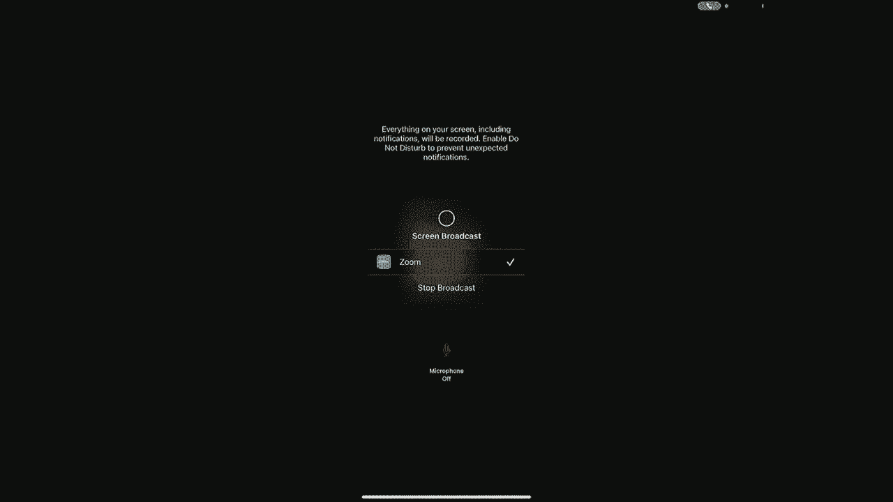
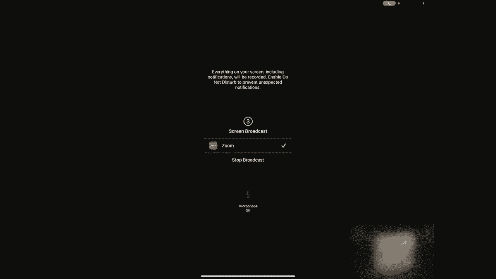
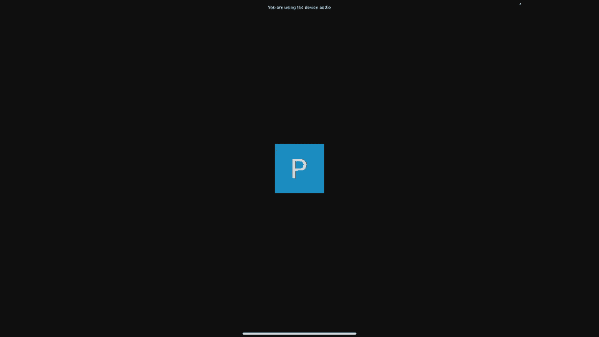
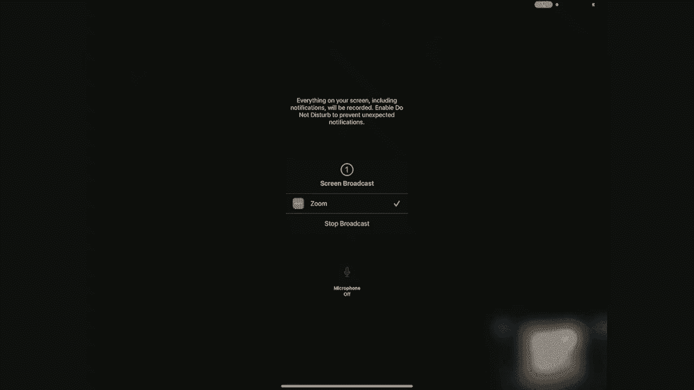
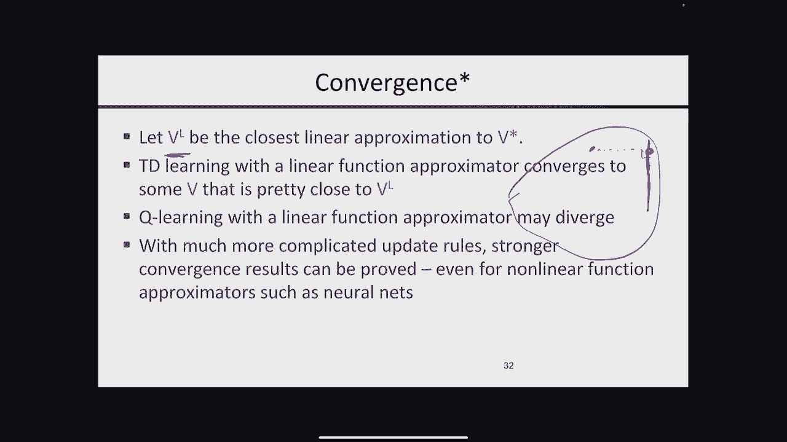

# 15：强化学习 II 🧠

在本节课中，我们将要学习强化学习的核心算法——Q学习，并探讨如何将其扩展到大规模问题中。我们将从Q学习的基本原理开始，然后讨论探索与利用的权衡，最后介绍如何通过函数近似（如线性函数或神经网络）来应对巨大的状态空间。

---

## 概述 📋

本节课是强化学习的第二部分。我们将深入探讨一种无模型的强化学习算法——Q学习。与之前学习的基于模型或基于价值函数的方法不同，Q学习直接学习状态-动作对的价值，从而可以直接导出最优策略。我们还将讨论在强化学习中至关重要的探索-利用困境，并学习如何通过引入探索奖励来更高效地学习。最后，面对现实世界中庞大的状态空间，我们将介绍如何使用函数近似（例如线性特征组合）来泛化经验，使智能体能够从少量经验中学习并适应新环境。

---

## Q学习：基本原理与算法 ⚙️

上一节我们介绍了基于模型的强化学习和时差学习。本节中我们来看看一种更直接的方法——Q学习。

在强化学习中，Q值函数 `Q(s, a)` 表示在状态 `s` 下执行动作 `a` 后，所能获得的长期累积折扣奖励的期望值。它与价值函数 `V(s)` 和最优策略 `π*(s)` 紧密相关：
*   最优价值函数是各个动作Q值的最大值：`V*(s) = max_a Q*(s, a)`
*   最优策略是选择具有最高Q值的动作：`π*(s) = argmax_a Q*(s, a)`

因此，Q值函数包含了做出最优决策所需的全部信息。

Q学习的核心思想来源于Q值函数的贝尔曼方程：
`Q(s, a) = E[ R(s, a) + γ * max_{a'} Q(s', a') ]`
其中，`s'` 是执行动作 `a` 后转移到的下一个状态，`γ` 是折扣因子。

与价值函数的更新类似，我们无需计算期望，可以直接使用采样得到的经验 `(s, a, r, s')` 来更新Q值。Q学习更新规则如下：
`Q(s, a) <- (1 - α) * Q(s, a) + α * [ r + γ * max_{a'} Q(s', a') ]`
这里，`α` 是学习率。这个规则非常简洁，其含义是：将当前的Q值估计向“即时奖励加上下一状态最佳Q值的折现”这一目标方向调整。

Q学习的优势在于它是**无模型**的。一旦学会了Q函数，智能体无需知道环境模型（转移概率），只需在每个状态选择Q值最高的动作即可，即 `π(s) = argmax_a Q(s, a)`。

当然，Q函数通常比价值函数更大（维度为 `|状态| x |动作|`），学习任务更重，但其概念更统一和简洁。

以下是Q学习算法的基本流程：
1.  初始化Q表，所有 `Q(s, a)` 值可以设为零或随机小值。
2.  对于每一轮训练（episode）：
    a. 初始化状态 `s`。
    b. 当状态 `s` 不是终止状态时，循环：
        i. 根据当前Q函数和某种探索策略（如ε-greedy）选择动作 `a`。
        ii. 执行动作 `a`，观察到奖励 `r` 和下一个状态 `s‘`。
        iii. 使用上述更新规则更新 `Q(s, a)`。
        iv. 将状态更新为 `s‘`。

---

## 探索与利用的权衡 ⚖️

上一节我们介绍了Q学习的基本框架，但其中有一个关键问题尚未解决：如何选择动作？如果一直选择当前认为最好的动作（利用），可能无法发现潜在更优的动作；如果一直随机探索，又会积累大量“后悔”（获得低奖励）。这就是**探索-利用困境**。

一个经典例子是多臂老虎机问题：你有多个老虎机（臂），每个臂的奖励概率未知。你应该继续拉当前收益最高的臂（利用），还是尝试拉得次数较少的臂以获取更多信息（探索）？

在强化学习中，低效的探索会导致学习缓慢，甚至无法收敛到最优策略。

### ε-贪心策略

确保探索的一种简单方法是**ε-贪心策略**。
*   以概率 `1 - ε`，选择当前Q值最高的动作（利用）。
*   以概率 `ε`，随机选择一个动作（探索）。

只要 `ε > 0`，并且无限频繁地访问所有状态-动作对，就能保证最终学到正确的Q值。但它的缺点是，即使已经知道某些动作很糟糕，仍会以固定概率去尝试，导致不必要的“后悔”。

### 乐观探索与UCB

更聪明的探索策略是为不确定性较高的动作赋予“探索奖金”。其思想是：一个动作的价值估计 = 平均观测奖励 + 探索奖励。探索奖励与该动作被尝试次数的平方根成反比（或类似形式），尝试次数越少，探索奖励越高。

一种著名的理论是**上置信界**算法。其选择动作的公式形如：
`选择动作 a = argmax_a [ Q(s, a) + c * sqrt( log(N) / n_a ) ]`
其中 `N` 是总尝试次数，`n_a` 是动作 `a` 被尝试的次数，`c` 是常数。这个公式在利用（`Q(s,a)`）和探索（右边项）之间取得了理论上的最优平衡。

在Q学习中，我们可以将这种思想融入，通过给Q值加上一个基于访问计数的奖励来鼓励探索未充分尝试的状态-动作对。这比简单的ε-贪心策略能更快地减少总后悔值。

---

## 函数近似：应对大规模状态空间 🚀

前面的方法都假设Q值存储在一张表格中。但对于像围棋、俄罗斯方块或电子游戏这样的问题，状态空间极其庞大（甚至连续），表格表示法完全不现实。

解决方案是使用**函数近似**。我们不再为每个状态-动作对存储一个独立的值，而是学习一个参数化函数 `Q(s, a; w)`，其中 `w` 是参数向量。函数 `Q` 的输出是对应 `(s, a)` 的Q值估计。

### 线性函数近似

一种简单有效的方法是**线性函数近似**。我们定义一组特征函数 `f_i(s, a)`，每个特征捕获状态-动作对的某个重要属性（例如：吃豆人中离最近幽灵的距离、最近豆子的距离等）。然后，Q值表示为这些特征的线性组合：
`Q(s, a; w) = w_1 * f_1(s, a) + w_2 * f_2(s, a) + ... + w_n * f_n(s, a) = w · f(s, a)`
我们的目标就是学习最优的权重向量 `w`。

### 训练：梯度下降

如何更新权重 `w`？我们可以沿用Q学习的思想，但改为对参数 `w` 进行梯度下降更新。

定义时序差分误差为：
`δ = [ r + γ * max_{a'} Q(s', a'; w) ] - Q(s, a; w)`
这个误差衡量了当前预测与目标之间的差距。

然后，我们使用梯度下降来最小化这个误差的平方。对于线性函数，Q值关于权重 `w_i` 的梯度就是对应的特征值 `f_i(s, a)`。因此，权重的更新规则为：
`w_i <- w_i + α * δ * f_i(s, a)`
这个规则非常直观：如果得到的回报比预期好（正误差），就增加那些值为正的特征的权重，减少值为负的特征的权重，从而提高对该 `(s, a)` 的价值估计；反之亦然。

这种方法实现了**泛化**。智能体从一次“靠近幽灵导致死亡”的经历中，就能学习到“`离幽灵近`”这个特征具有负权重，并将这个教训应用到所有具有类似特征的状态中，而无需遍历每一个具体状态。

### 收敛性说明

对于表格型Q学习，在适当条件下可以保证收敛。但对于函数近似：
*   使用线性函数近似的**时差学习**可以收敛到给定特征下对真实价值函数的最佳线性逼近。
*   使用线性函数近似的**Q学习**则可能发散。这是早期研究中的一个挑战。
*   现代深度强化学习（使用神经网络作为非线性函数近似）结合了改进的算法（如深度Q网络），在实践中取得了巨大成功，并且有理论可以保证其收敛性。

---

## 总结 🎯

本节课中我们一起学习了强化学习中的几个核心进阶主题：

1.  **Q学习**：一种无模型的强化学习算法，直接学习状态-动作价值函数，并可通过选取最大Q值动作直接得到策略。
2.  **探索与利用**：我们介绍了探索-利用困境，并对比了简单的ε-贪心策略和更高效的基于乐观探索/UCB原理的方法，后者能通过赋予探索奖励来智能地平衡两者。
3.  **函数近似**：为了将强化学习扩展到大规模或连续状态空间，我们引入了函数近似的思想。重点介绍了线性函数近似，它通过一组手工设计的特征和可学习的权重来泛化Q函数，并使用基于梯度下降的更新规则进行训练。这使智能体能够从有限经验中学习并适应新情况。

通过结合Q学习、智能探索策略和函数近似，我们构建了能够解决复杂、高维决策问题的现代强化学习系统的基础。