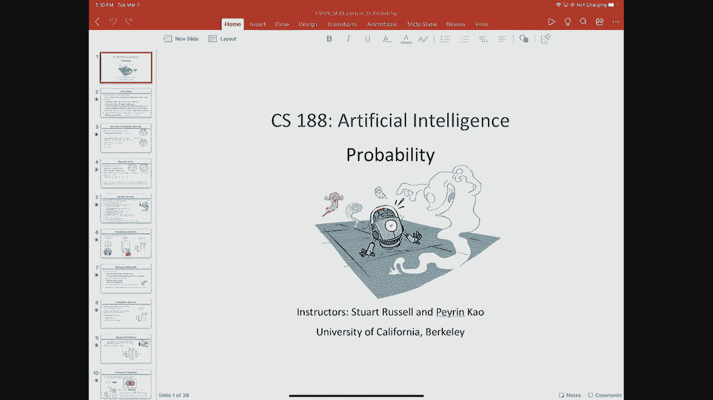
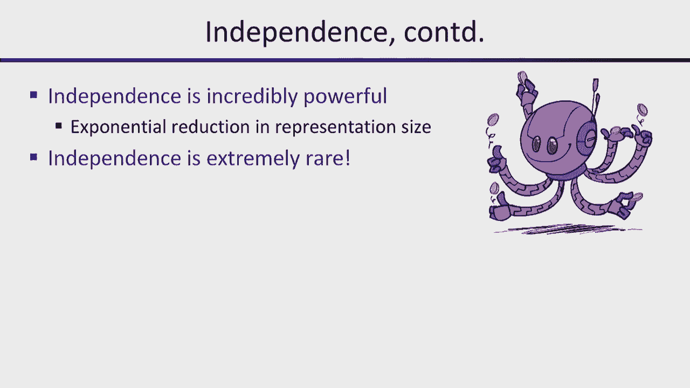

# 16：概率论回顾与贝叶斯网络 📊

在本节课中，我们将学习概率论的基础知识，这是处理人工智能中不确定性的核心数学工具。我们将从基本概念开始，逐步深入到如何利用概率进行推理，并初步了解贝叶斯网络这一强大的表示方法。

## 概述 📋

我们之前学习的搜索算法都假设了确定性的转移模型和结果函数。然而，现实世界充满了不确定性。本节课将介绍概率论，它为我们提供了一种量化和管理这种不确定性的严谨方法。我们将学习概率的基本规则、条件概率、贝叶斯规则以及独立性的概念，这些都是构建更复杂推理系统（如贝叶斯网络）的基石。

## 概率基础 🎲

概率论为我们提供了一套处理不确定性的数学框架。其核心思想是：存在一组可能的世界，每个世界都有一个对应的概率值。

*   **可能世界**：例如，掷一个骰子，有六个可能的结果（世界）。
*   **概率分配**：为每个可能世界分配一个介于0和1之间的实数，所有世界的概率之和必须为1。
*   **事件**：事件是可能世界集合的一个子集。例如，“点数小于4”这个事件对应集合 {1, 2, 3}。事件的概率是其包含的所有可能世界的概率之和。

一个处理不确定性的方法如果不符合概率定律（例如概率和不等于1），就可能被设计出必然亏损的赌局，这说明了概率论的合理性。

## 随机变量与概率分布 🔢

随机变量是将可能世界映射到某个值域的函数。它本身是确定性的。

*   **定义**：随机变量 `X` 是一个函数，输入是一个可能世界 `ω`，输出是某个值（如布尔值、实数值、坐标等）。
*   **概率分布**：随机变量 `X` 的概率分布给出了 `X` 取每个可能值的概率。例如，布尔变量“点数为奇数”的分布是 `P(奇数=True) = 0.5`, `P(奇数=False) = 0.5`。
*   **联合分布**：多个随机变量的联合分布指定了它们所有可能值组合的概率。它包含了变量间如何相关的信息。
*   **边缘分布**：可以从联合分布中通过“求和”（或称边缘化）其他变量得到单个变量的分布。例如，从天气和温度的联合分布中，对天气的所有可能值求和，就得到温度的边缘分布。

在人工智能中，我们通常先定义关心的随机变量，可能世界则是这些变量所有值组合的集合。直接列出所有可能世界（即完整的联合分布表）在变量增多时会变得指数级庞大且难以估计，因此我们需要更简洁的表示方法。

## 条件概率与推理 🔍

条件概率是在已知某些信息（证据）的情况下，更新我们对事件发生可能性的信念。

*   **定义**：在事件 `B` 发生的条件下，事件 `A` 发生的概率定义为 `P(A|B) = P(A, B) / P(B)`。这相当于将关注范围缩小到 `B` 为真的世界，然后看其中 `A` 也为真的比例。
*   **条件分布**：类似地，我们可以讨论在给定其他变量取值时，某个变量的完整概率分布。
*   **归一化**：为了使条件概率分布之和为1，常引入归一化因子 `α`。`P(Q|e) = α * P(Q, e)`，其中 `α = 1 / Σ_q P(Q=q, e)`。

基于联合分布进行概率推理的通用模式如下：
1.  **查询变量** `Q`：我们想知道其分布的变量。
2.  **证据变量** `E`：我们已经观察到其取值的变量（`E = e`）。
3.  **隐藏变量** `H`：既非查询也非证据的其他变量。
推理目标是计算 `P(Q | E=e)`。方法是：首先将联合分布限制在 `E=e` 的世界，然后对隐藏变量 `H` 的所有可能取值求和，得到 `P(Q, E=e)`，最后进行归一化：`P(Q | E=e) = α * Σ_h P(Q, H=h, E=e)`。

这种方法的计算成本很高，因为它需要对隐藏变量的所有可能组合进行求和，其复杂度随隐藏变量数量呈指数增长。同时，存储和估计庞大的联合分布表也需要指数级的数据量。因此，我们需要寻找更高效的表示和推理方法。

## 概率规则与独立性 ⚖️

为了高效地表示和计算概率，我们需要掌握一些基本的代数规则。

*   **乘积规则**：由条件概率定义直接导出，`P(A, B) = P(A|B) * P(B)`。它提供了从条件分布和边缘分布构造联合分布的方法。
*   **链式规则**：乘积规则的推广，可以将任意多个变量的联合分布分解为一系列条件概率的乘积：`P(X₁, X₂, ..., Xₙ) = Πᵢ P(Xᵢ | X₁, ..., Xᵢ₋₁)`。分解的顺序可以任意选择。
*   **贝叶斯规则**：`P(A|B) = P(B|A) * P(A) / P(B)`。它极其重要，因为它允许我们进行“逆概率”推理：从观察到的结果 `B`（证据）去推断原因 `A`（假设）的可能性。`P(A)` 是先验概率，`P(A|B)` 是后验概率，`P(B|A)` 是似然度。贝叶斯规则描述了一个自然的信念更新过程：后验概率 ∝ 似然度 × 先验概率。

上一节我们看到了直接使用联合分布进行推理的困难。本节我们来看看如何利用变量间的**独立性**来极大地简化问题。

*   **定义**：两个变量 `X` 和 `Y` 独立，当且仅当它们的联合分布等于各自边缘分布的乘积：`P(X, Y) = P(X) * P(Y)`。
*   **等价表述**：独立性也意味着 `P(X|Y) = P(X)`。即，知道 `Y` 的信息不会改变我们对 `X` 的信念。
*   **意义**：如果变量间存在独立性，那么表示其联合分布所需的参数数量会大幅减少（从指数级降到线性级或更低），从而使得存储、估计和推理都变得可行。例如，`n` 次独立的硬币抛掷，其联合分布只需 `n` 个参数（每次正面朝上的概率），而不是 `2ⁿ` 个参数。

然而，完全的独立性在复杂系统中很少见。更常见的是条件独立性，这将是贝叶斯网络的核心思想。

## 总结 🎯

本节课我们一起学习了概率论的基础知识，这是人工智能中处理不确定性的数学语言。我们回顾了概率空间、随机变量、联合分布与边缘分布。重点掌握了条件概率的概念以及如何用它进行概率推理，并指出了基于完整联合分布进行枚举推理的计算瓶颈。接着，我们学习了乘积规则、链式规则和至关重要的贝叶斯规则，后者为信念更新和机器学习提供了理论基础。最后，我们引入了独立性的概念，它是指数级简化概率表示和计算的关键。在接下来的课程中，我们将以此为基础，学习贝叶斯网络，它利用条件独立性来紧凑地表示复杂的联合概率分布，并支持高效的概率推理。