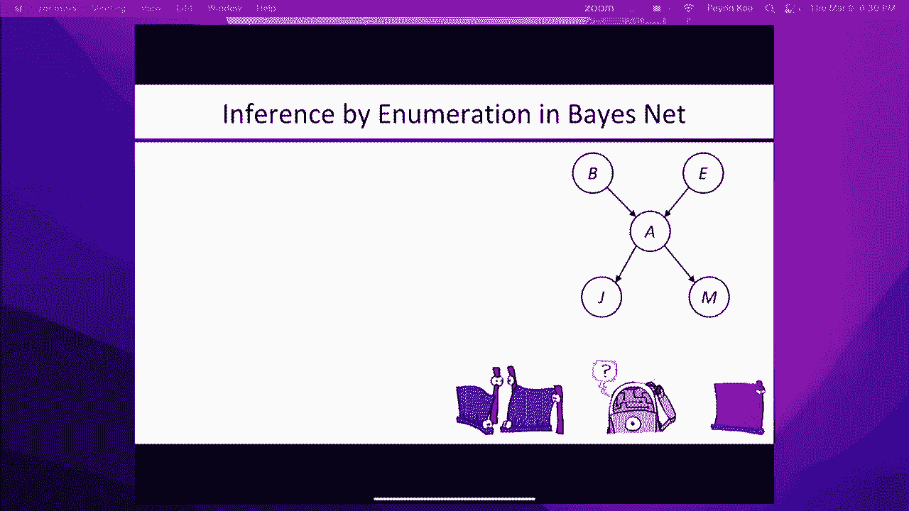

# 17：贝叶斯网络：语法与语义 🧠

在本节课中，我们将学习贝叶斯网络（Bayes Nets）的基本概念，包括其语法（如何构建）和语义（代表什么含义）。我们将从概率论的基础知识开始，逐步理解如何利用条件独立性来简化复杂的联合概率分布，并最终构建出清晰、高效的贝叶斯网络模型。

## 概率论基础回顾

上一节我们介绍了概率的基本概念，本节中我们来看看如何用概率模型来描述世界。

事件的概率分布告诉你某个事件发生的可能性。这个分布的所有概率之和应为1，因为所有可能事件中必然有一个会发生。

随机变量通常用大写字母表示，例如 `X`。它可以取很多不同的值，比如 `1`、`2`、`3`，或者 `轻`、`重`、`中` 等。

如果你有多个随机变量，例如 `X` 和 `Y`，你可以定义联合分布。联合分布告诉你 `X` 和 `Y` 的每一个特定组合发生的可能性有多大。所有组合的概率之和也应为1。

你可以通过边缘化（求和）来降低联合分布的维度。例如，对 `X` 的所有可能值求和，可以得到 `Y` 的分布。

条件概率是指在已知 `Y` 发生的情况下，`X` 发生的概率。其定义为：
**公式：** `P(X|Y) = P(X, Y) / P(Y)`

乘积规则是条件概率的简单重排：
**公式：** `P(X, Y) = P(X|Y) * P(Y)`

链式法则将乘积规则推广到多个变量：
**公式：** `P(X1, X2, ..., Xn) = P(X1) * P(X2|X1) * ... * P(Xn|X1, X2, ..., Xn-1)`

## 联合分布的挑战与条件独立性

上一节我们讨论了如何用一组随机变量的联合分布来建立概率模型。本节中我们来看看直接使用联合分布会遇到的问题，以及如何用条件独立性来解决。

从联合分布中，我们可以通过边缘化（对隐藏变量求和）来回答任何问题，例如计算特定变量的边际概率或条件概率。

然而，联合分布的大小会随着变量数量呈指数级增长。这意味着我们面临存储和计算上的巨大挑战。例如，对于50个二值变量，联合分布有 `2^50` 个条目，我们既无法存储，也无法从数据中估计这么多参数。

独立性是简化联合分布的一种方式。如果所有变量都相互独立，那么联合分布就是每个变量边际分布的乘积。这样，参数数量就从指数级降为线性级。

但在现实世界中，变量很少完全独立。更普遍的是**条件独立性**。条件独立性是指，在给定另一组变量（`Z`）的值时，变量 `X` 和 `Y` 相互独立。这可以表示为：
**公式：** `P(X, Y | Z) = P(X | Z) * P(Y | Z)`

条件独立性同样允许我们将大的联合分布分解为许多小的、局部的条件分布，从而实现表示上的指数级简化。

## 捉鬼敢死队示例 👻

为了说明条件独立性，我们使用一个“捉鬼敢死队”游戏的例子。在这个游戏中，你需要在网格上找到鬼魂。

*   你不知道鬼魂的具体位置。
*   你可以探测网格上的方块。探测会返回一种颜色（红、橙、黄、绿），颜色指示了鬼魂离该方块的大致距离。
*   传感器是有噪声的，颜色与距离的对应关系是概率性的。

你的目标是结合多次探测的证据，推断出鬼魂最可能的位置。

以下是游戏的关键点：

*   **随机变量**：鬼魂的位置 `G`，以及每个探测方块的颜色 `C_i`。
*   **先验分布**：鬼魂在每个位置的概率是均匀的。
*   **传感器模型**：给定鬼魂的位置 `G`，在某个方块探测到特定颜色的概率。这个概率只取决于该方块到鬼魂的距离。
*   **条件独立性**：在已知鬼魂位置 `G` 的条件下，任意两个探测结果 `C_i` 和 `C_j` 是相互独立的。因为探测结果只由鬼魂位置（共同原因）决定，彼此之间没有直接影响。

利用这种条件独立性，我们可以将庞大的联合分布简化为先验分布和一系列小型传感器模型的乘积。这极大地减少了模型所需的参数数量。

这种具有一个根本原因变量和多个条件独立的证据变量的结构非常常见，被称为**朴素贝叶斯模型**。在这个例子中，该模型完全正确，因为传感器就是被如此设计的。

## 构建贝叶斯网络

上一节我们通过例子看到了条件独立性的威力，本节中我们来看看如何系统地用图形化模型——贝叶斯网络——来表示这种结构。

贝叶斯网络提供了一种系统、优雅、自然的方式来描述联合分布的条件独立结构，并将其分解为小的条件分布的乘积。

一个贝叶斯网络由以下三部分组成：

1.  **节点**：每个节点代表一个随机变量。
2.  **有向边（弧）**：连接节点的箭头。直观上，箭头从“因”指向“果”，表示直接影响。
3.  **条件概率表（CPT）**：对于每个节点，给定其父节点（所有指向它的节点）的取值，该节点取各个值的条件概率。

网络中的缺失边（即没有直接连接）是对条件独立性的断言。

### 网络构建示例

让我们通过几个小练习来构建贝叶斯网络。

**示例1：雨、交通和雨伞**
*   雨会导致交通拥堵和人们带伞。
*   交通和带伞本身没有直接因果关系，但它们通过“下雨”这个共同原因相关联。
*   **条件独立性**：在已知是否下雨的条件下，交通状况和是否带伞是相互独立的。
*   **网络结构**：`雨` -> `交通`；`雨` -> `伞`。`交通`和`伞`之间没有直接连接。

**示例2：火灾、烟雾和警报**
*   火灾会产生烟雾，烟雾会触发烟雾报警器。
*   **条件独立性**：在已知是否有烟雾的条件下，火灾是否发生和警报是否响起是相互独立的。因为警报只“听”烟雾的。
*   **网络结构**：`火灾` -> `烟雾` -> `警报`。`火灾`和`警报`之间没有直接连接。

构建网络时，按**因果顺序**（从根本原因到可观察结果）添加变量通常最简单，产生的网络也最简洁。如果按非因果顺序构建，可能会引入不必要的连接，使网络变得复杂且难以参数化。

## 警报网络示例 🚨

现在，我们来看一个经典的贝叶斯网络示例——警报网络。

这个网络包含以下布尔变量：
*   `B`：入室盗窃（Burglary）
*   `E`：地震（Earthquake）
*   `A`：警报（Alarm）
*   `J`：约翰打电话（JohnCalls）
*   `M`：玛丽打电话（MaryCalls）

**网络结构（因果关系）**：
*   `B` 和 `E` 是 `A` 的父节点（盗窃和地震都可能触发警报）。
*   `A` 是 `J` 和 `M` 的父节点（警报响会导致约翰和玛丽可能打电话）。

**条件概率表（CPT）示例**：
*   `P(B=true) = 0.001` （盗窃先验概率）
*   `P(E=true) = 0.002` （地震先验概率）
*   `P(A=true | B=true, E=true) = 0.95` （两者都发生，警报极可能响）
*   `P(A=true | B=true, E=false) = 0.94`
*   `P(A=true | B=false, E=true) = 0.29`
*   `P(A=true | B=false, E=false) = 0.001` （误报）
*   `P(J=true | A=true) = 0.90`， `P(J=true | A=false) = 0.05` （约翰的可靠性）
*   `P(M=true | A=true) = 0.70`， `P(M=true | A=false) = 0.01` （玛丽的可靠性）

这个网络只有10个独立参数（因为每行概率和为1），而5个布尔变量的完整联合分布需要 `2^5 - 1 = 31` 个参数。这展示了贝叶斯网络在参数数量上的显著优势。

## 贝叶斯网络的语义

上一节我们定义了贝叶斯网络的语法，本节中我们来看看它的精确语义——它到底代表了什么。

贝叶斯网络的语义非常简单而强大：

**所有变量上的联合概率分布，等于网络中所有条件概率表（CPT）中对应项的乘积。**

**公式：** `P(X1, X2, ..., Xn) = ∏ P(Xi | Parents(Xi))`

这意味着，联合分布中任何一个具体的赋值（如 `B=true, E=false, A=true, J=false, M=false`）的概率，可以通过查找每个变量在其父节点特定取值下的条件概率，然后将它们相乘得到。

这种语义隐含着贝叶斯网络所做出的条件独立性断言。与链式法则 `P(X1,...,Xn) = ∏ P(Xi | X1,...,Xi-1)` 对比可以发现，贝叶斯网络假设：
**公式：** `P(Xi | X1,...,Xi-1) = P(Xi | Parents(Xi))`
即，给定其父节点，每个变量 `Xi` 条件独立于所有其他非后代变量。

这是从网络拓扑结构中可以直接读出的属性，也是进行高效概率推理的基础。

## 总结

本节课中我们一起学习了贝叶斯网络的核心思想。

我们首先回顾了概率论基础，并指出了直接使用大型联合分布面临的挑战。然后，我们引入了**条件独立性**这一关键概念，它允许我们将复杂的联合分布分解为更小、更易处理的局部条件分布的乘积。

通过“捉鬼敢死队”等例子，我们看到了条件独立性在现实模型中的体现。接着，我们系统地介绍了**贝叶斯网络**的语法（节点、有向边、CPT）和语义（联合分布等于CPT的乘积）。我们学习了如何按照因果顺序构建网络，并分析了经典的“警报网络”示例。

贝叶斯网络的核心优势在于，它利用变量间的条件独立结构，用远少于完整联合分布的参数，清晰而自然地表达了复杂的概率关系。这为后续进行高效的概率推理（包括精确推断和近似推断）奠定了坚实的基础。