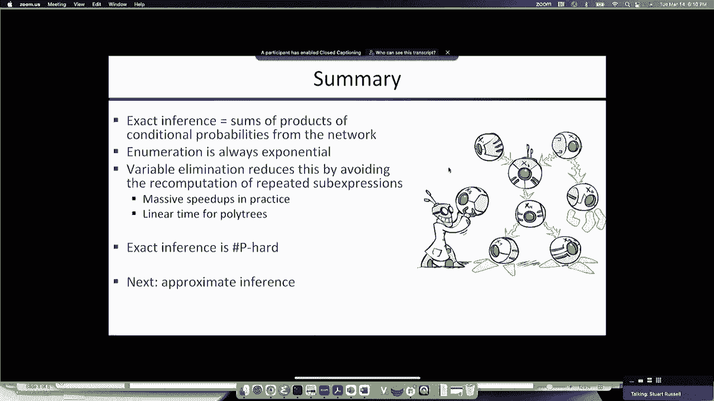

# 18：贝叶斯网络中的变量消除算法 🧠

在本节课中，我们将学习如何高效地在贝叶斯网络中进行概率推理。具体来说，我们将探讨**变量消除算法**，这是一种通过缓存重复子表达式来避免指数级计算成本的方法。我们还将了解为什么在最坏情况下，精确推理仍然是计算困难的，并简要介绍近似推理的概念。

---

## 📚 概述：从枚举到变量消除

上一节我们介绍了贝叶斯网络的基本语法和语义，以及如何通过枚举隐变量来计算查询概率。然而，枚举方法需要指数级的时间，对于大规模网络是不现实的。

本节中，我们将看看如何通过**变量消除算法**来显著提高计算效率。该算法的核心思想是：在计算巨大的概率乘积和时，识别并缓存重复出现的子表达式，从而避免冗余计算。

---

## 🔍 枚举推理的局限性

通过枚举进行推理的基本思想是：对联合分布中所有不是查询或证据的隐变量求和。联合分布由贝叶斯网络中的条件概率乘积表示。

例如，计算 `P(Burglary | JohnCalls=true, MaryCalls=true)`，需要对联合分布中的隐变量（如 `Earthquake` 和 `Alarm`）求和。联合分布是各节点条件概率的乘积：

```
P(B,E,A,J,M) = P(B) * P(E) * P(A|B,E) * P(J|A) * P(M|A)
```

枚举方法需要计算所有隐变量取值组合的概率并求和。对于一个有20多个节点的汽车保险网络，枚举需要约2.27亿次运算；对于有400多个节点的喷气发动机诊断网络，枚举是完全不可行的。

---

## 💡 变量消除的基本思想

观察一个具体的概率求和表达式，例如计算后验概率时的求和式。当写出所有项时，会发现许多相同的子表达式重复出现。

例如，在计算 `P(B|J,M)` 时，对 `E` 和 `A` 的求和展开后，项如 `P(B)*P(E)*P(A|B,E)*P(J|A)*P(M|A)` 会因 `E` 和 `A` 的取值不同而多次出现，但其中部分乘积是相同的。

如果首次计算某个子表达式后将其结果缓存，后续需要时直接复用，就能避免重复计算。这就是变量消除算法的核心：**系统性地缓存和复用中间结果**。

---

## 🧮 因子：算法的基本数据结构

算法操作的基本对象是**因子**，本质上是多维数组，表示一组变量的（条件）概率分布。

因子主要有以下几种类型：
*   **联合分布因子**：如 `P(A, J)`，数组所有元素之和为1。
*   **投影联合分布因子**：如 `P(A=true, J)`，是固定某些变量值后的子表，元素之和等于被固定变量的概率。
*   **条件分布因子**：如 `P(J | A)`，对于条件的每个取值，该分布都归一化（和为1）。

算法通过两种基本运算组合和简化因子：

1.  **因子乘法（点积）**：
    将两个因子相乘，生成一个新因子，其变量集是原因子变量集的并集。新因子的每个条目是原因子对应条目的乘积。
    ```python
    # 例如，给定 P(A) 和 P(J|A)，计算 P(A, J)
    # 结果因子中，P(A=true, J=true) = P(A=true) * P(J=true | A=true)
    ```

2.  **变量求和（消元）**：
    对一个因子中的某个变量求和，将该变量“消去”，得到一个维度更小的新因子。
    ```python
    # 例如，对 P(A, J) 中的 J 求和，得到 P(A)
    # P(A=true) = P(A=true, J=true) + P(A=true, J=false)
    ```

---

## 🔄 变量消除算法步骤

以下是变量消除算法的具体步骤：

1.  **初始化因子**：
    列出网络中所有条件概率分布因子，并将证据变量固定为其观测值。

2.  **循环消元隐变量**：
    当还存在隐变量时：
    *   选择一个隐变量 `H`。
    *   找出所有涉及 `H` 的因子。
    *   将这些因子相乘，然后对 `H` 求和，得到一个新的因子。
    *   用这个新因子替换掉那些被乘的旧因子。

3.  **合并剩余因子并归一化**：
    当所有隐变量都被消去后，将剩余的所有因子相乘，得到一个只包含查询变量的因子。最后将其归一化，即得到查询概率。

**算法关键**：消元顺序直接影响中间因子的大小，从而影响计算效率。好的顺序可以保持因子很小，差的顺序可能导致因子急剧膨胀。

---

## ⚠️ 计算复杂性与最优顺序

变量消除算法的效率取决于消元过程中产生的最大因子的大小。对于某些结构（如朴素贝叶斯网络），自底向上（先消叶子节点）的顺序可以保证因子大小很小，算法是线性的。

然而，**寻找最优消元顺序本身是一个NP难问题**。在最坏情况下，即使有最优顺序，变量消除的运行时间也是指数级的。这是因为贝叶斯网络的精确概率推理是一个 **#P-完全问题**，比NP完全问题（如布尔可满足性问题SAT）更难。

我们可以通过一个归约来证明：任何SAT问题都可以转化为一个特定贝叶斯网络的概率查询。如果能高效解决贝叶斯网络推理，就能高效解决SAT，但SAT是NP完全的。更进一步，计算概率值实际上是在计算SAT满足赋值的数量，这是一个#P-完全问题。

---

## 🌳 实际中的高效情况：多树与割集调整

尽管最坏情况很困难，但许多实际网络具有特殊结构，使得精确推理变得高效：

*   **多树**：其对应的无向图（忽略箭头）是一棵树，没有环。对于多树，变量消除可以在线性时间内完成。
*   **近似多树**：如果网络通过实例化少量变量（称为**割集**）就能切断所有环，变成多树，那么可以采用**割集调整**方法：为割集变量的每种可能取值分别求解剩余的多树网络，然后合并结果。总时间是指数于割集大小，但线性于网络其他部分。

---

## 📝 总结

本节课我们一起学习了贝叶斯网络中的精确推理算法——变量消除。

*   我们首先回顾了枚举方法的指数级计算成本。
*   然后，我们引入了变量消除算法，它通过**因子乘法**和**变量求和**操作，并**缓存中间结果**来避免重复计算。
*   我们了解到，算法的效率严重依赖于**消元顺序**，而找到最优顺序是困难的。
*   最后，我们认识到精确推理在最坏情况下是 #P-完全的，计算困难。但幸运的是，对于许多具有**多树**或**近似多树**结构的实际网络，存在高效的精确推理算法。




这为下节课的内容——当精确推理不可行时，使用**蒙特卡洛采样**进行**近似推理**——做好了铺垫。