# 19：贝叶斯网络中的采样方法 🎲

在本节课中，我们将学习如何利用随机采样技术，在贝叶斯网络中进行高效的近似推理。我们将从简单的采样概念入手，逐步探讨如何克服精确推理的计算瓶颈，并学习几种关键的采样算法。

---

## 概述

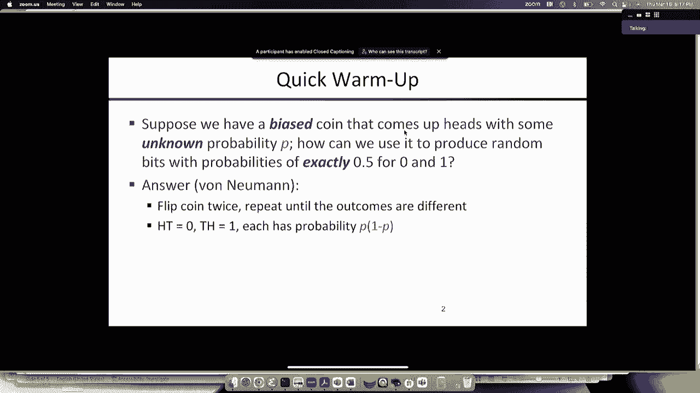

精确推理算法（如枚举和变量消除）在处理大型或复杂贝叶斯网络时可能效率极低，甚至不可行。因此，我们转向基于随机采样的蒙特卡洛方法。这些方法通过生成大量随机样本来近似计算概率，即使对于包含数千个变量的网络，也能在普通计算机上快速运行。本节课我们将学习先验采样、拒绝采样、似然加权以及吉布斯采样的核心思想。


---

## 从有偏硬币到无偏采样 🔄

上一节我们提到了精确推理的局限性，本节中我们来看看如何利用随机性来解决问题。一个经典的起点是：如何使用一个未知偏置的有偏硬币，来模拟一个完全公平的硬币？

以下是两种可行的算法思路：

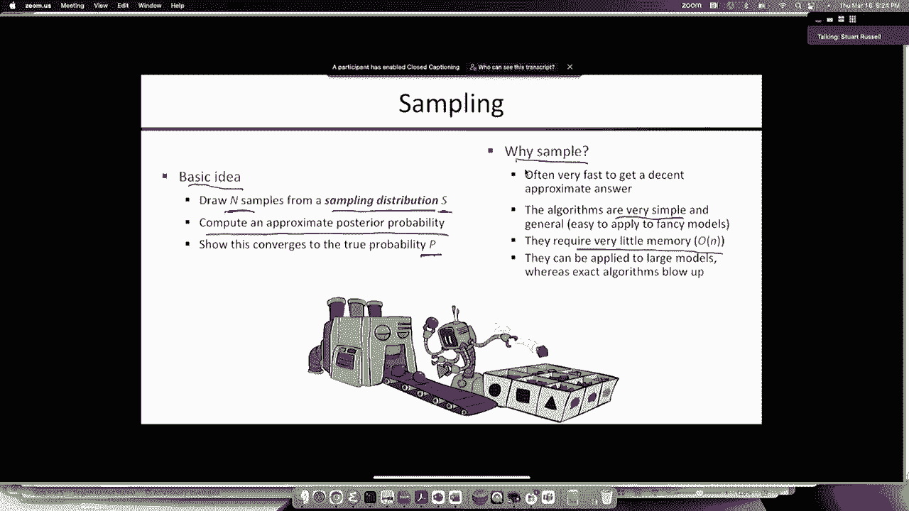

*   **方法一（冯·诺依曼方法）**：重复抛掷这枚硬币两次，并观察结果。
    *   如果结果是 `HT`（先正后反），则将其计为一次“正面”。
    *   如果结果是 `TH`（先反后正），则将其计为一次“反面”。
    *   如果结果是 `HH` 或 `TT`，则丢弃这两次抛掷，重新开始。
    *   由于 `P(HT) = p * (1-p)` 且 `P(TH) = (1-p) * p`，两者概率相等，因此可以产生无偏的随机比特。但这种方法在硬币极度有偏（如 `p=0.9`）时效率较低。

*   **方法二（连续抛掷法）**：先抛掷硬币，直到出现一次正面（H），然后观察紧接着的下一次抛掷结果。
    *   如果下一次是 `T`，则计为一次“正面”。
    *   如果下一次是 `H`，则计为一次“反面”。
    *   这种方法看似高效，但经过分析会发现，得到“正面”的概率是 `p`，得到“反面”的概率是 `1-p`，因此它**不能**产生无偏的随机比特。

这个例子展示了如何通过巧妙的算法设计，从低质量的随机源中生成高质量的随机性，这正是蒙特卡洛方法的核心思想之一。

---

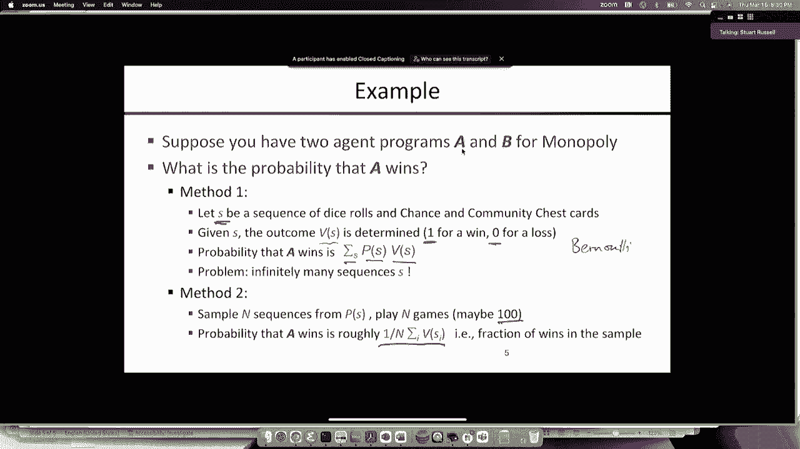

## 为什么需要采样？ 🧠

我们已经讨论了贝叶斯网络中的精确推理。枚举法简单但效率极低；变量消除法更高效，但在最坏情况下仍然是计算困难的。因此，我们转向使用随机数的蒙特卡洛方法。

以下是采用采样方法的主要优势：

*   **处理大规模网络**：对于包含成千上万个变量的网络，精确算法所需的内存和时间可能超出物理极限，而采样方法只需存储网络状态和当前样本，可以轻松扩展。
*   **模型灵活性**：采样算法易于应用于各种复杂模型，例如同时包含离散变量（条件概率表）和连续变量（高斯分布等）的混合模型，只要能从条件分布中采样即可。
*   **算法简单**：许多采样算法的实现相对简单。
*   **理论保证**：在生成足够多样本的前提下，估计值会收敛到真实概率。

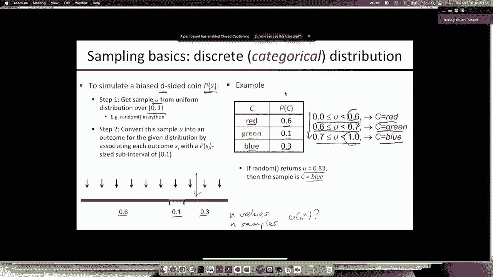

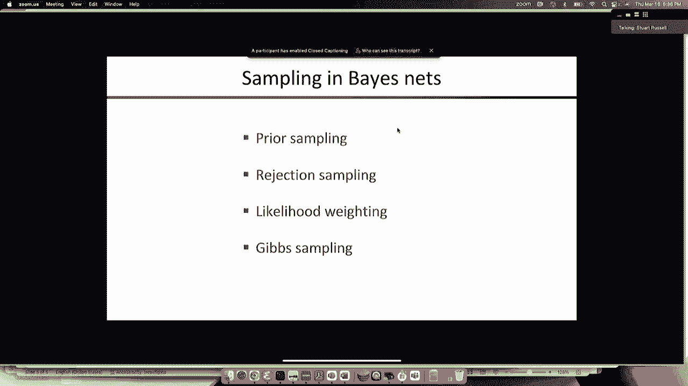

---

## 核心工具：从分布中采样 🎯

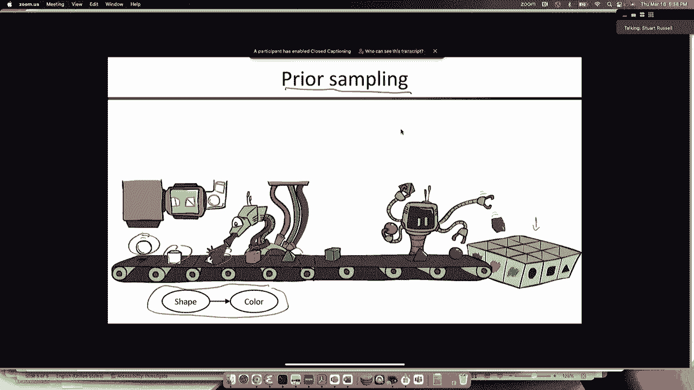

为了构建采样算法，我们首先需要掌握如何从一个给定的概率分布中生成样本。对于离散随机变量，这可以转化为一个“有偏的多面骰子”问题。

假设一个随机变量 `X` 有 `k` 个可能取值，其概率分布为 `P(X=value_i) = p_i`。我们可以通过以下步骤生成一个样本：

1.  生成一个在 `[0, 1)` 区间上均匀分布的随机数 `r`。
2.  将区间 `[0, 1)` 划分为 `k` 个连续的子区间，第 `i` 个区间长度为 `p_i`，其累积边界为 `sum_{j=1}^{i} p_j`。
3.  找到 `r` 落入的那个子区间，其对应的 `value_i` 即为本次采样的结果。

这个过程可以直观地理解为：随机雨滴均匀地落在一条标有累积概率的线上，它落在哪个区间，就输出哪个值。

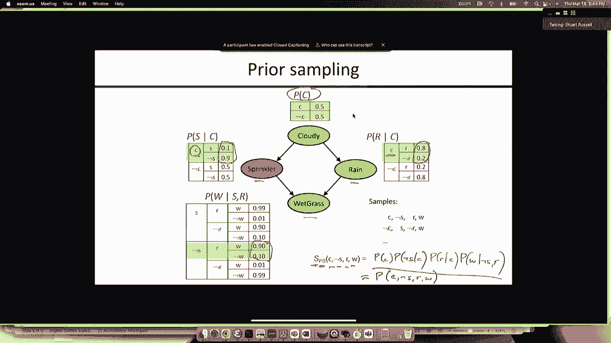

```python
# 伪代码示例：从离散分布中采样
def sample_from_distribution(values, probabilities):
    r = random.uniform(0, 1)
    cumulative_prob = 0
    for v, p in zip(values, probabilities):
        cumulative_prob += p
        if r < cumulative_prob:
            return v
```

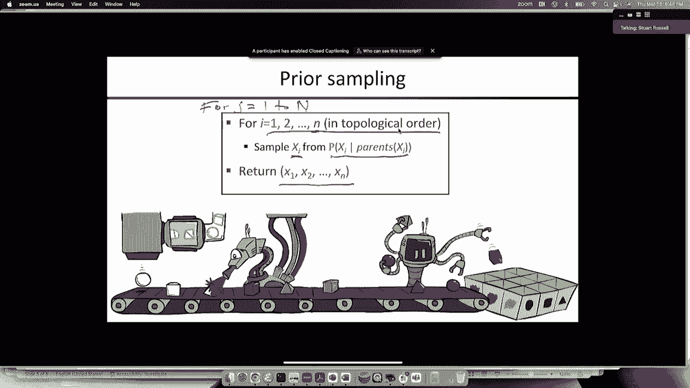

---

## 先验采样 🏗️

现在，我们将采样技术应用于贝叶斯网络。第一种方法称为**先验采样**，其目标是从网络所定义的联合概率分布 `P(X1, X2, ..., Xn)` 中直接生成样本。

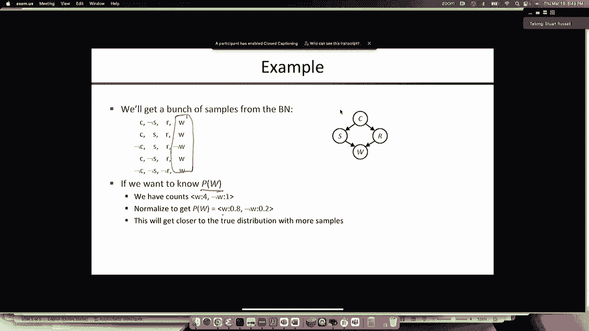

以下是先验采样的步骤：

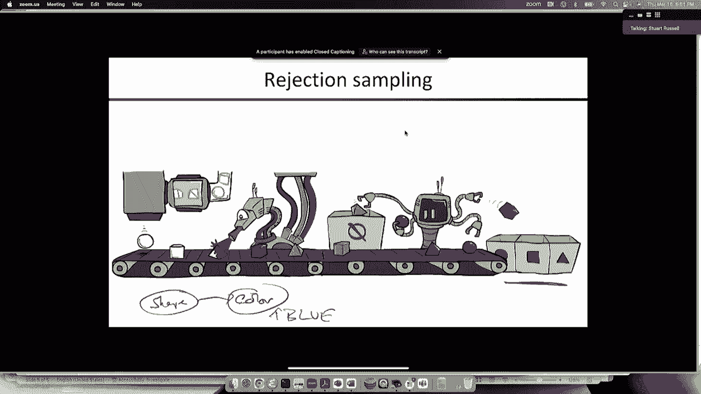

1.  按照网络节点的拓扑顺序（从根节点到叶节点）遍历所有变量。
2.  对于每个变量 `Xi`，根据其父节点 `Parents(Xi)` 的当前取值（已采样得到），从其条件概率分布 `P(Xi | Parents(Xi))` 中进行采样。
3.  将所有变量的采样值组合起来，就得到了一个完整的联合样本。

**为什么这是正确的？** 生成一个特定样本 `(x1, x2, ..., xn)` 的概率，恰好是算法中每一步采样概率的乘积，即 `∏_i P(xi | parents(xi))`。根据贝叶斯网络的链式法则，这正是该样本在联合分布中的概率 `P(x1, x2, ..., xn)`。因此，先验采样是联合分布的完美采样器。

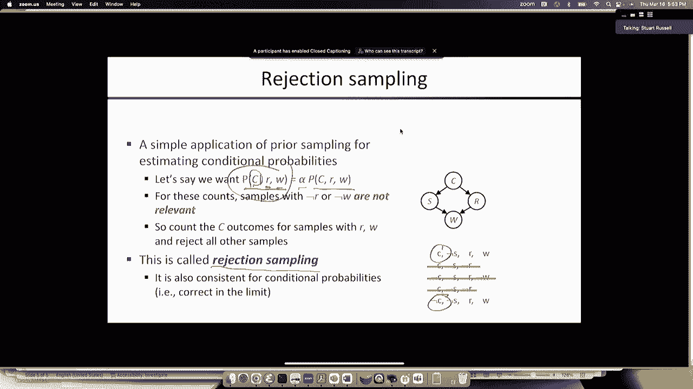

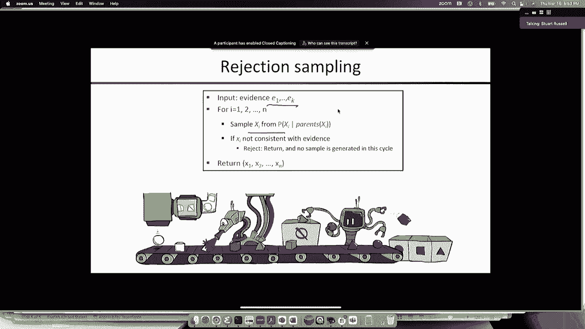

---

## 拒绝采样：引入证据 🚫

上一节我们学习了如何从先验分布中采样，但在推理中，我们通常关心的是在给定某些证据 `E=e` 下的条件概率 `P(Q | E=e)`。最直接的方法是**拒绝采样**。

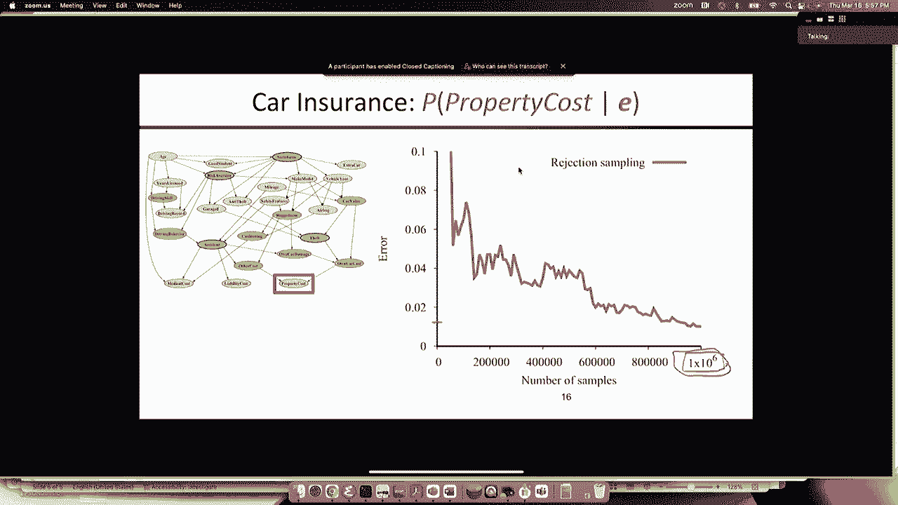

拒绝采样的流程如下：

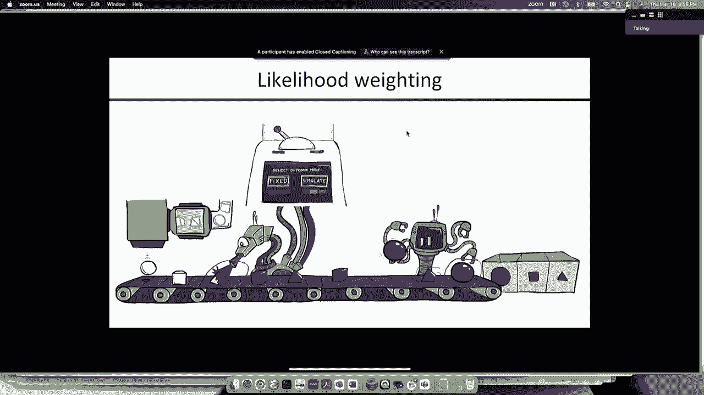

1.  使用先验采样生成大量样本。
2.  对于每个生成的样本，检查它是否与所有证据 `E=e` 一致。
3.  如果一致，则保留该样本用于后续估计；如果不一致，则丢弃（拒绝）该样本。
4.  在保留的样本中，通过计数来计算查询变量 `Q` 的条件概率估计：`P(Q=q | E=e) ≈ (# samples with Q=q and E=e) / (# samples with E=e)`。

**优点与局限**：拒绝采样非常简单直观。然而，当证据的概率 `P(E=e)` 很小时，绝大多数样本都会被拒绝，导致有效样本量极少，估计效率非常低下。

---

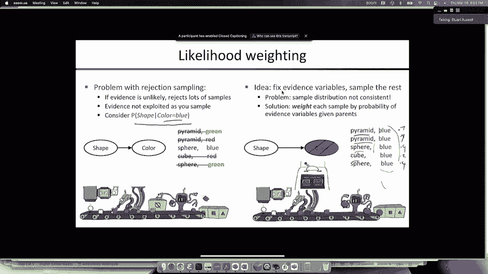

## 似然加权采样：固定证据并重新加权 ⚖️

为了解决拒绝采样效率低下的问题，我们引入了**似然加权采样**。其核心思想是：在生成样本时，**固定**证据变量的值为观测值，只对非证据变量进行采样，然后通过赋予样本一个**权重**来补偿采样分布与真实后验分布之间的偏差。

以下是算法的具体步骤：

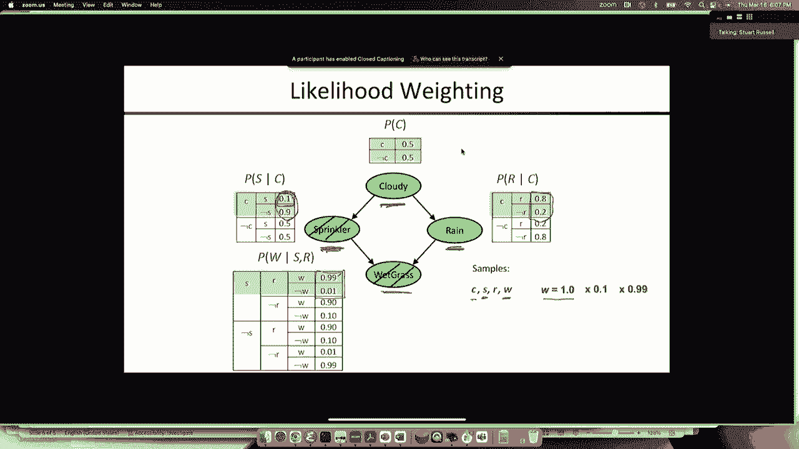

1.  初始化样本权重 `w = 1`。
2.  按照拓扑顺序遍历所有变量：
    *   如果变量 `Xi` 是**证据变量**（其值 `xi` 已给定）：
        *   不进行采样。
        *   将权重更新为 `w = w * P(Xi=xi | Parents(Xi))`。这里 `Parents(Xi)` 的取值来自当前已赋值的父节点。
    *   如果变量 `Xi` 是**非证据变量**：
        *   根据其父节点的当前取值，从 `P(Xi | Parents(Xi))` 中采样一个值 `xi`。
        *   将 `xi` 加入样本。
3.  返回生成的样本及其权重 `w`。
4.  要估计 `P(Q=q | E=e)`，我们不再简单计数，而是计算所有样本中，满足 `Q=q` 的样本的**权重之和**，然后除以所有样本的**总权重之和**。

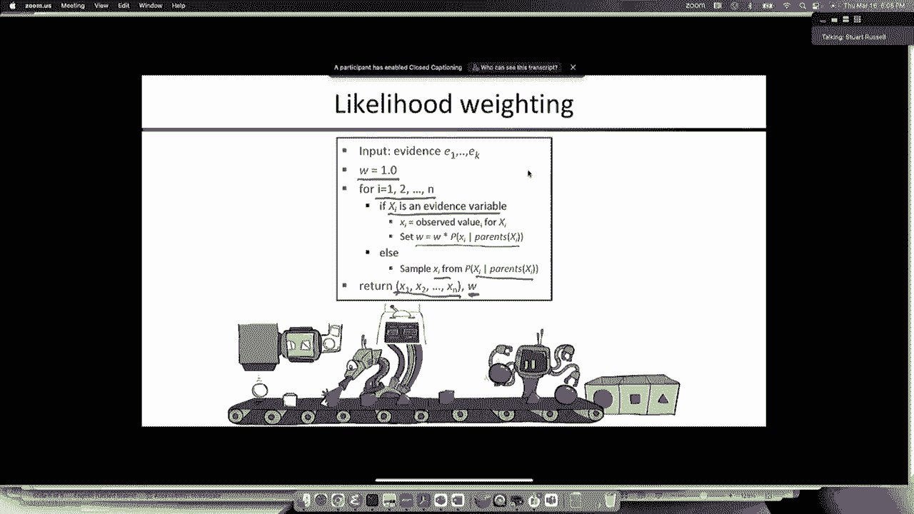

**为什么这行得通？** 这实际上是**重要性采样**技术的一个应用。我们从提议分布 `Q`（即固定证据、采样非证据的分布）中采样，然后通过权重 `w = P(sample) / Q(sample)` 进行修正。可以证明，加权后的样本分布恰好能给出对真实后验概率的一致估计。

**优点与局限**：似然加权采样避免了样本被大量拒绝，效率远高于拒绝采样。然而，当证据位于网络下游（叶节点）时，上游变量的采样完全不受证据影响，样本权重可能变得非常小且方差很大，导致估计仍然不理想。

---

## 马尔可夫链蒙特卡洛与吉布斯采样 🔗

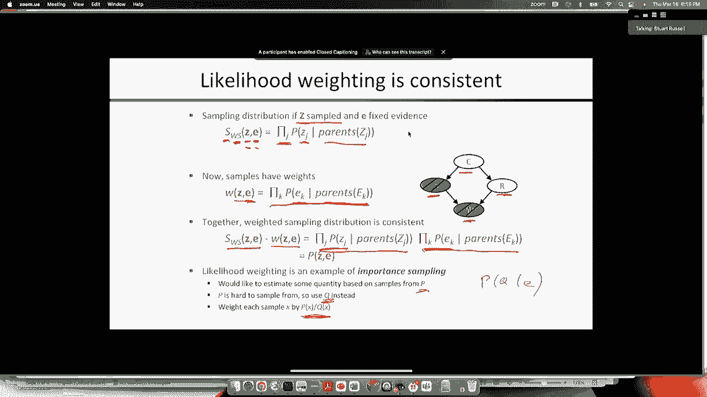

为了克服似然加权采样的局限性，我们需要一种能让**所有证据都影响所有变量采样**的方法。这就是**马尔可夫链蒙特卡洛** 方法，其中**吉布斯采样**是适用于贝叶斯网络的一种简单而强大的变体。

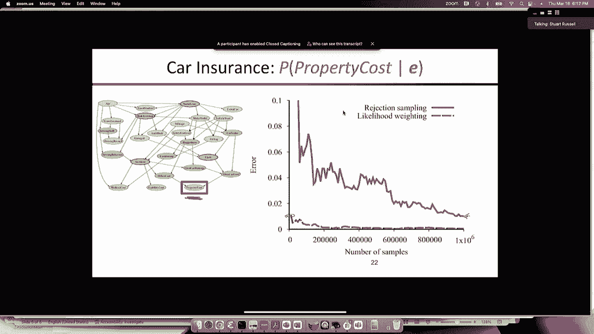

MCMC的核心思想是构建一个马尔可夫链，其**平稳分布**恰好就是我们想要的目标后验分布 `P(X | E=e)`。通过在这个链上进行随机游走，最终生成的样本序列将近似服从该后验分布。

在深入吉布斯采样之前，让我们通过一个城市随机游走的例子来理解“平稳分布”：

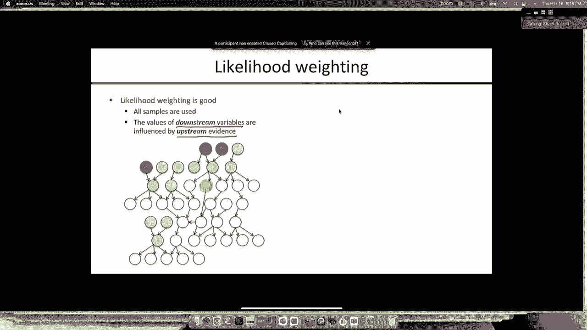

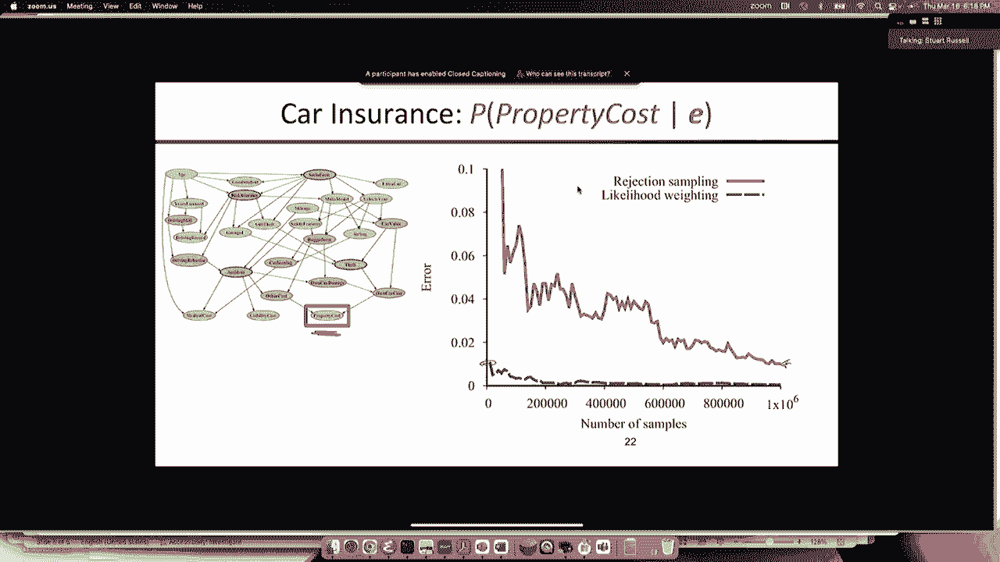

> 假设有若干个城市由道路连接，一个人每天随机选择一条道路去往相邻城市。经过长时间后，他在各个城市停留的时间比例会趋于一个稳定值，这个分布就是随机游走的平稳分布。可以证明，在这个无向图游走中，平稳分布与节点的度数成正比。

吉布斯采样正是利用了这种思想。对于贝叶斯网络，给定证据 `E=e`，吉布斯采样的步骤如下：

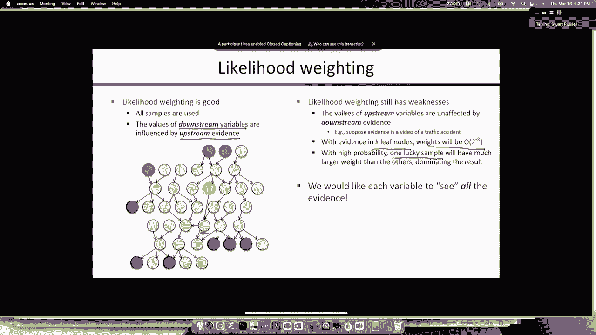

1.  随机初始化所有非证据变量的值。
2.  重复以下步骤很多次（每次迭代生成一个新样本）：
    *   对于每一个非证据变量 `Xi`：
        *   固定**所有其他变量**（包括证据变量和其他非证据变量）的当前值。
        *   根据 `Xi` 的**马尔可夫毯**（即其父节点、子节点以及子节点的其他父节点）的当前取值，计算 `Xi` 的条件概率分布 `P(Xi | MarkovBlanket(Xi))`。
        *   从这个条件分布中为 `Xi` 采样一个新的值。
    *   在经过一定次数的“预热”后，将当前所有非证据变量的取值记录为一个样本。

**关键点**：在吉布斯采样中，每个变量的更新都考虑了所有相关证据（通过其马尔可夫毯），因此最终样本会收敛到真实的后验分布 `P(X | E=e)`。它特别适合证据变量很多或位于网络任何位置的情况。

---

## 总结

本节课我们一起学习了贝叶斯网络中几种重要的近似推理采样方法：


1.  **先验采样**：直接从联合分布中生成样本，是其他方法的基础。
2.  **拒绝采样**：通过丢弃与证据不符的样本来估计条件概率，简单但效率低。
3.  **似然加权采样**：固定证据变量，对非证据变量采样并通过权重修正，效率更高，但在下游证据多时可能失效。
4.  **吉布斯采样**：一种MCMC方法，通过迭代地根据马尔可夫毯更新每个变量，使样本序列收敛到目标后验分布，能有效处理各种证据情况。

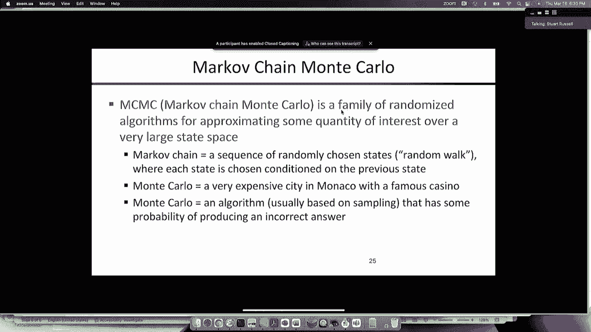

这些采样方法使我们能够对大规模、复杂的概率模型进行可行的推理，是连接概率论与实用人工智能算法的重要桥梁。