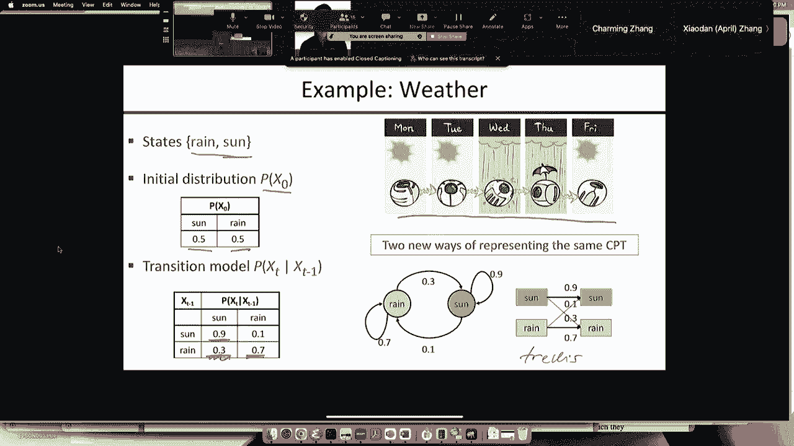

# P20：贝叶斯网络推理与马尔可夫模型 🧠

在本节课中，我们将学习贝叶斯网络中的高级采样推理算法——马尔可夫链蒙特卡罗方法，并初步了解马尔可夫模型的基本概念。我们将从回顾之前的采样方法开始，深入探讨吉布斯采样如何解决似然加权采样的缺陷，并理解其背后的原理。最后，我们会将概率模型扩展到随时间变化的系统，引入马尔可夫模型，并了解其广泛的应用。

***

## 🔄 回顾：从贝叶斯网络采样

上一节我们讨论了从贝叶斯网络本身进行采样的几种算法。

以下是之前介绍过的几种采样方法：
*   **先验采样**：直接从网络先验分布中生成样本。
*   **拒绝采样**：生成样本后，丢弃所有与观测证据不一致的样本。这种方法效率极低。
*   **似然加权采样**：通过固定证据变量的值来确保所有样本都与证据一致，但需要对生成的样本根据其与证据的匹配程度进行重新加权。

虽然似然加权采样效果尚可，但它存在一个显著问题。当网络中存在大量位于“叶子”节点（即没有子节点的节点）的证据时，算法会生成大量无视这些证据的样本。这些样本会获得极小的权重，导致只有少数“幸运”地猜对了证据变量值的样本主导最终的估计结果。这使得有效样本量变得极小，从而得到非常糟糕的概率估计。

***

## 🎲 马尔可夫链蒙特卡罗算法

为了解决上述问题，我们引入了**马尔可夫链蒙特卡罗**算法。

MCMC算法不仅固定证据变量，还能让来自证据变量的信息在整个网络中传播。因此，采样过程很快就能受到网络中所有证据的影响，而不仅仅是根节点的证据。

### MCMC 算法概述

MCMC算法的高级思想非常简单：在状态空间中随机游走，并通过观察游走过程中访问的状态来估计查询结果。

以下是该算法的核心要点：
*   **马尔可夫链**：指通过随机游走生成样本序列的特定方式。链中的每个新状态都只依赖于前一个状态，并以一定的概率随机选择。
*   **蒙特卡罗**：泛指任何使用随机化来给出问题近似答案的算法。

因此，MCMC算法就是在状态空间中“随便逛逛”，并记录你所看到的内容。

***

## ⚙️ 吉布斯采样

我们将重点学习一种特定的MCMC算法，称为**吉布斯采样**。

在贝叶斯网络推理的语境下，吉布斯采样通常每次只对**一个**非证据变量进行采样。采样时，该变量的新值取决于网络中**所有其他变量**在当前状态下的取值。

### 算法步骤

吉布斯采样的过程可以概括为以下几个步骤：
1.  **初始化**：将所有证据变量固定为其观测值。为所有非证据变量随机分配一个初始值，形成一个完整的联合状态。
2.  **循环采样**：重复以下过程：
    *   从所有非证据变量中随机选择一个变量 \(X_i\)。
    *   根据 \(X_i\) 的**马尔可夫毯子** 中所有变量的当前值，计算 \(X_i\) 的条件概率分布 \(P(X_i | \text{MB}(X_i))\)。
    *   从这个分布中为 \(X_i\) 采样一个新的值 \(x_i'\)，更新当前状态。
3.  **估计查询**：在经过一段“预热”期后，持续采样并记录状态。对于任何查询，只需计算这些记录状态中该查询为真的比例，作为其概率估计。

### 马尔可夫毯子与计算简化

在贝叶斯网络中，一个变量的马尔可夫毯子包括其父节点、子节点以及子节点的其他父节点（即“配偶”节点）。

关键的性质是：给定其马尔可夫毯子，该变量与网络中的所有其他变量条件独立。这意味着在吉布斯采样中，为变量 \(X_i\) 采样新值时，只需考虑其马尔可夫毯子中的少数几个邻居变量。

计算公式如下：
\[
P(X_i | \text{mb}(X_i)) \propto P(X_i | \text{Parents}(X_i)) \times \prod_{Y_j \in \text{Children}(X_i)} P(Y_j | \text{Parents}(Y_j))
\]
你只需要将 \(X_i\) 在其父节点下的条件概率，与其每个子节点在其各自父节点下的条件概率相乘（其中 \(X_i\) 是父节点之一），然后进行归一化即可得到分布。这个计算是局部的，与网络总规模无关，因此效率很高。

***

## 📈 吉布斯采样的性质与示例

### 信息传播与收敛

吉布斯采样能有效地将证据信息传播到整个网络。例如，在第一轮采样后，所有与证据变量直接相邻的变量都会受到影响；几轮之后，影响就能传播到更远的变量。最终，采样过程会收敛到真实的**后验概率分布**。

### 与似然加权采样的比较

通过汽车保险网络的例子，我们可以比较两种算法：
*   当证据位于查询变量的**上游**时（这是似然加权的理想情况），两种算法都表现良好。
*   当证据位于查询变量的**下游**时（这是似然加权的最坏情况），吉布斯采样显著优于似然加权。在后者可能无法收敛的情况下，吉布斯采样仍能给出近乎准确的估计。

因此，对于具有大量证据的大型网络，吉布斯采样的效率可能比似然加权高出多个数量级，是实践中常用的工具。

***

## 🔬 深入原理：平衡分布与收敛

从更理论的角度看，吉布斯采样定义了一个在状态（即所有变量的赋值）上的马尔可夫链。每个状态都是一个超立方体的顶点，状态之间的转移沿着超立方体的边进行（因为一次只改变一个变量）。

我们可以定义一个转移概率矩阵 \(K\)，其中 \(K_{\mathbf{x} \to \mathbf{x’}}\) 表示从状态 \(\mathbf{x}\) 转移到状态 \(\mathbf{x’}\) 的概率。运行采样算法相当于在这个图上随机游走。

### 平衡分布

马尔可夫链的**平衡分布** \(\pi\) 是一个概率向量，满足：
\[
\pi = \pi K
\]
这意味着，一旦链的分布达到 \(\pi\)，后续的采样将保持这个分布。可以证明，在吉布斯采样中，这个平衡分布 \(\pi\) 正好就是给定证据下的真实后验概率分布。

### 收敛保证与挑战

在满足一定条件（如所有概率严格介于0和1之间，且每个变量都被无限频繁采样）时，吉布斯采样是一致的，即当采样次数趋于无穷时，估计值会收敛到真实后验。

然而，**收敛速度**是一个实际问题。在最坏情况下，达到平衡分布所需时间可能是状态空间大小的指数级，这通常发生在转移概率非常极端（接近0或1）时，导致链长时间困在状态空间的某个子集中。诊断马尔可夫链是否已收敛是实际应用中的一个挑战。

***

## ⏳ 扩展到时序模型：马尔可夫模型

现在，我们将概率模型扩展到那些状态随时间演化的系统，即**马尔可夫模型**。

核心思想是为每个时间点 \(t\) 复制一组变量 \(X_t\)。我们做出**马尔可夫假设**：时间 \(t\) 的状态 \(X_t\) 只依赖于前一个时间点 \(t-1\) 的状态 \(X_{t-1}\)，而与更早的历史无关。

### 模型表示

联合概率分布可以写为：
\[
P(X_0, X_1, ..., X_T) = P(X_0) \prod_{t=1}^{T} P(X_t | X_{t-1})
\]
其中 \(P(X_0)\) 是初始状态分布，\(P(X_t | X_{t-1})\) 是**转移模型**，通常假设是平稳的（即不随时间变化）。

### 示例与应用

马尔可夫模型有极其广泛的应用：

以下是几个经典例子：
*   **一维随机游走**：状态是整数位置，每一步以相等概率向左或向右移动。其性质（如期望距离、返回原点的概率）在物理、金融（股票价格模型）、赌博理论中都有重要意义。
*   **N-gram语言模型**：用于建模自然语言。状态是单词，N-gram模型预测下一个单词的概率依赖于前 N-1 个单词。当今的大型语言模型（如GPT系列）本质上就是参数规模巨大的N-gram模型的高级压缩形式。
*   **网页浏览的PageRank**：将网页视为状态，点击链接视为状态转移。在此随机游走模型下的平稳分布就是PageRank，它是谷歌搜索算法的基石，用于衡量网页重要性。
*   **简单天气模型**：一个两状态（晴/雨）模型，其转移概率可以刻画天气的持续性。

***

## 🎯 总结

本节课我们一起学习了以下内容：
1.  **回顾了贝叶斯网络中的采样算法**，指出了拒绝采样和似然加权采样的局限性。
2.  **引入了马尔可夫链蒙特卡罗方法**，它通过状态空间中的随机游走来进行推理。
3.  **深入探讨了吉布斯采样**，这是一种具体的MCMC算法，它通过每次采样一个变量并依据其马尔可夫毯子更新，来高效地传播证据信息。我们了解了其操作步骤、计算简化原理以及优于似然加权采样的场景。
4.  **从原理上分析了MCMC**，包括平衡分布的概念和收敛性，同时也认识到诊断收敛的实际挑战。
5.  **将模型扩展到时序领域，引入了马尔可夫模型**。我们学习了其基本假设、表示方法，并了解了随机游走、语言模型、PageRank等丰富应用，为后续处理时序推理问题打下了基础。

MCMC是处理大型复杂概率模型的强大通用推理工具，而马尔可夫模型则为描述动态系统提供了简洁而有力的框架。