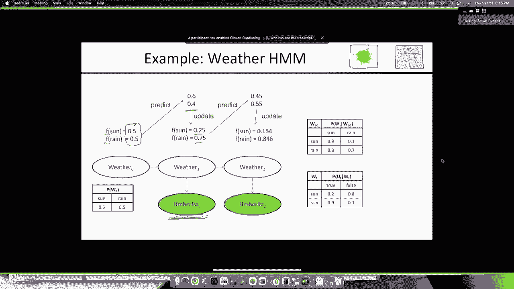
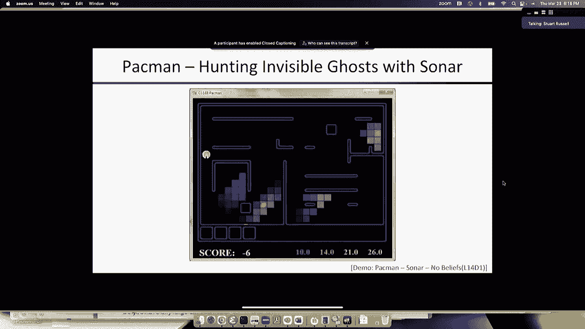
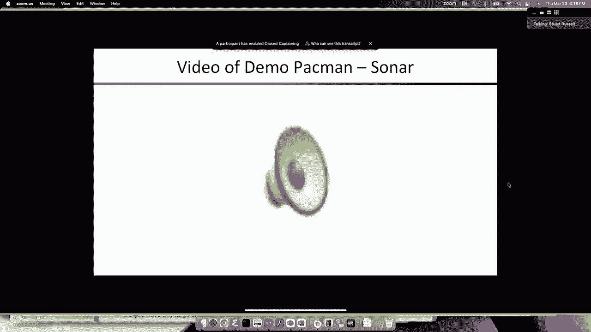
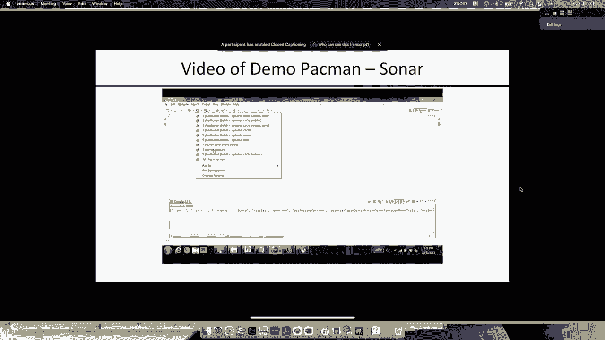
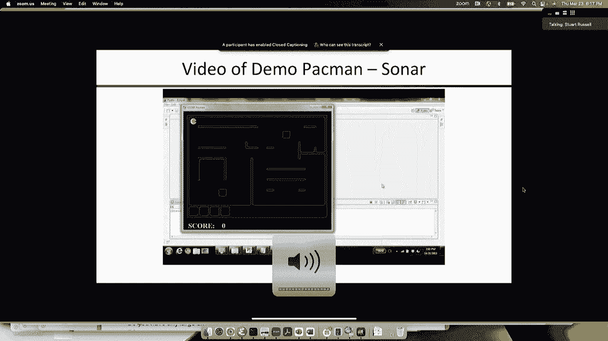
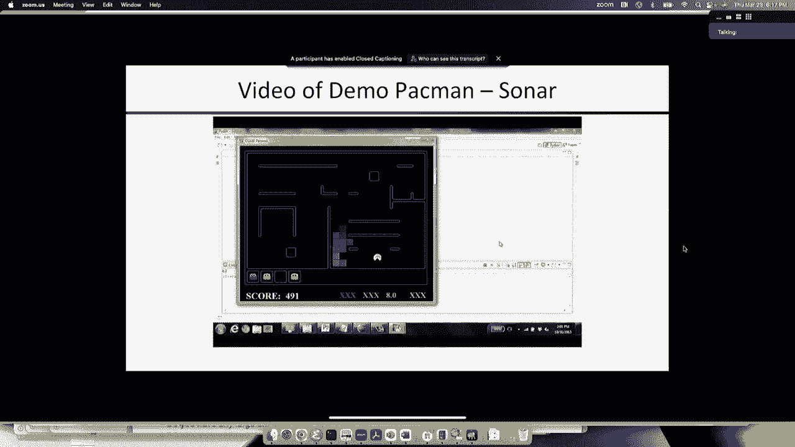
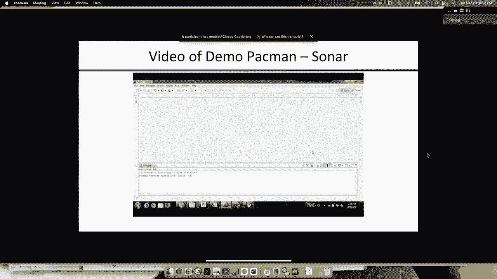
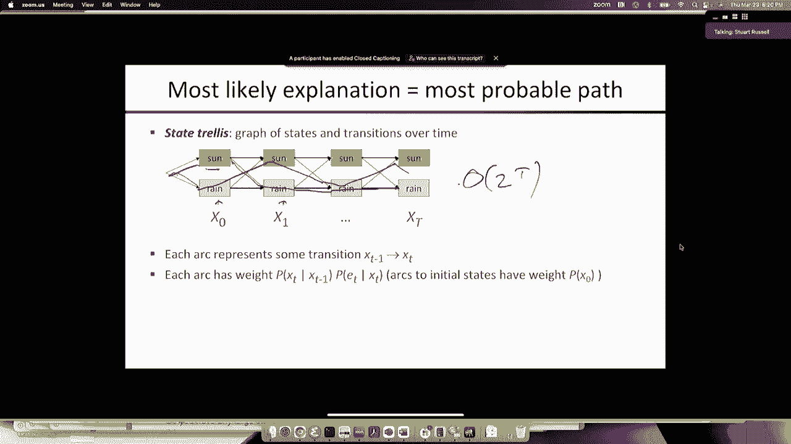
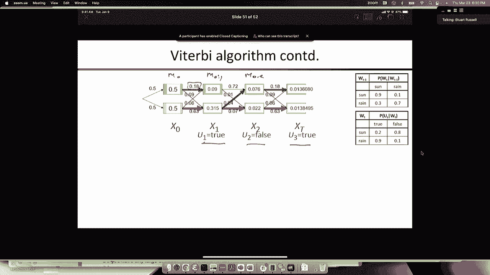

# 21：隐马尔可夫模型、滤波与维特比算法 🧠

在本节课中，我们将学习隐马尔可夫模型（HMMs）的核心概念，包括如何仅根据一系列观测来预测和推断隐藏状态。我们将重点介绍两种关键算法：用于实时状态估计的**滤波算法**，以及用于寻找最可能状态序列的**维特比算法**。

---

## 马尔可夫模型回顾 🔄

上一节我们讨论了马尔可夫模型的基本思想。它是一个状态变量序列：`x0, x1, x2, x3, ...`。我们引入了一个天气的例子，状态可以是晴天或雨天。

*   先验分布从 `P(x0) = [0.5, 0.5]` 开始。
*   转移模型描述了给定前一状态时，下一个状态的分布。这是一个一阶马尔可夫模型，因为下一个状态只取决于前一个状态。

模型可以描述为：晴天以 0.9 的概率持续，雨天以 0.7 的概率持续。我们可以用概率状态转移图或**篱笆图**来表示，后者将每个时间步的状态分开显示，并描述它们之间的转移。

---

## 状态预测 ☀️🌧️

本节中，我们来看看如何进行天气预报。在时间 0，我们有概率分布 `[0.5, 0.5]`。我们想预测时间 1 的天气分布 `P(x1)`。

计算方法是引入变量 `x0` 并对所有可能的 `x0` 值求和：
`P(x1) = Σ_{x0} P(x1, x0) = Σ_{x0} P(x0) * P(x1 | x0)`
这里，`P(x0)` 是先验，`P(x1 | x0)` 是转移模型。

代入数值计算，我们得到明天的天气预报：`P(x1) = [0.6, 0.4]`，即 60% 晴天，40% 雨天。

我们可以重复这个过程来预测更远的未来。从时间 1 的分布 `[0.6, 0.4]` 出发，使用相同的转移模型，可以计算出时间 2 的分布 `[0.66, 0.34]`。这个过程可以一直持续下去。

这种一步步从当前时间步分布计算下一个时间步分布的方法，构成了**前向算法**的基础。它采用递归更新的形式：`P(x_t) = g(P(x_{t-1}))`，其中函数 `g` 是乘以转移矩阵的转置。

如果我们考虑极限情况，状态分布会收敛到一个**平稳分布**。通过解方程 `P_∞ = T^T * P_∞`，我们可以求出这个极限分布。对于我们的天气模型，平稳分布是 `[0.75, 0.25]`，即长期来看，75% 的时间是晴天。这个极限与初始分布无关。

---

## 隐马尔可夫模型与部分可观测性 👁️

然而，现实世界往往是部分可观测的。我们无法直接看到状态（天气），只能获得一些有噪声的观测（例如，是否有人带伞）。这就是**隐马尔可夫模型**。

HMM 在标准马尔可夫链的基础上，为每个状态变量 `x_t` 增加了一个观测变量 `e_t`。我们假设观测只依赖于当前状态（传感器马尔可夫假设）。

以下是传感器模型的例子：
*   当天气晴朗时，有 20% 的概率看到伞。
*   当天气下雨时，有 90% 的概率看到伞。

HMM 的联合概率分布为：
`P(x_{0:t}, e_{1:t}) = P(x_0) * Π_{i=1}^t P(x_i | x_{i-1}) * P(e_i | x_i)`

HMM 在历史上非常重要，曾广泛应用于语音识别（状态是音素/单词，观测是声学信号）和分子生物学（状态是基因功能区域，观测是DNA序列）。

---

## 滤波：状态估计 🎯

**滤波**（或状态估计）是智能系统的一项基本任务：根据到目前为止的所有观测，估计当前世界的状态。例如，跟踪你的车或手机在哪里。

我们想要计算 `P(x_t | e_{1:t})`，记作 `f_t`。我们可以推导出一个递归更新公式，它包含三个步骤：

1.  **预测**：基于上一时刻的信念状态和转移模型，预测当前时刻的先验状态。
    `P(x_{t+1} | e_{1:t}) = Σ_{x_t} P(x_{t+1} | x_t) * f_t`
2.  **更新**：结合新的观测 `e_{t+1}`，用传感器模型更新预测。
    `f_{t+1} ∝ P(e_{t+1} | x_{t+1}) * P(x_{t+1} | e_{1:t})`
3.  **归一化**：确保 `f_{t+1}` 是一个有效的概率分布。

这个算法的核心是：**预测 -> 更新 -> 归一化**。更新成本与状态数量的平方成正比，但与时间序列的长度无关，因此可以实时运行。

一个著名的滤波算法是**卡尔曼滤波器**，用于具有线性动力学和高斯噪声的连续状态系统，在阿波罗计划等工程领域有里程碑式的应用。

---

## 维特比算法：最可能解释 🏆

有时我们不仅关心当前状态，还想知道**整个最可能的状态序列**，这称为**最可能解释**（MLE）。例如，在语音识别中，我们想找出最可能说出观测到声音的单词序列。

我们想找到：
`argmax_{x_{1:t}} P(x_{1:t} | e_{1:t})`

这等价于在所有可能路径（篱笆图中的路径）中，找到使路径权重（转移概率与观测概率的乘积）最大的路径。直接枚举所有路径是指数级复杂度。

**维特比算法**高效地解决了这个问题。其核心思想与滤波的前向算法类似，但将求和 (`Σ`) 替换为取最大值 (`max`)。

算法步骤：
*   定义 `m_t(s)` 为在时间 `t` 到达状态 `s` 的最可能路径的概率。
*   递归计算：`m_{t+1}(s') = max_{s} [ m_t(s) * P(s' | s) * P(e_{t+1} | s') ]`
*   同时，记录下对于每个状态 `s'`，是哪个前驱状态 `s` 达到了这个最大值（**回溯指针**）。
*   在计算完所有时间步后，从最终时刻概率最大的状态开始，沿着回溯指针反向追踪，即可得到最可能的状态序列。

维特比算法是数字通信中解码噪声信号的基础算法，具有极其重要的经济价值。

---

## 总结 📚

本节课我们一起学习了隐马尔可夫模型的核心框架。
*   我们回顾了马尔可夫模型和状态预测。
*   引入了部分可观测性和隐马尔可夫模型。
*   深入探讨了**滤波算法**，它能够递归地根据新证据更新对当前状态的信念，是实时状态估计的基石。
*   最后，我们学习了**维特比算法**，它通过动态规划高效地找出整个最可能的状态序列，解决了最可能解释问题。

这两种算法使我们能够在充满噪声和不完整信息的世界中，进行有效的推理和决策。