# 22：动态贝叶斯网络与粒子滤波器 🧠

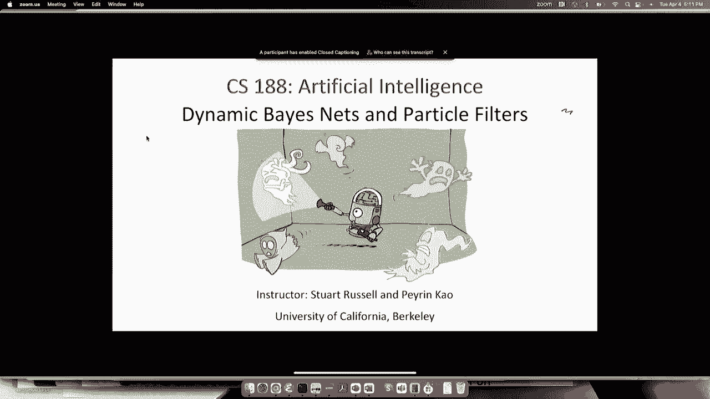

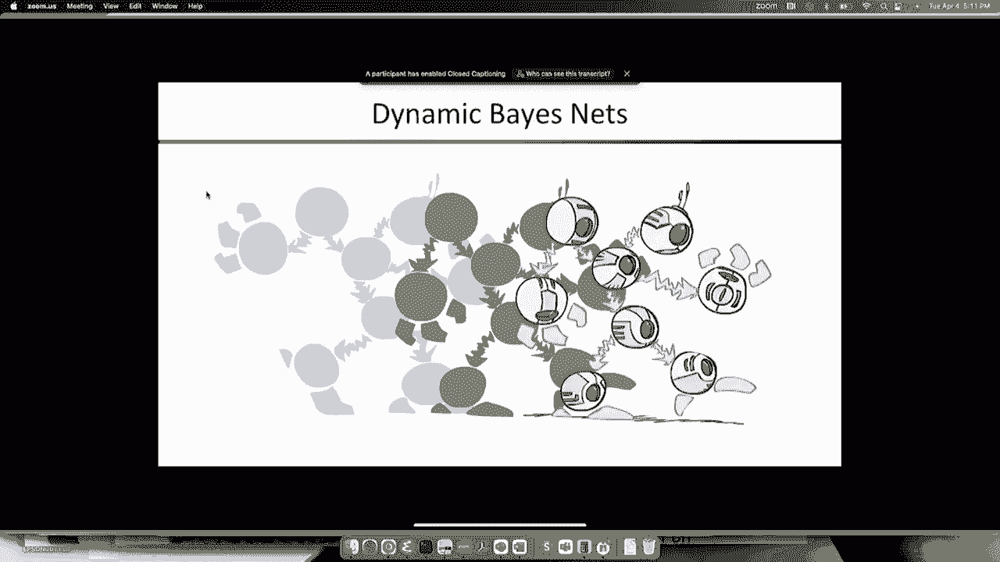

在本节课中，我们将学习如何为随时间演变的复杂系统建模，并探索当精确推理变得不可行时，如何利用粒子滤波器进行近似推理。我们将从回顾隐马尔可夫模型（HMM）开始，扩展到更通用的动态贝叶斯网络（DBN），并最终介绍粒子滤波器的核心思想——重采样。

---

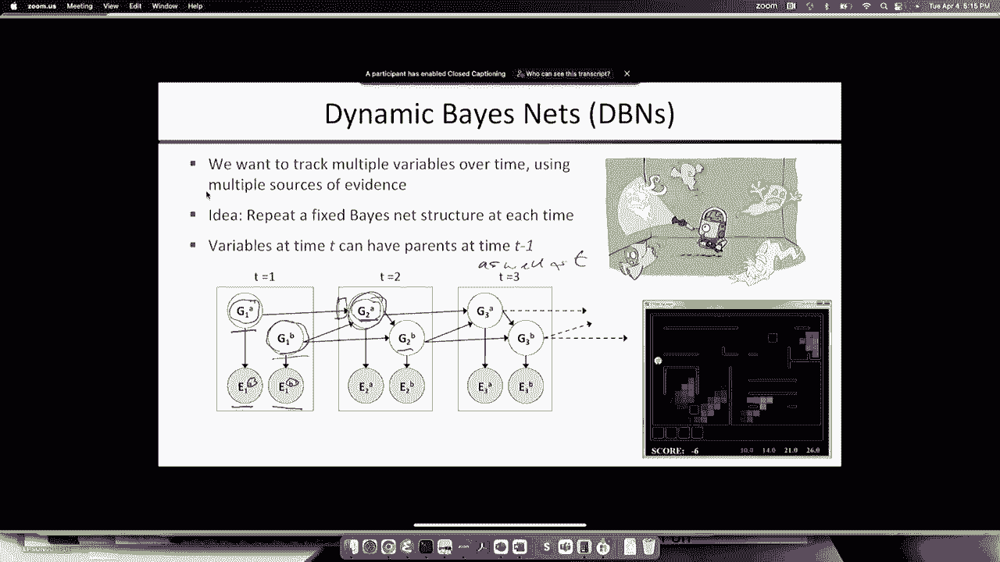

## 从隐马尔可夫模型到动态贝叶斯网络 🔄

上一节我们介绍了隐马尔可夫模型及其精确推理算法。本节中，我们来看看如何将模型扩展到包含多个状态变量和证据源的更大系统。

在HMM中，每个时间步只有一个状态变量。为了建模更复杂的系统，我们可以在每个时间步引入多个状态变量，并将它们连接成一个小型贝叶斯网络，然后随时间步复制这个结构。这就构成了动态贝叶斯网络。

在DBN中，状态变量的父节点可以是前一个时间步的状态变量，也可以是同一时间步的其他状态变量。例如，在追踪多个幽灵的项目中，每个幽灵的位置是一个状态变量，声纳测量是证据变量。幽灵在时间t的位置取决于它在时间t-1的位置，也可能取决于其他幽灵在之前的位置。

每个离散的DBN都可以转换为一个完全等效的HMM，方法是将所有状态变量“折叠”成一个组合变量，其取值范围是各状态变量值域的笛卡尔积。然而，这种转换会导致表示大小（参数数量）的指数级爆炸。例如，一个有20个布尔状态变量的系统，若每个变量最多有3个父节点，DBN只需约160个参数；而等效的HMM则需要约2^40（约一万亿）个参数。因此，利用DBN捕捉系统的子结构对于高效学习和推理至关重要。

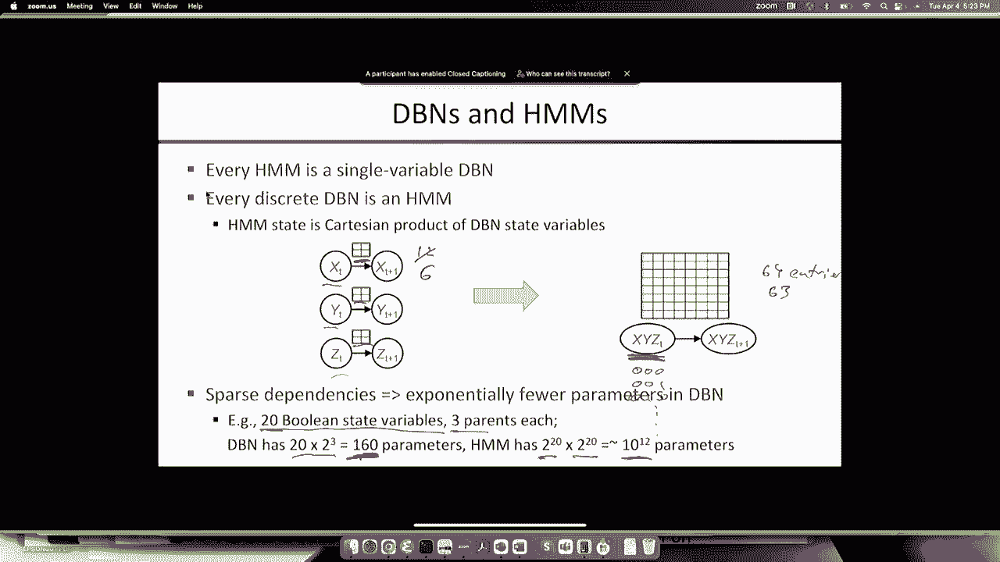

---

## 动态贝叶斯网络中的推理挑战 ⚙️

既然DBN非常适合表示复杂过程，我们如何在其上进行推理呢？一个直接的想法是：构建展开的时间步，形成一个大型贝叶斯网络，然后运行变量消除等精确推理算法。

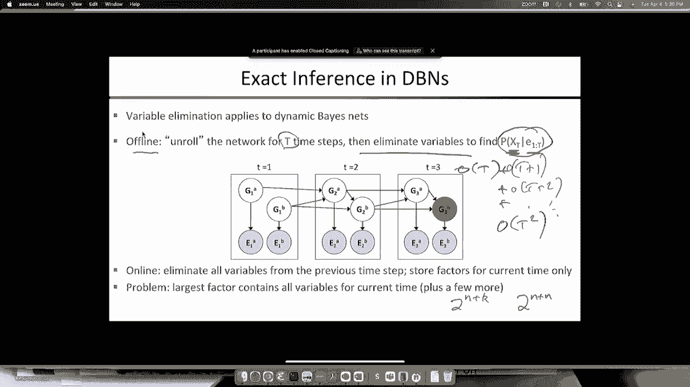

对于离线处理（所有数据已知），这种方法的时间复杂度与观察序列长度呈线性关系，是可行的。但对于在线处理（数据持续到达），每次新观察到来都重新展开网络并运行精确推理，总时间复杂度将变为序列长度的平方，这是不可接受的。

尝试为DBN设计类似HMM滤波的递归在线算法时，问题出现了。在DBN上运行变量消除时，因子最终会增长到包含给定时间步的所有状态变量，导致每次更新的计算成本相对于状态变量数量呈指数级增长。对于拥有数百个状态变量（如火星探测器健康监测系统）的大型系统，精确推理是无法实现的。

---

## 现实世界应用：重症监护室监测 🏥

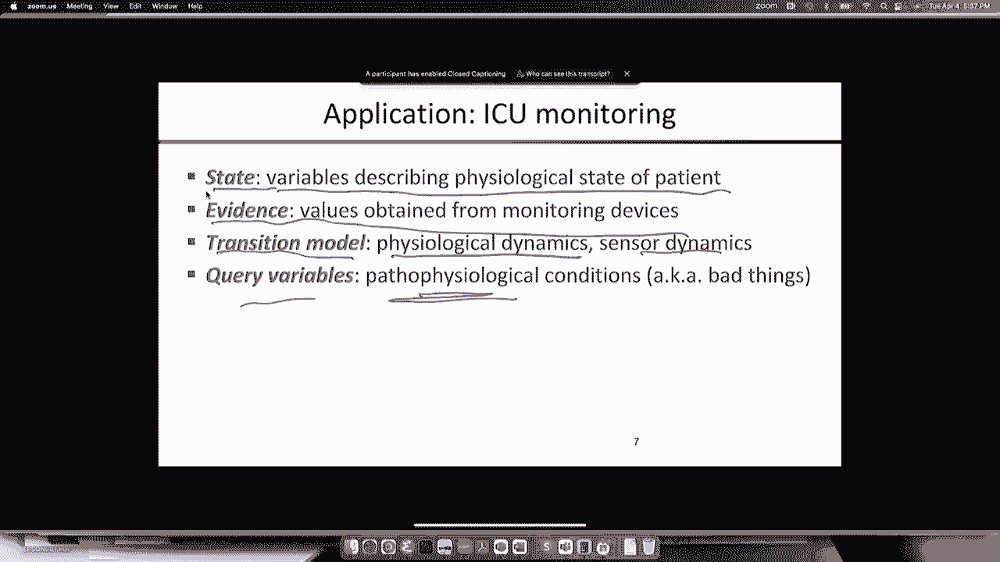

为了具体说明DBN的应用和挑战，我们来看一个现实世界的例子：儿科重症监护室（ICU）的病人监测系统。

系统的状态变量描述了病人的生理状态（如真实心率、血压、血氧、颅内压）以及传感器设备本身的状态（如电极是否脱落）。证据变量则是从各种监护设备（如心电图、血氧仪、呼吸机）获得的测量值。

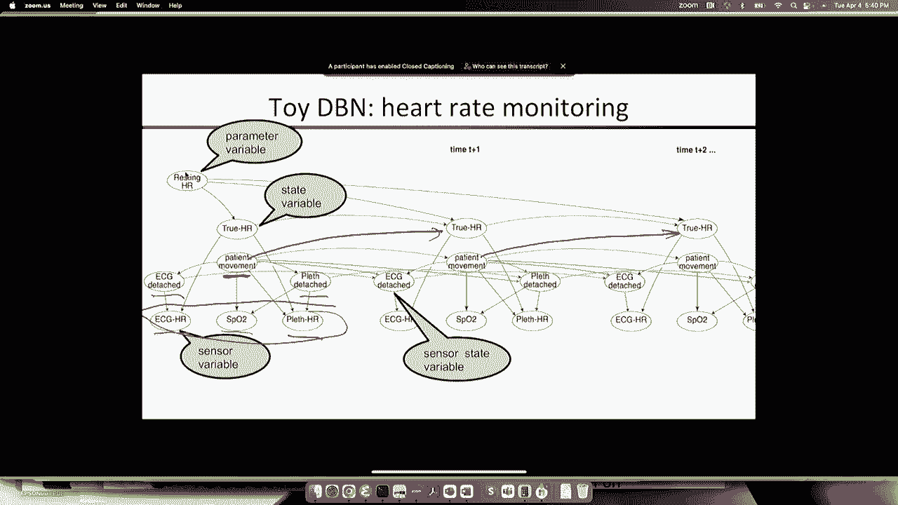

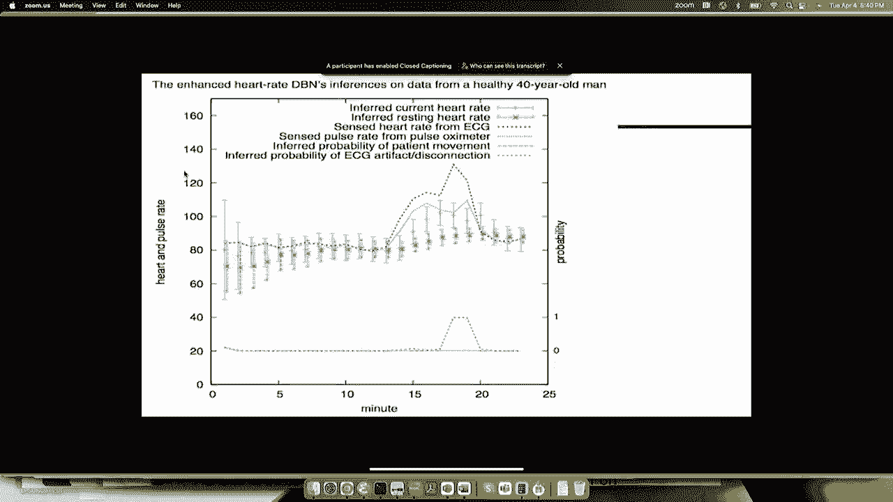

测量数据中充满了干扰和伪影。例如，血压监测中，护士抽血或设备校零会导致读数剧烈波动，产生大量假警报。研究表明，ICU中高达94%的警报是假警报。

通过构建一个精细的DBN来建模生理动力学、传感器动力学以及各种干扰事件（如“抽血”、“校零”）如何影响测量，我们可以从嘈杂的数据中推断出病人的真实生理状态以及设备故障情况。下图展示了一个简化的DBN片段，用于从心电图和血氧仪读数推断真实心率、传感器状态及病人是否移动：

```
状态变量: True HR (真实心率), Patient Motion (病人移动), Resting HR (静息心率)
传感器状态: ECG Lead Off? (心电图脱落?), Pulse Ox Off? (血氧仪脱落?)
证据变量: ECG HR (心电图心率读数), Pulse Ox HR (血氧仪心率读数), SpO2 (血氧饱和度)
```

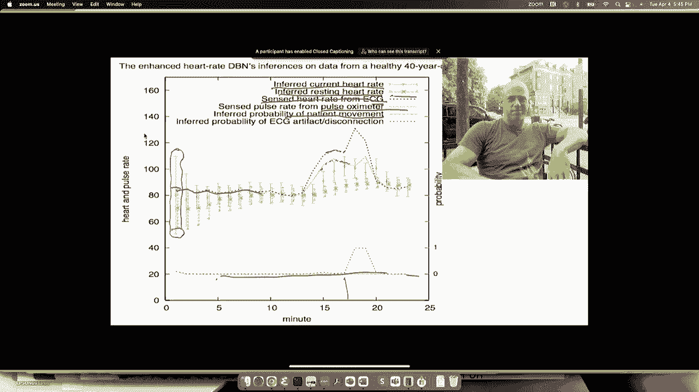

然而，这个完整的DBN模型非常庞大和复杂，无法进行精确推理，因此我们需要近似算法。

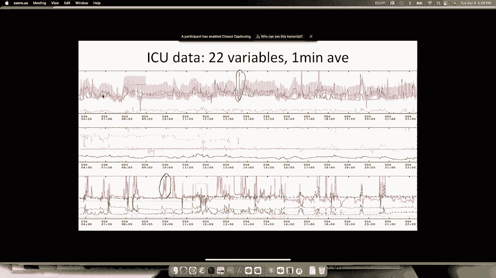

---

## 粒子滤波器：一种近似推理方法 🎯

面对大型DBN精确推理的指数级复杂度，我们需要高效的近似算法。我们首先可能会尝试已知的近似推理方法，如似然加权。

但在类似HMM的时序模型上应用似然加权时，效果非常差。因为证据变量位于“叶节点”，随着时间步增加，生成与所有历史证据一致的样本的概率呈指数级下降。最终，只有极少数“幸运”的样本拥有全部权重，导致估计结果完全错误。即使增加样本数量，也只能推迟问题发生的时间，无法根本解决。

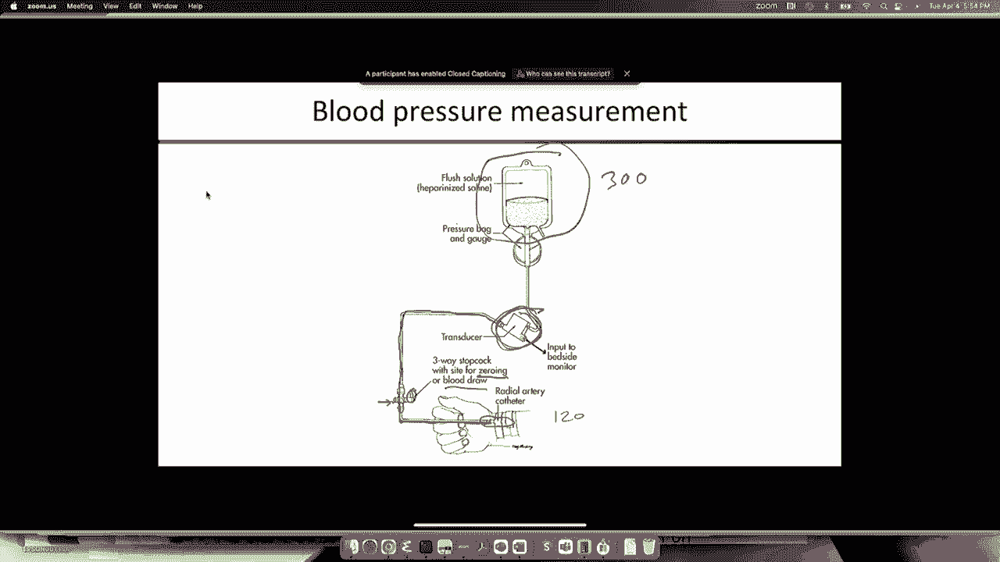

问题的核心在于，似然加权在生成状态序列（粒子）时完全忽略了证据，事后再检查一致性，这种方法在长序列中效率极低。

粒子滤波器通过引入一个全新的思想——**重采样**——来解决这个问题。其核心是让粒子“关注”证据。算法不是盲目地向前模拟，而是在每一步根据新证据的似然度来调整粒子的分布，淘汰掉与证据不符的粒子，并复制那些与证据一致的粒子。这个过程使得粒子群能够有效地跟踪系统的真实状态。

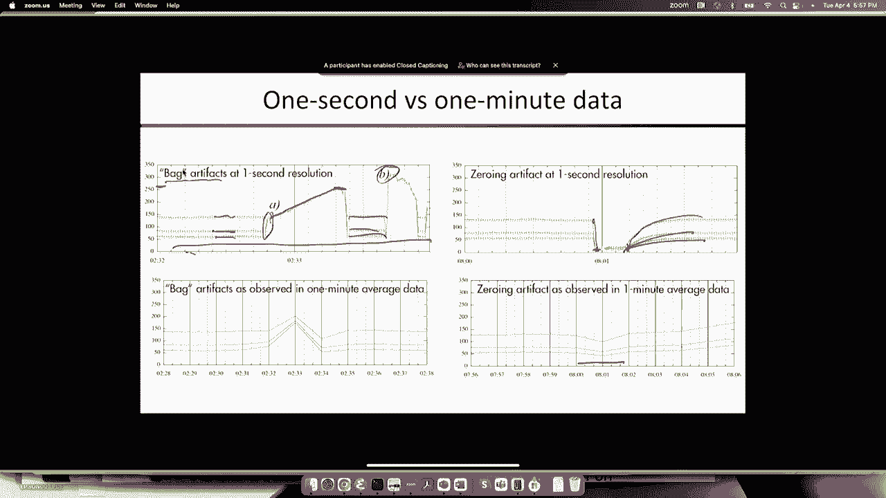

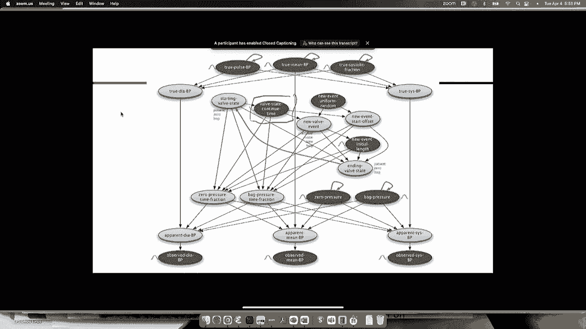

以下是粒子滤波器一个时间步的基本流程：

1.  **预测**：根据每个粒子在t-1时刻的状态，从其状态转移模型`P(X_t | X_{t-1})`中采样，得到它们在t时刻的预测状态。
2.  **更新**：获得t时刻的新证据`e_t`。为每个粒子计算权重，权重等于该粒子预测状态生成当前证据的似然度`P(e_t | X_t)`。
3.  **重采样**：根据粒子的权重，从当前粒子集合中有放回地抽取N个新粒子。权重高的粒子更有可能被多次抽取，权重低的粒子可能被淘汰。新粒子集合中每个粒子的权重重置为1/N。

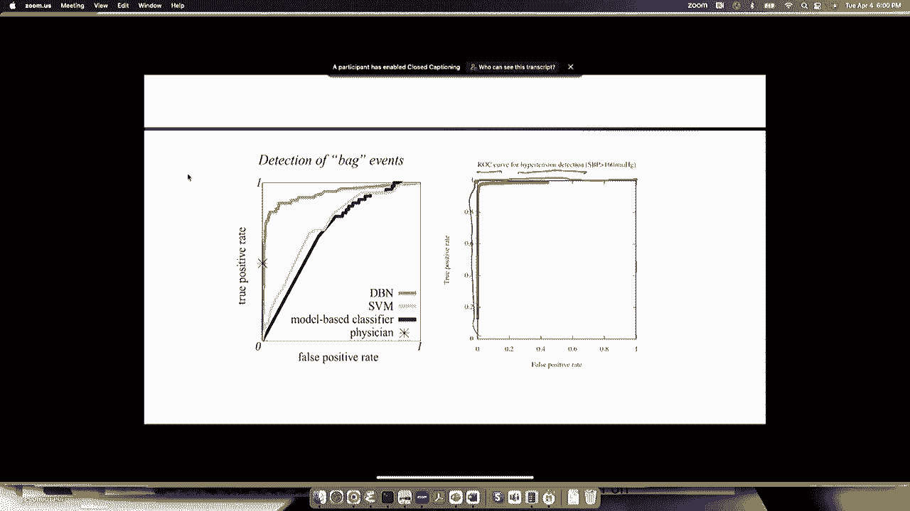

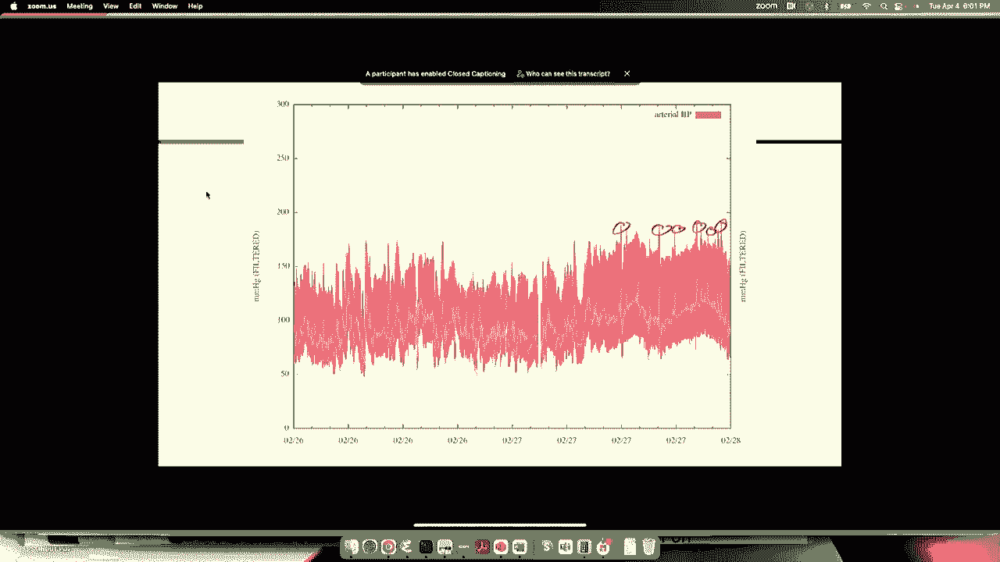

通过不断重复预测-更新-重采样的循环，粒子滤波器能够用一群粒子来近似表示系统状态的后验概率分布，即使在高维状态空间中也能有效工作。这正是我们之前提到的ICU监测系统实际采用的推理方法。

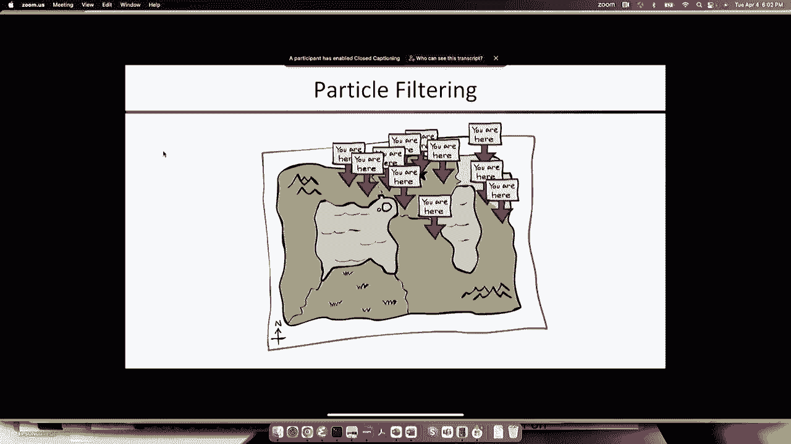

---

## 总结 📚

本节课中，我们一起学习了动态贝叶斯网络和粒子滤波器。

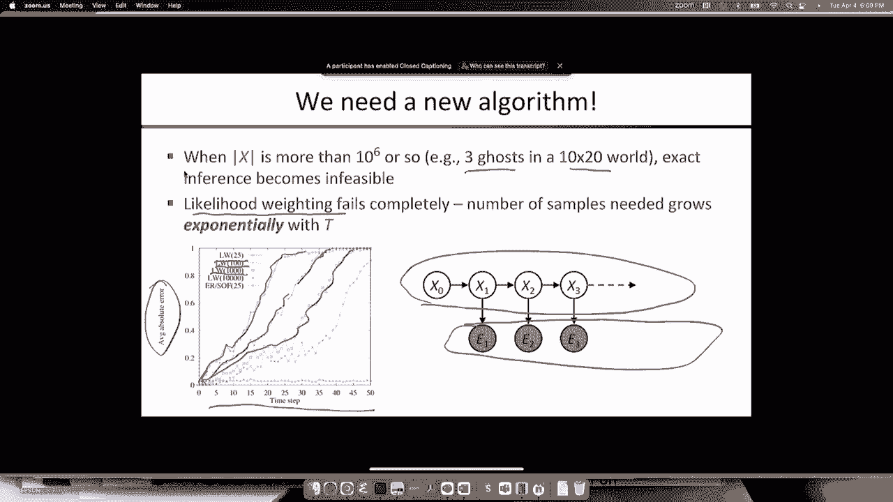

*   我们首先将**隐马尔可夫模型**扩展为**动态贝叶斯网络**，后者能更紧凑地表示具有多个状态变量的复杂时序系统。
*   我们认识到，在DBN上进行**精确推理**（如变量消除）对于在线应用或大型网络是计算上难以实现的。
*   通过**重症监护室监测**的案例，我们看到了DBN在现实世界中的强大建模能力，以及处理传感器噪声和伪影的必要性。
*   最后，我们引入了**粒子滤波器**作为解决方案。它通过**重采样**机制，使一组“粒子”能够随着新证据的到来而动态演化，从而高效地近似系统状态的后验分布，克服了传统似然加权方法在时序推理中的致命缺陷。

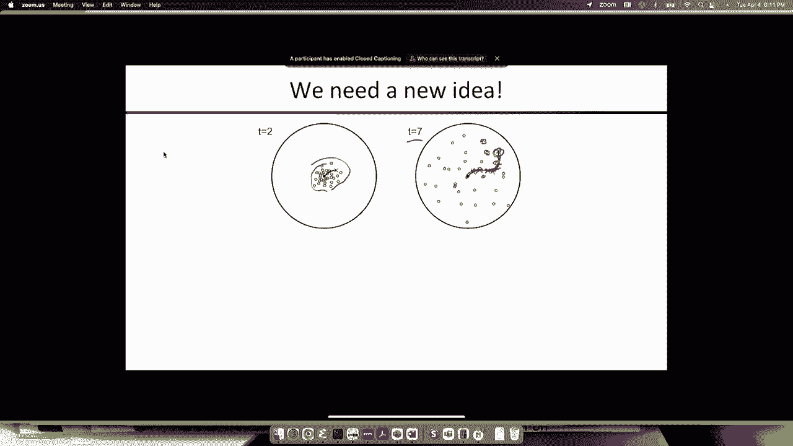

粒子滤波器已成为机器人定位、视觉跟踪、金融建模等众多领域的核心算法，它为我们处理复杂、高维的时序推理问题提供了一个强大而实用的工具。