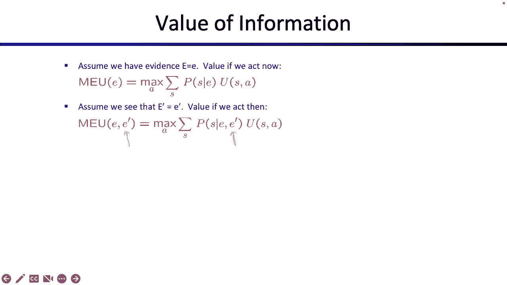

# 24：决策网络与信息价值

## 概述
在本节课中，我们将学习如何将概率推理与决策制定结合起来。我们将介绍决策网络的结构，学习如何在其中进行推理以最大化期望效用，并最终探讨“信息的价值”这一核心概念，即了解额外信息能为我们带来多少收益。

---

## 决策网络简介
上一节我们回顾了概率推理和效用最大化这两个独立的话题。本节中，我们来看看如何将它们结合在一个统一的框架中，即决策网络。

决策网络看起来很像贝叶斯网络，但增加了一些新的节点类型来代表决策和效用。

以下是决策网络中各种节点的含义：
*   **圆形节点（机会节点）**：代表随机变量。例如，`天气`和`预报`。你无法控制其结果，但可以基于概率分布进行推理。
*   **矩形节点（决策节点）**：代表你可以选择的行动。例如，`带伞`或`留伞`。与随机变量不同，行动由你完全控制，其下方没有概率分布。
*   **菱形节点（效用节点）**：代表最终的结果或得分（效用）。其值依赖于其父节点（例如行动和随机变量）的状态。对于父节点的每一种可能组合，都需要指定一个具体的效用值。

网络中的箭头表示条件依赖关系，类似于贝叶斯网络中的因果关系。

---

## 一个简单的决策故事
为了理解决策网络如何工作，我们来看一个关于机器人的简单例子。

故事背景是：一个机器人需要决定早上是否带伞。它的目标是尽可能快乐地玩耍（获得高效用）。结果取决于两个因素：它选择的行动（带伞/留伞）和实际的天气（晴天/雨天）。

以下是所有可能场景的效用：
*   留伞 & 晴天：可以玩机器人排球，非常快乐，效用为 **100**。
*   带伞 & 晴天：必须拖着伞，不能玩耍，效用为 **20**。
*   留伞 & 雨天：被雨淋湿，生锈短路，效用为 **0**。
*   带伞 & 雨天：保持干燥，比较快乐，效用为 **70**。

此外，我们知道先验概率：`P(天气=晴) = 0.7`，`P(天气=雨) = 0.3`。

---

## 在决策网络中推理：最大化期望效用
我们的目标是选择能最大化期望效用的行动。期望效用是对所有可能结果按其发生概率加权后的平均效用。

首先，我们计算每个行动的期望效用（EU）。

**计算行动“留伞”的期望效用：**
如果我们选择“留伞”，有两种可能结果：
1.  天气晴（概率0.7），获得效用100。
2.  天气雨（概率0.3），获得效用0。
因此，期望效用为：`EU(留伞) = 0.7 * 100 + 0.3 * 0 = 70`

**计算行动“带伞”的期望效用：**
如果我们选择“带伞”，也有两种可能结果：
1.  天气晴（概率0.7），获得效用20。
2.  天气雨（概率0.3），获得效用70。
因此，期望效用为：`EU(带伞) = 0.7 * 20 + 0.3 * 70 = 14 + 21 = 35`

现在，我们比较这两个值。由于我们可以自由选择行动，我们会选择能带来更高期望效用的那个。这就是**最大期望效用（MEU）**。

在当前没有任何额外证据（记为空集 `∅`）的情况下，最大期望效用是：
`MEU(∅) = max( EU(留伞), EU(带伞) ) = max(70, 35) = 70`
最优行动是“留伞”。

**符号说明：**
*   `EU(a | e)`：在已知证据 `e` 的条件下，采取行动 `a` 的期望效用。
*   `MEU(e)`：在已知证据 `e` 的条件下，所有可能行动中的最大期望效用。括号内是你当前掌握的信息。

---

## 引入证据：预报的作用
现在，我们让故事变得更现实一些。机器人早上会听天气预报，预报可能为“好”或“坏”。预报的准确度并非完美，它与真实天气有概率关联。

假设机器人听到预报是“坏”。这改变了我们对天气的信念。通过贝叶斯网络推理（例如使用贝叶斯规则或变量消除），我们可以得到新的条件概率：
`P(天气=晴 | 预报=坏) = 0.34`
`P(天气=雨 | 预报=坏) = 0.66`

现在，我们基于新的证据重新计算期望效用。

**已知预报=坏，计算行动“留伞”的期望效用：**
`EU(留伞 | 预报=坏) = 0.34 * 100 + 0.66 * 0 = 34`

**已知预报=坏，计算行动“带伞”的期望效用：**
`EU(带伞 | 预报=坏) = 0.34 * 20 + 0.66 * 70 = 6.8 + 46.2 = 53`

因此，在已知预报坏的情况下，最大期望效用为：
`MEU(预报=坏) = max(34, 53) = 53`
最优行动变成了“带伞”。

可以看到，获得新证据（预报）不仅改变了我们可能获得的分数（从70降到53），也可能改变最优决策本身。

---

## 信息的价值
直觉上，获取信息（如天气预报）应该能帮助我们做出更好的决策，从而获得更高的期望效用。信息的价值（Value of Perfect Information, VPI）就是衡量“拥有该信息”与“没有该信息”时期望效用提升的多少。

### 概念公式
信息 `E'` 的价值公式如下：
`VPI(E' | e) = ( Σ_{e'} P(E'=e' | e) * MEU(e, E'=e') ) - MEU(e)`

其中：
*   `e` 是当前已掌握的证据。
*   `E'` 是那个将被揭示的随机变量（例如 `预报`）。
*   `e'` 是 `E'` 的具体取值（例如“好”或“坏”）。
*   `MEU(e, E'=e')` 是已知当前证据 `e` 且额外知道 `E'=e'` 时的最大期望效用。
*   `MEU(e)` 是仅已知当前证据 `e` 时的最大期望效用。

### 计算示例：回到天气预报
假设我们最初没有任何证据（`e = ∅`）。有人提出要告诉我们 `预报` 的真实值（好或坏），我们需要计算这个信息的价值。

1.  **计算 `MEU(∅)`**：如前所述，`MEU(∅) = 70`。
2.  **计算知道预报后的期望MEU**：我们需要分别计算预报为好和坏时的MEU，然后按预报的先验概率取期望。
    *   已知 `预报=好` 时的 `MEU`（计算过程略）：假设为 **95**。
    *   已知 `预报=坏` 时的 `MEU`：如前所述，为 **53**。
    *   预报的先验概率（从贝叶斯网得出）：假设 `P(预报=好)=0.8`，`P(预报=坏)=0.2`。
    *   因此，知道预报后的期望MEU为：`0.8 * 95 + 0.2 * 53 = 76 + 10.6 = 86.6`
3.  **计算VPI**：
    `VPI(预报 | ∅) = 期望MEU(知道预报) - MEU(不知道预报) = 86.6 - 70 = 16.6`

这意味着，平均而言，获得天气预报这项信息能让机器人的期望效用提升 **16.6**。这也是机器人愿意为获取该信息支付的“公平价格”。

**关键点**：在计算 `VPI` 时，因为提供信息者并没有承诺揭示的结果具体是什么（例如，保证预报是好消息），所以我们必须在所有可能的结果（预报好/坏）上，对 `MEU` 再取一次期望。

---

## 总结
本节课中我们一起学习了决策网络与信息价值。

1.  **决策网络** 融合了贝叶斯网络（用于概率推理）和决策/效用节点（用于行动选择），为我们提供了一个对不确定性世界进行建模和决策的框架。
2.  **核心推理任务** 是计算最大期望效用（`MEU`），即选择那个能带来最高平均效用的行动。计算涉及在行动上取最大值，并在未知的随机变量结果上取期望值。
3.  **信息的价值（VPI）** 量化了获取额外信息所能带来的期望效用增益。其计算方式是：`[已知信息后的期望MEU]` 减去 `[未知信息时的MEU]`。其中，`已知信息后的期望MEU` 需要对被揭示变量的所有可能结果进行加权平均。

通过理解这些概念，你可以系统地分析在不确定性下如何做出最优决策，并评估获取更多信息是否值得。