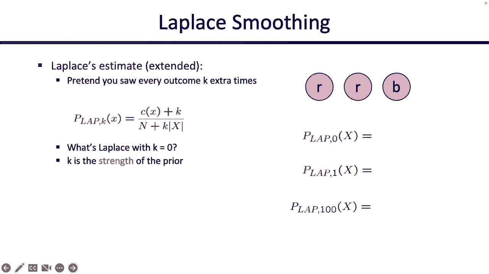

# 25：机器学习：朴素贝叶斯 🧠

在本节课中，我们将要学习机器学习的基础知识，特别是朴素贝叶斯分类器。我们将了解如何从数据中构建模型，而不是直接使用给定的模型。课程将涵盖分类任务的基本框架、朴素贝叶斯模型的构建与训练过程，以及如何利用该模型对新数据进行预测。我们还将探讨机器学习中一个关键概念——过拟合，并学习如何通过划分数据集来评估模型的泛化能力。

---

## 什么是机器学习？🤔

到目前为止，在这门课程中，总是有人走到你面前，递给你一个模型。例如，他们会说：“这是一个搜索问题，给我一个算法来解决它。”或者“这是一个填写了概率的贝叶斯网络。告诉我如何在其中进行推理。”总会有人给你一个模型，然后你以某种方式使用该模型进行计算并从中学习。

但机器学习的情况有所不同。现在，不再是有人给你模型并告诉你如何处理它，而是需要你自己构建模型。我们将从今天开始看到这一点，并在接下来的课程中了解更多。我们不再是被动接受一个贝叶斯网络并求解，而是思考这个贝叶斯网络本身是如何构建的。或者，如果使用更复杂的机器学习算法，如何利用手头的数据构建模型。这就是机器学习与之前讨论内容的不同之处。

今天，我们将通过一个基于贝叶斯网络的机器学习算法（朴素贝叶斯）来了解一个小例子，并在接下来的课程中逐步扩展。

---

## 分类任务：机器学习的目标 🎯

就像我们讨论搜索时有经典的搜索问题示例，讨论MDP时有网格世界示例一样，机器学习也有一个贯穿始终的示例，即**分类**。这是许多机器学习算法的目标。

我们的目标如下：我们有一个包含许多不同数据点的世界，每个数据点 `X` 都有一个标签 `Y`。标签或类别是什么？我们会展示一些例子。目标是设计一个算法，它接收一个标签未知的输入 `X`，并能够预测其标签 `Y`。

人们通常这样做（这不是唯一的方法，但今天我们将看到这种方法）：首先从输入 `X` 中提取一些**特征**。特征是关于输入 `X` 的一些有用信息，可能为输出 `Y` 提供线索。然后，将这些特征输入某个机器学习算法（今天只介绍一种），最终输出一个预测的标签。这就是我们想要设计的一般目标。

---

## 机器学习如何工作？⚙️

到目前为止，我们所做的是获取别人给我们的数字，然后处理这些数字并得出一些结论。例如，在贝叶斯网络中，我们利用给定的概率进行计算。

但在机器学习中，不同之处在于，我们不是通过自己编写的算法或自己的知识来生成智能或发现有用的东西，而是**直接从数据中尝试发现智能模式**。我们不会自己推理数据，而是希望有人给我们一堆**训练数据**。训练数据可能是许多带有标签的示例数据点。然后，利用这些训练数据，我们尝试进行预测或学习一些模式，以帮助我们在未来进行预测。

---

## 示例：垃圾邮件过滤器 📧

这是最经典的例子，已经使用了大约20年，至今仍然很常见。当你使用电子邮件时，你不会看到很多垃圾邮件，这是因为有垃圾邮件过滤器在工作。

在这种情况下，输入 `x` 是一封电子邮件。有人给你一封电子邮件，要求你将其分类为两个标签或类别之一：**垃圾邮件**或**非垃圾邮件**（在垃圾邮件分类领域，非垃圾邮件通常被称为“火腿邮件”）。

你需要从电子邮件中提取一些特征，这些特征可能告诉你关于这封电子邮件的一些有用信息，从而为你判断它是火腿邮件还是垃圾邮件提供线索。然后，通过机器学习算法，判断它是火腿邮件还是垃圾邮件。

机器学习算法的特殊之处在于，理论上你可以说：“我是垃圾邮件检测专家。我确切地知道什么对应垃圾邮件，什么对应火腿邮件。我将利用我所有的人类知识，写下所有规则，生成我的专家算法。”这很好，但这不是机器学习。在这种情况下，是你自己在学习。

机器学习之所以特殊，是因为**你不是在学习，而是让算法为你学习垃圾邮件和火腿邮件的模式**。你将获取所有这些训练数据（训练数据是一堆示例电子邮件，可能告诉你这封是垃圾邮件，那封是火腿邮件），并尝试基于这些训练数据学习垃圾邮件和火腿邮件的模式。

这就像你为考试而学习。有人给你很多训练数据，就像已经为你解答的练习题，你知道答案。你研究它们，试图找出其中的模式。这就是你在学习。然后，当你认为自己准备好了，你走进考场，参加期末考试。有人给你一个从未见过的新问题（一封新电子邮件），你的任务是利用之前学到的所有模式来判断它是火腿邮件还是垃圾邮件。这就是我们的目标。

---

## 如何手动判断垃圾邮件？🔍

假设你是CS188的垃圾邮件检测器，让我们一起检测一些垃圾邮件。

阅读以下邮件：
*   “尊敬的先生，首先，我对这笔交易充满信心。由于其性质，这完全是机密和绝密的。” 你认为这是垃圾邮件还是火腿邮件？它看起来很重要，是“绝密”。但它是垃圾邮件。
*   “要从未来的邮件列表中删除，只需回复此消息，并在主题中注明‘删除’。9900万个电子邮件地址仅售99美元。” 这是火腿邮件还是垃圾邮件？这看起来是个好交易。它是垃圾邮件。

问题是你怎么知道这是垃圾邮件？你怎么知道它不是火腿邮件？你从这封电子邮件中提取了一些有用的特征和模式，这些特征和模式告诉你它是否是火腿邮件或垃圾邮件。也许这些特征包括：你看到了“免费”这个词，感觉像是广告（垃圾邮件）；或者你看到了全大写字母，觉得可疑；或者你看到了美元符号，感觉有人在向你推销东西。

你在大脑中自动完成了这个过程。但我们希望以某种方式将其自动化并归纳出来。今天的目标就是将你刚才所做的过程自动化成算法。你不会写下你所知道的关于火腿邮件和垃圾邮件的规则，而是希望获取一堆训练数据，将其输入某个机器学习算法。算法将在数据上进行训练，学习关于垃圾邮件和火腿邮件的模式（例如，这个特征指示垃圾邮件，那个特征指示火腿邮件）。最终，你可以参加“期末考试”，将事物分类为火腿邮件或垃圾邮件。

---

## 另一个示例：数字识别 🔢

有人给你一张图片（一堆像素），告诉你网格中哪些像素被填充，并问你这个人写的是哪个数字（0到9）。同样，你有训练数据。你不会去学习“1看起来像这样，2看起来像那样”的模式并写下来（虽然可以，但那不是机器学习）。相反，你希望利用别人提供给你的数据（如何获取这些数据更多是数据科学问题，我们不详细讨论），这些数据是手工标记的数字。你希望从这些数字中自动学习模式，例如，“这看起来像2，那看起来像3”。你希望自动完成这个过程，而不是手动编写规则。

这样，当有人给你一个新的、从未见过的数字图片时，你就能判断出它是哪个数字。这就是模式：有人给你一堆数据，你在数据上训练以自动学习模式，然后当需要测试时，有人给你一个新的、未见过的数据，你应该能够对其进行分类。

在训练过程中，通常不是直接处理数据本身，而是从数据中提取特征，然后在特征上进行训练。例如，不是逐个像素查看，而是查看有趣的特征，如图片中是否有环、是否是圆形或线条等。

---

## 朴素贝叶斯模型 🏗️

我们今天要学习的算法叫做**朴素贝叶斯**。它基于贝叶斯网络，因此看起来会有些熟悉。其思想是构建一个模型，即某种贝叶斯网络。在这个贝叶斯网络中，我们将有一些关于特征和输出的信息。然后，我们将使用这个贝叶斯网络，根据提供给我们的证据（即输入）来预测我们认为的输出（标签）。

但存在一些问题：我应该如何绘制这个贝叶斯网络？我们知道贝叶斯网络内部隐藏着数字（概率表）。这些数字从哪里来？这些都是我们在构建模型时需要回答的问题。

以下是模型的结构：

**什么是贝叶斯网络？** 贝叶斯网络包含许多随机变量。当我们不知道某事或对其有概率分布时，就将其设为随机变量。

在我们的分类问题中，哪些可以是随机变量？
*   **标签 `Y`** 是一个随机变量，因为我们不知道它的值。它可能是垃圾邮件，也可能是火腿邮件。
*   其他随机变量是**特征**。这些是从数据集中提取的特征。正如之前所说，有人为我们提供了一些训练数据的输入 `X`，我们提取特征。特征如何提取？已经有人为我们完成了。所以，别人已经挑选了有趣的特征并为我们提取出来。我们只需将这些特征作为证据或节点输入。

看看这个贝叶斯网络。我们知道贝叶斯网络内部有概率表。这个贝叶斯网络内部隐藏着哪些概率表？

贝叶斯网络总是有描述随机变量给定其父节点的表。
*   查看 `Y` 节点内部，你会看到 `P(Y)`。`P(Y)` 是关于有多少电子邮件是垃圾邮件或火腿邮件的分布。它描述了电子邮件是垃圾邮件或火腿邮件的普遍程度。在朴素贝叶斯中，我们必须以某种方式找出 `P(Y)`。
*   还有 `P(F1|Y)`、`P(F2|Y)` 等。这些是告诉我们特征如何随标签变化的表。如果你知道标签，特征的分布是什么？这个特征在垃圾邮件中是否更可能出现？这些表隐藏在我们不知道具体数字的贝叶斯网络中，但我们将通过训练从数据中找出它们。

---

## 机器学习的两步过程：训练与分类 🔄

正如之前所说，机器学习通常是一个两步过程。

**第一步是训练**。这就像为考试而学习。我们需要获取别人给我们的数据。他们给我们很多特征到标签的映射（例如，这个特征对应垃圾邮件，这个输入有这些特征是火腿邮件等）。我们需要研究这些数据。在朴素贝叶斯模型中，这意味着我们将使用别人给我们的数据来填充那些概率表。在没有任何知识的情况下，我们不知道概率表中有什么。但如果有人给我们数据，我们可以使用数据来估计概率表可能是什么。我们希望这些估计能够编码关于特征及其与标签关系的有趣模式。

我们获取数据集，深入研究，根据数据找出可以放入这些表的最佳概率。我们估计 `P(Y)` 和 `P(F|Y)`（这告诉我们标签如何影响特征）。这就是训练部分，就像你在学习、学习、再学习。最终，你在数据集上完成了学习，对自己的学习感到满意，并认为：“我认为我了解了模式。我理解了垃圾邮件和火腿邮件。”这样，你的自动化算法就学到了关于垃圾邮件或火腿邮件的一些东西，并隐藏在这个贝叶斯网络中。它学到了什么？我不知道。它学到了有用的东西吗？希望如此。但你没有告诉这个算法任何关于垃圾邮件或火腿邮件的事情。这个算法必须根据给定的训练数据自己找出模式。

**第二步是分类（测试）**。当你完成学习后，你认为自己已经准备好参加期末考试。这意味着你准备好向世界发布你的分类器。当你发布分类器后，有人走到你面前，给你一封全新的、从未见过的电子邮件。你提取这封电子邮件的特征（已经有人为我们完成）。然后，将这些特征作为证据。现在，我们需要做的就是进行**贝叶斯网络推理**。贝叶斯网络推理告诉我们，给定这个贝叶斯网络，我们可以从中提取概率分布。

我们特别想要查询的分布是：`P(标签 | 证据)`。这听起来是一个非常合理的查询，我们可以用它进行分类。使用这个模型，有人给我们证据，我们将所有特征作为证据填入，然后询问模型：“给定这些证据，它是垃圾邮件的可能性有多大？或者给定这些证据，它是火腿邮件的可能性有多大？”通过这个查询，我们以某种方式对这个未知数据进行了分类。我们希望这是一个好的分类。

---

## 朴素贝叶斯实战：训练与分类示例 📊

假设我们选择使用朴素贝叶斯。这意味着我们将绘制一个看起来像上面那样的贝叶斯网络：有一个标签 `Y`，以及一堆特征，所有特征都是标签的结果（箭头从标签指向所有特征）。在这个例子中，我们选择两个特征。

同样，我们如何选择这些特征？今天暂不讨论。目前假设有人已经告诉我们特征是什么。他们告诉我们应该使用的特征，我们不知道这些特征与火腿邮件或垃圾邮件的关系，只知道这些可能是提供线索的有用特征。

我们有两个特征：
1.  **F1：我认识发件人吗？**（是/否）。我可以查看电子邮件，编写一小段代码来提取这个特征。
2.  **F2：电子邮件中“免费”这个词出现了多少次？**（一个数字）。同样，我可以编写一小段代码来计算“免费”一词出现的次数并提取特征。

当有人给我一个输入 `X`（无论是让我分类还是用于训练），我都可以从中提取特征。今天我们不担心如何提取，假设已经有人为我们提取了这些特征。我们的任务是自动从这些特征中学习模式。

以下是隐藏在贝叶斯网络中的表：
*   `P(Y)`：告诉我们，在没有任何证据的情况下，每个标签的普遍程度。我们需要从数据中学习。
*   `P(F1|Y)`：隐藏在 `F1` 节点中的表。它告诉你对于 `F1` 和 `Y` 的每一种设置，`F1` 给定 `Y` 的概率。我们不知道里面是什么，需要学习。
*   `P(F2|Y)`：类似，需要学习。

### 训练过程

现在，我们使用数据进行训练。别人给我们这些标记的电子邮件数据。使用这个训练数据，我们应该能够给出这些概率表的最佳估计。

我们想要 `P(F2|Y)`，例如 `P(F2=0次免费 | Y=火腿邮件)`。我如何知道这个数字？我可以从数据中估计。给定我的电子邮件是火腿邮件（即这两封），我看到“免费”出现0次的频率是多少？有两封火腿邮件，其中一封“免费”出现0次。所以，我对这个概率的最佳估计是0.5。我是怎么做的？我只是统计了我的数据。

根据这些数据，如果我知道某物是火腿邮件，那么50%的情况下，“免费”一词出现0次。这是一个好的估计吗？这取决于我的数据，但这就是我的估计。继续这样做：给定电子邮件是火腿邮件，“免费”一词恰好出现一次的频率是多少？这发生在第二封电子邮件中，所以是0.5。给定电子邮件是火腿邮件，“免费”一词出现两次的频率是多少？根据这个数据集，是0（我从未见过火腿邮件中“免费”出现两次的情况）。

对于垃圾邮件也可以这样做：给定电子邮件是垃圾邮件，“免费”出现0次的频率是多少？四封垃圾邮件中有一封是这样的，所以是1/4。出现一次呢？我看到两次（第三和第五封邮件）。出现两次呢？0.25。

我是如何得到这些数字的？我只是进行了一些统计，没有什么特别复杂的。通过统计，我进行了训练。这些数字现在编码了关于垃圾邮件模式以及它们如何影响“免费”一词出现次数特征的信息。我不必自己指定，也从未说过“当你看到‘免费’时，应该想到垃圾邮件”。我所要做的就是查看数据，从数据中计算一些数字，并希望数据自动给我一些关于标签如何影响“免费”一词出现频率的模式。

这是一个非常小的数据集（只有6封电子邮件）。你可以想象在更多数据上进行训练。假设我在更多数据上进行了训练，并给出了一些更准确的数字。

以下是基于更大数据集训练后的模型参数：
*   `P(Y)`：60%的电子邮件是火腿邮件，40%是垃圾邮件。
*   `P(F1|Y)`：如果电子邮件是火腿邮件，我认识发件人的概率是70%；如果电子邮件是垃圾邮件，我认识发件人的概率是10%。这感觉很正常：如果电子邮件是垃圾邮件，我可能不认识发件人；如果是火腿邮件，我可能认识。我不必用英语写下这些，而是从数据中学到的。这就是机器学习的魔力。
*   `P(F2|Y)`：类似地从数据中估计得到。

### 分类过程

现在我们已经训练完毕，准备好参加“考试”并对未见过的数据进行分类。

有人给你这封全新的电子邮件：“今天在Soda Hall有免费食物和饮料。”（假设你真的收到了这封电子邮件，你想知道它是垃圾邮件还是火腿邮件。）

首先，你从中提取特征（同样，今天不讨论如何提取，假设已经完成）。你查看电子邮件，发现你认识发件人（`F1 = 是`）。然后你计算“免费”一词出现的次数，在这个例子中是1次（`F2 = 1`）。

现在，我们需要做的就是执行推理。我们想估计给定证据下是火腿邮件和垃圾邮件的概率：`P(火腿邮件 | 证据)` 和 `P(垃圾邮件 | 证据)`。

这纯粹是一个贝叶斯网络推理问题，没有更多的机器学习。你只需要计算联合概率（通过枚举进行推理）。如何计算联合概率？将贝叶斯网络的所有部分相乘。

贝叶斯网络的组成部分是：`P(F1|Y)`、`P(F2|Y)` 和 `P(Y)`。将这三部分相乘，就得到整个联合分布。如何知道这些值？根据证据查表，得到数字。

这告诉我，在所有可能的电子邮件世界中，收到一封垃圾邮件且发件人我认识、“免费”一词出现一次的概率是某个值；收到一封火腿邮件且发件人我认识、“免费”一词出现一次的概率是另一个值。

但我不想要联合分布，我想要条件概率 `P(垃圾邮件 | 证据)` 和 `P(火腿邮件 | 证据)`。记得我们讨论过的归一化技巧吗？应用这个技巧，你会发现给定这些证据，是垃圾邮件的概率是14%，是火腿邮件的概率是86%。

因此，你的分类器现在可以告诉你：“我有86%的把握认为这不是垃圾邮件，14%的把握认为是垃圾邮件。”或者，如果你只需要一个猜测（火腿邮件还是垃圾邮件），你可以说，因为86% > 14%，所以我认为它是火腿邮件。

这真的很酷，即使我从未真正思考过这些特征，也从未问过你“免费”是否指示垃圾邮件或火腿邮件。你所要做的就是获取数据，从数据中学习数字，然后有人给你这封从未见过的新电子邮件（它不在训练数据中）。这个简单的小模型能够给出一个相当不错的猜测，认为这封电子邮件是火腿邮件。它实际上是火腿邮件吗？我不知道，但它似乎做了一个相当自信的猜测。

---

## 扩展到其他问题：数字识别与词袋模型 🔢📦

朴素贝叶斯模型不仅可用于垃圾邮件过滤，还可用于其他问题，如数字识别。

在数字识别中，模型是相同的：有一个你不知道的标签 `Y`（这里是0到9的数字）。和之前一样，你有一堆特征。特征是什么取决于为你提取特征的人。特征可以是直观的（如“免费”出现次数），也可以是非常基本的。有时，即使特征非常基础，朴素贝叶斯也能工作得很好。

一个非常基本的、无需计算的特征可以是：这个像素是亮还是暗？这个像素是亮还是暗？这些特征没有直观意义，但你仍然可以用它们来学习模式。

在数字识别的例子中，我们选择将特征作为像素的亮暗。我提取特征：像素(0,0)是暗，像素(0,1)是暗，像素(0,2)是亮，等等。每个特征节点对应一个我可能知道也可能