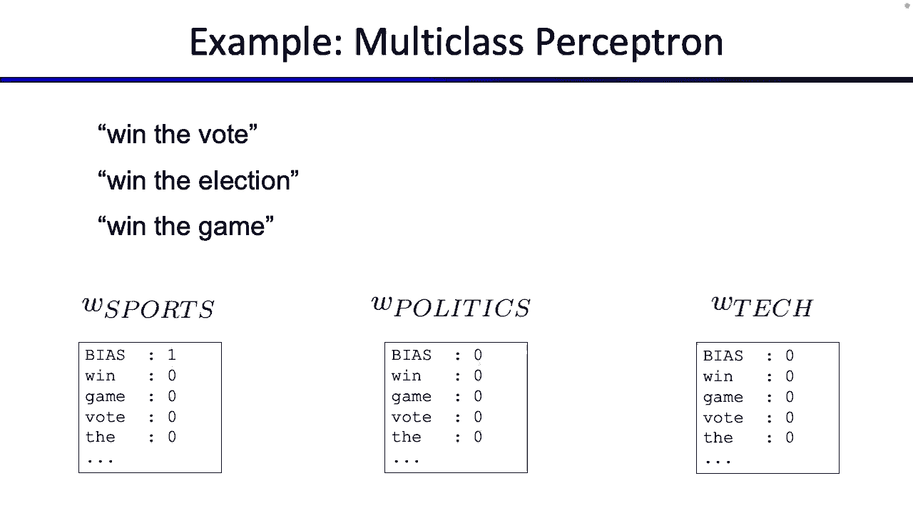

# 26：机器学习算法 - 感知机 🧠

在本节课中，我们将学习第二种机器学习算法——感知机。我们将从回顾朴素贝叶斯中的过拟合问题及其解决方案开始，然后深入探讨感知机的原理、几何与代数解释、训练方法，以及如何将其扩展到多分类问题。

---

## 回顾：过拟合与平滑

上一节我们讨论了泛化与过拟合，这是机器学习中的一个核心主题。过拟合意味着模型过于“记住”了训练数据中的特定模式，而这些模式并不能很好地推广到未见过的数据上。

例如，在垃圾邮件分类中，如果训练数据里“Southwest”这个词只出现在正常邮件（ham）中，朴素贝叶斯模型可能会学到“只要看到‘Southwest’就一定是正常邮件”的规则。这虽然能在训练数据上获得高准确率，但无法泛化到新的邮件中。

为了解决这个问题，我们引入了**平滑**技术，特别是拉普拉斯平滑。其核心思想是：在计算概率时，为每个可能的事件（即使未在训练数据中出现）都“假装”我们已经看到过它K次。

**公式**：
`P_laplace(event) = (count(event) + K) / (total_count + K * num_possible_events)`

其中，K是一个超参数。K越大，概率分布越趋向于均匀分布，对训练数据的“信任”就越低。K=0则对应无平滑的最大似然估计。

**关键点**：
*   **超参数**：K不是从数据中学到的，而是需要手动调整的“旋钮”。
*   **数据集划分**：为了选择最佳的K，我们需要将数据分为三部分：
    1.  **训练集**：用于学习模型参数。
    2.  **验证集**：用于调整超参数（如K），模拟测试数据。
    3.  **测试集**：仅在最终评估模型性能时使用，绝不能用于训练或调参。

---

## 感知机：基本概念

现在，我们转向今天的核心内容——感知机。感知机是一种受生物学神经元启发的线性分类模型。

**模型流程**：
1.  输入一个数据点 `X`（如一封邮件）。
2.  通过特征函数 `f` 将其转换为特征向量 `f(X)`，这是一个实数向量。
3.  感知机算法接收特征向量，并输出一个分类标签 `Y`（如“垃圾邮件”或“正常邮件”）。

感知机的核心是一个**权重向量** `W`。分类决策非常简单：计算特征向量 `f(X)` 和权重向量 `W` 的点积（内积），然后根据点积的符号进行判断。

**分类规则**：
`prediction = sign(W · f(X))`
*   如果 `W · f(X) >= 0`，则预测为正类（例如，垃圾邮件）。
*   如果 `W · f(X) < 0`，则预测为负类（例如，正常邮件）。

**直观理解**：权重 `W` 中的每个值代表对应特征对分类的“贡献”方向和强度。正权重表示该特征倾向于正类，负权重表示倾向于负类。

---

## 感知机的几何视角

为了更好地理解感知机，我们可以从几何角度来审视它。特征向量和权重向量都可以被视为高维空间中的点或箭头。

**向量视角**：
*   权重向量 `W` 是高维空间中的一个方向。
*   分类规则等价于：计算特征向量 `f(X)` 与 `W` 之间的夹角 θ。
*   如果夹角 θ < 90°，则点积为正，预测为正类。
*   如果夹角 θ > 90°，则点积为负，预测为负类。
*   因此，`W` 定义了一个“决策边界”（一个与 `W` 垂直的超平面），将空间分为两个半区。

**点视角**：
*   每个训练样本的特征向量可以画成高维空间中的一个点。
*   权重向量 `W` 定义了决策边界（一条线、一个平面或超平面），其方程为 `W · f(X) = 0`。
*   所有落在边界一侧的点被预测为正类，另一侧的点被预测为负类。

这两种视角是等价的，都能帮助我们直观理解感知机如何做出决策。

---

## 训练感知机：感知机学习算法

我们知道了如何使用给定的权重 `W` 进行分类，但关键问题是如何从训练数据中学习出这个 `W`。这就是感知机学习算法的目标。

**算法流程**：
1.  初始化权重向量 `W`（例如，全部设为0）。
2.  遍历训练数据（可以多次遍历）：
    a.  对于每个带标签的样本 `(X, Y_true)`，计算其特征向量 `f(X)`。
    b.  使用当前 `W` 做出预测：`Y_pred = sign(W · f(X))`。
    c.  **如果预测正确**（`Y_pred == Y_true`），则保持 `W` 不变。
    d.  **如果预测错误**：
        i.  若本应为正类但预测为负类（`Y_true = +1， Y_pred = -1`）：将 `W` 向 `f(X)` 靠近。更新规则：`W_new = W_old + f(X)`。
        ii. 若本应为负类但预测为正类（`Y_true = -1， Y_pred = +1`）：将 `W` 远离 `f(X)`。更新规则：`W_new = W_old - f(X)`。

**几何解释**：更新规则实际上是在旋转权重向量 `W`。当预测错误时，我们将 `W` 向正确类别的方向旋转（通过加上特征向量），或从错误类别的方向旋离（通过减去特征向量）。

**代数解释**：可以通过点积的性质证明，加上 `f(X)` 会使 `W · f(X)` 的值增加，减去 `f(X)` 会使该值减少，从而在下一次对同一数据点分类时，更可能得到正确结果。

**算法终止**：如果训练数据是**线性可分**的（即存在一个超平面能完美分开所有正负样本），那么感知机算法保证会在有限步内收敛到一个解。否则，算法可能不会终止，通常我们会设置一个最大迭代次数。

---

## 扩展到多分类问题

感知机可以很容易地扩展到处理两个以上的类别。

**多分类感知机**：
*   为每个类别 `c` 维护一个独立的权重向量 `W_c`。
*   **分类时**：对于一个输入 `X`，计算其特征向量 `f(X)` 与每个类别权重向量 `W_c` 的点积。预测结果为点积最高的那个类别。`Y_pred = argmax_c (W_c · f(X))`。
*   **训练时**：
    1.  对于训练样本 `(X, Y_true)`，用当前所有权重向量进行预测，得到 `Y_pred`。
    2.  如果预测正确，不更新任何权重。
    3.  如果预测错误（`Y_pred != Y_true`）：
        *   **降低错误类别的分数**：更新错误预测类别的权重向量，使其远离当前样本的特征向量：`W_Y_pred = W_Y_pred - f(X)`。
        *   **提高正确类别的分数**：更新真实类别的权重向量，使其靠近当前样本的特征向量：`W_Y_true = W_Y_true + f(X)`。

**几何解释**：这相当于在向量空间中，为每个类别划分出一个区域。训练过程就是调整各个类别的权重向量（即调整这些区域的边界），使得每个样本的特征向量都离其真实类别的权重向量最近。

---

## 总结

本节课我们一起学习了感知机这一重要的线性分类模型。

**核心要点**：
1.  **模型**：感知机通过计算权重向量与特征向量的点积，并根据符号进行分类，是一个简单的线性分类器。
2.  **几何理解**：权重向量定义了决策边界。训练过程可视作调整这个边界，以正确划分训练数据点。
3.  **训练算法**：感知机学习算法通过迭代和错误驱动的更新规则（`W = W ± f(X)`）来学习权重。它在数据线性可分时保证收敛。
4.  **多分类**：通过“一对多”策略，为每个类别维护一个权重向量，选择点积最大的类别作为预测结果。
5.  **与朴素贝叶斯对比**：感知机是一种**判别式模型**，直接学习决策边界；而朴素贝叶斯是一种**生成式模型**，学习数据的概率分布。

感知机是神经网络和支持向量机等更复杂模型的基础。虽然简单，但其核心思想——通过特征加权求和进行决策，以及错误驱动的在线学习——在机器学习中影响深远。下一节课，我们将探讨如何为感知机等模型设计和选择有效的特征。