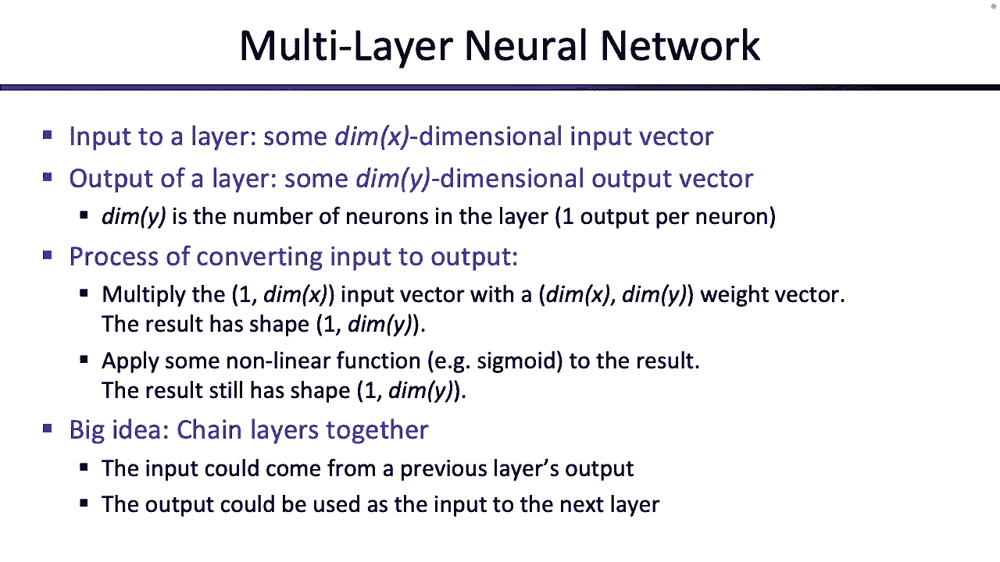

# 27：机器学习：神经网络 🧠

## 概述
在本节课中，我们将学习神经网络的基础知识。我们将从感知器开始，探讨其局限性，然后引入逻辑回归来解决这些问题。接着，我们会将多个感知器连接起来，构建出神经网络的基本结构，并了解其背后的数学原理和优化方法。最后，我们会看到如何将神经网络推广到更复杂的结构。

---

## 感知器及其局限性

上一节我们回顾了感知器的基本概念。本节中，我们来看看感知器存在的一些问题。

感知器接收一个输入向量 **x**，计算其与权重向量 **w** 的点积 **z = w · x**。如果 **z > 0**，则预测为正类（+1）；如果 **z < 0**，则预测为负类（-1）。

**公式**：
`预测 = sign(w · x)`

感知器有两个很好的性质：
1.  **可分性**：如果数据是线性可分的，感知器最终能找到那条分界线。
2.  **收敛性**：对于线性可分数据，感知器会在有限步内收敛。

然而，感知器也存在以下问题：
1.  **不可分数据**：当数据无法用一条直线完全分开时，感知器会永远运行，无法停止。
2.  **解的质量**：即使数据可分，感知器找到的分界线可能不是“最好”的（例如，离某些点太近，泛化能力差）。
3.  **过拟合**：与所有机器学习模型一样，训练过度可能导致过拟合。

为了解决这些问题，特别是处理不可分数据和得到更“好”的解，我们需要对感知器进行改进。

---

## 从确定性到概率性决策 🔀

上一节我们指出了感知器在不可分数据上的困境。本节中，我们来看看如何通过引入概率决策来解决它。

核心思想是：我们不希望分类器仅仅输出“是正类”或“是负类”，而是希望它输出“是正类的概率”。这样，对于靠近边界的点，分类器可以表示其不确定性（例如，55%的概率是正类）。

在确定性感知器中，我们使用阶跃函数将点积 **z** 映射为0或1。为了实现概率输出，我们需要一个能将实数 **z** 平滑地映射到 (0, 1) 区间的函数。

我们使用 **Sigmoid函数**（或称逻辑函数）：

**公式**：
`σ(z) = 1 / (1 + e^{-z})`

这个函数的性质符合我们的需求：
*   当 **z** 为正且很大时，`σ(z)` 接近 1（高置信度为正类）。
*   当 **z** 为负且很小时，`σ(z)` 接近 0（高置信度为负类）。
*   当 **z = 0** 时，`σ(z) = 0.5**（完全不确定）。

于是，我们的分类过程变为：计算 `P(正类 | x) = σ(w · x)`。

**示例**：
假设 `w · x = 5`。
*   确定性感知器：输出 +1。
*   概率性感知器：计算 `σ(5) ≈ 0.993`，表示有 99.3% 的概率是正类。

这种使用 Sigmoid 函数进行概率预测的模型，就是 **逻辑回归**。

---

## 训练逻辑回归模型 🏋️

上一节我们学会了如何使用逻辑回归进行分类。本节中，我们来看看如何训练它，即如何找到最优的权重 **w**。

训练的目标是：找到一组权重 **w**，使得我们观察到的训练数据出现的 **概率最大**。这称为 **最大似然估计**。

对于单个数据点 `(x_i, y_i)`，其出现的概率是：
*   如果 `y_i = +1`（正类）：`P = σ(w · x_i)`
*   如果 `y_i = -1`（负类）：`P = 1 - σ(w · x_i) = σ(-w · x_i)` （利用Sigmoid性质）

对于整个训练集 `D`，其出现的 **似然函数** 是所有数据点概率的乘积。为了计算方便，我们通常取其对数，得到 **对数似然函数** `L(w)`。

**公式**（二分类逻辑回归的对数似然）：
`L(w) = Σ_{i} [ y_i * log(σ(w · x_i)) + (1 - y_i) * log(1 - σ(w · x_i)) ]`

我们的训练目标就是找到使 `L(w)` 最大的 **w**：
`w* = argmax_w L(w)`

这变成了一个纯粹的 **优化问题**。我们可以通过求导并令其为零（解析解）或使用 **梯度上升** 等数值方法来求解。

**示例（简化）**：
假设有三个训练点 `(2,1, +1)`, `(1,1, +1)`, `(0,-1, -1)`。我们的对数似然函数 `L(w1, w2)` 将是一个关于 `w1`, `w2` 的复杂表达式。训练就是寻找使这个表达式值最大的 `(w1, w2)`。

---

## 扩展到多分类问题 🎯

上一节我们处理了二分类问题。本节中，我们来看看如何将其扩展到多个类别。

对于 K 个类别的分类，我们为每个类别 `k` 准备一个权重向量 **w_k**。对于输入 **x**，我们计算 K 个“分数”：`z_k = w_k · x`。

在确定性多类感知器中，我们直接选择分数最高的类别作为预测结果。

为了得到概率输出，我们使用 **Softmax函数**。它将 K 个实数分数转换成一个概率分布。

**公式**（Softmax）：
`P(类别 k | x) = e^{z_k} / Σ_{j=1}^{K} e^{z_j}`

Softmax 的性质：
*   所有输出的概率之和为 1。
*   分数 `z_k` 越高，对应的概率 `P(k)` 也越高。
*   分数 `z_k` 越低（越负），对应的概率 `P(k)` 越接近 0。

**示例**：
假设三个类别的分数为 `z = [5, 6, -2]`。
*   确定性预测：选择第2类（分数6最高）。
*   Softmax预测：计算 `P = [e^5, e^6, e^{-2}] / (e^5+e^6+e^{-2}) ≈ [0.267, 0.730, 0.003]`。模型以73%的概率预测第2类，但也认为有26.7%的可能性是第1类。

训练多类逻辑回归同样采用最大似然估计，目标函数形式类似，只是将 Sigmoid 替换为 Softmax。

---

## 优化基础：梯度上升 ⛰️

上一节我们将训练问题归结为优化问题。本节中，我们来看看解决这类优化问题的核心方法——梯度上升。

我们的目标是最大化函数 `g(w)`（例如对数似然函数）。在一维情况下，我们可以通过求导并检查导数的正负来决定移动方向。

在高维空间（`w` 是向量），我们有无限多个移动方向。此时，**梯度** 指明了函数值增长最陡峭的方向。

**梯度** 是一个向量，其每个分量是函数 `g(w)` 对对应权重分量的偏导数。

**公式**（梯度）：
`∇g(w) = [ ∂g/∂w1, ∂g/∂w2, ..., ∂g/∂wd ]^T`

**梯度上升** 的更新规则是沿着梯度方向前进一小步：

**公式**（梯度上升更新）：
`w_{new} = w_{old} + α * ∇g(w_{old})`

其中 `α` 是 **学习率**，控制每一步的大小。

**随机梯度上升** 是一种变体，它每次只使用一个训练数据点来计算梯度并更新权重，而不是使用全部数据求和。这种方法计算更快，常用于大数据集。
**小批量梯度上升** 则是折中方案，每次使用一小批（batch）数据。

---

## 构建神经网络 🧱

上一节我们掌握了优化方法。本节中，我们利用这些基础构件来搭建神经网络。

核心思想：与其手动设计特征，不如让模型自己从数据中学习特征。神经网络通过将多个“神经元”（改进的感知器）连接起来实现这一点。

一个基本的神经元（以Sigmoid激活为例）：
1.  接收输入向量 **x**。
2.  计算加权和 `z = w · x`。
3.  应用激活函数 `h = σ(z)`，输出一个值。

最简单的神经网络是将神经元分层连接：
*   **输入层**：原始特征 `x`。
*   **隐藏层**：第一层神经元。每个神经元学习输入特征的某种组合，输出一个新的“学习到的特征” `h_j`。所有 `h_j` 构成特征向量 **h**。
*   **输出层**：最后一个神经元（或多个，对应多分类）。它以隐藏层的输出 **h** 作为输入，进行最终预测 `y = σ(w_output · h)`。

**示例（单隐藏层网络）**：
输入 `x = [x1, x2, x3]`。
隐藏层有两个神经元，权重矩阵为 **W_h**（尺寸 3x2），输出 `h = σ(W_h^T x)`（`h` 是2维向量）。
输出层有一个神经元，权重向量为 **w_o**（尺寸 2x1），最终输出 `y = σ(w_o^T h)`。

我们可以用矩阵形式简洁地表示前向传播过程：
`h = σ(W_h^T x)`
`y = σ(w_o^T h)`

---

## 神经网络的泛化与深度化 🏗️

上一节我们构建了一个简单的两层网络。本节中，我们来看看如何将其泛化和加深，形成强大的深度学习模型。

我们可以从多个方面对简单网络进行扩展：

1.  **改变每层的神经元数量**：隐藏层可以有任意多个神经元（例如 `n` 个），输出层也可以有多个神经元（对应多分类，例如 `dim_y` 个）。
2.  **改变输入维度**：输入 `x` 可以是任意维度（`dim_x`）。
3.  **增加网络深度**：我们可以添加更多的隐藏层。前一层的输出作为后一层的输入。

一个通用的 **L层全连接神经网络** 的前向传播可以描述为：

设第 `l` 层的权重矩阵为 **W^(l)**，输入为 **a^(l-1)**，输出为 **a^(l)**。
**公式**（第 `l` 层计算）：
`z^(l) = (W^(l))^T a^(l-1)`
`a^(l) = σ(z^(l))`
其中 `a^(0) = x`（输入），`a^(L) = y`（输出）。

网络的设计变成了维度的匹配游戏。例如，若 `a^(l-1)` 的维度是 `d_{in}`，我们希望该层输出维度为 `d_{out}`，则权重矩阵 **W^(l)** 的尺寸应为 `d_{in} x d_{out}`。

网络越深、越宽，其学习复杂模式和特征的能力就越强，这也构成了现代深度学习（如图像识别、自然语言处理）的基础。训练如此复杂的网络，其核心仍然是我们在前面介绍的 **梯度下降/反向传播** 算法（由于时间关系，反向传播的细节将在后续课程中深入讲解）。

---

## 总结
本节课中我们一起学习了：
1.  **感知器的局限性**：无法处理不可分数据，且解的质量无法保证。
2.  **逻辑回归**：通过引入 Sigmoid 函数，将感知器改进为输出概率的模型，并使用最大似然估计进行训练。
3.  **多分类扩展**：使用 Softmax 函数将逻辑回归推广到多类别场景。
4.  **优化方法**：将训练问题转化为优化问题，并介绍了梯度上升这一核心求解算法。
5.  **神经网络构建**：通过连接多个神经元（感知器），构建了能够自动学习特征的基本神经网络结构。
6.  **网络的泛化与深化**：了解了如何通过增加层数、神经元数量来构建更强大、更通用的深度神经网络框架。

神经网络是当前许多人工智能突破性进展的引擎。理解其从感知器演变而来的基本思想、概率解释以及优化训练方式，是深入学习现代机器学习的关键第一步。