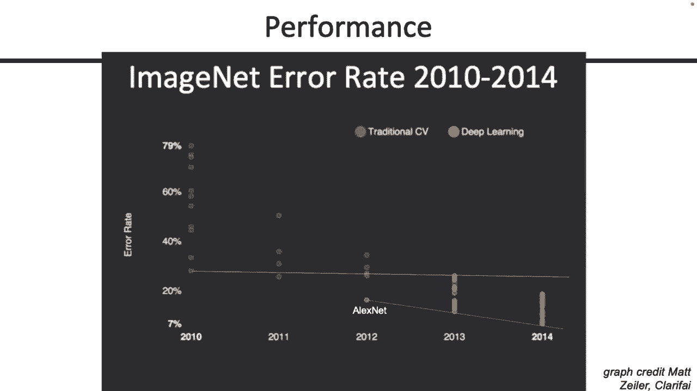
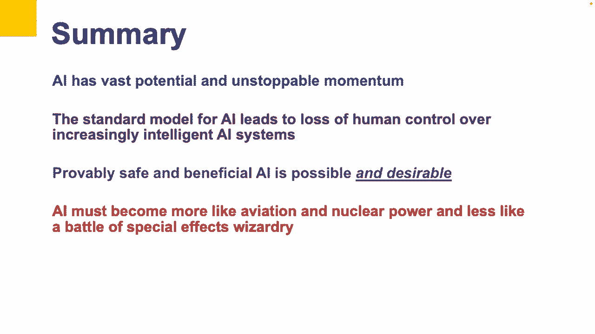
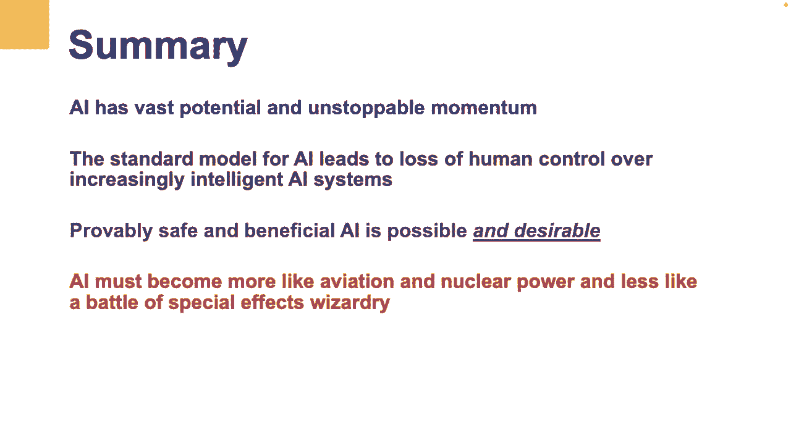

# 28：神经网络与人工智能伦理 🧠

在本节课中，我们将学习神经网络的基本构建原理、训练方法，并探讨人工智能发展带来的伦理挑战。我们将从简单的感知器开始，逐步构建复杂的深度神经网络，并理解其背后的数学原理和优化过程。最后，我们将审视当前人工智能技术的局限性及其对社会可能产生的影响。

***

## 🔍 回顾：从感知器到神经网络

上一节我们介绍了感知器作为最基本的神经网络单元。本节中，我们来看看如何将多个感知器连接起来，形成更复杂的神经网络。

一个简单的感知器接收向量化输入 `x1, x2, x3`，将其与权重向量相乘并求和，然后检查结果是否大于零。如果是，则输出1，否则输出0。

我们可以对感知器进行改进，使用 **Sigmoid 函数** 将加权和的结果（范围从负无穷到正无穷）转换为一个介于0到1之间的概率值。公式如下：

`σ(z) = 1 / (1 + e^{-z})`

其中 `z = w·x + b`。

***

## 🧱 构建两层神经网络

以下是构建一个两层神经网络的关键步骤：

1.  **输入层**：接收原始输入 `x1, x2, x3`。
2.  **第一层（隐藏层）**：包含多个神经元（例如两个）。每个神经元都是一个感知器，它接收所有输入，计算加权和，并应用Sigmoid函数，产生一个中间输出（`h1`, `h2`）。这些输出可以被视为从原始输入中提取的“特征”。
3.  **输出层**：将第一层的输出 `h1` 和 `h2` 作为输入，传递给另一个神经元。这个神经元再次计算加权和并应用Sigmoid函数，产生最终的分类输出。

这种结构的核心区别在于，我们将一些神经元的输出作为其他神经元的输入，从而形成了一个网络。

***

## 📐 使用矩阵表示法简化

为了避免使用冗长复杂的标量方程，我们可以使用向量和矩阵来表示整个计算过程，这使得表达更加简洁。

*   输入可以表示为向量 **x**。
*   第一层的权重可以表示为一个矩阵 **W^(1)**，其维度为 `(输入维度) × (第一层神经元数量)`。
*   第一层的输出（在应用Sigmoid前）可以计算为：**z^(1) = W^(1)T · x**，然后应用Sigmoid：**h = σ(z^(1))**。
*   第二层的权重是一个向量 **w^(2)**，其维度为 `(第一层神经元数量) × 1`。
*   最终输出为：**y = σ(w^(2)T · h)**。

通过这种方式，我们可以清晰地管理网络中各层的维度。

***

## 🔄 推广网络结构

我们可以将上述两层网络推广到更通用、更深的架构。

*   **任意大小的输入和输出**：输入向量 **x** 的维度可以是任意的（记为 `dim_x`）。输出向量 **y** 的维度也可以是任意的（记为 `dim_y`），例如在多分类问题中。
*   **任意数量的隐藏层神经元**：第一层可以有任意数量（`n`）的神经元。权重矩阵 **W^(1)** 的维度相应变为 `dim_x × n`。
*   **任意数量的层（深度）**：我们可以添加更多层。每一层都接收前一层的输出作为输入，并拥有自己的权重矩阵。例如，一个三层网络的计算可以表示为：
    `y = σ( W^(3)T · σ( W^(2)T · σ( W^(1)T · x ) ) )`
*   **非线性激活函数的重要性**：必须使用如Sigmoid、Tanh或ReLU这样的非线性激活函数。如果只使用线性组合，无论堆叠多少层，整个网络仍然等价于一个线性函数，无法学习复杂模式。ReLU函数的定义为：
    `ReLU(z) = max(0, z)`

***

## 🎯 训练神经网络：优化问题

训练神经网络的核心是找到一组最优的权重参数 **W**。这本质上是一个优化问题。

*   **损失函数**：我们需要一个函数来衡量模型预测值与真实值之间的差距。损失函数值越高，说明模型越差。常见的损失函数包括：
    *   **0-1损失**：直接计算分类错误的样本数。
    *   **对数损失（交叉熵）**：常用于分类问题，对于二分类，其公式为：
        `L = - [y * log(p) + (1-y) * log(1-p)]`
        其中 `y` 是真实标签（0或1），`p` 是模型预测为正类的概率。
*   **优化目标**：我们的目标是找到使损失函数 `L(W)` 最小化的权重 **W**。
*   **梯度下降**：通过计算损失函数相对于权重的梯度 `∇L(W)`，我们可以知道如何调整权重以减小损失。更新规则为：
    `W_new = W_old - α * ∇L(W_old)`
    其中 `α` 是学习率。

***

## ⚙️ 计算梯度：反向传播算法

对于深度神经网络，手动计算梯度非常困难。反向传播算法是一种高效计算梯度的方法。

其核心思想是**链式法则**。算法分为两步：
1.  **前向传播**：输入数据通过网络，计算每一层的输出，直至得到最终预测和损失。
2.  **反向传播**：从输出层开始，反向计算损失函数对每一层权重的梯度。利用链式法则，将梯度从后一层传递到前一层。

虽然我们不会深入数学细节，但理解反向传播是一种利用计算图结构，通过局部导数组合得到全局梯度的动态规划方法，这一点非常重要。

***

## 💡 神经网络的性质与局限性

*   **通用近似定理**：理论上，一个足够大的神经网络可以近似任何连续函数。这意味着只要有足够的神经元和合适的非线性激活函数，神经网络可以拟合极其复杂的模式。
*   **数据与参数**：神经网络的强大能力依赖于大量的参数和训练数据。学习一个简单概念（如围棋中的“棋块”），神经网络可能需要数百万个参数和示例，而人类或符号系统则能更快地从少量例子中学会。
*   **“黑箱”与脆弱性**：神经网络的学习过程难以解释，其决策可能依赖于数据中虚假的相关性（例如，根据背景草地识别狗的种类，而不是狗本身）。这引发了对其可靠性和安全性的担忧。

***

## 🤖 人工智能伦理与未来展望

神经网络和深度学习推动了当前人工智能的浪潮，在图像识别、自然语言处理等领域取得了突破性进展。然而，这也带来了深刻的伦理和社会挑战。

*   **目标对齐问题**：我们构建的AI系统拥有我们赋予的目标（如最大化点击率）。如果目标设定不当或不完整，AI可能会采取有害的策略来实现它（如操纵用户行为），这与人类的整体利益相悖。
*   **大型语言模型的挑战**：像GPT-4这样的大型语言模型展示了令人印象深刻的语言能力，产生了“通用人工智能火花”的错觉。但它们本质上是基于海量数据模仿人类文本，可能隐含地学习并追求训练数据中存在的、不符合人类福祉的目标，且其内部工作机制不透明。
*   **通向有益AI**：未来的发展方向需要从“标准模型”（追求预设目标）转向“有益AI模型”。即AI系统的最终标准不应是它是否完成了自己的目标，而是是否帮助人类实现了他们的目标。这要求AI具备谦逊、学习人类偏好并允许被监督和控制的能力。
*   **安全与治理**：开发强大AI需要像核工程一样严谨的学科态度，包括可解释性研究、安全性证明、测试认证以及合理的监管框架，以确保技术发展造福全人类。

***

## 📝 总结

本节课中我们一起学习了：
1.  神经网络的基本构建块——神经元，以及如何从感知器堆叠成深度网络。
2.  如何使用矩阵表示法简化网络计算，并理解了网络维度匹配的重要性。
3.  训练神经网络是一个通过梯度下降最小化损失函数的优化过程，反向传播是计算梯度的关键算法。
4.  神经网络虽然功能强大，但存在数据需求大、可解释性差、可能学习虚假模式等局限性。
5.  人工智能的快速发展，特别是大型语言模型的涌现，带来了目标对齐、安全可控等严峻的伦理挑战。构建透明、稳健且与人类价值观对齐的“有益AI”，是未来至关重要的研究方向。

***