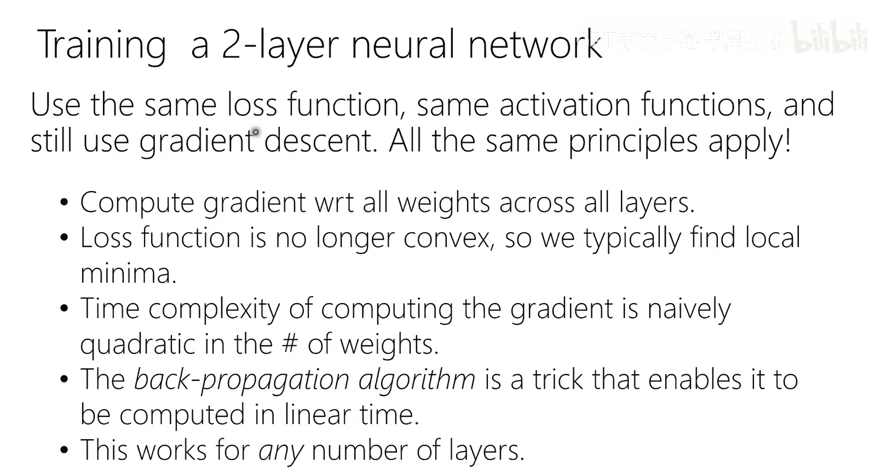

# 1：课程介绍与安排 🎓

在本节课中，我们将学习课程的基本安排、机器学习的基本概念以及一个简单的分类问题示例。课程将涵盖从数据表示到模型训练和评估的全过程。

---

## 课程安排与政策 📋

课程已满员，无法容纳更多学生。任何未在正式座位就座的人员必须离开教室，以避免违反消防规定并导致高额罚款。课程的所有材料，包括视频和幻灯片，都将在课程网站上提供。只有注册的学生才能通过B课程访问作业和考试的答案。

讨论课将线下进行。考试必须亲自参加，且不提供补考。课程评分由期末考试（45%）、期中考试（35%）和作业（20%）组成。共有七次作业，允许放弃两次最低分。如果作业得分达到80%，则该次作业计为满分。

鼓励学生以2-5人的小组形式讨论作业，但禁止互相查看最终答案。严禁抄袭和作弊，包括使用往届作业答案。所有课程相关问题应通过Ed论坛公开提问。

课程材料包括讲座幻灯片和Chris Bishop的《模式识别与机器学习》教材。相关章节将作为阅读材料发布，以巩固学习内容。

---

## 机器学习概述 🤖

机器学习问题无处不在。例如，识别图像中的手写数字、检测医学影像中的肿瘤、过滤垃圾邮件、预测蛋白质结构或股票价格。这些问题主要分为几类：

*   **分类**：预测离散的类别标签，例如判断一张图片是否是数字“7”。
*   **回归**：预测连续的实数值，例如预测血压。
*   **排序**：预测项目的相对顺序，例如网络搜索引擎的结果排序。
*   **无监督学习**：没有对应标签，目标是学习数据本身的分布，例如大型语言模型对网络文本的建模。

前三种属于**监督学习**，即我们有输入数据和对应的输出标签。无监督学习则没有这样的标签。

---

## 一个简单的分类示例 🔢

我们将以著名的MNIST手写数字数据集为例。每个数字图像是28x28的灰度像素矩阵，可以“展平”成一个784维的**特征向量**。

假设我们只区分数字“7”和非“7”。在训练阶段，我们使用带有标签（“7”或“非7”）的数据来训练一个分类器。在测试阶段，我们使用未参与训练的数据来评估模型的性能。此外，在实际部署模型时，我们会使用所有可用数据重新训练模型，并将其应用于未知的新数据。

我们可以将高维特征向量在二维平面上示意。红色点代表“7”，蓝色点代表“非“7”。一种简单的分类思路是找到一条直线（**决策边界**），尽可能地将两类点分开，这类似于**逻辑回归**的思想。

另一种简单的方法是**最近邻**分类：对于一个新点，将其类别预测为训练数据中离它最近的点的类别。使用更多邻居（K近邻）并进行投票，可以得到更平滑的决策边界。

然而，数据可能无法用一条直线完美分开。例如，正例点分布在一个圆盘内，而负例点分布在圆盘外。在这种情况下，线性分类器效果不佳。

解决这个问题的一种方法是进行**特征变换**或**基扩展**。例如，除了原始特征x1和x2，我们还可以加入新特征如x1²、x2²和x1*x2。在这个新的高维特征空间中，数据可能变得线性可分。**神经网络**的核心思想之一就是自动学习这种有效的特征表示。

---

## 神经网络简介 🧠

神经网络可以看作是多个简单函数（如逻辑回归单元）的堆叠组合。

一个最简单的单层神经网络单元接收输入特征向量，计算其与参数向量的内积，然后通过一个**非线性激活函数**（如Sigmoid函数）产生输出。Sigmoid函数的输出在0到1之间，可以解释为属于某个类别的概率。

通过堆叠这样的层，就形成了**深度神经网络**。每一层的输入是前一层的输出。这种结构被称为**前馈网络**。

训练神经网络需要定义一个**损失函数**，用于衡量模型预测与真实标签之间的差异。常见的损失函数包括交叉熵损失，它与统计学中的**最大似然估计**原理相通。

我们通过**优化**算法来寻找使损失函数最小化的模型参数。最常用的方法是**梯度下降**：计算损失函数关于参数的梯度，然后沿着梯度的反方向以小步长更新参数，逐步降低损失。

将以上步骤整合：准备训练数据，定义网络架构和损失函数，然后使用梯度下降法迭代优化参数，最终得到训练好的模型。

---

## 总结 📝

本节课我们一起学习了课程的基本安排和机器学习的基础概念。我们了解了监督学习中的分类、回归等问题，并通过一个手写数字分类的例子，直观感受了从数据表示、模型构建（如线性分类器、最近邻、神经网络）到模型训练与评估的完整流程。我们还初步认识了神经网络的核心组成和训练原理。在接下来的课程中，我们将深入探讨这些概念背后的数学原理和实现细节。