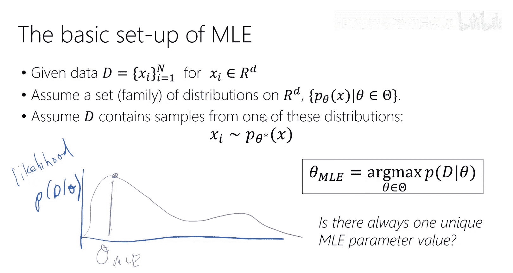
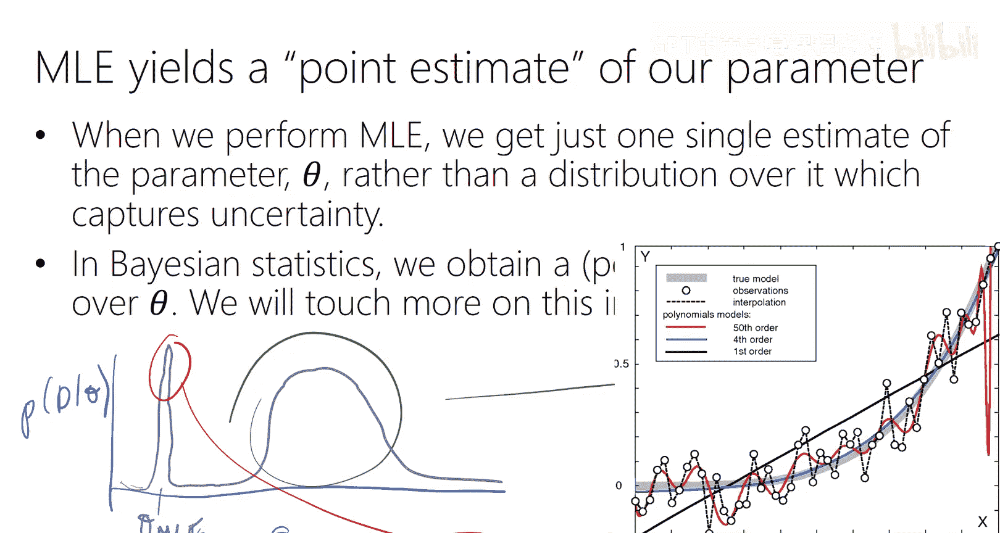

# 2：最大似然估计

在本节课中，我们将学习机器学习与统计学中的一个核心概念：**最大似然估计**。这是一种为统计模型寻找最优参数的方法，构成了许多现代机器学习算法的基础。

上一节我们介绍了机器学习的基本框架，包括模型、参数和损失函数。本节中，我们将深入探讨如何通过最大似然估计来定义并优化这个损失函数。

## 模型与参数

在监督式学习中，我们有一个训练数据集 **D**，包含 **n** 个样本。每个样本由输入特征 **x_i**（例如，一张展平后的图像像素向量）和对应的标签 **y_i** 组成。我们的目标是学习一个从特征空间到标签的映射。

为此，我们需要选择一个**模型族**或**假设类**。这是一个带有自由参数 **θ**（有时也写作 **w**）的函数形式。例如，一个线性分类器或一个高斯分布族。一旦我们固定了参数 **θ** 的值，就得到了该模型族中的一个具体模型实例。

## 最大似然估计原理

最大似然估计的核心思想是：**找到能使观测到的数据出现概率最大的参数值**。

我们假设数据集 **D** 中的样本是**独立同分布**的，即每个样本都从同一个由参数 **θ** 定义的分布中独立抽取。这个假设使得我们可以将整个数据集的联合概率分解为每个样本概率的乘积。

**似然函数** 定义为给定参数时数据的概率：**L(θ) = P(D | θ)**。由于 IID 假设，它可以写为：
**L(θ) = ∏_{i=1}^{n} P(x_i | θ)**

我们的目标是找到最大化这个似然函数的参数值：
**θ_MLE = argmax_θ L(θ)**

在实际操作中，我们通常最大化**对数似然函数**，因为求和比连乘更容易处理，且对数函数是单调的，不会改变最大值的位置：
**θ_MLE = argmax_θ log L(θ) = argmax_θ Σ_{i=1}^{n} log P(x_i | θ)**

这个对数似然函数就是我们的**损失函数**（有时取负号成为最小化问题）。通过优化它，我们可以“学习”或“估计”出模型参数。

## 示例：单变量高斯分布的最大似然估计

让我们通过一个具体例子来实践最大似然估计：估计单变量高斯分布的参数（均值 μ 和方差 σ²）。

假设我们有一组数据点 **{x_1, x_2, ..., x_n}**，例如一群人的身高测量值。我们假设这些数据点独立地从一个高斯分布 **N(μ, σ²)** 中抽取。

高斯分布的概率密度函数为：
**P(x | μ, σ²) = (1 / √(2πσ²)) * exp(-(x - μ)² / (2σ²))**

**第一步：写出似然函数**
根据 IID 假设，整个数据集的似然函数是每个数据点概率的乘积：
**L(μ, σ²) = ∏_{i=1}^{n} (1 / √(2πσ²)) * exp(-(x_i - μ)² / (2σ²))**

**第二步：转为对数似然函数**
取对数将乘积化为求和：
**log L(μ, σ²) = Σ_{i=1}^{n} [ -½ log(2πσ²) - (x_i - μ)² / (2σ²) ]**
**= - (n/2) log(2πσ²) - (1/(2σ²)) Σ_{i=1}^{n} (x_i - μ)²**

**第三步：对参数求导并令其为零**
我们分别对 μ 和 σ² 求偏导数，找到令导数为零的驻点。

*   **对 μ 求导：**
    **∂ log L / ∂μ = (1/σ²) Σ_{i=1}^{n} (x_i - μ)**
    令其等于零：
    **Σ_{i=1}^{n} (x_i - μ) = 0 => Σ_{i=1}^{n} x_i = nμ**
    解得：
    **μ_MLE = (1/n) Σ_{i=1}^{n} x_i**
    这正是数据的**样本均值**。

*   **对 σ² 求导（将 σ² 视为一个整体变量）：**
    经过求导和化简（过程略），并令导数为零，可得：
    **σ²_MLE = (1/n) Σ_{i=1}^{n} (x_i - μ_MLE)²**
    这正是数据的**样本方差**（注意，统计学中常使用 **1/(n-1)** 作为无偏估计，但在机器学习中，我们通常使用 MLE 得出的 **1/n** 版本）。

**第四步：验证其为最大值**
通过计算二阶导数（或海森矩阵）并验证其为负定，可以确认我们找到的驻点是最大值点。对于高斯分布，这个条件是满足的。

## 最大似然估计的性质与思考

最大似然估计拥有一些良好的理论性质：
*   **一致性**：如果数据确实来自假设的分布族，那么随着数据量增加，MLE 估计值会收敛到真实参数值。
*   **统计有效性**：在给定的数据量下，MLE 能高效地提取信息。
*   **参数化不变性**：如果对模型进行参数重整化（例如，用 `α = μ + 2` 代替 `μ`），虽然估计出的参数值会变，但最终的模型分布（即似然值）是不变的。

然而，也需要注意：
*   MLE 严重依赖于我们选择的**模型族**。如果模型假设错误，估计结果可能很差。
*   MLE 给出的是一个**点估计**，即单个最优参数值。有时，参数空间可能存在一个“宽而平”的高似然区域，相比一个“尖而陡”的峰值，前者可能更稳健。我们将在后续课程中讨论如何考虑参数的不确定性（如贝叶斯方法）或避免过拟合（如正则化）。

## 与机器学习的联系

在机器学习中，我们经常听到**交叉熵损失**。对于分类问题，最小化交叉熵损失等价于对模型输出的类别概率分布进行最大似然估计。同样，**均方误差损失**则等价于在高斯噪声假设下进行回归问题的最大似然估计。

因此，最大似然估计为许多常见的机器学习损失函数提供了概率论上的 justification。

---

本节课中我们一起学习了最大似然估计的基本原理，并通过单变量高斯分布的实例，一步步推导了其参数估计公式。我们了解到，MLE 的核心是最大化观测数据的概率，其结果是许多经典统计估计和现代机器学习损失函数的基础。下一节课，我们将探讨更复杂的模型与分布。