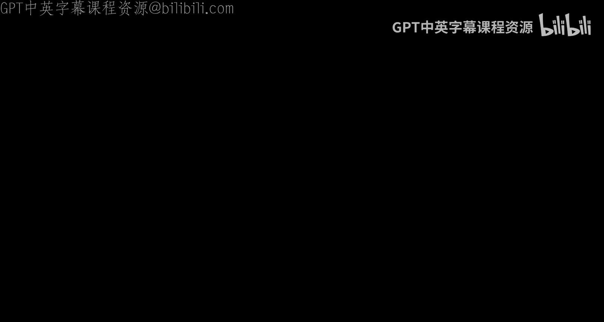
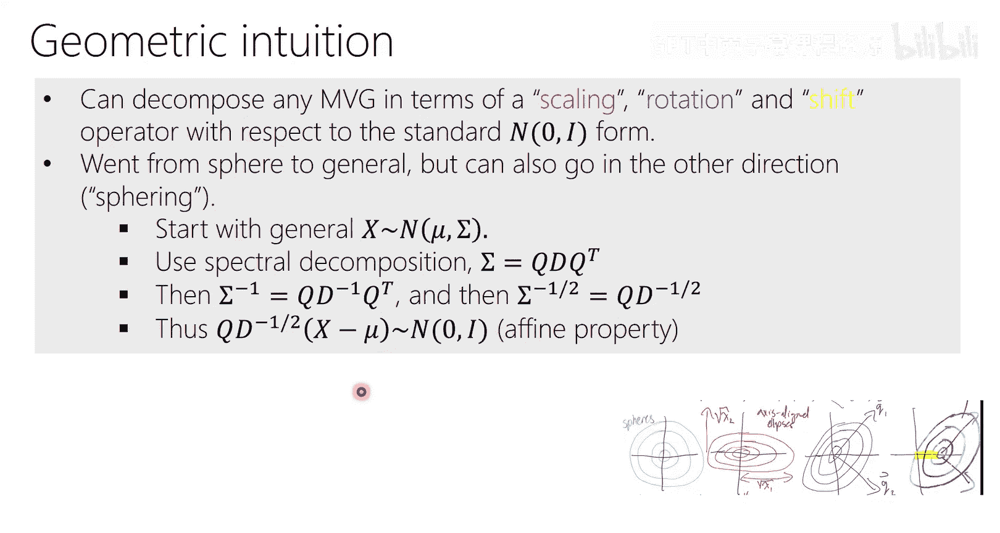

# 3：多元高斯分布 🧮





在本节课中，我们将要学习多元高斯分布。我们将从回顾最大似然估计的原理开始，然后深入探讨多元高斯分布的定义、几何直观、数学性质及其在机器学习中的重要性。我们将学习如何从几何角度理解协方差矩阵，以及如何通过线性变换（如缩放和旋转）来操作高斯分布。

---

## 最大似然估计回顾

上一节我们介绍了最大似然估计的原理，并将其应用于一元高斯分布。本节中，我们来看看如何将其应用于一个离散随机变量的例子——多项分布。

最大似然估计的目标是找到一组参数，使得观测数据的概率（似然）最大化。我们假设数据是独立同分布的，因此似然函数是每个数据点概率的乘积。

### 多项分布的最大似然估计

考虑一个六面骰子。每次投掷会以概率 `θ_k` 出现第 `k` 面（k=1,...,6）。我们的目标是通过 `n` 次独立投掷的观测结果，估计这些参数 `θ`。

首先，我们写出似然函数。由于每次投掷是独立的，`n` 次观测的联合概率是每次概率的乘积。我们可以使用一个技巧来简化表达式：统计每个面出现的次数 `N_k`。

**似然函数**可以写为：
```
L(θ) = ∏_{k=1}^{6} θ_k^{N_k}
```
其中，`N_k` 是第 `k` 面出现的次数，且 `∑_{k=1}^{6} N_k = n`。

然而，参数 `θ` 有一个约束：它们必须构成一个有效的概率分布，即 `∑_{k=1}^{6} θ_k = 1`。因此，我们的优化问题是一个带约束的最大化问题。

为了解决这个带等式约束的优化问题，我们使用**拉格朗日乘数法**。我们构造拉格朗日函数：
```
L(θ, λ) = ∑_{k=1}^{6} N_k log(θ_k) + λ (1 - ∑_{k=1}^{6} θ_k)
```

接下来，我们分别对拉格朗日乘子 `λ` 和每个参数 `θ_k` 求偏导数，并令其为零。

1.  **对 `λ` 求偏导**：得到约束条件 `∑ θ_k = 1`。
2.  **对 `θ_k` 求偏导**：得到 `N_k / θ_k - λ = 0`，即 `θ_k = N_k / λ`。

将 `θ_k = N_k / λ` 代入约束条件 `∑ θ_k = 1`，可以解出 `λ = n`。因此，最大似然估计为：
```
θ_k_hat = N_k / n
```
这个结果非常直观：第 `k` 面的概率估计值，就是该面在观测中出现的频率。

与高斯分布的案例一样，我们得到了参数的解析解。然而，对于更复杂的模型（如神经网络），我们通常无法获得闭式解，而必须使用迭代优化算法（如梯度下降）来最大化似然函数。

---

## 多元高斯分布介绍

现在，我们进入本节课的核心内容：多元高斯分布。一元高斯分布描述了一个标量随机变量，而多元高斯分布则描述了一个随机向量。

### 定义与公式

一个 `d` 维的多元高斯分布由均值向量 `μ` 和协方差矩阵 `Σ` 参数化。其概率密度函数为：
```
p(x | μ, Σ) = (1 / ((2π)^{d/2} |Σ|^{1/2})) * exp( -1/2 (x - μ)^T Σ^{-1} (x - μ) )
```
其中：
*   `x` 和 `μ` 是 `d` 维向量。
*   `Σ` 是一个 `d × d` 的对称正定矩阵，称为协方差矩阵。
*   `Σ^{-1}` 是 `Σ` 的逆矩阵，也称为精度矩阵。
*   `|Σ|` 是 `Σ` 的行列式。

这个分布在机器学习中无处不在，部分原因是中心极限定理，部分原因是其数学上的便利性。理解其几何直观对于掌握主成分分析、生成分类器等后续主题至关重要。

### 从一元到多元：联合分布的思考

假设我们有两个随机变量：身高和体重。各自都（近似）服从一元高斯分布。但我们想知道它们的联合分布。

如果我们绘制来自联合分布的样本点，它们会形成一个椭圆形的点云。这个椭圆的“中心”由两个变量的均值组成。描述这个点云的“展布”不再是一个标量方差，而需要协方差矩阵。

**协方差矩阵 `Σ`** 的对角线元素是各个变量的方差，非对角线元素是变量之间的协方差。对于二维情况：
```
Σ = [ Var(X)    Cov(X, Y) ]
    [ Cov(Y, X)  Var(Y)   ]
```
如果 `X` 和 `Y` 独立，则 `Cov(X, Y) = 0`，协方差矩阵是对角阵，数据点云是轴对齐的椭圆。如果它们相关，则非对角线元素不为零，椭圆是倾斜的。

一个关键性质是：**对于多元高斯分布，变量之间互不相关（协方差为零）与变量之间相互独立是等价的**。这个性质是高斯分布特有的，对于一般分布，不相关并不蕴含独立。

---

## 多元高斯的几何直观

理解多元高斯几何的关键在于观察其概率密度函数的等高线。

### 等高线与椭圆

如果我们固定概率密度函数为一个常数 `c`，即 `p(x) = c`，那么满足条件的 `x` 的集合由方程 `(x - μ)^T Σ^{-1} (x - μ) = constant` 决定。这是一个二次型方程，其解在二维空间中形成一个椭圆，在高维空间中形成一个椭球面。

因此，**协方差矩阵 `Σ` 本质上描述了这些椭球面的形状、方向和尺度**。

### 对角化与谱分解

如何理解一个倾斜的椭圆？我们可以通过线性变换将其变为轴对齐的椭圆。这对应于对协方差矩阵进行对角化。

根据谱定理，任何实对称矩阵 `Σ` 都可以分解为：
```
Σ = Q Λ Q^T
```
其中：
*   `Q` 是一个正交矩阵，其列向量是 `Σ` 的特征向量。`Q` 代表一个旋转。
*   `Λ` 是一个对角矩阵，其对角线元素是 `Σ` 的特征值。`Λ` 代表沿新坐标轴方向的缩放。

这个分解的几何意义非常强大：
1.  特征向量（`Q` 的列）指出了椭球主轴的方向。
2.  特征值（`Λ` 的对角元素）决定了沿各主轴方向的伸展程度。等高线椭球沿第 `i` 个主轴方向的“半径”与 `√(λ_i)` 成正比。

### 白化与仿射性质

基于谱分解，我们可以实现两个重要的操作：

1.  **白化**：将一个任意的多元高斯分布转化为标准高斯分布 `N(0, I)`。
    *   步骤：`z = Λ^{-1/2} Q^T (x - μ)`
    *   几何解释：先中心化（减去均值），再旋转（`Q^T` 将主轴对齐到坐标轴），最后缩放（`Λ^{-1/2}` 将各轴方差变为1）。

2.  **仿射性质**：这是操作高斯分布的核心工具。
    *   如果 `x ~ N(0, I)` 是标准高斯，那么 `y = A x + μ` 服从分布 `N(μ, A A^T)`。
    *   反之，如果 `y ~ N(μ, Σ)`，那么 `x = A^{-1} (y - μ)` 服从标准高斯，其中 `A` 是满足 `A A^T = Σ` 的矩阵（例如 `A = Q Λ^{1/2}`）。

**仿射性质的几何直观**：我们可以从标准高斯球出发，通过以下步骤得到任意高斯分布：
    a. **缩放**：用 `Λ^{1/2}` 沿坐标轴拉伸或压缩，得到轴对齐的椭圆。
    b. **旋转**：用 `Q` 旋转这个椭圆到任意方向。
    c. **平移**：加上均值 `μ`，将椭圆中心移动到指定位置。

这个过程完美地将协方差矩阵的数学定义（`Σ = A A^T`）与其几何含义（旋转加缩放）联系了起来。

---

## 总结

本节课中我们一起学习了：
1.  **最大似然估计在多项分布上的应用**，通过拉格朗日乘数法处理概率之和为1的约束，得到了频率即概率的直观估计。
2.  **多元高斯分布的定义和核心公式**，理解了其由均值向量和协方差矩阵参数化。
3.  **协方差矩阵的几何意义**：它定义了概率密度等高线椭球的方向和形状。特征向量指向主轴，特征值决定沿主轴的伸展程度。
4.  **谱分解的关键作用**：它将协方差矩阵分解为旋转（特征向量）和缩放（特征值），为理解高斯分布的几何形态提供了数学工具。
5.  **仿射性质**：这是连接标准高斯与任意高斯的桥梁，允许我们通过线性变换在分布间进行转换，是后续许多推导和算法的基础。



掌握多元高斯分布的这些基本概念和性质，将为学习线性判别分析、主成分分析、高斯过程等更高级的机器学习主题奠定坚实的基础。