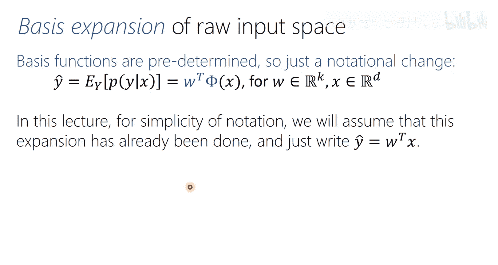
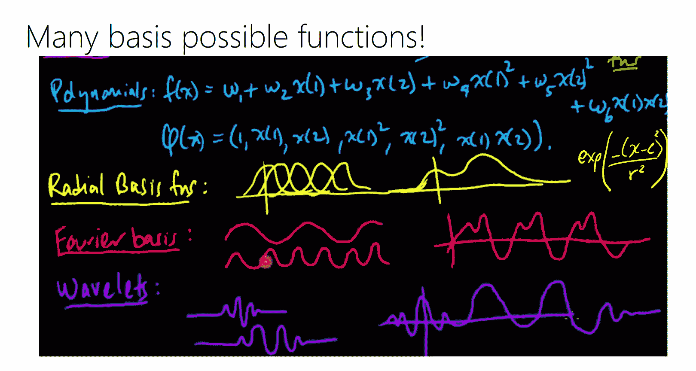
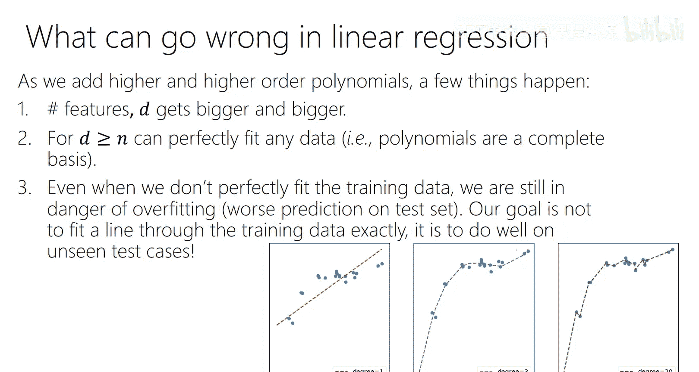

# 4：线性回归 1

## 概述
在本节课中，我们将学习线性回归。我们将利用前两节课学到的最大似然估计和高斯分布知识，来构建一个用于预测连续值标签的监督学习模型。我们将从概率统计的角度出发，理解线性回归的核心假设，并推导出其参数估计的解析解。

---

## 回归：监督学习的一种形式

回归是监督学习的一种形式。我们的数据是成对的 `(X, Y)`。`X` 是一个输入特征向量，`Y` 是一个输出。今天，我们主要考虑 `Y` 是实值标量的情况。特征 `X` 可以是离散的，也可以是连续的，我们在此不做假设。

在回归中，与分类不同，标签 `Y` 是实数值的。从形式上说，当我们说学习一个回归模型时，我们想要估计的是给定输入特征 `X` 时，目标标签 `Y` 的条件概率密度函数 `P(Y|X)`。这是一个关于随机变量 `Y` 的条件概率密度函数，对于 `X` 的每一个取值，都会得到一个不同的密度函数。

在回归中，我们通常考虑获得标签的一个点预测。也就是说，在模型训练完成后，给定一些特征，我们希望得到对 `Y` 的最佳估计或预测。如果我们已经估计出了条件概率分布 `P(Y|X)`，那么获得单点预测的方法就是计算 `Y` 相对于该分布的期望值，这将是目标标签正确值的最佳猜测。

我们将先思考这个期望值，然后再回到实际的概率分布。今天我们会涉及这两个概念。

---

## 线性回归的直观理解

每个人都见过线性回归。通常在二维示意图中，输入特征是 `x`，输出特征是 `y`。你会看到一些观测点 `(x, y)`，线性回归就像一条穿过这些点的“最佳拟合”直线。

当你将其视为一个统计模型时，实际上你考虑的是：对于 `x` 的每一个值，`y` 都有其自身的分布。例如，对于这个 `x` 值，`y` 的分布就像一个侧放的高斯分布。同样地，对于另一个 `x` 值也是如此。当我们讨论回归中的预测误差时，我们讨论的是一个观测值距离该高斯分布均值的距离，对于高斯分布来说，这个均值也是其期望值。

在这个模型中，每个 `x` 值都有其对应的 `y` 的均值。这个 `y` 的均值与另一个 `x` 值对应的 `y` 的均值是不同的。

---

## 获取条件概率密度的两种策略

我们的目标是估计条件概率密度 `P(Y|X)`。有不同的统计建模策略可以达到这个目的。

以下是两种主要策略：

1.  **生成式方法**：我可以假设 `X` 和 `Y` 的联合概率密度函数属于某一类分布（例如多元高斯分布）。虽然我关心的对象是条件密度，但通过使用最大似然估计等方法从数据中拟合出这个联合分布模型后，我可以利用概率规则，从这个联合分布中计算出所需的条件分布。具体来说，`P(Y|X) = P(X, Y) / P(X)`，而 `P(X)` 可以通过对联合分布 `P(X, Y)` 关于 `Y` 积分得到。

2.  **判别式方法**：我可以直接基于数据对 `(X, Y)` 来学习条件密度 `P(Y|X)`。例如，我可以假设对于每个 `X`，`Y` 的条件分布是一个高斯分布，然后拟合这些高斯分布的参数（即条件均值和方差）。在标准线性回归中，通常假设所有 `X` 对应的方差是相同的。

这两种策略的一个关键区别在于对 `X` 的假设。在生成式方法中，我必须对 `X` 的分布做出假设（例如，`X` 和 `Y` 是联合高斯的）。在判别式方法中，我不需要将 `X` 视为随机变量，也不需要对其分布做任何假设，我只需要对给定 `X` 时 `Y` 的分布做出假设。

直观上，如果我对 `X` 的分布一无所知，那么生成式方法可能不是一个好主意，因为我需要做出可能不正确的假设。此时，判别式方法更合适，因为它不对 `X` 的分布做任何假设。然而，如果我确实知道 `X` 和 `Y` 是联合高斯的，那么将这个知识融入到模型中（生成式方法）通常会使模型在估计参数时更高效，即用更少的数据达到相同的精度。

“生成式”这个术语源于，因为学习了 `X` 和 `Y` 的联合密度，原则上你可以从这个密度中采样，生成看起来像原始数据集的新数据。而判别式模型无法生成 `X`，因为它没有将 `X` 建模为随机变量。

今天线性回归的剩余部分将采用判别式方法。

---

## 线性回归模型

在线性回归中，预测（即预测分布的期望值）将是参数的线性函数。这就是“线性”在线性回归中的含义。任何参数以线性函数形式出现的模型都是线性回归模型。

例如，如果我的点预测（期望值）具有以下形式：
`ŷ = w₀ + w₁x₁ + w₂x₂ + ... + w_Dx_D`
其中 `w` 是参数向量，`x` 是输入特征向量，`w₀` 是偏置项或截距。

为了数学推导的简便，我们通常使用一个技巧：在原始特征向量 `x` 的末尾总是附加一个 `1`。这样，新的特征向量变为 `[x₁, x₂, ..., x_D, 1]`，参数向量变为 `[w₁, w₂, ..., w_D, w₀]`。于是，模型可以简洁地写为：
`ŷ = wᵀx`
其中 `w` 和 `x` 都已经是扩展后的向量。这样，偏置项 `w₀` 就被吸收到了参数向量中。

---

## 基函数扩展

线性回归的“线性”指的是参数 `w` 是线性的，而不是特征 `x`。这意味着我们可以对原始特征进行非线性变换，只要变换后的新特征与参数 `w` 的关系是线性的即可。这极大地增强了模型的表达能力。

这个过程称为**基函数扩展**。我们通过一个预定的函数 `φ` 将原始 `D` 维特征 `x` 映射到一个新的 `K` 维特征空间。
`φ(x): ℝᴰ → ℝᴷ`
然后，我们在新的特征空间 `φ(x)` 上进行线性回归。

常见的基函数扩展包括：
*   **多项式扩展**：添加原始特征的平方项、立方项以及交叉项。这允许模型拟合曲线。
*   **径向基函数**：基于到一组中心点的距离来构造特征。
*   **傅里叶基**：将信号（如图像）转换到频域。

基函数扩展的美妙之处在于，一旦我们完成了扩展，我们就得到了一组固定的新特征。之后，所有针对原始特征的线性回归方法都可以直接应用。这使我们能够用线性回归的简单性获得任意复杂的模型。

一个前瞻性的提示是，神经网络的一个强大之处在于，它不是在事先定义基函数，而是在学习过程中动态地学习有用的特征表示（可以看作是多层的基函数扩展），最后一层通常就是在这些学习到的特征上进行线性回归。

---

## 高斯线性回归与最大似然估计

在标准线性回归中，我们通常指的是**高斯线性回归**。这意味着我们假设条件分布 `P(Y|X)` 是一个高斯分布。具体来说，对于每个 `x`，`y` 的分布是一个高斯分布，并且所有 `x` 对应的方差 `σ²` 是相同的。

我们如何得到条件均值呢？我们让参数向量 `w` 与输入特征 `x` 做内积：
`μ = wᵀx`
这个标量 `μ` 就是给定 `x` 时 `y` 的条件均值。

我们可以等价地写成：
`y = wᵀx + ε`
其中 `ε` 是一个随机噪声项，服从均值为 `0`、方差为 `σ²` 的高斯分布：`ε ~ N(0, σ²)`。

移项后得到：
`y - wᵀx = ε ~ N(0, σ²)`
我们通常称 `y - ŷ` 为**残差**。在线性回归中，我们假设残差是高斯分布的。

为了拟合参数 `w` 和 `σ²`，我们将使用**最大似然估计**。

我们假设有 `N` 个独立同分布的数据点 `{(x_i, y_i)}`。条件似然函数为：
`L(w, σ²) = ∏_{i=1}^N P(y_i | x_i; w, σ²)`
代入高斯分布的概率密度函数并取对数，得到对数似然函数：
`log L(w, σ²) = ∑_{i=1}^N [ -1/2 log(2πσ²) - (y_i - wᵀx_i)²/(2σ²) ]`

如果我们只关心估计 `w`，可以忽略与 `w` 无关的项。最大化对数似然等价于最小化负对数似然。去掉常数项后，我们得到：
`argmin_w ∑_{i=1}^N (y_i - wᵀx_i)²`
这正是**最小二乘损失函数**，也称为均方误差。因此，最小二乘法自然地源于高斯线性回归的最大似然估计。

---

## 推导解析解

为了便于推导，我们将损失函数写成向量和矩阵形式。

定义：
*   `y`：一个 `N×1` 的向量，包含所有 `N` 个观测值 `y_i`。
*   `X`：**设计矩阵**，维度为 `N×D`。每一行对应一个数据点的特征向量 `x_iᵀ`（已包含偏置项对应的 `1`）。
*   `w`：`D×1` 的参数向量。

预测向量为 `ŷ = Xw`。
残差向量为 `e = y - Xw`。
损失函数（平方和）可以写为：
`L(w) = ||y - Xw||² = (y - Xw)ᵀ(y - Xw)`

我们的目标是最小化 `L(w)`。为此，我们计算梯度并令其为零。

首先展开损失函数：
`L(w) = yᵀy - 2yᵀXw + wᵀXᵀXw`

接下来，我们利用向量微积分的规则求梯度。有用的规则包括：
*   `∇_w (aᵀw) = a` （`a` 是常数向量）
*   `∇_w (wᵀAw) = 2Aw` （当 `A` 是对称矩阵时）

对 `L(w)` 求关于 `w` 的梯度：
`∇_w L(w) = -2Xᵀy + 2XᵀXw`

令梯度为零以找到临界点：
`-2Xᵀy + 2XᵀXw = 0`
`=> XᵀXw = Xᵀy`

为了解出 `w`，我们需要在等式两边左乘 `(XᵀX)⁻¹`（假设 `XᵀX` 是可逆的）：
`w_MLE = (XᵀX)⁻¹ Xᵀy`

这个解被称为 `w` 的**最大似然估计**。量 `(XᵀX)⁻¹ Xᵀ` 被称为矩阵 `X` 的**左伪逆**。

---

## 解的存在性与唯一性

解 `w_MLE = (XᵀX)⁻¹ Xᵀy` 要求 `XᵀX` 是可逆的。`XᵀX` 可逆的充要条件是设计矩阵 `X` 是**满秩**的，即它的列（特征）是线性无关的。

如果 `X` 的列是线性相关的（例如，特征之间存在冗余，或者数据点数量 `N` 小于特征数量 `D`），那么 `X` 就不是满秩的，`XᵀX` 是奇异的（不可逆）。此时，存在无穷多个 `w` 都能使损失函数最小化（达到相同的损失值）。

在这种情况下，我们可以使用**摩尔-彭罗斯伪逆**，记作 `X⁺`。伪逆总是存在的。使用伪逆得到的解 `w = X⁺y` 具有一个良好的性质：它是所有可能的最小二乘解中**欧几里得范数最小**的那个。这在机器学习中通常被认为是一个好的归纳偏置，可能有助于模型在新数据上的泛化。

为了确认我们找到的临界点是最小值点，可以检查损失函数的**海森矩阵**（二阶导数矩阵）：
`H = ∇²_w L(w) = 2XᵀX`
当 `XᵀX` 是正定矩阵时（即 `X` 满秩），海森矩阵是正定的，这意味着临界点是一个严格的局部最小值。

---

## 几何视角

除了概率视角，线性回归还有一个优美的**几何视角**，它不依赖于高斯假设。

在这个视角下，我们希望找到一个参数向量 `w`，使得预测值 `Xw` 尽可能接近真实值 `y`。预测值 `Xw` 位于设计矩阵 `X` 的列空间（一个超平面）中。真实向量 `y` 通常不在这个列空间中。

我们的目标是找到列空间中离 `y` 最近的点。根据几何知识，从 `y` 到列空间的**最短距离**是通过 `y` 向列空间做**垂直投影**得到的。这个垂直投影的条件是：连接 `y` 和其投影点 `Xw` 的向量（即残差向量 `e = y - Xw`）与列空间中的每一个基向量（即 `X` 的每一列）都垂直。

用数学语言表达，垂直意味着内积为零：
`Xᵀ e = 0`
代入 `e = y - Xw`：
`Xᵀ (y - Xw) = 0`
`=> XᵀXw = Xᵀy`

这恰好与我们通过最大似然估计（或最小二乘法）导出的方程相同！因此，我们从纯粹的几何最优性（最小化欧几里得距离）出发，得到了完全相同的解。

这个几何解释非常直观，但它没有提供关于噪声分布或不确定性估计的信息。概率视角的优势在于，它提供了一个框架，可以轻松地推广到其他噪声分布（例如，学生 t 分布用于处理异常值），并自然地给出预测的不确定性。

---

## 潜在问题与总结

线性回归虽然强大且简单，但也面临一些挑战：

*   **过参数化与过拟合**：当我们使用基函数扩展添加大量特征时，参数数量 `D` 会增加，但数据量 `N` 保持不变。这可能导致模型有足够的能力去“记忆”训练数据中的噪声，而不是学习潜在规律，从而在新数据上表现不佳（过拟合）。特别是当 `D` 接近甚至大于 `N` 时，模型几乎总能完美拟合训练数据，但这通常不是泛化能力好的标志。

*   **特征共线性**：如果特征之间高度相关，设计矩阵 `X` 的列接近线性相关，会导致 `XᵀX` 接近奇异。虽然伪逆可以提供解，但估计出的参数 `w` 可能非常不稳定（对数据微小变化敏感），且难以解释。

本节课中，我们一起学习了线性回归的基础。我们从概率统计的角度出发，将线性回归定义为对条件高斯分布 `P(Y|X)` 的建模，并通过最大似然估计推导出了最小二乘解 `w_MLE = (XᵀX)⁻¹ Xᵀy`。我们还探讨了基函数扩展如何极大地增强线性模型的表达能力，并从几何视角重新审视了最小二乘解，发现它与概率视角下的解一致。最后，我们讨论了解的存在性、唯一性以及模型可能面临的问题。理解线性回归的这些基本原理，是学习更复杂机器学习模型的重要基石。