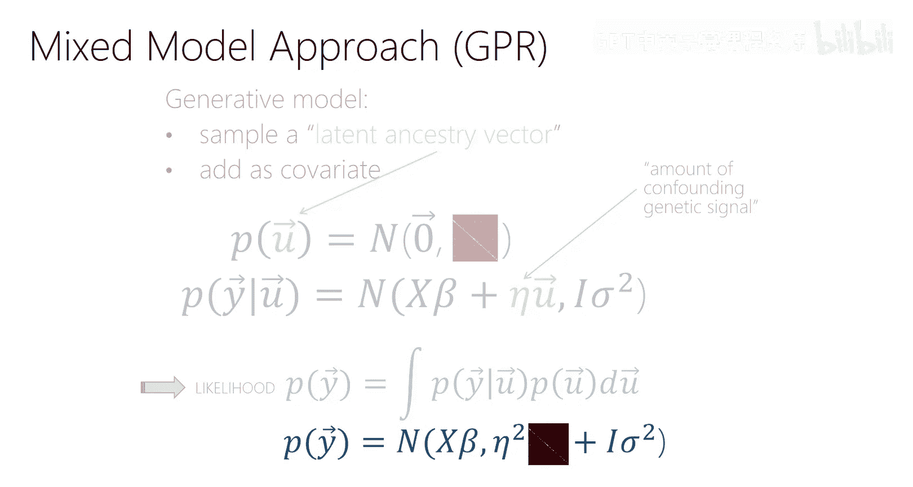

# 5：线性回归 2 🧮

在本节课中，我们将继续学习线性回归，并深入探讨一个核心概念：**正则化**。我们将了解当线性回归模型遇到“欠定”问题时，如何通过添加约束来获得更稳定、泛化能力更强的解。我们还将学习两种最常用的正则化方法：L2正则化（岭回归）和L1正则化（Lasso），并理解它们背后的概率解释（贝叶斯视角）以及如何选择超参数。

---

## 欠定系统与正则化动机

上一节我们介绍了高斯线性回归及其最大似然估计。我们通过求解方程 `A^T A w = A^T y` 来得到权重 `w` 的估计，其中 `A` 是设计矩阵。然而，这个解要求 `A^T A` 是可逆的。

当设计矩阵 `A` 不是满秩时（例如，特征之间存在线性依赖，或者特征数量 `D` 大于样本数量 `n`），`A^T A` 不可逆。此时，我们有无穷多个 `w` 都能使训练数据的似然函数达到相同的最大值。这样的系统被称为**欠定系统**。

为了解决这个问题，一个直观的想法是直接删除一些特征，但这可能丢失信息。另一种更优雅、更通用的方法是**正则化**。正则化的核心思想是：**保持参数数量不变，但对其添加约束，从而有效减少模型的“自由度”**，防止过拟合，并提高模型在未知数据上的鲁棒性。

---

## 为何选择小范数解？🤔

在欠定系统中，穆尔-彭罗斯广义逆给出的解是所有可能解中**范数最小**的那个。为什么这是一个好的选择？

考虑一个简单的例子：假设有两个线性相关的特征 `x1` 和 `x2`（即 `x2 = α * x1`）。模型预测为 `ŷ = w1*x1 + w2*x2`。可以证明，存在无穷多组 `(w1, w2)` 能给出完全相同的训练集预测值。

**直觉是**：在训练集上表现相同的参数向量，在测试集上的表现可能大不相同。**范数较小的参数向量**（即各 `wi` 值较小）通常意味着模型更“平滑”。当输入 `x` 有微小扰动时，预测 `ŷ` 的变化也更小。这种对噪声的鲁棒性是我们所期望的，因为机器学习通常假设真实世界中的函数具有一定的平滑性。

因此，即使是在 `A^T A` 可逆的“超定”系统中，我们也有动机去约束 `w` 的范数，使其小于最大似然估计得到的范数。这虽然会略微降低模型在训练集上的拟合程度（似然值下降），但往往能显著提升其泛化能力。

---

## L2正则化线性回归（岭回归）🏔️

现在，我们正式引入第一种正则化方法。我们不再仅仅最大化似然函数，而是在损失函数中添加一个关于参数 `w` 的L2范数惩罚项。

**损失函数公式**：
`L(w) = ||y - A w||² + λ ||w||²`
其中 `λ > 0` 是一个超参数，控制正则化的强度。

### 贝叶斯视角下的推导 🧠

我们可以从概率角度理解L2正则化。这涉及到**最大后验概率估计**。

*   **贝叶斯方法**：将参数 `w` 视为随机变量，引入一个**先验分布** `p(w)` 来表示我们在看到数据之前对参数的信念。看到数据 `D` 后，我们根据贝叶斯规则计算**后验分布** `p(w|D) ∝ p(D|w) * p(w)`。
*   **“懒惰”的贝叶斯方法（MAP）**：我们不计算整个后验分布，而是寻找使后验概率最大的单个 `w`，即**最大后验概率估计**。
    `w_MAP = argmax_w [ p(D|w) * p(w) ]`
*   **与L2正则化的对应**：如果我们选择先验分布 `p(w)` 为一个**零均值、方差由 `λ` 控制的高斯分布**，即 `w ~ N(0, (1/λ)I)`，那么最大化后验概率 `p(w|D)` 的对数，正好等价于最小化上述的L2正则化损失函数 `L(w)`。

因此，**L2正则化等价于假设参数服从高斯先验的MAP估计**。这个先验表达了我们“认为参数值应该接近零”的信念。

### 求解与性质 🔍

对新的损失函数求导并令其为零，我们可以得到解析解：

**权重解公式**：
`w_Ridge = (A^T A + λ I)^(-1) A^T y`

与普通最小二乘解 `(A^T A)^(-1) A^T y` 相比，岭回归的解在 `A^T A` 上加了一个 `λ I`。只要 `λ > 0`，`(A^T A + λ I)` 就总是可逆的，即使 `A^T A` 原本不可逆。这从数值计算上也更加稳定。

---

## L1正则化线性回归（Lasso）🎯

第二种广泛使用的正则化方法是L1正则化，它在损失函数中添加参数向量的L1范数（绝对值之和）作为惩罚项。

**损失函数公式**：
`L(w) = ||y - A w||² + λ ||w||₁`
其中 `||w||₁ = Σ_i |w_i|`。

### 几何解释与稀疏性 ✨

L1正则化最引人注目的特性是它能产生**稀疏解**，即最终得到的权重向量 `w` 中许多项恰好为0。这实现了自动的**特征选择**。

我们可以从约束优化的几何视角来理解这一点：
*   将L1正则化视为在最大化似然的同时，要求 `||w||₁ ≤ t`（`t` 是与 `λ` 相关的常数）。
*   这个约束在二维参数空间中是一个**菱形**，而在高维空间中是具有“尖角”的多面体。
*   似然函数的等高线是椭圆。在约束优化中，最优解通常出现在约束区域的边界与似然等高线“相切”的地方。
*   由于L1约束区域有“尖角”，相切点有很大概率落在坐标轴上，这意味着某些 `w_i = 0`。

相比之下，L2约束 (`||w||₂ ≤ t`) 区域是一个“光滑”的球体，与等高线相切在坐标轴上的概率很小，因此通常不会产生精确为零的权重。

### 贝叶斯视角 🧠

类似于岭回归，Lasso也有其贝叶斯解释。它对应于假设参数 `w` 服从**拉普拉斯先验**（又称双指数分布）。拉普拉斯分布在零点有更高的概率密度，这同样表达了我们期望许多参数为零或接近零的信念。

---

## 如何设置超参数 λ？🎛️

正则化强度 `λ` 是一个**超参数**，我们不能通过最大化训练集似然来学习它（因为那样总会得到 `λ = 0`）。必须使用独立的**验证集**来评估不同 `λ` 值下模型的性能。

以下是标准流程：
1.  **分割数据**：将全部数据分为**训练集**、**验证集**和**测试集**。
2.  **交叉验证**：对于每个候选的 `λ` 值：
    *   在训练集上训练模型（最小化 `L(w)`）。
    *   在验证集上评估模型性能（**使用原始的、未正则化的损失，如平方误差**）。
3.  **选择最优λ**：选择在验证集上性能最好的 `λ` 值。
4.  **最终训练与测试**：使用选定的 `λ`，用**全部训练集+验证集**数据重新训练最终模型，然后在**测试集**上进行一次性的最终性能评估，以估计模型在真实场景中的表现。

常用的交叉验证方法是 **k折交叉验证**，它能更有效地利用数据来估计验证误差。

---

## L2 vs L1 vs 弹性网络 🤼

以下是两种正则化方法的简单比较：

*   **岭回归 (L2)**：
    *   **优点**：总是可解，数值稳定，能处理特征相关性。
    *   **缺点**：不产生稀疏模型，所有特征都会被保留，只是系数被缩小。
*   **Lasso (L1)**：
    *   **优点**：能产生稀疏模型，自动进行特征选择，模型更易解释。
    *   **缺点**：如果一组特征高度相关，Lasso倾向于只从中随机选择一个，这可能不稳定。

有时，为了结合两者的优点，会使用**弹性网络**，它同时包含L1和L2惩罚项：
`L(w) = ||y - A w||² + λ₁ ||w||₁ + λ₂ ||w||²`
但这引入了两个需要调优的超参数。

---

## 总结 📚

本节课我们一起深入学习了线性回归的正则化技术。

1.  **问题起源**：我们首先了解了当线性回归面临欠定系统时，最大似然估计会得到无穷多解。
2.  **核心思想**：引入了**正则化**的概念，通过给损失函数添加关于参数的惩罚项，来约束模型复杂度，提高泛化能力。
3.  **L2正则化 (岭回归)**：我们学习了添加L2范数惩罚项的方法，推导了其解析解 `(A^T A + λ I)^(-1) A^T y`，并从**贝叶斯最大后验概率估计**的角度理解了它对应于高斯先验。
4.  **L1正则化 (Lasso)**：我们学习了添加L1范数惩罚项的方法，理解了其能产生**稀疏解**的特性，并从几何和贝叶斯（拉普拉斯先验）角度进行了解释。
5.  **超参数调优**：我们明确了正则化系数 `λ` 是超参数，必须使用**验证集**和**交叉验证**技术来选择。
6.  **方法比较**：我们对比了岭回归和Lasso的优缺点，并简要介绍了结合二者的弹性网络。

正则化是机器学习的核心概念之一，其思想远超线性回归，将贯穿于我们后续学习的所有复杂模型（如逻辑回归、神经网络）中。掌握它，是构建稳健、高性能机器学习模型的关键。