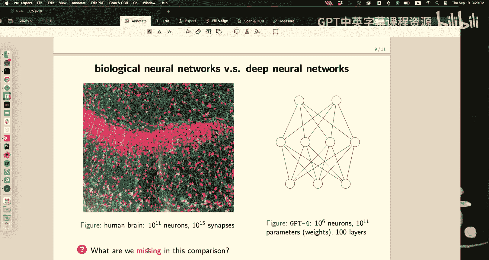

# 7：逻辑回归与神经网络

在本节课中，我们将要学习逻辑回归的判别式学习方法，并初步了解神经网络的基本概念。我们将从几何角度理解逻辑回归的参数，推导多分类逻辑回归的公式，并学习如何通过梯度下降法进行参数学习。最后，我们将从神经科学的视角出发，引出神经网络的基本模型。

---

## 逻辑回归的几何解释

上一节我们介绍了逻辑回归的生成式方法。本节中，我们来看看其参数的几何意义。

逻辑回归模型的核心公式为：
\[
P(y=1 \mid \mathbf{x}; \boldsymbol{\theta}) = \frac{1}{1 + e^{-\boldsymbol{\theta}^T \mathbf{x}}}
\]

参数 \(\boldsymbol{\theta}\) 的几何意义如下：
*   **方向**：\(\boldsymbol{\theta}\) 的方向决定了决策边界（即概率为0.5的等高面）的法线方向。数据点 \(\mathbf{x}\) 可以分解为平行于 \(\boldsymbol{\theta}\) 的分量 \(\mathbf{x}_{\parallel}\) 和垂直于 \(\boldsymbol{\theta}\) 的分量 \(\mathbf{x}_{\perp}\)。垂直于 \(\boldsymbol{\theta}\) 方向上的移动不会改变分类概率。
*   **大小**：\(\boldsymbol{\theta}\) 的范数影响决策边界的“锐利”程度。
*   **偏置**：参数 \(\theta_0\) （通常与一个常数特征 \(x_0=1\) 结合）决定了决策边界沿法线方向的平移。

如果 \(\boldsymbol{\theta}\) 指向“类别1”区域，那么沿着 \(\boldsymbol{\theta}\) 方向移动，\(P(y=1 \mid \mathbf{x})\) 会趋近于1；反之则趋近于0。这为参数学习提供了直观的更新方向。

---

## 多分类逻辑回归

接下来，我们将逻辑回归从二分类推广到多分类（K > 2）场景。

我们同样可以从生成式方法出发进行推导。假设每个类别的类条件概率密度 \(p(\mathbf{x} \mid y=k)\) 是同协方差矩阵 \(\boldsymbol{\Sigma}\) 的高斯分布。通过贝叶斯定理计算后验概率 \(P(y=k \mid \mathbf{x})\)，并消去分子分母中的公共项，我们可以得到如下形式：

\[
P(y=k \mid \mathbf{x}) = \frac{e^{a_k}}{\sum_{j=1}^{K} e^{a_j}}
\]
其中，
\[
a_k = \boldsymbol{\theta}_k^T \mathbf{x} + \theta_{k0}
\]

这个映射函数被称为 **Softmax 函数**。它具有以下重要性质：
*   **输出归一化**：所有类别的概率之和为1。
*   **可微分性**：便于使用基于梯度的优化方法。
*   **赢者通吃**：如果某个 \(a_k\) 远大于其他 \(a_j\)，则 \(P(y=k \mid \mathbf{x}) \approx 1\)，而其他类别的概率趋近于0。这使得模型能够做出“硬”决策。

在生成式方法中，我们需要估计所有类别的均值 \(\boldsymbol{\mu}_k\) 和共享的协方差矩阵 \(\boldsymbol{\Sigma}\)，参数数量为 \(O(K D + D^2)\)。当特征维度 \(D\) 很高时（例如图像像素），估计协方差矩阵会非常困难，这为判别式方法提供了动机。

---

## 判别式学习与梯度下降

现在，我们忘记生成式假设，直接从逻辑函数形式出发，通过判别式方法进行参数学习。

对于二分类问题，给定数据集 \(\{(\mathbf{x}_i, y_i)\}\)，其中 \(y_i \in \{0, 1\}\)。我们采用负对数似然（交叉熵）作为损失函数。对于单个样本，其损失为：

\[
\mathcal{L}(\boldsymbol{\theta}) = - \left[ y \log(p) + (1-y) \log(1-p) \right]
\]
其中 \(p = P(y=1 \mid \mathbf{x}; \boldsymbol{\theta})\)。

我们的目标是最小化总损失（所有样本损失之和）。我们使用梯度下降法进行优化，需要计算损失函数对参数 \(\boldsymbol{\theta}\) 的梯度。

以下是梯度计算的关键步骤：
1.  令 \(z = \boldsymbol{\theta}^T \mathbf{x}\)，则 \(p = \sigma(z) = 1/(1+e^{-z})\)。
2.  应用链式法则：\(\nabla_{\boldsymbol{\theta}} \mathcal{L} = (\frac{d \mathcal{L}}{d z}) (\nabla_{\boldsymbol{\theta}} z)\)。
3.  经过计算和化简，可以得到一个非常简洁的梯度表达式：
    \[
    \nabla_{\boldsymbol{\theta}} \mathcal{L} = (p - y) \mathbf{x}
    \]

这个结果非常直观：
*   **梯度方向**：梯度指向数据点 \(\mathbf{x}\) 的方向。
*   **更新规则**：参数更新为 \(\boldsymbol{\theta} \leftarrow \boldsymbol{\theta} - \eta (p - y) \mathbf{x}\)，其中 \(\eta\) 是学习率。
*   **物理意义**：如果真实标签 \(y=1\) 但模型预测概率 \(p\) 很小，则 \((p-y)\) 为负，更新会使 \(\boldsymbol{\theta}\) 向 \(\mathbf{x}\) 的方向增加，从而提高下次预测 \(p\) 的值。反之亦然。每个数据点都在“推动”参数向正确的方向调整。

**这个推导的优美之处在于其通用性**。即使 \(z\) 不是 \(\boldsymbol{\theta}^T \mathbf{x}\) 这样的线性函数，而是任何复杂的可微函数（例如神经网络的输出），梯度计算的核心部分 \((p-y) \nabla_{\boldsymbol{\theta}} z\) 依然成立。这为深度学习中的反向传播算法奠定了基础。

多分类逻辑回归的梯度推导与此类似，鼓励大家课后自行完成。

---

## 神经网络：来自神经科学的启发

最后，我们从一个不同的视角——神经科学——来引出神经网络的基本思想。

历史上，人们对大脑结构的认识不断深入。从11世纪最早的神经系统手绘图，到19世纪末Cajal和Golgi利用染色技术绘制的精美神经元图谱，揭示了大脑是由离散的神经元细胞通过突触连接而成的网络。

关键生物学事实为神经网络提供了灵感：
1.  **结构**：神经元由接收信号的树突、处理信号的细胞体和发送信号的轴突组成。
2.  **信号**：神经元通过电脉冲（动作电位）通信，可以近似看作一种二值（激活/静息）或频率编码信号。
3.  **连接**：神经元之间通过突触连接，突触具有强度（权重），可表现为兴奋性（正权重）或抑制性（负权重）。
4.  **整合与激活**：一个神经元接收来自众多前序神经元的信号，进行加权求和。如果总输入超过某个阈值，则产生输出脉冲。这个“整合-发放”过程可以抽象为一个加权和 followed by 一个非线性激活函数（如Sigmoid函数，将输入映射到[0,1]区间，模拟放电率）。

基于这些观察，我们可以构建一个简化的计算模型：
*   **输入层**：对应感觉神经元，接收外部特征 \(\mathbf{x} = (x_1, x_2, ...)\)。
*   **隐藏层**：对应大脑中的中间神经元。每个神经元计算 \(z_j = \sigma(\sum_i \theta_{ji}^{(1)} x_i)\)，其中 \(\sigma\) 是激活函数。
*   **输出层**：对应决策神经元，计算 \(y_k = \sigma(\sum_j \theta_{kj}^{(2)} z_j)\)。
*   **组合**：通过堆叠多个这样的层，就构成了一个前馈神经网络。其核心特点是**层级化和组合性**。

现代大型神经网络（如GPT-4）拥有约 \(10^{12}\) 量级的参数（突触权重）。作为对比，人脑约有 \(10^{11}\) 个神经元和 \(10^{15}\) 个突触。尽管在规模和结构上存在差异，但二者都体现了通过大量简单计算单元互联来解决复杂问题的核心思想。

---

本节课中我们一起学习了逻辑回归的几何解释与判别式学习方法，推导了多分类Softmax回归，并理解了梯度下降更新规则的直观意义。最后，我们从神经科学的历史和原理出发，引出了人工神经网络的基本构建思想。下一讲，我们将深入探讨神经网络的训练算法——反向传播。