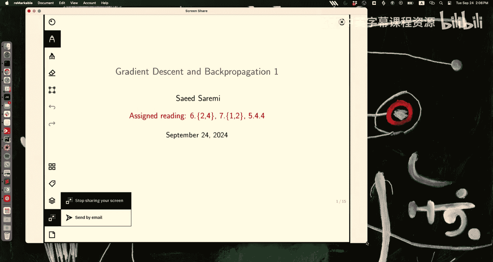
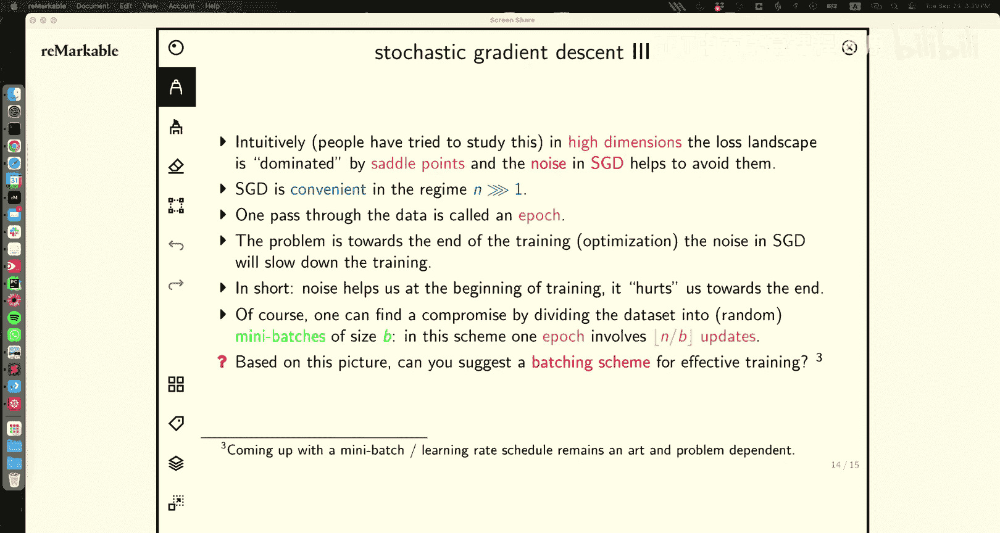

# 8：反向传播与梯度下降 1




在本节课中，我们将学习神经网络的基础、梯度下降的几何意义以及随机梯度下降的原理。我们将从回顾逻辑回归开始，逐步构建对神经网络和其训练算法的理解。

## 回顾：逻辑回归与决策边界

上一节我们介绍了逻辑回归的几何解释。核心思想是将输入向量 **x** 分解为与参数向量 **θ** 平行和垂直的两个部分：**x** = **x**∥ + **x**⊥。

由于 **θ** · **x**⊥ = 0，垂直于 **θ** 的 **x** 分量不影响分类概率。因此，决策边界垂直于 **θ**。同时，**θ** 指向类别 1 的方向，因为当 **θ** · **x** 趋近于正无穷时，P(y=1|**x**) 趋近于 1。

对于多类分类（K > 2），在类条件密度为具有固定协方差矩阵的高斯分布这一假设下，我们推导出了 softmax 函数。

从最大似然的角度，我们定义了损失函数（负对数似然）并计算了其梯度。梯度的解释很直观：对于每个数据点，如果其真实标签与模型预测不符，梯度会推动参数 **θ** 向正确的方向调整。

## 神经网络作为非线性函数

本节中，我们来看看神经网络如何作为一种强大的非线性函数逼近器。

### 基本结构与符号

一个神经网络接收输入 **x**⁰（第0层，即输入层）。每一层（第 *l* 层）的神经元接收来自前一层（第 *l-1* 层）的信号，进行线性组合后，再通过一个非线性激活函数 *g*。

**公式**：对于第 *l* 层的第 *j* 个神经元，其激活值 *xⱼˡ* 计算如下：
```
zⱼˡ = Σᵢ θⱼᵢˡ * xᵢˍˡ⁻¹ + bⱼˡ
xⱼˡ = g(zⱼˡ)
```
其中，*θⱼᵢˡ* 是连接权重，*bⱼˡ* 是偏置项（通常通过添加一个值恒为1的“偏置神经元”来实现）。

### 激活函数示例

激活函数 *g* 引入了非线性，这是神经网络表达能力的关键。以下是一些常见例子：

*   **Sigmoid/Logistic**: *g(z) = 1 / (1 + e⁻ᶻ)*。将输出压缩到(0,1)区间，常用于二分类输出层。
*   **线性**: *g(z) = z*。用于回归问题的输出层。
*   **ReLU (整流线性单元)**: *g(z) = max(0, z)*。计算高效，能缓解梯度消失问题，是隐藏层最常用的激活函数之一。
*   **SiLU/Swish**: *g(z) = z * sigmoid(z)*。一种平滑的、表现良好的激活函数。

**重要提示**：如果所有激活函数都是线性的，那么整个多层网络将退化为一个单层线性网络，失去其强大的表示能力。因此，隐藏层必须使用非线性激活函数。

### 多层神经网络与通用近似定理

我们可以堆叠多个层来构建深度神经网络。一个著名的理论结果是**通用近似定理**：只要使用非线性激活函数（如Sigmoid），一个单隐藏层的前馈神经网络，在隐藏层神经元足够多的情况下，可以以任意精度逼近任何连续函数。

这意味着神经网络在理论上具有强大的函数表示能力。输入层和输出层的维度由问题本身决定（如图像像素数、分类类别数），而中间隐藏层的结构和大小则是我们可以设计的超参数。

## 优化基础：梯度下降

为了训练神经网络，我们需要优化其参数以最小化损失函数。这通常通过梯度下降法及其变种来实现。

### 梯度的几何解释

梯度 ∇f(θ) 指向函数 *f* 在点 *θ* 处**增长最快**的方向。其大小表示增长率。

一个关键的性质是：在任意点 θ，梯度向量垂直于该点处函数的**等高线**（即所有使函数值相等的点构成的曲面）。这可以通过链式法则证明：考虑一个在等高线上运动的轨迹 θ(t)，由于 f(θ(t)) 为常数，其对时间的导数为零，即 ∇f · (dθ/dt) = 0。由于 dθ/dt 是等高线的切向方向，因此梯度 ∇f 必垂直于该切线方向。

### 学习率与收敛性

梯度下降的更新规则为：
**公式**：`θ_{t+1} = θ_t - ε ∇f(θ_t)`
其中 ε 是学习率。

学习率的选择至关重要。以一个简单的一维二次函数 *f(θ) = θ² / (2α)* 为例：
*   如果 ε 设置过小，收敛速度会非常慢。
*   如果 ε 设置得恰到好处（例如 ε = α），可以一步到达最优解。
*   如果 ε 设置过大（例如 ε > 2α），更新过程将会发散，参数在最优解两侧震荡甚至趋于无穷。

在高维空间中，损失函数的“地形”可能非常复杂，在不同方向上具有不同的曲率（即二阶导数）。最陡峭的方向决定了我们能使用的最大稳定学习率，而最平缓的方向则决定了收敛到最小值所需的时间。这解释了为什么优化深度神经网络具有挑战性。

### 随机梯度下降

在实际的机器学习问题中，损失函数通常是所有训练样本上个体损失之和：
**公式**：`L(θ) = (1/N) Σ_{i=1}^N L_i(θ)`
其中 *L_i(θ)* 是第 *i* 个样本的损失。

标准的（批量）梯度下降需要计算整个训练集上的梯度，这在数据集很大时计算代价极高。**随机梯度下降** 采用了一种近似但高效的方法：
*   在每一步，**随机**选取一个（或一小批）样本。
*   仅用这个（批）样本的梯度 `∇L_i(θ)` 来近似整个数据集的梯度 `∇L(θ)`。
*   进行参数更新：`θ_{t+1} = θ_t - ε ∇L_i(θ_t)`。

可以将小批量梯度视为真实梯度加上一个“噪声”。这个噪声有其两面性：
1.  **好处**：在非凸的损失地形中，噪声可以帮助参数跳出较差的局部极小值，有可能找到更好的解。
2.  **坏处**：噪声会导致更新路径不稳定，在接近最优解时会产生震荡，减慢收敛速度。

为了平衡，实践中常采用**小批量随机梯度下降**，即每次使用一小批（例如32、64、128个）样本计算梯度。常见的策略是，在训练初期使用较小的批量大小以利用噪声的探索能力，在训练后期增大批量大小或降低学习率以减少噪声，实现稳定收敛。

## 总结

本节课中我们一起学习了：
1.  **神经网络的基础**：了解了其作为非线性函数逼近器的结构，包括层、神经元、权重、偏置和激活函数。
2.  **优化核心**：深入探讨了梯度的几何意义（垂直于等高线），并分析了学习率对梯度下降收敛性的关键影响。
3.  **实用算法**：介绍了随机梯度下降及其小批量变种，理解了其通过引入噪声来应对非凸优化问题和提升大规模数据训练效率的原理。



下一节课，我们将在此基础上，深入探讨**反向传播**算法，它是高效计算神经网络中损失函数对所有权重梯度的核心方法。