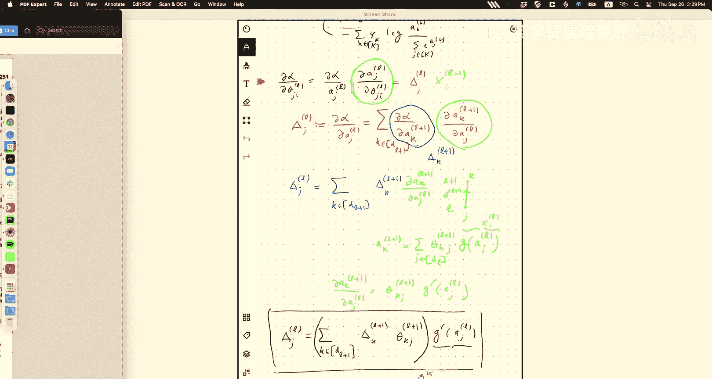

# 9：反向传播与梯度下降 2

在本节课中，我们将学习神经网络中一个核心且优雅的算法——反向传播。我们将从单层网络开始，逐步推导出适用于深度网络的通用梯度计算规则，并理解其高效计算的原理。

上一节我们介绍了神经网络的基本结构和前向传播过程。本节中，我们来看看如何高效地计算损失函数对所有参数的梯度，这是训练神经网络的关键。

## 神经网络与损失函数回顾

我们有一个由 L 层组成的神经网络。其前向传播过程可以描述为：从输入 `x0` 开始，逐层计算“预激活”信号 `a`，然后通过非线性激活函数 `g` 得到该层的激活值 `x`，并作为下一层的输入。

**公式表示：**
对于第 `l` 层（`l` 从 1 到 L）：
1.  预激活：`a_j^l = Σ_i θ_{ji}^l * x_i^{l-1}`
2.  激活：`x_j^l = g(a_j^l)`

通常，最后一层（第 L 层）的激活函数是线性的，即 `x_j^L = a_j^L`。网络的最终输出取决于任务：对于回归，可能是一个标量；对于二分类，是一个代表概率的标量；对于多分类，是 K 个标量，经过 Softmax 后得到类别概率。

损失函数 `L` 衡量网络预测与真实标签的差距。我们之前已经推导了几种常见任务的损失函数：
*   **回归（高斯假设）**：`L = 1/2 * (y - a^L)^2`
*   **二分类（伯努利假设）**：`L = -[y * log(σ(a^L)) + (1-y) * log(1-σ(a^L))]`，其中 `σ` 是 Sigmoid 函数。
*   **多分类（多项分布假设）**：`L = -Σ_{k=1}^K y_k * log(p_k)`，其中 `p_k = e^{a_k^L} / Σ_j e^{a_j^L}`（Softmax）。

一个关键的观察是：**损失函数 `L` 总是通过最后一层的预激活值 `a^L` 依赖于网络参数 `θ`**。这强烈暗示我们应该使用链式法则来计算梯度。

## 单层网络的梯度计算

为了建立直觉，我们先考虑一个单层神经网络（L=1）。此时，预激活 `a` 就是输入的线性组合：`a = θ^T x`。

我们想计算损失 `L` 对参数 `θ` 的梯度。根据链式法则：
`∂L/∂θ = (∂L/∂a) * (∂a/∂θ)`

这个公式非常通用，即使对于深度网络，其形式也保持不变。其中：
*   `∂a/∂θ` 很简单，就是输入 `x`。
*   `∂L/∂a` 是损失对最后一层激活的梯度，它包含了“误差”信号。

以下是不同损失函数对应的 `∂L/∂a` 计算结果：

**回归：**
`∂L/∂a = -(y - a)`
这直观地表示预测值 `a` 与真实值 `y` 之间的差距。

**二分类：**
`∂L/∂a = σ(a) - y`
其中 `σ(a)` 是模型预测的概率。当 `y=1` 时，我们希望 `σ(a)` 接近 1，误差 `σ(a)-1` 为负，驱动学习。

**多分类：**
`∂L/∂a_k = p_k - y_k`
其中 `p_k` 是 Softmax 输出的第 k 类概率，`y_k` 是 one-hot 编码的真实标签（第 k 位为 1，其余为 0）。这同样是预测概率与真实标签的差值。

可以看到，在输出层，`∂L/∂a^L` 具有清晰的“误差”语义。它衡量了网络顶层预测与目标的差异。

## 反向传播算法

对于深度网络，我们需要计算损失 `L` 对网络中任意参数 `θ_{ji}^l` 的梯度。直接使用有限差分法（对每个参数进行微小扰动）的计算成本是 `O(M^2)`（M 为参数总数），对于现代动辄数十亿参数的网络来说是不可行的。

反向传播算法提供了一种精确且高效（`O(M)`）的计算方法。其核心思想是**利用链式法则，将顶层的误差信号逐层向后（反向）传播**。

我们定义第 `l` 层第 `j` 个神经元的误差为：
`δ_j^l = ∂L / ∂a_j^l`

我们的目标是计算任意参数 `θ_{ji}^l` 的梯度。根据链式法则：
`∂L/∂θ_{ji}^l = (∂L/∂a_j^l) * (∂a_j^l/∂θ_{ji}^l) = δ_j^l * x_i^{l-1}`

因此，问题的关键变成了如何高效计算所有层的 `δ_j^l`。

### 误差的反向传播公式

我们已知输出层（第 L 层）的误差 `δ^L`，其计算公式已在上一节给出（即 `p_k - y_k` 等形式）。

对于第 `l` 层（`l < L`）的误差 `δ_j^l`，我们可以通过第 `l+1` 层的误差 `δ_k^{l+1}` 来计算。再次应用链式法则，考虑 `a_j^l` 如何影响后续所有层的损失：

`δ_j^l = ∂L/∂a_j^l = Σ_k (∂L/∂a_k^{l+1}) * (∂a_k^{l+1}/∂a_j^l) = Σ_k δ_k^{l+1} * (∂a_k^{l+1}/∂a_j^l)`

现在需要计算 `∂a_k^{l+1}/∂a_j^l`。根据前向传播公式：
`a_k^{l+1} = Σ_m θ_{km}^{l+1} * x_m^l = Σ_m θ_{km}^{l+1} * g(a_m^l)`

当对特定的 `a_j^l` 求偏导时，求和中只有 `m=j` 的项有贡献：
`∂a_k^{l+1}/∂a_j^l = θ_{kj}^{l+1} * g'(a_j^l)`

将其代回误差公式，我们得到**反向传播的核心递归公式**：

`δ_j^l = g'(a_j^l) * Σ_k θ_{kj}^{l+1} * δ_k^{l+1}`

这个公式非常优美：
1.  **局部梯度**：`g'(a_j^l)` 是激活函数在当前位置的导数。
2.  **加权误差和**：`Σ_k θ_{kj}^{l+1} * δ_k^{l+1}` 是下一层所有神经元的误差 `δ_k^{l+1}`，以连接权重 `θ_{kj}^{l+1}` 为权重的加权和。**注意**：这里使用的权重 `θ_{kj}^{l+1}` 是前向传播时从本层 `j` 神经元连接到下一层 `k` 神经元的权重。在反向传播时，信号沿着相同的连接路径反向流动，但使用了权重的转置形式（下标 `kj` 与正向的 `jk` 顺序相反，体现了“反向”）。

### 算法步骤总结

综合以上，完整的反向传播算法步骤如下：

1.  **前向传播**：输入数据，计算每一层的 `a^l` 和 `x^l`（即 `g(a^l)`），并保存下来。
2.  **计算输出层误差**：根据损失函数类型，计算 `δ^L = ∂L/∂a^L`。
    *   回归：`δ^L = -(y - a^L)`
    *   二分类：`δ^L = σ(a^L) - y`
    *   多分类：`δ^L = p - y` （向量形式，`p` 为 Softmax 输出概率）
3.  **反向传播误差**：对于 `l = L-1, L-2, ..., 1`，利用递归公式计算：
    `δ^l = g'(a^l) ⊙ ((θ^{l+1})^T δ^{l+1})`
    其中 `⊙` 表示逐元素相乘，`(θ^{l+1})^T` 是权重矩阵的转置。
4.  **计算参数梯度**：对于每一层 `l`，利用保存的 `x^{l-1}` 和计算好的 `δ^l`：
    `∂L/∂θ^l = δ^l * (x^{l-1})^T`
    （对于偏置项，其梯度就是 `δ^l`）。

该算法只需一次前向传播和一次反向传播，即可计算出损失函数对所有参数的梯度，计算复杂度与参数数量 `M` 成线性关系，极其高效。

## 反向传播的直观理解与意义

反向传播算法之所以得名，是因为它沿着网络反向传播误差信号。输出层的误差 `δ^L` 代表了网络最终输出的“错误程度”。这个误差被分解，并沿着产生它的路径（即网络的连接）分配回中间的神经元。

每个中间神经元的误差 `δ_j^l` 可以理解为“该神经元对最终输出误差应负的责任”。这个责任由两部分决定：
1.  该神经元激活函数的局部斜率（`g'(a_j^l)`）：如果它对输入变化不敏感，则责任小。
2.  以该神经元为起点的所有连接，其下游神经元的误差的加权和（`Σ_k θ_{kj}^{l+1} * δ_k^{l+1}`）：如果它强烈影响了某些犯了大错的下游神经元，则它的责任就大。

这种将误差责任反向分配的过程，与人类学习中的反思过程有相似之处。

## 扩展：计算图与自动微分

我们推导的反向传播算法针对的是简单的全连接前馈网络。现代神经网络结构复杂，可能包含跳跃连接、分支、循环等。为此，更通用的框架是**将计算过程表示为计算图**。

自动微分（Automatic Differentiation， AD）系统（如 PyTorch、TensorFlow 的核心）允许用户定义任意计算图，并自动计算任意节点的梯度。反向传播是自动微分中“反向模式”的一个特例。

在计算图中，反向传播的本质是：
*   **前向传播**：执行图的计算，并保存所有中间结果。
*   **反向传播**：从输出（损失）节点开始，应用链式法则，递归地计算每个节点对损失的梯度。对于每个操作节点，都需要定义其“反向传播函数”，该函数知道如何将输出梯度映射回输入梯度。

本节课中我们一起学习了反向传播算法的原理与推导。我们从单层网络的梯度计算出发，通过定义“误差”并推导其层与层之间的递归关系，得到了高效计算深度神经网络所有参数梯度的反向传播算法。理解这一算法是掌握神经网络训练机制的基础。下一讲，我们可能会探讨与此相关的梯度消失/爆炸等问题。