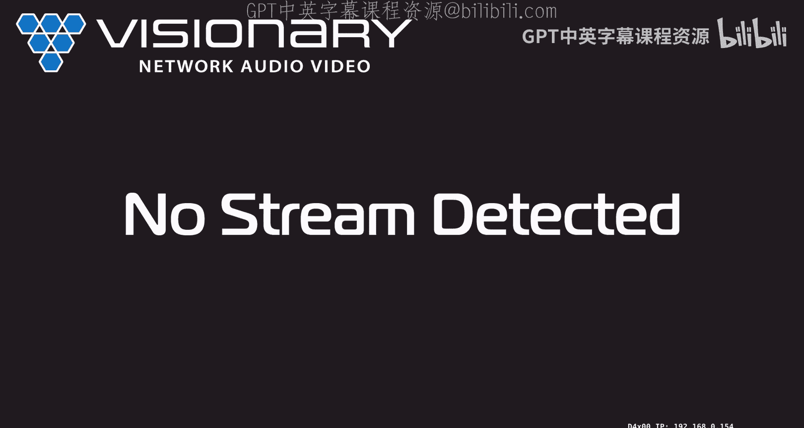
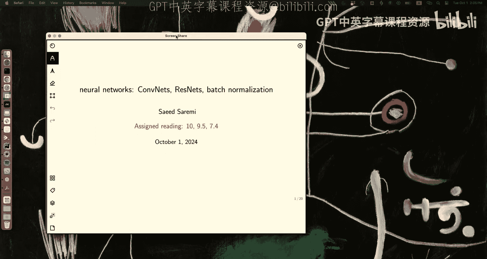
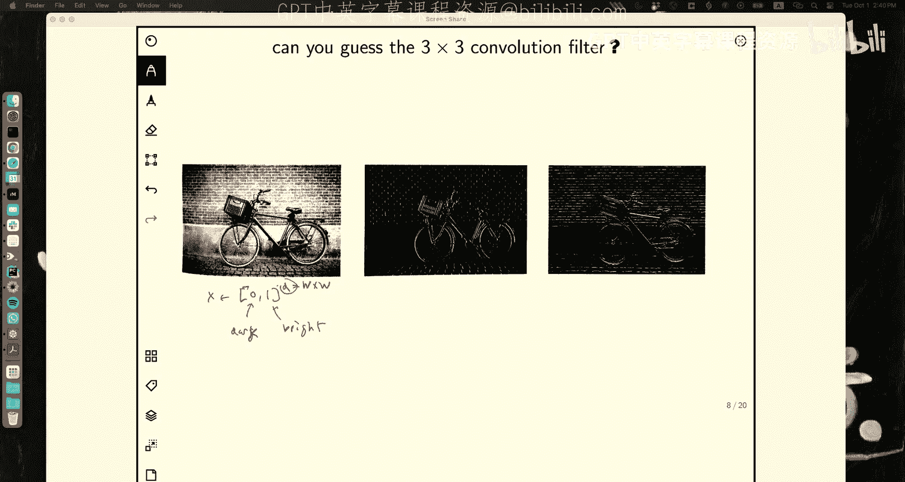
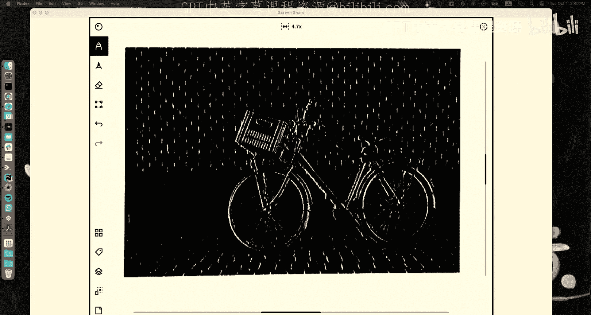
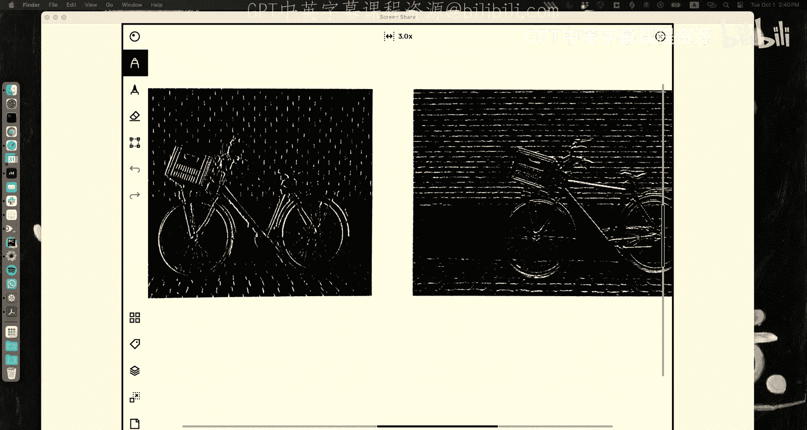
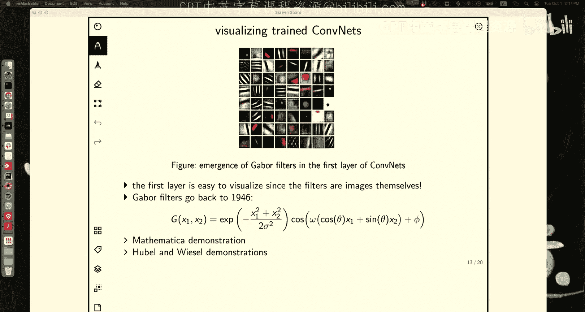
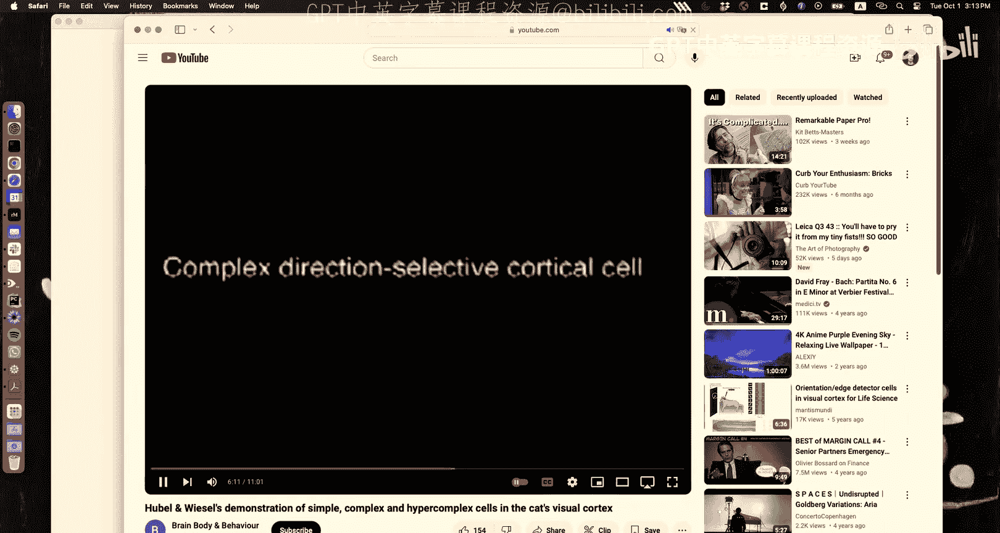
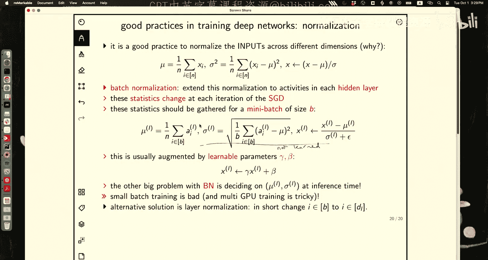

# 10：神经网络 - CNN、批归一化与残差网络

在本节课中，我们将深入学习一类重要的神经网络架构——卷积神经网络。我们将探讨其核心思想、结构，并了解如何通过批归一化和残差连接等技术来优化深度网络的训练。

---

## 课程回顾与动机

上一节我们介绍了如何通过组合简单的线性变换和非线性激活函数来构建强大的神经网络。这种组合可以形式化地表示为函数 **F_θ**，其中 θ 包含了网络的所有参数。

对于典型的监督学习问题，我们通过最小化负对数似然损失函数来训练网络，其形式通常为：
`L(θ) = Σ_i l(y_i, F_θ(x_i))`
例如，对于多分类问题，损失函数是交叉熵损失。

我们拥有高效的反向传播算法来计算这个复杂损失函数的梯度。然而，即使有了强大的优化工具，直接将全连接网络应用于某些问题（如图像识别）仍然面临巨大挑战。

接下来，我们将探讨这些挑战以及卷积神经网络如何巧妙地解决它们。

---

## 全连接网络的局限性

全连接网络在处理高维输入（如图像）时面临几个主要问题：

1.  **参数爆炸**：对于一张百万像素的图片，如果第一个隐藏层有1000个神经元，那么仅这一层就需要10^9个参数。这在计算和存储上都是不可行的。
2.  **过拟合风险**：当参数数量远大于训练样本数量时，模型极易记住训练数据中的噪声，导致泛化能力差。
3.  **缺乏归纳偏置**：全连接网络没有内置任何关于数据结构的先验知识。例如，它不知道图像中的物体平移后，其类别应该保持不变。网络需要从海量数据中从头学习这些不变性，效率低下。

因此，我们需要一种能够将我们对问题（如图像的平移不变性）的先验知识“烘焙”进网络架构本身的方法。

---

## 卷积神经网络的核心思想

卷积神经网络的核心设计理念是引入**平移等变性**和**平移不变性**的归纳偏置。

*   **平移不变性**：对于分类任务，我们希望网络对输入图像中物体的平移不敏感。即，如果 `T(x)` 是图像 `x` 的平移版本，那么对于分类函数 `F_θ`，我们希望 `F_θ(T(x)) = F_θ(x)`。
*   **平移等变性**：对于像素级任务（如分割），我们希望网络的输出能随着输入的平移而相应平移。即，`F_θ(T(x)) = T(F_θ(x))`。

CNN 通过一种特殊的、参数共享的层结构来实现这些性质。

---

### 卷积操作

与全连接层中每个神经元都与上一层的所有神经元相连不同，卷积层中的每个神经元只与输入数据的一个局部区域（称为感受野）相连。

这个局部连接是通过一个小的、可学习的**滤波器**（或**卷积核**）来实现的。滤波器在输入数据上滑动（卷积），计算每个位置的点积并加上偏置，然后通过激活函数。

数学上，对于二维输入（如图像），在位置 `(i, j)` 的卷积层激活值 `a[i, j]` 可以表示为：
`a[i, j] = σ( Σ_{m=0}^{F-1} Σ_{n=0}^{F-1} θ[m, n] * x[i+m, j+n] + b )`
其中：
*   `σ` 是非线性激活函数（如 ReLU）。
*   `θ` 是大小为 `F x F` 的滤波器权重。
*   `x` 是输入。
*   `b` 是偏置项。

**关键点**：同一个滤波器 `θ` 会被重复应用于整个输入图像的不同位置。这实现了**参数共享**，极大地减少了参数量，并强制网络学习在空间上平移不变的特征。

---

### 卷积层的相关概念

以下是构建卷积层时需要考虑的几个重要操作和超参数：

*   **填充**：在输入图像的边缘周围添加额外的像素（通常为0）。这有助于控制输出特征图的空间尺寸。例如，使用 `F x F` 的滤波器对 `W x W` 的图像进行卷积，若步长为1且无填充，则输出尺寸为 `(W - F + 1) x (W - F + 1)`。若希望输入输出尺寸相同，则填充大小 `P` 应为 `(F - 1) / 2`（这要求 `F` 为奇数）。
*   **步长**：滤波器在输入上每次滑动的距离。步长大于1会降低输出特征图的空间分辨率，是一种下采样方式。
*   **池化**：一种非学习的下采样操作，用于降低特征图尺寸、增加感受野并引入一定程度的平移不变性。最常用的是**最大池化**，它取局部区域内的最大值作为输出。
*   **通道**：输入数据（如RGB图像有3个通道）和卷积层的输出都可以有多个通道。每个通道可以看作是一个独立的特征检测器。卷积操作会跨所有输入通道进行，并生成指定数量的输出通道。

---

## 经典CNN架构：VGG16

通过堆叠卷积层、池化层，并在最后连接全连接层，可以构建出强大的图像识别模型。VGG16是一个经典示例：

1.  输入：224x224 RGB图像。
2.  主体：一系列卷积层（使用3x3小滤波器）和最大池化层。随着网络加深，特征图空间尺寸逐渐减小（通过池化），而通道数逐渐增加（从64到512），以捕获更抽象的特征。
3.  分类器：在特征图尺寸变得很小（如7x7）后，将其展平，接入几个全连接层，最终通过softmax输出类别概率。

这种设计非常高效：绝大部分参数集中在最后的全连接层，而前面的卷积层通过参数共享和池化，以较少的参数提取了丰富的层次化特征。

---

## 我们学到了什么？可视化与对抗样本

训练好的CNN，其第一层的滤波器通常可以可视化，并常被发现类似于**Gabor滤波器**（具有特定方向、频率和相位的边缘检测器）。这与生物视觉系统中初级视觉皮层“简单细胞”的响应特性惊人地相似。

我们还可以通过梯度来探究网络内部：
*   **可视化神经元偏好**：通过优化输入图像 `x` 以最大化某个高层神经元的激活，可以生成该神经元所“寻找”的图案（尽管结果可能看起来像抽象的纹理）。
*   **对抗样本**：通过对输入图像添加一个精心构造的、人眼难以察觉的小扰动，可以使得网络以高置信度做出错误分类。这揭示了神经网络的决策边界在高维空间中的复杂性。一种防御方法是**对抗训练**，即将生成的对抗样本加入训练集。

---

## 让网络更深：残差网络

理论上，更深的网络应该能学习更复杂的函数。但实践中，单纯增加深度会导致**梯度消失/爆炸**和**退化问题**：更深网络的训练误差和测试误差反而可能比浅层网络更差。

**残差网络** 通过引入“快捷连接”巧妙地解决了退化问题。其核心构件是残差块：

在一个残差块中，我们不直接学习从输入 `x` 到输出 `H(x)` 的映射，而是学习残差函数 `F(x) = H(x) - x`。块的输出为：
`输出 = F(x) + x`
其中 `F(x)` 通常由两到三个卷积层组成。

**直观理解**：如果恒等映射 `H(x) = x` 是最优的，那么将残差 `F(x)` 推至0比让一堆非线性层去拟合恒等映射要容易得多。快捷连接使得梯度可以直接反向传播到更早的层，缓解了梯度消失问题。

借助残差连接，研究者成功训练了上百甚至上千层的网络，并在多项任务上取得了显著提升。

---

## 稳定训练：批归一化

深度网络训练的另一大挑战是内部协变量偏移：随着网络参数的更新，每一层输入的分布会发生改变，这要求后续层不断适应新的分布，减慢了训练速度。

**批归一化** 的解决方案是：在每一层的激活函数前，对每个小批量数据进行归一化，使其均值为0，方差为1。
对于一个小批量数据 `B = {x_1, ..., x_m}`，批归一化操作如下：
`μ_B = (1/m) Σ_{i=1}^{m} x_i` // 计算小批量均值
`σ_B² = (1/m) Σ_{i=1}^{m} (x_i - μ_B)²` // 计算小批量方差
`x̂_i = (x_i - μ_B) / √(σ_B² + ε)` // 归一化
`y_i = γ * x̂_i + β` // 缩放和偏移

其中 `γ` 和 `β` 是可学习的参数，用于恢复网络的表示能力。`ε` 是一个小常数，用于数值稳定性。

批归一化使得网络对初始化和学习率更不敏感，允许使用更高的学习率，并具有一定的正则化效果，从而加速训练并常常能提升模型性能。

---

## 总结

本节课我们一起深入学习了卷积神经网络及其相关技术：

1.  **CNN的核心**：通过局部连接、参数共享和池化操作，将平移等变/不变的先验知识嵌入网络架构，高效处理图像等网格化数据。
2.  **经典架构**：了解了如VGG16等经典CNN如何通过堆叠卷积层和池化层来构建层次化特征表示。
3.  **可视化与脆弱性**：探索了如何可视化网络所学，并认识了对抗样本所揭示的模型决策边界复杂性。
4.  **深度网络训练**：认识到训练极深网络的困难，并学习了**残差网络**通过快捷连接来解决退化问题的巧妙设计。
5.  **训练稳定技术**：掌握了**批归一化**如何通过标准化层激活来加速训练并提升稳定性。

这些概念和组件是现代深度神经网络，尤其是在计算机视觉领域取得成功的基石。