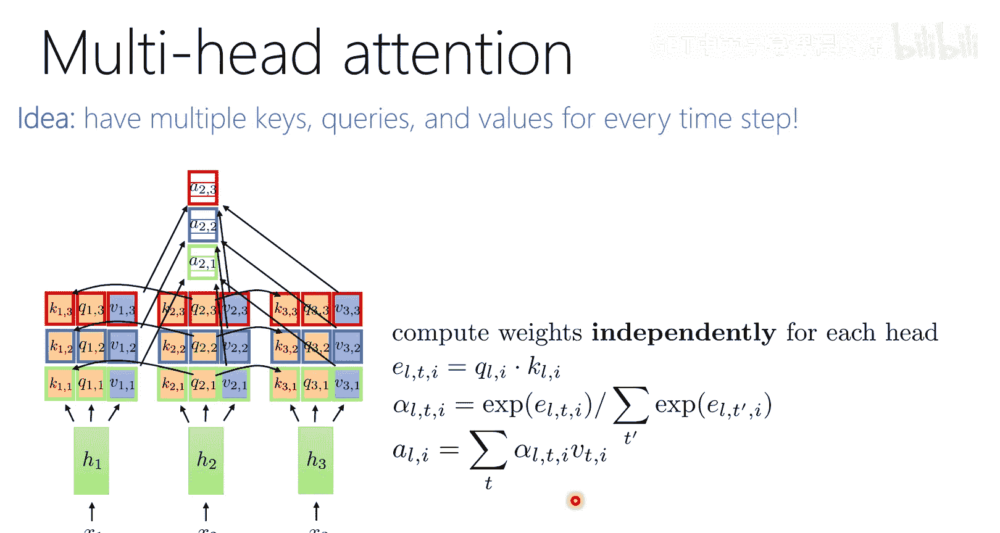

# 11：注意力机制与Transformer模型

在本节课中，我们将学习如何处理可变长度的输入和输出序列，这是自然语言处理等任务中的核心挑战。我们将从循环神经网络的历史视角出发，探讨其局限性，并最终深入讲解现代序列建模的基石——注意力机制与Transformer架构。

## 概述：从循环神经网络到注意力机制

上一节我们介绍了卷积神经网络及其在图像处理中的应用。本节中，我们来看看如何处理序列数据，例如句子或蛋白质序列。传统的神经网络要求固定大小的输入，但序列数据长度可变，这带来了挑战。循环神经网络是早期的解决方案，但其存在信息瓶颈和梯度问题。为了解决这些问题，研究者们提出了注意力机制，并最终发展出了强大的Transformer模型。

## 序列建模的挑战

以下是几种常见的序列建模任务，它们都涉及可变长度的输入或输出：

1.  **固定长度输入到固定长度输出**：例如，图像分类。输入（图像）和输出（类别标签）都是固定大小的。
2.  **可变长度输入到单个输出**：例如，情感分析。输入是一个可变长的句子，输出是一个情感标签（积极/消极）。
3.  **可变长度输入到等长输出**：例如，蛋白质结构预测。输入是氨基酸序列，输出是每个氨基酸的3D坐标，输入输出长度相同。
4.  **可变长度输入到可变长度输出**：例如，机器翻译或图像描述生成。输入和输出的长度可以不同，且输出长度由模型决定。

使用我们目前学到的工具（如标准全连接网络或卷积网络）很难直接处理最后两种，尤其是输入输出长度不同的情况。卷积网络虽然输出大小依赖于输入，但其关系是确定性的，难以处理输出长度与输入解耦的任务。

## 循环神经网络：初步解决方案

为了处理可变长度序列，人们最初设计了循环神经网络。其核心思想是引入一个“记忆”状态，该状态随着序列的推进而更新。

### RNN的基本结构

假设我们有一个输入序列 `X = [x1, x2, x3, ...]`。在RNN中，我们不是一次性处理整个序列，而是按时间步逐步处理。

在时间步 `t`，RNN单元会做两件事：
1.  结合当前输入 `xt` 和上一个时间步的隐藏状态 `a(t-1)`。
2.  产生当前时间步的隐藏状态 `at` 和可能的输出 `yt`。

这个过程可以用以下公式描述：
`a_t = σ(W * [a_(t-1), x_t] + b)`
其中：
*   `σ` 是非线性激活函数（如Sigmoid或ReLU）。
*   `W` 和 `b` 是可学习的权重矩阵和偏置向量。
*   `[a_(t-1), x_t]` 表示将两个向量拼接起来。

通过这种方式，`at` 包含了到时间步 `t` 为止的所有序列信息。对于分类任务，我们可以取最后一个时间步的隐藏状态 `a_T` 来进行预测。

### RNN的变体与应用

*   **序列标注**：如果我们想为序列的每个位置都生成一个输出（如词性标注），可以在每个时间步的隐藏状态 `at` 上接一个小的解码网络来预测 `yt`。
*   **编码器-解码器架构**：对于机器翻译这类任务，我们使用两个RNN。第一个RNN（编码器）将源语言句子编码成一个固定长度的上下文向量。第二个RNN（解码器）以该上下文向量为起点，自回归地（即用上一个输出作为下一个输入）生成目标语言句子。

### RNN的局限性

尽管RNN很强大，但它存在两个主要问题：
1.  **信息瓶颈**：编码器需要将整个输入序列的信息压缩到一个固定长度的上下文向量中。对于长序列，早期信息很容易在循环过程中被稀释或遗忘。
2.  **梯度消失/爆炸**：在长序列上反向传播时，梯度需要通过许多时间步，这可能导致梯度变得极小（消失）或极大（爆炸），使得模型难以训练。

这些局限性促使了注意力机制的发展。

## 注意力机制：解决信息瓶颈

注意力机制的核心思想是：在解码器生成每一个词的时候，不应该只依赖于编码器最后的那个上下文向量，而应该能够直接“查看”编码器所有时间步的隐藏状态，并动态地决定关注哪些部分。

### 注意力机制类比：概率化数据库查询

你可以将注意力机制理解为一个**概率化的数据库查询系统**。
*   **数据库**：编码器所有时间步的隐藏状态 `[h1, h2, ..., hn]`。每个状态有两个属性：`键` 和 `值`。
*   **查询**：解码器当前时间步的隐藏状态 `s_t` 会生成一个`查询`向量。
*   **操作**：`查询`向量会与数据库中所有的`键`进行匹配（通常计算点积相似度），得到一组“注意力分数”。这些分数经过Softmax归一化后，变成一组权重（概率分布）。最终，解码器得到的上下文向量是数据库中所有`值`的加权和，权重就是这组概率。

**公式描述如下：**
1.  计算注意力分数：`e_ti = Query(s_t) · Key(h_i)`
2.  归一化得分：`α_ti = softmax(e_ti) = exp(e_ti) / Σ_j exp(e_tj)`
3.  计算上下文向量：`context_t = Σ_i (α_ti * Value(h_i))`

这样，解码器在生成每个词时，都能获取到输入序列中最相关的部分信息，而非仅仅依赖一个压缩的总结。这极大地改善了对长序列的处理能力。

## Transformer：基于自注意力的全新架构

注意力机制最初是作为RNN的增强组件出现的。但研究者很快发现，**我们可以完全摒弃RNN的循环结构，仅用注意力来构建序列模型**。这就是Transformer的核心思想。

### 自注意力

在编码器-解码器注意力中，查询来自解码器，键和值来自编码器。如果我们想让一个序列内部的元素相互关注（例如，理解一个句子中词与词之间的关系），就需要**自注意力**。

自注意力的计算过程与上述注意力完全相同，只是查询、键、值都来自同一个序列。通过自注意力层，序列中每个位置都能聚合整个序列的信息。

### Transformer的核心组件

一个Transformer块通常包含以下层：

1.  **多头自注意力层**：这是核心。与其只有一个注意力“头”，我们使用多个头（例如8个）。每个头都有自己独立的查询、键、值变换矩阵，可以学习关注序列中不同方面的信息（例如语法结构、语义关系）。多个头的输出会被拼接并线性变换。
    `MultiHead(Q, K, V) = Concat(head1, head2, ..., head_h) * W^O`
    `where head_i = Attention(Q * W_i^Q, K * W_i^K, V * W_i^V)`

2.  **位置编码**：自注意力本身是**置换等变**的，即打乱输入顺序，输出也会相应打乱，但它无法感知原始顺序。为了注入序列的顺序信息，我们在输入词嵌入上加上一个“位置编码”向量。原始Transformer使用不同频率的正弦和余弦函数来生成这个编码：
    `PE(pos, 2i) = sin(pos / 10000^(2i/d_model))`
    `PE(pos, 2i+1) = cos(pos / 10000^(2i/d_model))`
    其中 `pos` 是位置，`i` 是维度索引。这种编码既能提供绝对位置信息，也能提供相对位置信息。

3.  **前馈神经网络**：在注意力层之后，每个位置会独立地通过一个全连接前馈网络（通常包含两层和非线性激活函数），进行进一步的特征变换。
    `FFN(x) = max(0, x * W1 + b1) * W2 + b2`

4.  **残差连接与层归一化**：每个子层（自注意力层、前馈层）都包裹着残差连接和层归一化，这有助于稳定和加速深度网络的训练。
    `LayerNorm(x + Sublayer(x))`

### Transformer的编码器与解码器

一个完整的Transformer模型用于机器翻译等任务时，包含：
*   **编码器**：由N个相同的层堆叠而成，每层包含多头自注意力和前馈网络。编码器处理输入序列，为每个词生成丰富的上下文表示。
*   **解码器**：也由N个相同的层堆叠而成。每层包含：
    *   **掩码多头自注意力层**：确保在预测位置 `t` 时，只能看到 `t` 之前的位置，防止信息泄露（自回归特性）。
    *   **编码器-解码器注意力层**：其查询来自解码器，键和值来自编码器的最终输出。这让解码器在生成每个词时都能聚焦于输入序列的相关部分。
    *   前馈网络。

解码器以自回归方式工作，从`<start>`标记开始，依次生成输出序列，直到产生`<end>`标记。

## 总结

本节课中我们一起学习了序列建模的演进之路。我们从处理可变长度序列的挑战出发，介绍了循环神经网络及其在编码器-解码器架构中的应用。为了克服RNN的信息瓶颈和梯度问题，我们深入探讨了注意力机制，它允许模型动态地关注输入序列的不同部分。最终，我们看到了如何将注意力机制发扬光大，通过引入自注意力、位置编码、多头机制等组件，构建出完全无需循环结构的Transformer模型。Transformer以其强大的并行计算能力和对长程依赖的有效建模，已成为当今自然语言处理乃至多模态人工智能领域最主流的架构基石。