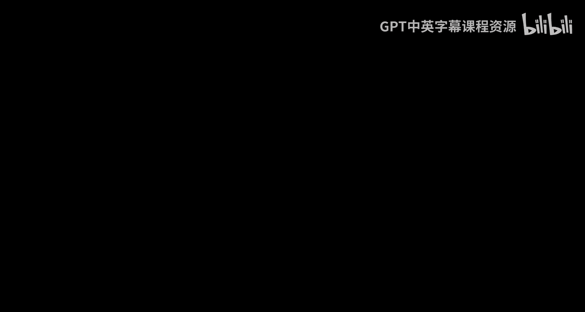
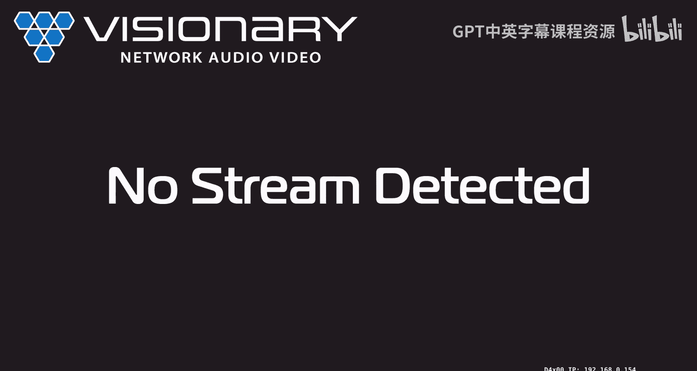
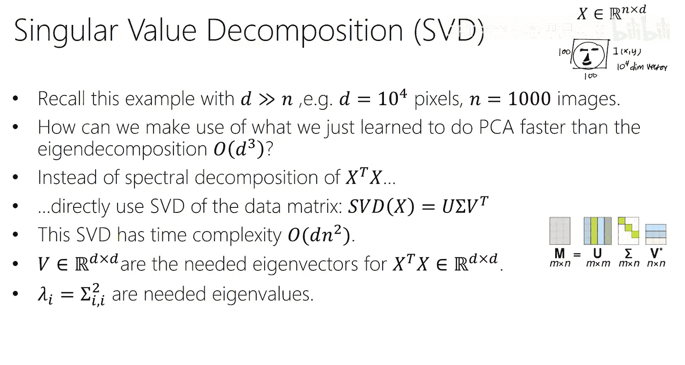

# 12：降维与PCA

在本节课中，我们将学习一种非常重要的无监督学习技术——主成分分析。我们将从介绍无监督学习的概念开始，然后深入探讨PCA的数学原理、算法步骤及其应用。最后，我们会简要介绍奇异值分解，这是一种更高效计算PCA的方法。

## 无监督学习简介

上一节我们完成了关于Transformer架构的讨论。本节中，我们来看看机器学习中另一个重要的领域：无监督学习。

在监督学习中，我们处理的是带有标签的数据对 `(X, y)`。而在无监督学习中，我们只有输入数据 `X`，没有对应的目标变量 `y`。那么，我们能用这些数据做什么呢？

以下是几种常见的无监督学习任务：
*   **降维**：当数据特征维度非常高时，我们可能希望在不丢失太多信息的前提下，减少特征的数量，使数据处理和分析更加容易。
*   **聚类**：将数据样本分组，使得组内样本彼此相似，组间样本差异较大。
*   **表示学习**：学习如何将原始特征空间转换到一个新的、对后续任务更有帮助的特征空间。
*   **密度估计**：估计数据背后的概率分布。
*   **生成建模**：学习数据的分布，以便生成新的、类似的数据样本（例如，大型语言模型）。

## 降维与流形假设

降维是无监督学习中的一个核心任务。其背后的一个关键思想是**流形假设**。

流形假设认为，现实世界中的高维数据往往分布在一个低维的**流形**附近。流形是一个数学概念，粗略地说，它是一个局部类似于欧几里得空间的低维结构。

例如，一个三维空间中的瑞士卷形状数据，虽然坐标是三维的 `(x, y, z)`，但本质上可以用两个坐标（沿着卷的长度和环绕的角度）来唯一确定每个点，而不丢失信息。这意味着数据实际上“生活”在一个二维流形上。

降维的目标之一就是找到这个低维流形，将数据**嵌入**到这个低维空间中。

## 主成分分析：核心思想

主成分分析是一种经典且广泛使用的线性降维技术。它的目标是为数据找到一组新的正交基（称为主成分），使得当数据投影到这组基上时，能够最大程度地保留原始信息。

我们可以从两个等价的角度来理解PCA：

1.  **最大方差角度**：第一个主成分方向是数据投影后方差最大的方向。第二个主成分方向是与第一个正交的方向中，投影后方差最大的方向，依此类推。保留方差最大的方向，意味着保留了数据中最主要的变异信息。
2.  **最小重构误差角度**：PCA寻找一组基，使得当数据用这组基的前K个分量（即降维后）来近似重构时，重构数据与原始数据之间的误差（通常用欧氏距离衡量）最小。

这两个视角在数学上是等价的。

## PCA算法步骤

接下来，我们一步步地看PCA的具体算法流程。

### 第一步：数据预处理（中心化）

首先，我们必须对每个特征进行**中心化**处理，即减去该特征的均值，使得每个特征的均值为0。

**公式**：`X_centered = X - mean(X)`

中心化是必要的。如果不中心化，第一个主成分可能会指向数据的均值方向，而不是数据变异最大的方向。

### 第二步：计算协方差矩阵

假设我们有 `n` 个数据点，每个点有 `d` 个特征。中心化后的数据矩阵为 `X`（`n x d` 维）。我们计算其协方差矩阵 `Σ`。

**公式**：`Σ = (1/(n-1)) * X^T * X`

这是一个 `d x d` 的对称矩阵，描述了不同特征之间的协方差关系。

### 第三步：特征分解（谱分解）

我们对协方差矩阵 `Σ` 进行特征分解（谱分解）。

**公式**：`Σ = Q Λ Q^T`
*   `Q` 是一个 `d x d` 的正交矩阵，其列向量 `q_i` 就是特征向量，也就是我们寻找的**主成分方向**。
*   `Λ` 是一个 `d x d` 的对角矩阵，对角线上的元素 `λ_i` 是特征值。特征值 `λ_i` 的大小代表了其对应的主成分方向所携带的方差量。

特征分解后，我们按特征值从大到小对特征向量进行排序。`λ_1` 最大，对应的 `q_1` 是第一主成分；`λ_2` 次之，对应 `q_2`，依此类推。

### 第四步：选择主成分与降维

现在我们需要决定保留多少个主成分 `k`（`k < d`）。这通常通过观察**累计方差贡献率**来决定。

每个主成分的方差贡献率为：`λ_i / (λ_1 + λ_2 + ... + λ_d)`
累计方差贡献率是前 `k` 个贡献率的和。

我们绘制累计方差贡献率随 `k` 变化的曲线（碎石图），通常选择在曲线拐点（斜率明显变缓）处的 `k` 值，作为降维后的维度。

### 第五步：数据投影（得到低维表示）

我们选取前 `k` 个特征向量组成矩阵 `Q_k`（`d x k` 维）。将中心化后的原始数据投影到这个低维空间上，得到降维后的数据表示 `Z`，也称为主成分得分。

**公式**：`Z = X_centered * Q_k`

`Z` 是一个 `n x k` 的矩阵，即每个原始数据点现在用 `k` 个新特征（主成分得分）表示。

### 第六步：数据重构（可选）

为了评估降维效果或可视化，我们可以将低维数据 `Z` 重构回原始的高维空间。由于我们丢弃了 `(d-k)` 个主成分，重构会有损失。

**公式**：`X_reconstructed = Z * Q_k^T + mean(X)`

这里的 `X_reconstructed` 是使用 `k` 个主成分对原始数据的最佳线性近似。

## PCA实例：特征脸

一个著名的PCA应用是“特征脸”。假设我们有一个包含许多人脸图像的数据集，每张图像是 `32x32=1024` 像素。将每张图像拉平成一个1024维的向量。

对这个人脸数据矩阵进行PCA：
*   计算得到的特征向量 `q_i` 本身也是1024维的向量，可以重新reshape成 `32x32` 的图像。这些图像看起来像是模糊的人脸基图像，因此被称为“特征脸”。
*   第一特征脸对应方差最大的方向，捕捉了所有人脸共有的最显著模式（如背景和平均脸结构）。
*   更高阶的特征脸捕捉了更细微的、频率更高的变化模式（如眼睛、嘴巴的细节）。
*   我们可以用前100个特征脸来近似表示任何一张原始人脸，只需存储100个系数（主成分得分），从而实现了大幅度的数据压缩。重构后的人脸虽然丢失了一些细节，但视觉上仍然可辨认。

## 奇异值分解：一种更高效的计算方法

直接对 `d x d` 的协方差矩阵进行特征分解，计算复杂度是 `O(d^3)`。当特征维度 `d` 非常大（例如，图像像素很多）时，这会非常耗时。

更高效的方法是使用**奇异值分解**直接对中心化后的数据矩阵 `X`（`n x d` 维）进行操作。

SVD将矩阵 `X` 分解为：
**公式**：`X = U S V^T`
*   `U` 是 `n x n` 的正交矩阵。
*   `S` 是 `n x d` 的矩形对角矩阵，对角线上的元素称为**奇异值** `σ_i`。
*   `V` 是 `d x d` 的正交矩阵，其列向量 `v_i` 被称为右奇异向量。

关键联系在于：
*   PCA所需要的特征向量 `q_i` 正是SVD中的右奇异向量 `v_i`。
*   PCA中的特征值 `λ_i` 与奇异值 `σ_i` 的关系为：`λ_i = (σ_i^2) / (n-1)`。

因此，我们可以**跳过显式计算协方差矩阵 `X^T X` 的步骤**，直接对数据矩阵 `X` 进行SVD，并从结果中提取 `V` 的前 `k` 列作为主成分方向。当 `n < d`（样本数少于特征数）时，SVD的计算效率远高于直接的特征分解。

## 总结

本节课中我们一起学习了主成分分析这一核心的无监督降维技术。
*   我们首先了解了无监督学习的目标和流形假设。
*   然后，我们从最大方差和最小重构误差两个角度理解了PCA的直观思想。
*   我们详细拆解了PCA的标准算法步骤：中心化、计算协方差、特征分解、选择主成分、投影降维。
*   我们通过“特征脸”的例子看到了PCA的强大应用。
*   最后，我们介绍了使用奇异值分解来高效计算PCA的数学原理和实用优势。

PCA作为一种基础方法，不仅本身用途广泛，也为理解更复杂的非线性降维和表示学习模型奠定了基础。