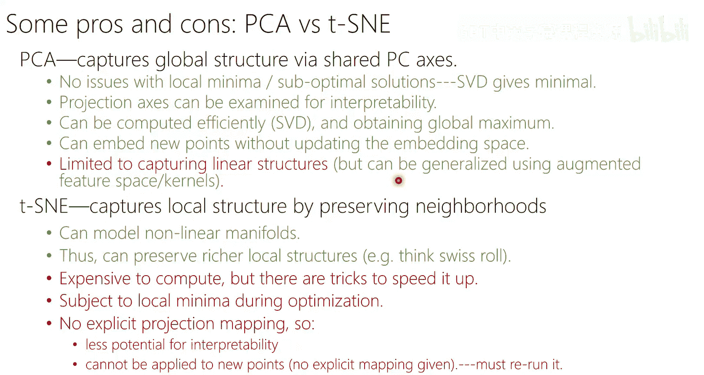
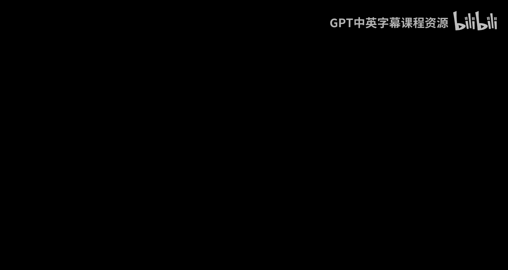

# 13：t-SNE降维教程 🧠

在本节课中，我们将学习一种非常流行的非线性降维方法——t-SNE。我们将从回顾PCA开始，逐步引入非线性降维的思想，最终详细讲解t-SNE的原理、算法及其优缺点。本教程旨在让初学者能够轻松理解。

---

## 概述：从线性到非线性降维

上一节我们介绍了主成分分析（PCA），它是一种通过寻找全局最大方差方向来进行线性降维的方法。然而，对于许多复杂的数据结构（如“瑞士卷”或MNIST手写数字），线性方法可能无法有效地揭示数据的真实低维流形结构。

本节中，我们将探讨如何超越线性假设，学习一种旨在**保持数据局部邻域结构**的非线性降维技术——t-SNE。

---

## PCA回顾与局限

PCA通过奇异值分解（SVD）或协方差矩阵的特征分解，为数据找到一组最优的正交基。新的低维表示通过将原始数据投影到这组基上获得。

**核心公式**：
若数据矩阵为 `X`（已中心化），其协方差矩阵为 `C = X^T X / (n-1)`。PCA求解 `C` 的特征值和特征向量。低维表示 `Z` 可通过 `Z = X V_k` 计算，其中 `V_k` 是前 `k` 个特征向量组成的矩阵。

然而，PCA存在局限：
*   **全局线性**：PCA寻找的是适用于所有数据点的全局线性变换。对于非线性流形上的数据（如瑞士卷），这种全局线性投影无法“展开”数据。
*   **高斯假设**：虽然PCA不严格要求数据服从高斯分布，但其“最大方差方向”的直觉在高斯分布或单峰分布的数据上效果最好。对于多类别、多簇结构的数据，PCA可能无法很好地区分。

---

## 引入非线性：从ISOMap到t-SNE

为了处理非线性结构，我们需要放弃全局线性变换的思想，转而关注如何**保持数据点之间的局部邻近关系**。

### ISOMap：基于邻域图的降维

ISOMap是这一思路的早期代表。其核心思想是：两点间的“距离”不应是欧氏距离，而应是在数据流形上沿着邻域图行走的**测地线距离**。

**算法步骤简述**：
1.  为每个数据点确定其 `k` 个最近邻（根据欧氏距离）。
2.  构建 `k`-近邻图，将每个点与其 `k` 个近邻连接。
3.  计算图中任意两点之间的最短路径距离（例如使用Dijkstra算法），得到距离矩阵 `D`。
4.  对距离矩阵 `D` 应用**多维缩放（MDS）**，从而得到低维嵌入 `Y`。MDS试图找到一组低维点，使得这些点之间的欧氏距离矩阵尽可能接近给定的距离矩阵 `D`。

ISOMap成功的关键在于邻域大小 `k` 的选择。`k` 太小可能导致图不连通；`k` 太大则可能短路流形，将本不该邻近的点连接起来。

### 随机邻域嵌入（SNE）：软化邻域概念

SNE对ISOMap的“硬”邻域分配进行了改进，引入了**概率**来描述点与点之间的邻近关系，使其更加鲁棒。

**核心思想**：
对于高维空间中的点 `x_i`，我们定义点 `x_j` 是 `x_i` 的“邻居”的概率。这个概率与以 `x_i` 为中心的高斯分布密度成正比。

**高维空间概率公式**：
`p_{j|i} = exp(-||x_i - x_j||^2 / (2σ_i^2)) / (∑_{k≠i} exp(-||x_i - x_k||^2 / (2σ_i^2)))`
这里，`σ_i` 是以 `x_i` 为中心的高斯分布的方差（带宽参数）。`p_{j|i}` 可以理解为：如果 `x_i` 要挑选一个邻居，它选中 `x_j` 的概率。

为了使概率对称，定义联合概率：
`p_{ij} = (p_{j|i} + p_{i|j}) / (2n)`

**带宽参数 `σ_i` 的设置**：
SNE通过设定一个称为**困惑度（Perplexity）** 的超参数来为每个点 `x_i` 自动选择 `σ_i`。困惑度可以理解为对有效邻居数量的平滑度量。通过二分搜索调整 `σ_i`，使得条件概率分布 `P_i` 的熵等于 `log2(Perplexity)`。

**低维空间与优化目标**：
现在，我们假设存在一个低维表示 `Y = {y_1, y_2, ..., y_n}`。在低维空间中，我们同样用高斯分布定义点之间的邻近概率（通常固定方差为 `1/√2`）：

`q_{ij} = exp(-||y_i - y_j||^2) / (∑_{k≠l} exp(-||y_k - y_l||^2))`

SNE的目标是让低维空间中的邻近分布 `Q` 尽可能匹配高维空间中的邻近分布 `P`。衡量两个分布差异的指标是**KL散度**。

**损失函数（成本函数）**：
`C = KL(P || Q) = ∑_i ∑_j p_{ij} log(p_{ij} / q_{ij})`

通过梯度下降法最小化这个损失函数 `C`，我们可以优化低维表示 `Y`。

---

## t-SNE：解决“拥挤问题”

SNE存在一个称为“拥挤问题”的缺陷：在高维空间中，中等距离的点在低维空间中可能没有足够的空间来摆放。为了在低维空间中保持局部结构，中距离的点会被挤到远离的位置。

t-SNE对SNE做了一个关键改进：**在低维空间中使用学生t分布（自由度为1，即柯西分布）代替高斯分布来定义邻近概率**。

**低维空间概率公式（t-SNE）**：
`q_{ij} = (1 + ||y_i - y_j||^2)^{-1} / (∑_{k≠l} (1 + ||y_k - y_l||^2)^{-1})`

**为何有效？**
学生t分布比高斯分布具有更**重的尾部**。这意味着：
1.  在低维空间中，对于**相距较远**的点，`q_{ij}` 不会变得像高斯那样小。这减轻了将中距离点推开以匹配极小 `p_{ij}` 的压力。
2.  它自然地在低维空间中产生了“排斥力”，使得不属于同一簇的点能够更好地分开。

高维空间的概率 `p_{ij}` 计算方式与SNE相同（使用高斯分布）。损失函数和优化方法（梯度下降）保持不变。

### t-SNE算法流程

以下是t-SNE算法的简要步骤：

1.  **输入**：高维数据 `X`，目标维度 `d`，困惑度 `Perp`，迭代次数 `T`，学习率 `η`。
2.  **计算高维相似度 `P`**：
    *   对于每个点 `x_i`，通过二分搜索找到 `σ_i`，使得条件分布 `P_{i|.}` 的困惑度等于 `Perp`。
    *   计算 `p_{j|i}`，然后对称化得到 `p_{ij}`。
3.  **初始化低维表示 `Y`**：通常从均值为0、方差很小的正态分布中随机采样初始化 `y_i`。
4.  **迭代优化**：
    *   `for t = 1 to T`：
        *   根据当前 `Y`，使用t分布公式计算低维相似度 `q_{ij}`。
        *   计算损失函数 `C = KL(P || Q)`。
        *   计算损失函数关于 `Y` 的梯度 `∂C/∂Y`。
        *   更新 `Y = Y - η * ∂C/∂Y`。（实践中常使用动量加速）
5.  **输出**：优化后的低维表示 `Y`。

---

## t-SNE vs PCA：对比总结

本节课我们一起学习了t-SNE，现在我们来总结其与PCA的主要区别：

| 特性 | PCA | t-SNE |
| :--- | :--- | :--- |
| **类型** | 线性降维 | 非线性降维 |
| **目标** | 保留全局方差（协方差结构） | 保留局部邻域结构 |
| **优化** | 通过SVD/特征分解得到全局最优解 | 通过梯度下降寻找（局部）最优解，结果受初始化和超参数影响 |
| **可解释性** | **强**。主成分（特征向量）有明确含义（如“特征脸”）。 | **弱**。仅得到点的低维坐标，没有全局的“基”或映射函数。 |
| **外样本投影** | **容易**。得到投影矩阵后，新点可直接投影。 | **困难**。需要重新运行整个优化过程或训练一个回归模型来近似映射。 |
| **计算成本** | 相对较低（`O(min(mn^2, m^2n))`）。 | 较高（`O(n^2)`，需要计算所有点对相似度）。 |
| **主要用途** | 数据压缩、去噪、特征提取、可视化（适用于线性或近似线性结构）。 | **高维数据可视化**（特别适用于探索聚类和流形结构）。 |
| **超参数** | 主成分数量 `k`。 | 困惑度 `Perplexity`（最重要），学习率、迭代次数。 |

**重要提示**：
t-SNE是一种强大的**探索性可视化工具**，但其结果需要谨慎解读。不同的超参数（尤其是困惑度）和随机初始化可能产生不同的可视化结果。它不适合作为特征提取的预处理步骤，也不应仅基于t-SNE图就做出严格的科学结论。

---

## 总结

本节课中，我们一起学习了非线性降维方法t-SNE。我们从PCA的局限性出发，介绍了基于保持局部邻域结构的ISOMap思想，然后深入讲解了通过概率化邻域关系来改进的SNE算法，最后引出了使用学生t分布解决“拥挤问题”的t-SNE。我们详细阐述了t-SNE的原理、算法步骤，并将其与PCA进行了全面对比。理解t-SNE有助于我们在面对复杂高维数据时，选择合适的工具进行有效的可视化分析。