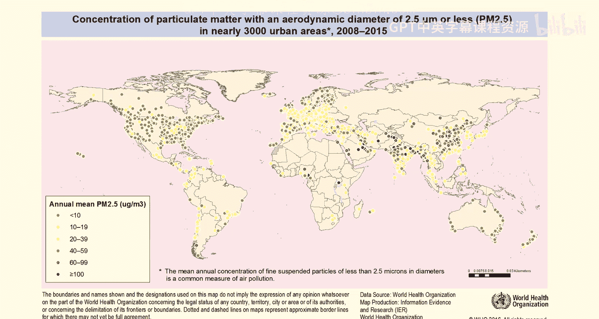
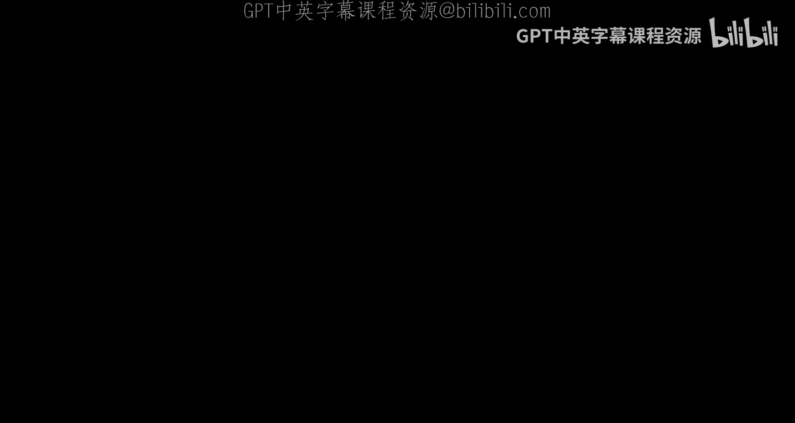
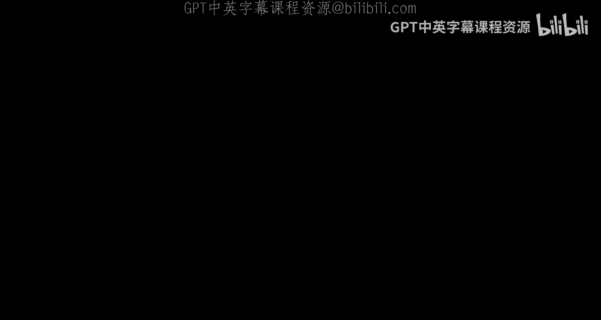
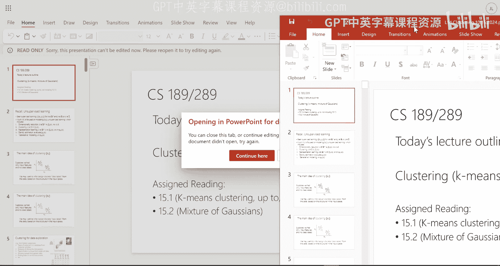
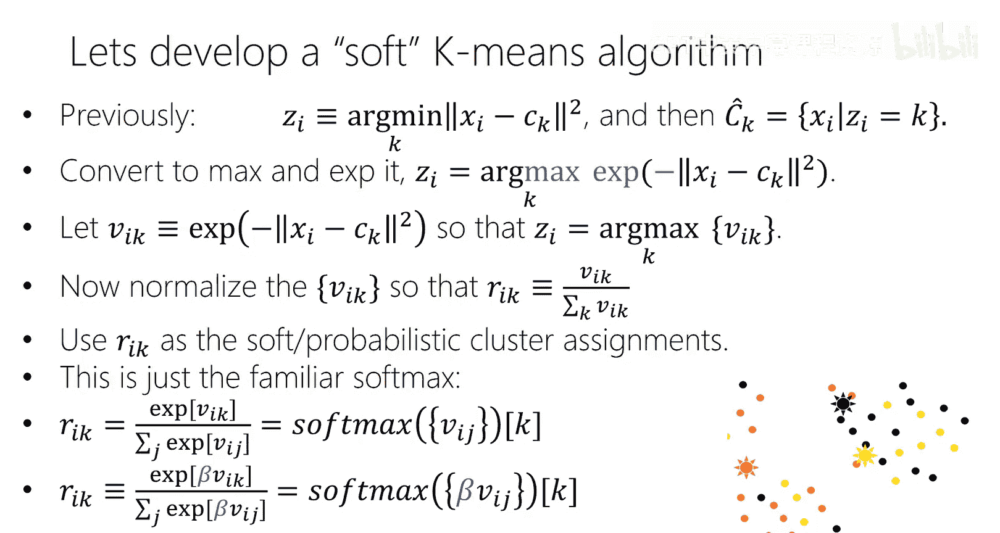
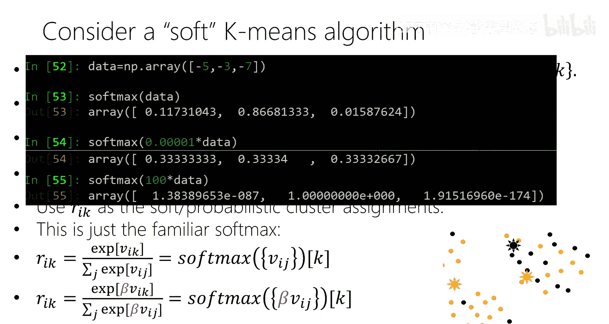
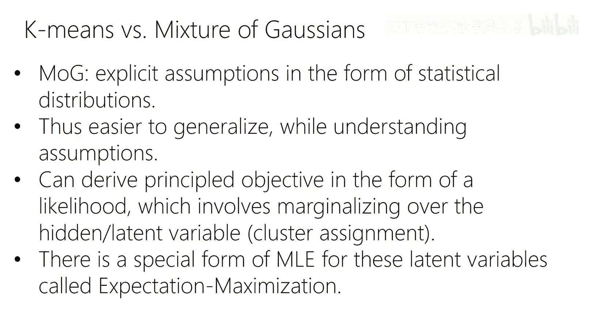

# 14：聚类

## 概述
在本节课中，我们将要学习一种重要的无监督学习方法——聚类。我们将从直观概念入手，逐步深入到具体的算法和模型，特别是K均值算法和高斯混合模型。我们将学习如何将数据点分组到不同的簇中，即使没有预先定义的标签。

---

## 聚类简介
上一节我们介绍了降维，本节中我们来看看另一种无监督学习任务：聚类。聚类的目标是将数据集中的每个样本映射到一个离散的标签，但这个标签不是预先给定的，而是通过算法在数据中寻找模式，将相似的数据点聚集在一起形成的。

例如，想象一个二维数据集，我们可以直观地看到一些点彼此更相似，聚类算法会为这些相似的点分配相同的标签。在高维空间中，这种模式无法直观看到，因此我们需要算法来帮助我们完成这个任务。

聚类通常用于数据探索，帮助我们理解数据。例如，电商公司可能根据用户的登录频率、购买次数等特征对用户进行聚类，以发现不同的客户类型，从而指导营销策略。

以下是聚类的一些常见应用场景：
*   **客户细分**：根据用户行为特征（如登录频率、购买记录）对用户进行聚类，以识别不同的客户群体。
*   **疾病亚型分析**：对患有同一种疾病（如高血压）的患者进行基因数据聚类，以发现不同的疾病亚型。
*   **单细胞数据分析**：根据细胞中基因的表达量对细胞进行聚类，以识别不同的细胞类型。
*   **异常检测**：识别那些不属于任何主要簇的数据点，这些点可能是异常值。

---

## 聚类方法概述
聚类主要有三种广泛使用的方法。本课程将重点介绍第三种方法。

1.  **层次聚类**：这种方法需要定义数据点之间的距离。算法从每个点作为一个簇开始，然后递归地合并最相似的两个簇，形成一个树状结构（树状图）。通过在不同高度切割这棵树，可以得到不同数量的簇。
2.  **划分式聚类**：这种方法直接定义对数据划分的代价函数，并寻找最优划分。例如，图割方法将数据点视为图中的节点，通过切割边权重最小的方式将图划分为不同的部分。
3.  **基于模型的聚类**：这是我们本节课的重点。我们首先会学习一个非常著名且古老的算法——K均值，然后将其扩展为一个概率模型，即高斯混合模型。在基于模型的方法中，距离的概念通过概率分布来体现。

---

## K均值聚类
K均值是一种基于质心的聚类方法。每个簇由一个质心代表，质心是输入空间中的一个点（不一定是数据点本身），它代表了该簇中所有点的中心位置。

### 模型定义
K均值模型有一个超参数 **K**，即我们期望的簇的数量。模型的目标是找到K个质心，并将每个数据点分配给离它最近的质心所在的簇，同时最小化所有数据点到其所属簇质心的总距离。

**公式**：损失函数定义为：
`L = Σ_{k=1}^{K} Σ_{i ∈ C_k} ||x_i - μ_k||^2`
其中，`C_k` 是分配给第k个簇的数据点集合，`μ_k` 是第k个簇的质心。

### 算法：Lloyd算法
K均值通常使用Lloyd算法（也称为K均值算法）进行优化。这是一个交替优化过程，保证每次迭代都能降低损失函数的值，并最终收敛到一个局部最优解。

以下是算法的具体步骤：
1.  **初始化**：随机选择K个数据点作为初始质心。
2.  **分配步骤**：对于每个数据点 `x_i`，计算其到所有质心 `μ_k` 的距离，并将其分配给距离最近的质心所在的簇。
    `z_i = argmin_k ||x_i - μ_k||^2`
3.  **更新步骤**：对于每个簇 `k`，重新计算其质心，即该簇内所有数据点的均值。
    `μ_k = (1 / |C_k|) Σ_{i ∈ C_k} x_i`
4.  **迭代**：重复步骤2和步骤3，直到质心的位置不再发生变化（或变化很小），此时算法收敛。

### 算法演示与讨论
通过一个二维数据集的动画演示，我们可以看到Lloyd算法如何从随机初始化的簇分配开始，通过交替执行分配和更新步骤，最终收敛到一个清晰的聚类结果。

需要指出的是，K均值算法存在一些局限性：
*   **局部最优**：损失函数是非凸的，算法容易陷入局部最优解。解决方案通常是多次运行算法，选择结果最好的那次。
*   **超参数K的选择**：与PCA类似，我们可以通过“肘部法则”来选择K值。绘制不同K值对应的损失函数值，选择损失函数下降速度突然变缓的点（肘部）作为K值。
*   **球形簇假设**：K均值使用欧氏距离，这隐含地假设每个簇是球形的。对于拉长的或非球形的簇结构，K均值可能无法得到理想的结果。

---

## 从硬K均值到软K均值
K均值算法为每个数据点进行“硬分配”，即一个点只能属于一个簇。当数据点位于两个簇的边界附近时，这种硬性决策可能不够合理。

我们可以将硬分配“软化”，允许数据点以一定的概率属于多个簇。这通过将最小距离决策转换为一个Softmax函数来实现。

**公式**：软分配概率定义为：
`r_{ik} = exp(-β ||x_i - μ_k||^2) / Σ_{j=1}^{K} exp(-β ||x_i - μ_j||^2)`
其中，`r_{ik}` 表示数据点 `i` 属于簇 `k` 的概率，`β` 是一个控制分布“尖锐”程度的参数（称为逆温度参数）。当 `β` 很大时，软分配趋近于硬分配。

在软K均值中，更新质心时，不再是计算簇内点的简单平均，而是计算所有点的加权平均，权重就是该点属于该簇的概率 `r_{ik}`。

**公式**：更新后的质心为：
`μ_k = (Σ_{i=1}^{N} r_{ik} * x_i) / (Σ_{i=1}^{N} r_{ik})`

---

## 高斯混合模型
软K均值为我们引入了概率思想，而高斯混合模型则是一个完全的概率生成模型，它是软K均值的自然扩展，也是聚类中最常用的概率模型之一。

### 模型定义
高斯混合模型假设数据是由K个高斯分布混合生成的。每个高斯分布代表一个簇，有自己的均值 `μ_k` 和协方差矩阵 `Σ_k`。此外，还有一个混合权重 `π_k`，表示数据点来自第k个高斯分布的先验概率。

**公式**：高斯混合模型的概率密度函数为：
`p(x) = Σ_{k=1}^{K} π_k * N(x | μ_k, Σ_k)`
其中，`Σ_{k=1}^{K} π_k = 1`，`N(x | μ_k, Σ_k)` 是第k个高斯分布的概率密度。

### 引入隐变量
为了便于推导和计算，我们引入一个隐变量 `z`，它表示数据点 `x` 来自于哪个高斯分量。`z` 是一个K维的one-hot向量。

**公式**：联合概率分布可以分解为：
`p(x, z) = p(z) * p(x|z)`
其中，`p(z_k=1) = π_k`，`p(x | z_k=1) = N(x | μ_k, Σ_k)`。

通过边缘化隐变量 `z`，我们可以得到观测数据 `x` 的似然函数：
`p(x) = Σ_{z} p(x, z) = Σ_{k=1}^{K} π_k * N(x | μ_k, Σ_k)`

### 与K均值的联系
高斯混合模型比K均值更强大：
*   **灵活的簇形状**：通过协方差矩阵 `Σ_k`，每个簇可以是任意椭圆形状，而不仅仅是球形。
*   **概率输出**：模型可以给出数据点属于每个簇的概率，而不仅仅是硬标签。
*   **生成能力**：在估计参数后，我们可以从模型中采样生成新的数据点。

当高斯混合模型中每个分量的协方差矩阵趋于0（即方差无限小）时，模型会退化为K均值。

### 参数估计：期望最大化算法
高斯混合模型的参数（`π_k`, `μ_k`, `Σ_k`）通常使用期望最大化算法进行估计。EM算法也是一个交替优化过程：
1.  **E步（期望步）**：基于当前参数，计算每个数据点 `x_i` 属于每个簇 `k` 的后验概率（责任值 `γ_{ik}`）。
    `γ_{ik} = π_k * N(x_i | μ_k, Σ_k) / Σ_{j=1}^{K} π_j * N(x_i | μ_j, Σ_j)`
2.  **M步（最大化步）**：基于E步计算出的责任值，更新模型参数，以最大化数据的期望似然。
    `μ_k = (Σ_i γ_{ik} * x_i) / (Σ_i γ_{ik})`
    `Σ_k = (Σ_i γ_{ik} * (x_i - μ_k)(x_i - μ_k)^T) / (Σ_i γ_{ik})`
    `π_k = (Σ_i γ_{ik}) / N`

---

## 总结
本节课中我们一起学习了聚类这一核心的无监督学习技术。

我们首先了解了聚类的直观概念和应用场景。然后，我们深入探讨了最经典的K均值算法，包括其损失函数、Lloyd优化算法以及其优缺点（如局部最优、球形假设）。

为了克服硬分配的局限性，我们引入了软K均值的概念。最后，我们系统学习了高斯混合模型这一概率框架。GMM通过引入隐变量和EM算法，提供了更灵活的簇形状建模能力、概率化的簇分配以及生成新数据的能力，是聚类中一个强大而通用的工具。

从K均值到高斯混合模型，我们看到了如何将一个启发式算法逐步完善为一个有坚实概率基础、可扩展的统计模型，这是机器学习中一个典型的思想发展路径。