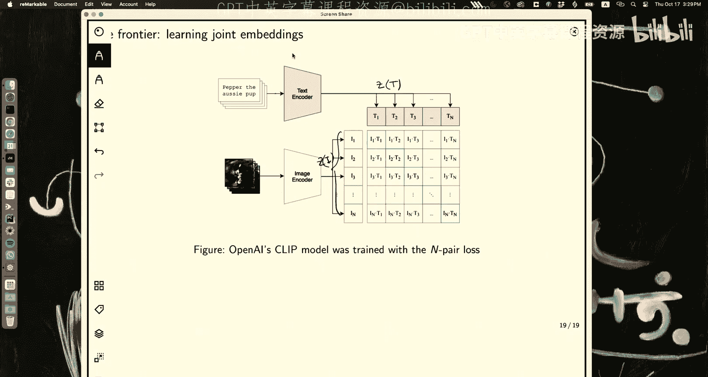

# 15：最近邻与度量学习 👨‍🏫

在本节课中，我们将要学习两种重要的机器学习方法：K最近邻分类器和度量学习。我们将从最简单直观的非参数模型开始，探讨其优缺点，并引出在高维数据中遇到的“维度灾难”问题。为了解决这个问题，我们将深入度量学习，特别是对比学习，了解如何通过学习一个更好的数据表示空间来提升模型性能。最后，我们将以OpenAI的CLIP模型作为度量学习的一个前沿应用来结束课程。

---

## 参数模型 vs. 非参数模型 🤔

到目前为止，本课程主要关注的是参数模型。我们从线性回归、逻辑回归、Softmax回归开始学习。随后我们了解到，通过神经网络参数化模型，我们可以建立损失函数并计算梯度。

这类模型的优点在于，参数是可以通过数据一次性估计出来的。在估计出参数后，你甚至可以丢弃数据。整个预测模型都封装在参数 θ 中，θ 就是一切。

但在另一个极端，存在一类称为非参数模型的模型。本节课将重点讨论分类问题中的非参数模型。它与参数模型截然相反，基本上不需要“训练”，但你必须存储并保留你的数据集。在进行预测时，你需要实时访问这些数据。

因此，你可以认为参数化这个模型的就是数据集本身。随着数据集的增长，模型的有效参数数量也在增长。这是统计模型中两种极端的范式，各有其优缺点。

---

## 度量空间与距离 📏

本节课的核心是“邻近”的概念。我们首先需要从数学上理解“邻近”，这就是度量空间的概念。

度量空间的定义非常简单。你有一个集合，并定义一个函数作为该集合中元素之间的距离度量。

距离函数 d 是一个映射，它将两个元素 x 和 x‘ 映射到一个实数。这个函数必须满足几条公理：
*   自反性：一个对象到自身的距离为 0。
*   对称性：距离是对称的。
*   非负性：距离总是非负的。
*   三角不等式：对于任意三个点 x1, x2, x3，有 **d(x1, x3) ≤ d(x1, x2) + d(x2, x3)**。

满足这些公理的距离函数有很多种。本节课最相关的一种是马氏距离，它是欧氏距离的推广，其中 M 是一个半正定矩阵。当 M 是单位矩阵时，马氏距离就退化为我们熟悉的欧氏距离。

---

## K最近邻分类器 🎯

K最近邻分类器正如其名，它的设置包含四个步骤：
1.  存储训练集：你需要将整个训练集保存在某个地方。
2.  无需训练：这一步没有传统的“训练”过程。
3.  在测试时，当一个新测试点 x 到来时，你需要在存储的数据集 D 中，根据选定的度量（通常使用欧氏距离），找到与 x 最接近的 K 个点。
4.  我们记这个包含 K 个最近邻点的集合为 N_K(x)。

以下是一个具体的例子。图中已有的点是带有标签（0 或 1）的训练数据。一个新的测试点 x 到来。我们设定 K=5，并找到距离 x 最近的 5 个点，这就是我们的 N_K(x) 集合。

接下来，我们需要估计后验概率 P(y | x)。我们通过在这个邻域集合内进行计数来定义它：

**P(y = c | x) = (1/K) * Σ_{i ∈ N_K(x)} I(y_i = c)**

其中 I(.) 是指示函数。对于每个类别 c，我们统计在 N_K(x) 集合中属于该类别的点的数量，然后除以 K。

在这个例子中，对于类别 1，有 3 个点，所以 P(y=1 | x) = 3/5。对于类别 0，有 2 个点，所以 P(y=0 | x) = 2/5。很容易验证，所有类别的概率之和为 1。

对于回归任务，流程非常相似。训练阶段相同，存储数据集。在推断时，对于一个测试点 x，我们同样找到它的 K 个最近邻 N_K(x)。预测值 ŷ 则取这些邻居对应目标值 y_i 的平均值：

**ŷ = (1/K) * Σ_{i ∈ N_K(x)} y_i**

---

## K=1 的特殊情况与Voronoi图 🧩

K=1 的情况比较特殊，它与乌克兰数学家Voronoi的研究相关，形成了所谓的Voronoi镶嵌或 mosaics。

让我们做一个思想实验。假设数据集中每个点都有不同的标签。在 1-最近邻 的策略下，我们想知道空间中的哪些区域会被分类为某个特定样本点。

这实际上将空间划分成了多个线性区域。可以证明，这些决策边界总是线性的。证明思路是：边界是到两个中心点距离相等的点的集合。设这两个中心点为 x_A 和 x_B，边界条件为 **||x - x_A|| = ||x - x_B||**。展开后，两边的平方项 **||x||^2** 会抵消，最终只剩下关于 x 的线性项。

当然，现实中每个类别通常不止一个样本点。我们可以将属于同一类别的点的 Voronoi 区域合并起来，这样就得到了最终的分类决策区域。这正是最近邻分类器工作原理的直观体现。

---

## K 值的作用与偏差-方差权衡 ⚖️

K 值在 KNN 中起着至关重要的作用。这里我们可以暂停思考一下。

我们来看一个真实数据集的例子，其中有大约 200 个训练点。左边是某个 K 值的分类结果，右边是另一个 K‘ 值的分类结果。

你能猜出左边是 K=1 的情况吗？是的，例如，围绕某个孤立点的非常紧凑的决策边界表明它只考虑了最近的一个点。这通常会导致过拟合，除非问题非常简单，否则 K=1 通常不是好选择。

那么右边的 K‘ 是多少呢？它可能是 15。当 K 值较大时，决策边界更加平滑。

一个极端情况是，当 K 等于甚至大于样本总数 N 时，我们之前定义的分布会退化成什么？它会退化为先验概率，即 **P(y=c | x) ≈ N_c / N**，其中 N_c 是类别 c 的样本数。此时，预测与测试点 x 无关，模型变得极其简单。

这引出了机器学习中一个非常普遍且重要的概念：偏差-方差权衡。虽然后续会有专门讲座，但在此结合 KNN 讨论非常合适。

模型的复杂度可以用 **N / K** 来粗略衡量。当 K 很小时，模型复杂，训练误差可以很低（K=1 时训练误差为 0），但容易过拟合，测试误差较高，此时方差大。当 K 很大时，模型简单，训练误差和测试误差都可能很高，此时偏差大。中间存在一个最佳区域，能在偏差和方差之间取得平衡，使测试误差最小。

---

## KNN 的一个概率论推导 🧮

之前我们对后验概率的定义非常直观。现在，我想给出一个基于生成式分类思想的“信封背面”式推导。

在生成式分类器中，我们需要类别条件概率 P(x | y=c) 和先验概率 P(y=c)。然后使用贝叶斯规则计算后验概率：**P(y=c | x) ∝ P(x | y=c) P(y=c)**。

我们可以这样估计类别条件概率：给定一个测试点 x，我们以一个球体包围它，并不断扩大这个球体，直到它恰好包含 K 个训练样本。设这个球体的体积为 V_K。那么，概率密度 P(x | y=c) 乘以体积 V_K，应该近似等于该体积内属于类别 c 的样本比例，即 **P(x | y=c) * V_K ≈ N_c(x) / N_c**，其中 N_c(x) 是球体内属于类别 c 的样本数，N_c 是整个数据集中属于类别 c 的样本总数。

由此可得 **P(x | y=c) ≈ (N_c(x)) / (V_K * N_c)**。将其代入贝叶斯公式：

**P(y=c | x) ∝ [N_c(x) / (V_K * N_c)] * (N_c / N) = N_c(x) / (V_K * N)**

对所有的类别 c‘ 求和进行归一化时，分母为 Σ_{c‘} N_{c‘}(x) / (V_K * N)。注意，Σ_{c‘} N_{c‘}(x) 就是球体内的总样本数，根据定义，它等于 K。所以分母等于 **K / (V_K * N)**。

最终，体积项 V_K 被抵消，我们得到：

**P(y=c | x) = N_c(x) / K**

这与我们最初直观的定义完全一致。这个推导的美妙之处在于，它从一个密度估计出发，最终又回到了简单的计数，而体积项在过程中自然消失了。

---

## KNN 的优点与缺点 📊

现在让我们总结一下 KNN 的好坏。

**优点：**
*   **无需训练**：设置简单快速。
*   **可以学习复杂函数**：通过控制 K 值，你可以调整模型的复杂度。
*   **易于调参**：通过一个验证集，可以快速找到适合当前问题的 K 值。

**缺点：**
*   **存储成本高**：需要保存整个训练集。
*   **推断速度慢**：对于每个测试点，都需要在整个数据集中搜索最近邻。
*   **在**高维空间中表现糟糕**：这是最严重的问题，源于“维度灾难”。在高维空间中，“邻近”的概念会失效，数据点之间变得异常稀疏，需要海量数据才能有效进行最近邻判断。

---

## 维度灾难与度量学习的引入 🚀

维度灾难是所有基于距离的算法的根本问题。在高维空间中，体积呈指数级增长，数据点变得极其稀疏。

一个简单的例子是：在一个边长为 2 的高维立方体中，中心处一个边长为 1 的小立方体所占的体积比例是 **(1/2)^d**。当维度 d 增加时，这个比例迅速趋近于 0。这意味着，要想让数据点“填满”空间或彼此靠近，所需的样本量 N 是指数级的。

从另一个角度看，如果我们希望以精度 ε 逼近一个样本点，所需的样本量 N 大约为 **ε^{-d}**。即使 ε 取一个中等大小的值（如 0.1），当维度 d 较大时，N 也会变得天文数字般巨大，这在实际中是无法实现的。

那么，如何打破维度灾难呢？完全解决它没有希望，但我们可以利用一个关键观察：现实世界的数据虽然存在于高维空间（如图像像素），但它们通常位于一个低维的流形上。例如，一张人脸图片的所有像素点，其实是由少数几个因素（如姿势、光照、表情）控制的。

因此，问题的核心变成了：**如何学习这个低维流形，或者说，如何将数据嵌入到一个更有意义的低维空间中？** 在这个嵌入空间中，我们再使用欧氏距离等度量来进行最近邻等操作。这样，问题的复杂性就从“在高维空间中找到好邻居”转移到了“学习一个好的嵌入映射函数”上。

---

## 度量学习与对比学习 🎨

度量学习旨在学习一个映射函数，将原始数据转换到一个新的特征空间，使得在这个新空间中，相似样本靠近，不相似样本远离。近年来，对比学习是度量学习中非常成功的一个范式。

所有对比学习方法的核心哲学都包含“拉近”和“推开”两项。我们希望将相似样本（正样本对）的嵌入表示拉近，同时将不相似样本（负样本对）的嵌入表示推开。

**1. Siamese Network (孪生网络)**
最早的对比学习工作之一。它使用一个共享权重的神经网络来处理两个输入。损失函数由两部分组成：
*   **拉近项**：如果两个样本标签相同（相似），则最小化它们嵌入向量之间的距离 **||f(x_i) - f(x_j)||**。
*   **推开项**：如果标签不同，则最大化它们之间的距离，但为了避免优化时无限推开，设置了一个边际 m，损失为 **max(0, m - ||f(x_i) - f(x_j)||)**。
这个损失函数的问题是拉近和推开项是分离的，每次只激活一项。

**2. Triplet Loss (三元组损失)**
为了解决上述问题，三元组损失同时考虑三个样本：锚点样本 x，一个正样本 x+，一个负样本 x-。
损失函数为：**L = max(0, ||f(x) - f(x+)||² - ||f(x) - f(x-)||² + m)**
为了最小化损失，网络需要拉近锚点与正样本的距离，同时拉大锚点与负样本的距离。但它的效率较低，因为每次只用一个负样本。

**3. N-Pair Loss & InfoNCE Loss**
为了提高效率，我们希望在一个批次中使用多个负样本。一个重要的进展是 InfoNCE 损失。其思想是将问题构建为一个多类分类任务：给定一个锚点，从多个候选（一个正样本，多个负样本）中识别出正样本。
通过将嵌入向量归一化到单位球面上，并使用点积作为相似度度量，InfoNCE 损失可以写成熟悉的 Softmax 交叉熵形式：
**L = -log [ exp(sim(z, z+)) / (exp(sim(z, z+)) + Σ_{k} exp(sim(z, z-_k)) ) ]**
这正是让模型学习将正样本对的相似度得分提高，同时降低与所有负样本对的相似度得分。

---

## 跨模态嵌入：CLIP 模型 🌐

对比学习的前沿应用之一是学习跨模态的联合嵌入空间。OpenAI 的 CLIP 模型是一个里程碑式的工作。

CLIP 的目标是将图像和文本描述嵌入到同一个向量空间中。它使用一个图像编码器和一个文本编码器，分别将图像和文本映射到同一个维度 d 的嵌入空间。

训练时，它利用互联网上大量（图像，文本描述）配对数据。对于一个批次中的 N 个（图像，文本）对，CLIP 将每张图像与所有文本描述计算相似度。损失函数鼓励配对（图像，对应文本）的相似度得分高，而非配对（图像，其他文本）的相似度得分低。这本质上就是一个大规模的 InfoNCE 损失。

通过这种方式，CLIP 学会了图像和文本在语义上的对齐。例如，“狗”的文本嵌入会靠近狗图片的图像嵌入，而远离猫图片的嵌入。这种联合嵌入能力是许多多模态应用（如图文生成模型 DALL-E）的基础。

---

## 总结 📝

本节课我们一起学习了机器学习的两个重要主题。

我们首先深入探讨了 **K最近邻分类器**，这是一种经典的非参数模型。我们了解了其工作原理、K值的选择如何影响模型复杂度以及背后的偏差-方差权衡，并推导了其概率论解释。同时，我们也认识到 KNN 在高维空间中会遭遇严重的维度灾难问题。

为了解决高维数据中距离度量失效的问题，我们引入了 **度量学习**。重点介绍了对比学习这一强大范式，从 Siamese Network 到 Triplet Loss，再到更高效的 InfoNCE Loss，其核心思想都是学习一个嵌入空间，使得语义相似的样本靠近，不相似的样本远离。

最后，我们以 **OpenAI 的 CLIP 模型** 作为案例，看到了对比学习如何用于学习跨模态（图像与文本）的联合语义表示，这代表了度量学习在前沿人工智能应用中的强大能力。

从最简单的最近邻到复杂的深度度量学习，我们看到了机器学习中一个核心思想的演进：寻找或学习一个适合问题的数据表示空间，往往比在原始空间中直接使用复杂算法更为有效。