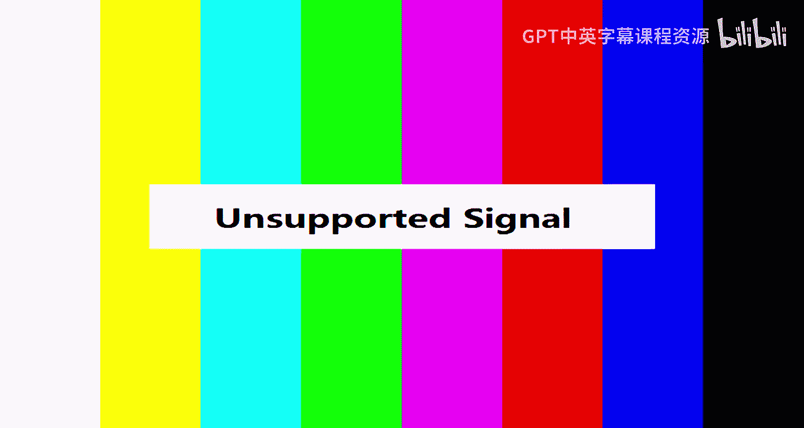
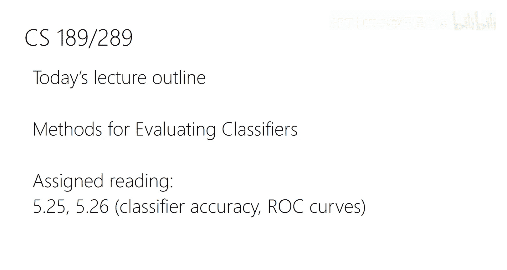
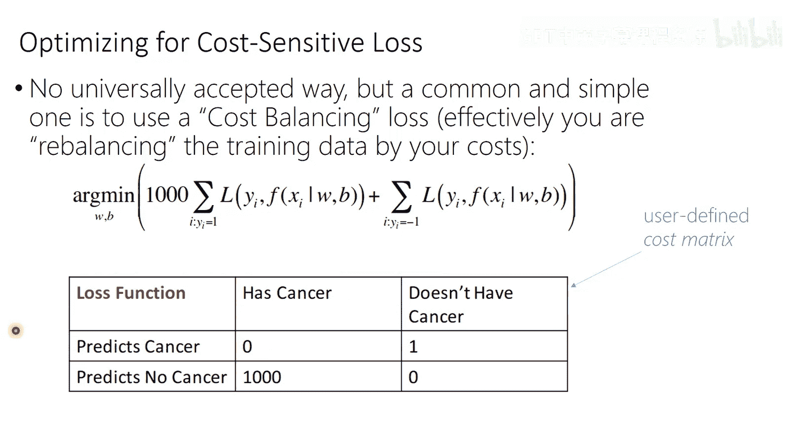

# 16：模型评估 🧠

在本节课中，我们将要学习如何评估分类器模型。我们将超越简单的准确率，深入探讨更精细的评估方法，特别是**ROC曲线**和**AUC**，这些工具能帮助我们理解模型在不同决策阈值下的表现，并比较不同模型的优劣。

---

## 概述 📋

评估分类器模型时，仅仅计算在某个阈值（如0.5）下的准确率是不够的。模型给出的分数（或概率）可能并未经过良好**校准**，这意味着分数不能直接解释为真实概率。此外，我们可能还需要比较像SVM这样不输出概率的模型。因此，我们需要一种与具体阈值和模型校准状态无关的评估框架。这就是**ROC曲线**和**AUC**的用武之地。

---

## 校准的概念 ⚖️

上一节我们提到了模型评估的挑战，本节中我们来看看一个关键概念：**校准**。

一个经过良好校准的概率分类器意味着：在所有被预测为具有概率 `p` 的样本中，真正属于该类的样本比例也恰好是 `p`。例如，在所有被模型预测为“猫”的概率为0.8的图片中，应有80%的图片确实是猫。

然而，许多模型（即使是使用最大似然估计训练的模型）在实践中可能并未完美校准。一个模型可能非常有区分能力（能很好地对样本排序），但其输出的数值却并非真实的概率。

---

## 从分数到决策：混淆矩阵 📊

为了从模型输出的连续分数（或未校准的概率）中得到分类决策，我们必须选择一个**决策阈值**。根据这个阈值，所有测试样本可以被划分为四个类别，这通常用**混淆矩阵**来总结。

以下是构成混淆矩阵的四个核心概念：
*   **真正例**：实际为正类，且被模型预测为正类。
*   **假正例**：实际为负类，但被模型错误预测为正类。
*   **真反例**：实际为负类，且被模型预测为负类。
*   **假反例**：实际为正类，但被模型错误预测为负类。

所有测试样本都必然属于这四类之一。基于这些计数，我们可以定义更有用的**比率**。

---

## 评估比率：TPR与FPR 📈

仅仅使用计数会受测试集规模影响，因此我们更常使用比率。两个最重要的比率是：

*   **真正例率**：在所有实际为正类的样本中，被正确预测的比例。
    `TPR = TP / (TP + FN)`
    TPR也被称为**灵敏度**或**召回率**。

*   **假正例率**：在所有实际为负类的样本中，被错误预测为正类的比例。
    `FPR = FP / (FP + TN)`

选择不同的决策阈值会改变TPR和FPR的值。理想情况下，我们希望TPR高而FPR低。

---

## ROC曲线：可视化所有阈值 🎯

上一节我们介绍了单个阈值下的评估指标，本节中我们来看看如何通过**ROC曲线**来综合评估所有可能的阈值。

ROC曲线的绘制方法如下：
1.  将测试样本根据模型输出的分数从高到低排序。
2.  将阈值依次设置为每个独特的分数（或分数之间的值）。
3.  对于每个阈值，计算对应的**TPR**和**FPR**。
4.  在图中以FPR为横轴，TPR为纵轴，绘制所有这些点并连接成线。

这条曲线展示了模型在**不同假正例率容忍度**下能达到的**真正例率**，即灵敏度和特异性的权衡。

关于ROC曲线，有几个关键的参考点：
*   **完美分类器**：曲线经过左上角点 `(0, 1)`，即FPR=0，TPR=1。
*   **随机分类器**：曲线是一条从 `(0,0)` 到 `(1,1)` 的对角线。
*   **一般分类器**：曲线越靠近左上角，说明模型的区分能力越好。

ROC曲线有一个重要特性：它对测试集中正负样本的比例不敏感（因为TPR和FPR都是比率），并且对模型分数的任何**单调变换**保持不变（因此不关心校准）。

---

## AUC：曲线下面积 📏

当需要用一个标量来总结模型性能时，我们使用**曲线下面积**。

`AUC` 的值在0.5（随机模型）到1.0（完美模型）之间。`AUC` 有一个非常直观的概率解释：它等于“随机选取一个正样本和一个负样本，模型给正样本的分数高于负样本分数”的概率。

`AUC` 计算的是整个阈值范围内的平均性能。但有时我们只关心FPR低于某个特定值（例如在医疗诊断中要求极低的误诊率）的区域，这时可以计算**部分AUC**。

---

## 精确率-召回率曲线 🔍

ROC曲线不关心类别不平衡，但有时我们需要考虑这一点。**精确率-召回率曲线**是另一种常用工具。

*   **精确率**：在所有被预测为正类的样本中，真正为正类的比例。`Precision = TP / (TP + FP)`
*   **召回率**：即TPR。

PR曲线以召回率为横轴，精确率为纵轴。完美分类器位于右上角 `(1, 1)`。PR曲线受测试集中正负样本比例的影响，因此当类别分布重要时，它比ROC曲线提供的信息更相关。

在实践中，根据具体问题，可能会同时查看ROC曲线和PR曲线。

---

## 成本敏感学习 ⚖️➡️🧠

我们讨论了如何评估模型，但评估目标也可以反过来影响我们如何**训练**模型。标准的极大似然估计平等对待所有类型的错误。然而，在某些领域（如医疗诊断），不同错误的代价截然不同。

例如，将癌症患者误诊为健康（假反例）的代价，远高于将健康人误诊为患病（假正例）。这时，我们可以使用**成本敏感损失函数**。

我们可以在损失函数中为不同类别的错误赋予不同的权重。例如，将假反例的损失乘以一个很大的系数（如1000），从而在训练中迫使模型更倾向于避免这种高代价错误。确定这些权重系数是一个需要领域知识（如医学、伦理学）的决策，无法通过机器学习自动完成。

---

## 总结 🎓

本节课中我们一起学习了分类器模型评估的核心方法：
1.  理解了**校准**的概念及其重要性。
2.  掌握了基于**混淆矩阵**的评估指标，如TPR、FPR、精确率和召回率。
3.  学会了使用**ROC曲线**来可视化模型在所有可能阈值下的性能，并用**AUC**进行量化总结。
4.  认识了**精确率-召回率曲线**及其适用场景。
5.  了解了评估目标如何影响训练过程，引入了**成本敏感学习**的概念。

关键要点是：没有单一的“最佳”评估指标。选择哪种方法（ROC/AUC， PR曲线， 校准概率的似然）取决于具体的应用场景、对错误类型的容忍度以及是否需要真实的概率估计。