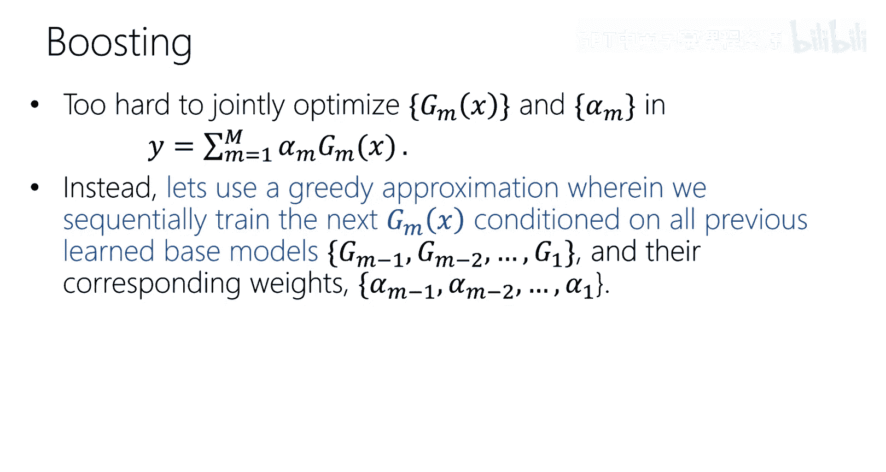

# 17：决策树与集成学习


在本节课中，我们将学习一种与之前完全不同的建模方法——决策树。尽管神经网络备受瞩目且非常成功，但决策树及其集成方法在特定类型的数据（如表格数据）上表现卓越，是许多实际竞赛中的获胜模型。我们将从决策树的基本概念入手，理解其工作原理，并探讨如何通过集成多个模型来提升性能。

---

## 决策树：20个问题的游戏 🎲

上一节我们介绍了本课程将转向一种全新的模型。本节中，我们来看看决策树的核心思想，它类似于“20个问题”游戏：通过一系列关于特征的是/否问题，最终对样本进行分类。

决策树是一种分层模型，它通过递归地根据某个特征对数据进行划分来工作。每个内部节点代表一个特征测试，每个分支代表测试的结果，每个叶节点则代表一个类别标签或预测值。

**核心概念**：决策树将特征空间划分为一系列轴对齐的矩形区域，每个区域对应一个叶节点和一个预测结果。

---

## 决策树的构建与使用 🌳

我们已经了解了决策树的直观形式。本节中，我们来看看如何具体构建和使用一棵决策树。

使用决策树进行预测时，我们从根节点开始，根据样本的特征值选择分支，直到到达某个叶节点，该叶节点的类别即为预测结果。

构建决策树则需要从训练数据中学习树的结构。这是一个NP完全问题，因此我们采用贪心算法递归构建：
1.  从根节点开始，包含所有训练数据。
2.  选择“最佳”特征进行分割。
3.  根据该特征的取值创建子节点。
4.  对每个子节点递归地重复步骤2-3，直到满足停止条件。

**核心概念（伪代码）**：
```python
def build_tree(data):
    if 所有样本属于同一类别:
        创建叶节点，预测为该类别
        return
    if 所有特征值相同 或 无剩余特征:
        创建叶节点，预测为多数类
        return
    选择最佳分割特征
    根据该特征的每个取值创建分支
    for 每个分支:
        subset = 属于该分支的样本
        build_tree(subset) # 递归构建子树
```

---

## 如何选择最佳分割特征？ 🎯

上一节我们介绍了递归构建树的框架。本节中，我们来看看贪心算法的核心：如何量化一个特征的好坏，从而选择“最佳”分割特征。

我们希望选择能最大程度“纯化”子节点的特征。一个节点越“纯”，意味着其包含的样本几乎都属于同一类别，我们做出错误预测的“惊喜”就越小。信息论中的“熵”恰好能度量这种不确定性或“惊喜”程度。

对于一个随机变量Y，其熵H(Y)定义为期望惊喜：
`H(Y) = - Σ P(y) log₂ P(y)`

在决策树中，我们关注的是按特征X分割后，目标Y的不确定性减少了多少。这可以通过**信息增益**来度量，它等于分割前Y的熵减去分割后Y的**条件熵**。

条件熵H(Y|X)衡量了在已知特征X的条件下，Y剩余的不确定性：
`H(Y|X) = Σ P(x) * H(Y|X=x)`

信息增益IG则为：
`IG = H(Y) - H(Y|X)`

**构建策略**：在每一步，我们计算每个可用特征的信息增益，然后选择信息增益最大的那个特征进行分割。这等价于选择能使条件熵最小化的特征。

---

## 停止递归与过拟合问题 ⚠️

通过贪心选择特征，我们可以持续生长树。但如果不加限制，树会一直生长直到完美拟合训练数据，这通常会导致过拟合。本节中，我们来看看何时应该停止递归，以及决策树面临的其他挑战。

以下是停止递归的常见条件（基础情况）：
*   **节点纯度**：如果节点中所有样本都属于同一类别，则无需再分割。
*   **特征耗尽**：如果节点中所有样本在所有剩余特征上取值相同，无法进一步分割。
*   **数据量过少**：如果节点中的样本数量低于预设阈值，停止分割以避免基于过少数据做出不可靠决策。

即使有停止条件，单棵决策树也容易过拟合，并且可能不稳定（训练数据的微小变化可能导致生成完全不同的树）。其决策边界是轴对齐且分段恒定的，对于某些简单模式（如线性可分数据）可能效率低下。

为了解决过拟合问题，我们需要对树进行**正则化**，常用方法包括：
*   **限制树深**：预设树的最大深度。
*   **设置叶节点最小样本数**：确保分割时有足够的数据支持。
*   **剪枝**：先构建一棵完整的树，然后自底向上移除对泛化性能贡献不大的子树。

---

## 集成方法：从单棵树到森林 🌲➡️🌳🌲

上一节我们讨论了单棵决策树的局限性。本节中，我们来看看如何通过集成学习结合多棵决策树，从而获得更强大、更稳定的模型。

集成学习的基本思想是结合多个模型（通常是弱模型）的预测，以获得比单一模型更好的性能。关键在于，集成的各个模型应该尽可能“不同”（即预测误差不相关），这样通过平均可以降低总体方差。

以下是集成决策树的主要方法：

**1. 装袋法**
*   **核心思想**：通过自助采样生成多个不同的训练集，分别训练多个决策树，预测时取平均。
*   **如何降低相关性**：对原始训练数据进行有放回抽样，创建多个略有差异的数据集。

**2. 随机森林**
*   **核心思想**：在装袋法的基础上，进一步在每棵树的每个节点分割时，只考虑一个随机子集的特征。
*   **如何降低相关性**：同时引入数据扰动（自助采样）和特征扰动（随机特征子集）。

**3. 提升法**
*   **核心思想**：按顺序训练一系列树，每棵新树都专注于纠正前一棵树的错误。
*   **工作原理**：是一个贪心的、逐步优化的过程。首先训练一棵树，然后基于前一棵树的残差（预测错误）训练下一棵树，如此迭代。
*   **代表算法**：梯度提升决策树，这是在许多表格数据竞赛中表现极其出色的模型。

---

## 课程总结 📚

本节课中，我们一起学习了决策树与集成学习。

我们首先将决策树类比为“20个问题”游戏，理解了其通过递归分割特征空间来进行预测的基本原理。接着，我们深入探讨了构建决策树的核心贪心算法：使用**信息增益**（或等价地，最小化条件熵）来选择最佳分割特征，以追求节点的“纯度”。

我们认识到单棵决策树容易过拟合且不稳定，因此讨论了通过限制树深、最小样本数或剪枝来进行正则化。更重要的是，我们介绍了如何通过**集成方法**来克服这些缺点。**装袋法**和**随机森林**通过引入随机性来构建多棵略有差异的树并进行平均，有效降低了方差。而**提升法**（特别是梯度提升决策树）则通过顺序地、贪心地拟合残差，构建出非常强大的模型序列。



最终，我们了解到，尽管神经网络在图像、语言等领域占据主导，但决策树及其集成方法（尤其是随机森林和梯度提升树）在处理**表格数据**的分类和回归问题上，常常是实践中的最佳选择，因为它们强大、易于使用且对超参数不敏感。