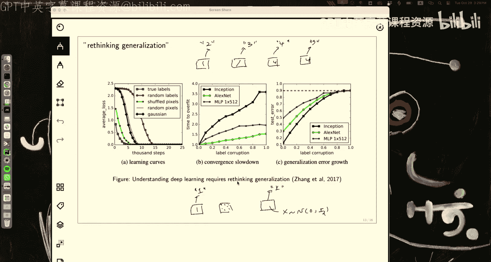
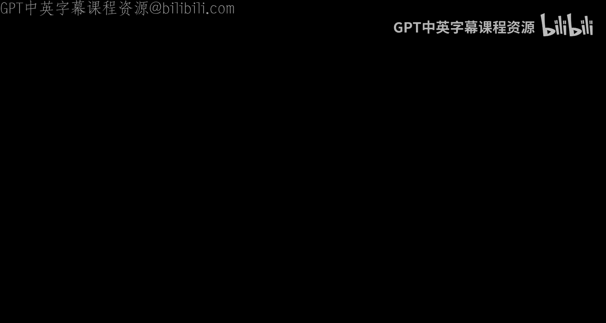

# 18：偏差-方差权衡与过拟合/欠拟合

在本节课中，我们将学习机器学习中一个核心概念：偏差-方差权衡。我们将从数学上分解泛化误差，理解其与过拟合和欠拟合的关系，并探讨在现代深度学习背景下，关于模型复杂度的经典观点如何被重新审视。

## 1. 概述与动机

上一节我们介绍了模型评估的基本概念。本节中，我们来看看一个更深入的问题：为什么我们的模型在训练集上表现良好，却在未见过的测试数据上表现不佳？这个问题的核心在于理解偏差、方差和噪声。

为了直观理解，考虑一个经典的例子：使用不同阶数的多项式去拟合一个正弦函数。我们生成多个不同的数据集（每个数据集包含从正弦函数中采样的少量点），并对每个数据集进行拟合。

*   **欠拟合**：当使用非常简单的模型（如低阶多项式或常数函数）时，模型无法捕捉数据中的基本模式。这对应于**高偏差**。
*   **过拟合**：当使用非常复杂的模型（如高阶多项式）时，模型会“记住”每个训练数据点，包括噪声，导致在训练集上完美拟合，但在新数据上表现糟糕。这对应于**高方差**。

下图展示了不同正则化强度（λ）下的拟合情况。当λ很大时，所有拟合曲线都收敛到一个简单的函数（高偏差，低方差）。当λ很小时，拟合曲线彼此差异很大（低偏差，高方差）。

## 2. 关键定义

在深入数学推导之前，我们需要明确几个关键定义。

### 2.1 最优回归函数

对于回归问题，我们使用平方损失。在已知数据真实分布 `P(x, y)` 的情况下，使期望损失最小的函数被称为最优回归函数。通过求解最小化问题，我们可以得到：

`f*(x) = E[y | x] = ∫ y P(y | x) dy`

这个函数 `f*(x)` 就是在给定 `x` 时，`y` 的条件期望。它是我们所能达到的最佳预测。

### 2.2 期望测试误差（泛化误差）

在实践中，我们不知道真实分布，只能通过训练集 `D` 学习一个函数 `f_D`。我们关心的是这个函数在真实数据分布上的表现，即泛化误差 `R(f_D)`：

`R(f_D) = E_(x, y)~P[ (f_D(x) - y)^2 ]`

这个误差衡量了我们的预测 `f_D(x)` 与真实值 `y` 之间的差距。

### 2.3 期望回归函数

如果我们能多次从数据分布中采样得到不同的训练集 `D_1, D_2, ...`，并对每个训练集都拟合出一个函数 `f_D_i`，那么这些函数的平均值就是期望回归函数：

`f̄(x) = E_D[ f_D(x) ]`

这个函数代表了我们的学习算法在所有可能训练集上的“平均预测”。

## 3. 偏差-方差-噪声分解

现在，我们可以对泛化误差进行分解。我们的目标是分析 `R(f_D)`，但我们需要考虑算法在所有可能训练集上的平均表现，因此我们最终关心的是**期望泛化误差** `E_D[ R(f_D) ]`。

通过巧妙的数学操作（添加再减去 `f̄(x)` 和 `f*(x)`），我们可以将 `E_D[ R(f_D) ]` 分解为三个独立的部分：

`E_D[ R(f_D) ] = E_x[ (f̄(x) - f*(x))^2 ] + E_D, x[ (f_D(x) - f̄(x))^2 ] + E_(x, y)[ (y - f*(x))^2 ]`

以下是每个部分的含义：

1.  **偏差²**：`E_x[ (f̄(x) - f*(x))^2 ]`
    *   这衡量了**学习算法的平均预测** `f̄(x)` 与**最优预测** `f*(x)` 之间的差距。
    *   高偏差意味着模型过于简单，无法捕捉数据中的潜在关系（欠拟合）。

2.  **方差**：`E_D, x[ (f_D(x) - f̄(x))^2 ]`
    *   这衡量了**针对不同训练集得到的单个预测函数** `f_D(x)` 围绕其**平均预测** `f̄(x)` 的波动程度。
    *   高方差意味着模型过于复杂，对训练数据中的随机噪声过于敏感（过拟合）。

3.  **噪声**：`E_(x, y)[ (y - f*(x))^2 ]`
    *   这衡量了数据中固有的、不可约的随机性。即使我们知道了最优预测 `f*(x)`，由于 `y` 本身是随机的，仍然会存在误差。
    *   噪声与模型选择无关，是问题本身固有的。

### 3.1 直观示例：飞镖游戏

考虑一个飞镖游戏，目标是击中靶心（`f*(x)`）。

*   **高偏差，低方差**：你视力不好，没戴眼镜。你每次都稳定地打在同一个偏离靶心的位置。你的平均落点（`f̄(x)`）有偏差，但每次投掷的波动很小。
*   **低偏差，高方差**：你喝醉了，但戴着眼镜。你的平均落点可能在靶心附近，但每次投掷都散落在各处。偏差小，但方差大。
*   **噪声**：突然刮起大风，即使你是神枪手（低偏差、低方差），飞镖也会被吹离轨迹。这个由风引起的误差就是噪声。

## 4. 与过拟合/欠拟合的联系

偏差-方差分解完美地解释了过拟合和欠拟合现象。

*   **模型复杂度低**（如简单线性模型）：
    *   **偏差高**：模型太简单，无法拟合数据模式。
    *   **方差低**：模型不灵活，不同训练集得到的模型差异不大。
    *   结果：**欠拟合**。训练误差和测试误差都较高。
*   **模型复杂度高**（如高阶多项式或大型神经网络）：
    *   **偏差低**：模型足够复杂，平均预测接近最优。
    *   **方差高**：模型过于灵活，会拟合训练数据中的噪声，导致不同训练集得到的模型差异巨大。
    *   结果：**过拟合**。训练误差很低，但测试误差很高。

经典的机器学习教义是寻找偏差和方差之间的“甜蜜点”，即模型复杂度适中，使总泛化误差最小。

## 5. 重新思考泛化：现代视角

然而，在现代深度学习中，我们通常使用参数数量远超训练样本数的“过参数化”模型，并且仍然能取得很好的泛化性能。这挑战了经典的偏差-方差权衡观点。

### 5.1 实验观察：重新思考泛化

一篇2017年的著名论文《理解深度学习需要重新思考泛化》通过实验表明，相同的神经网络架构：
*   在MNIST真实标签上可以很好地学习和泛化。
*   在MNIST随机打乱的标签上，同样可以将训练误差降到零，但完全无法泛化。
既然模型架构（复杂度）相同，为何泛化能力天差地别？这说明**参数数量本身并不能很好地定义“模型复杂度”**。

### 5.2 双下降现象

另一项研究观察到了“双下降”曲线。当模型参数数量接近训练样本数量时，测试误差会出现一个峰值（这是经典过拟合区域）。但是，**当继续增加参数，使模型进入“过参数化”区域后，测试误差会再次下降**。

这表明，在模型容量极大时，学习算法似乎找到了一种更“平滑”或更“简单”的方式来拟合数据，从而实现了更好的泛化。

### 5.3 格罗金现象

在一个更极端的例子中，研究者训练一个过参数化模型学习模除运算。在训练初期，模型很快记住了训练集（训练准确率100%），但测试准确率几乎为零（典型过拟合）。然而，**继续训练极长时间后，测试准确率突然开始上升，最终达到接近100%**。这个现象被称为“格罗金”，意指模型在长时间训练后似乎突然“理解”了任务的内在规律。

### 5.4 理论见解：过参数化与平滑性

有理论工作证明，在极度过参数化的条件下（参数数量 `>>` 样本数量），使用梯度下降等算法训练的网络倾向于找到一个**平滑**的函数解。而平滑函数通常具有更好的泛化能力。这为过参数化模型的成功提供了一种可能的解释：**足够的容量让模型有机会找到一个既拟合数据又保持平滑的解**，而不是被迫去“记忆”噪声。

## 6. 总结

本节课中我们一起学习了机器学习中的核心概念——偏差-方差权衡。

1.  我们从数学上推导了泛化误差可以分解为**偏差**、**方差**和**噪声**三部分。
2.  偏差衡量模型本身的系统性误差，方差衡量模型对数据扰动的敏感性，噪声是数据固有的不确定性。
3.  这一分解清晰地解释了**欠拟合（高偏差）** 和**过拟合（高方差）** 现象。经典机器学习旨在通过调整模型复杂度来平衡二者。
4.  然而，现代深度学习的实践（使用过参数化模型）对经典观点提出了挑战。实验观察到的“双下降”曲线和“格罗金”等现象表明，**模型复杂度不能简单地用参数数量来衡量**。
5.  当前的研究表明，在过参数化区域，优化算法可能倾向于找到**平滑**的解，这或许是其泛化能力良好的关键。关于泛化的本质，仍然是机器学习领域一个活跃且未完全解决的研究课题。

理解偏差-方差权衡为我们诊断模型问题、选择模型复杂度提供了根本性的框架。同时，了解其现代发展也能帮助我们以更开放的视角看待深度学习模型的行为。