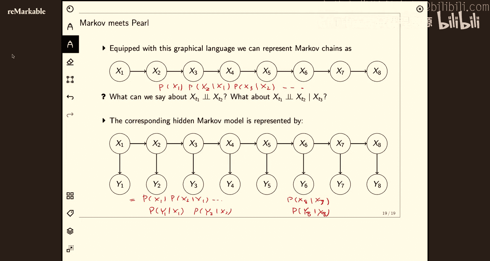

# 19：隐马尔可夫模型与图模型 1


在本节课中，我们将学习两种重要的概率模型：隐马尔可夫模型和概率图模型。我们将从简单的马尔可夫链开始，理解序列数据中的依赖关系，然后引入更复杂的隐马尔可夫模型。最后，我们将学习一种更通用的建模语言——概率图模型，并探讨其中的条件独立性概念。

## 从独立同分布到序列依赖

到目前为止，在课程中我们讨论的都是独立同分布的随机变量。我们将转向更有趣的情况，考虑一个随机变量序列，并且这个序列中的随机变量不是独立的。也就是说，给定 `X_{t'}`，`X_t` 的概率不等于 `P(X_t)`。在 `X_{t'}` 和 `X_t` 之间存在依赖关系。

在这个设定中，`t` 不一定代表时间，但让我们首先将其视为时间。一个简单的例子是天气。随机变量是“热”或“冷”。如果今天是热的，那么明天是热的可能性也更高。你可以想象很多例子，其中随机变量序列的状态在下一个时间步，很大程度上取决于前一个时间步发生了什么。

## 马尔可夫链

马尔可夫条件是一种在随机变量之间建立依赖关系的非常简单的方式。它说的是：预测未来时，过去无关紧要，只取决于现在。用公式表示，对于未来状态，其概率仅取决于当前状态：

```
P(未来 | 现在, 所有过去) = P(未来 | 现在)
```

在天气的例子中，这可能是一个合理的假设。但在语言预测中，下一个词的概率显然依赖于前一个词，但这种依赖可能依赖于过去发生的许多事情。当前的大型语言模型在某种程度上是这种一阶马尔可夫条件的泛化，但其上下文窗口可能长达数千个词。

### 马尔可夫链的概率分解

如果我们假设马尔可夫条件，我们可以证明整个序列的概率可以分解为一系列条件概率的乘积：

```
P(x_1, x_2, ..., x_T) = P(x_1) * P(x_2 | x_1) * P(x_3 | x_2) * ... * P(x_T | x_{T-1})
```

这个分解的关键在于，马尔可夫条件使得联合概率 dramatically 简化。如果我们考虑一个包含 T 个二元随机变量的一般概率分布，我们需要 `2^T - 1` 个参数来指定它。然而，对于一个具有 K 个状态的一阶马尔可夫链，我们只需要 `(K-1) + (T-1)*K*(K-1)` 个参数。参数数量从随 T 指数增长，减少为随 T 线性增长，这是一个巨大的简化。

### 齐次马尔可夫链

另一个简化层次是假设转移概率不依赖于时间。这意味着从状态 `s_i` 转移到状态 `s_j` 的概率在任何时间点都是相同的。这被称为**时间齐次马尔可夫链**。在这种情况下，我们可以用一个固定的转移概率矩阵 `A` 来描述系统，其中 `A_{ij} = P(x_{t+1}=j | x_t=i)`。这个矩阵的每一行之和必须为 1。

一个经典的例子是“青蛙跳荷叶”模型。假设有两个荷叶，东边和西边。青蛙根据掷硬币的结果决定是否跳到另一个荷叶。我们可以用状态图来表示这个过程，其中节点是状态（东、西），边是转移概率。通过初始状态向量 `π` 和转移矩阵 `A`，我们可以计算任何未来时间步的状态概率分布：`π_{t+1} = π_t * A`。

## 隐马尔可夫模型

现在，我们在马尔可夫链的基础上引入一个新的随机变量，从而得到隐马尔可夫模型。

假设我们的青蛙在每一个荷叶上都会发出叫声（比如“呱呱”的次数，1到3次）。它发出某种叫声的概率取决于它所在的荷叶（即马尔可夫链的当前状态）。在许多问题中，这个新的随机变量（叫声）是我们能观察到的，而原始的状态（青蛙的位置）是隐藏的、观测不到的。

对于机器学习从业者来说，我们只能观察到 `Y`（叫声），而我们希望对这个可观测的随机变量进行学习或推断，并试图找出背后隐藏的状态序列 `X`。

### HMM 的定义

一个隐马尔可夫模型由以下部分定义：
*   **状态**：隐藏的马尔可夫链有 K 个状态（例如，东、西）。
*   **转移概率矩阵 A**：描述了状态之间的转移概率，通常假设是时间齐次的。
*   **观测似然 B**：对于每个隐藏状态，有一个概率分布来描述产生各种观测的可能性。这被称为**发射概率**。
*   **初始状态分布 π**：系统在时间 `t=1` 时处于各个状态的概率。

一个非常经典的应用是语音识别。观测是声波，而隐藏状态是说话者心中想要表达的单词序列。HMM 的任务就是根据观测到的声波，推断出最可能的单词序列。

### HMM 的三大问题
1.  **评估问题**：给定模型参数和观测序列，计算该观测序列出现的概率 `P(Y | 参数)`。
2.  **解码问题**：给定模型参数和观测序列，找出最有可能产生该观测序列的隐藏状态序列。这正是语音识别要解决的问题。
3.  **学习问题**：给定观测序列，估计模型参数 `A`, `B`, `π`。我们将在下一讲讨论这个问题。

## 概率图模型

现在，我们切换到一个更通用、更强大的建模语言——概率图模型。

概率图模型使用图结构来编码随机变量之间的依赖关系。对于**有向无环图**，我们可以通过查看每个节点的父节点来构造整个图的联合概率分布。联合概率分解为每个节点在其父节点条件下的概率的乘积：

```
P(x_1, x_2, ..., x_N) = ∏_{i=1}^{N} P(x_i | parents(x_i))
```

这种分解带来了巨大的简化。考虑一个包含5个二元变量的全连接图，需要 `2^5 - 1 = 31` 个参数。但如果图结构稀疏（例如，某些变量之间没有直接边），所需的参数数量会大幅减少。图模型的美妙之处在于，它用直观的图结构捕捉了变量之间依赖关系的缺失。

### 基本的三节点图与条件独立性

为了理解图模型如何表示独立性，我们需要研究最基本的结构：三个节点的图。本质上，有三种基本结构：

1.  **链式结构**：`X1 -> X2 -> X3`
2.  **分叉结构**：`X2 -> X1`, `X2 -> X3`
3.  **汇合结构**：`X1 -> X2`, `X3 -> X2`

以下是关于条件独立性的关键结论：

*   **链式与分叉结构**：在这两种结构中，如果**中间节点 `X2` 被观测到**，那么 `X1` 和 `X3` 在给定 `X2` 的条件下是独立的。我们说 `X2` **阻断**了 `X1` 和 `X3` 之间的路径。
    *   **直观理解**：在链式中，`X1` 的影响必须通过 `X2` 才能到达 `X3`。一旦 `X2` 已知，`X1` 就不再提供关于 `X3` 的额外信息。在分叉中，`X2` 是 `X1` 和 `X3` 的共同原因。一旦知道了原因 `X2`，两个结果 `X1` 和 `X3` 就变得独立。

*   **汇合结构**：这是最有趣的情况。在汇合结构中，`X1` 和 `X3` 是 `X2` 的父节点，并且它们之间没有直接连接。**当 `X2` 未被观测时**，`X1` 和 `X3` 是独立的。
    *   **然而，当 `X2` 或其任何子节点被观测到时**，`X1` 和 `X3` 就变得**依赖**了。这被称为“解释 away”效应。
    *   **经典例子**：`X1`=地震发生，`X3`=小偷入室，`X2`=警报响。地震和小偷入室本是独立事件。但如果警报响了（`X2` 被观测），你得知刚刚发生了地震，那么你就会认为小偷入室的可能性大大降低。一个原因“解释”了结果，使得另一个原因的可能性下降，从而在两个父节点之间引入了依赖关系。

### D-分离：图模型中的独立性检验算法

D-分离是 Judea Pearl 提出的一个图论准则，用于系统性地判断在有向图中，给定一组观测变量 `Z` 后，两组变量 `X` 和 `Y` 是否条件独立。

算法思路如下：考虑所有连接 `X` 和 `Y` 的无向路径。如果对于每一条这样的路径，都存在一个节点使得该路径被“阻断”，那么 `X` 和 `Y` 在给定 `Z` 下就是 D-分离的，即条件独立。

一个节点在以下情况下会阻断一条路径：
1.  该节点在 `Z` 中，并且它的连接方式是链式或分叉结构。
2.  该节点**不在 `Z` 中**，它的**后代也不在 `Z` 中**，并且它的连接方式是汇合结构。

通过应用 D-分离规则，我们可以高效地分析复杂图模型中的条件独立性，而无需进行繁琐的概率计算。

## 回到隐马尔可夫模型

现在，我们可以用新学的概率图模型语言来优雅地表示隐马尔可夫模型。

一个 HMM 的图模型表示是一个长的链式结构：`X1 -> X2 -> ... -> X_T`，表示隐藏状态序列。然后，每个隐藏状态 `X_t` 指向一个观测节点 `Y_t`。联合概率分解为：

```
P(X, Y) = P(x1) * [∏_{t=2}^{T} P(x_t | x_{t-1})] * [∏_{t=1}^{T} P(y_t | x_t)]
```

这个分解式与之前代数的定义完全一致。图模型的优势在于，它让模型的结构和条件独立性假设一目了然。例如，从图中我们可以立即看出，任何两个不相邻的隐藏状态 `X_i` 和 `X_j`，在给定它们之间所有节点的情况下是条件独立的。

---



本节课中，我们一起学习了序列建模的基础。我们从马尔可夫链开始，理解了其如何用少量的参数建模序列依赖。然后引入了隐马尔可夫模型，其中可观测的数据由隐藏的状态序列产生。最后，我们学习了概率图模型这一强大框架，它用图结构编码变量间的依赖与独立关系，并通过分析三节点基本结构和 D-分离准则，掌握了判断条件独立性的方法。在下一讲中，我们将深入探讨 HMM 的推断与学习算法。