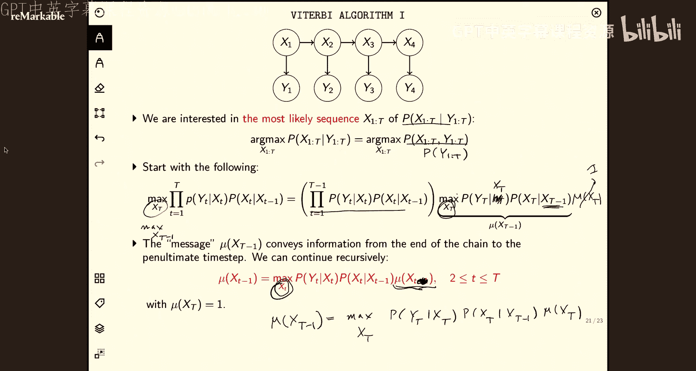
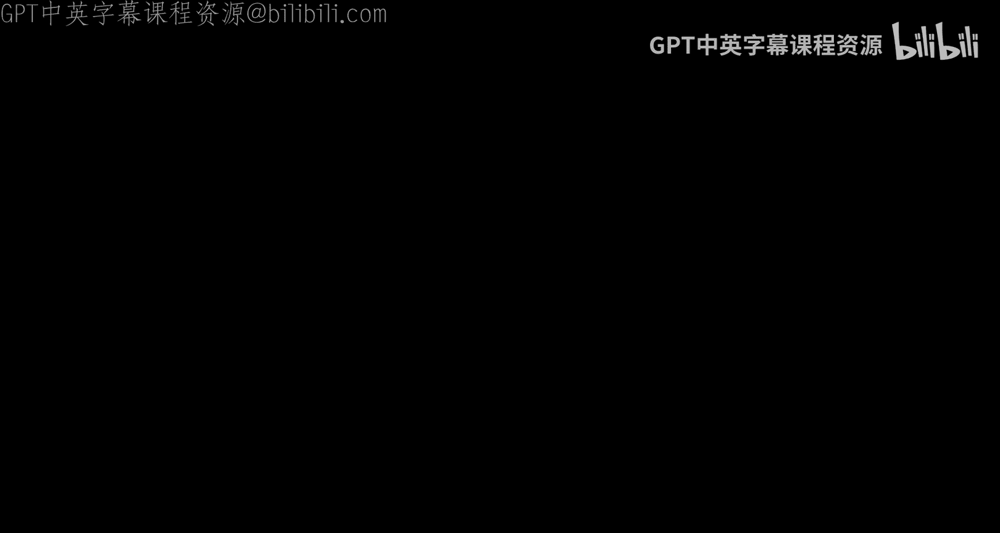

# 20：隐马尔可夫模型与图模型 2


在本节课中，我们将继续学习概率图模型。我们将首先完成对d-分离概念的讲解，并通过示例加深理解。接着，我们将探讨概率图模型的核心优势——参数计数，并理解条件独立性如何简化模型。最后，我们将重点介绍隐马尔可夫模型，并学习两种关键的推理算法：用于估计最终状态概率的滤波算法，以及用于寻找最可能隐藏状态序列的维特比算法。

## d-分离概念回顾

上一节我们介绍了图模型中的基本结构单元。本节中，我们来看看如何利用这些单元来判断变量间的条件独立性，这个过程称为d-分离。

d-分离的核心思想是检查图中所有连接两个变量的无向路径。如果每条路径都被“阻塞”，那么这两个变量在给定某些观测变量的条件下是独立的。路径的阻塞规则基于我们之前学过的三种基本结构：

1.  **链式结构 (X₁ → X₂ → X₃)**：当中间节点 **X₂** 被观测到时，路径被阻塞，**X₁** 和 **X₃** 条件独立。公式表示为：**X₁ ⟂ X₃ | X₂**。
2.  **分叉结构 (X₁ ← X₂ → X₃)**：当中间节点 **X₂** 被观测到时，路径被阻塞，**X₁** 和 **X₃** 条件独立。公式表示为：**X₁ ⟂ X₃ | X₂**。
3.  **汇合结构 (X₁ → X₂ ← X₃)**：当中间节点 **X₂** **未被**观测时，路径被阻塞，**X₁** 和 **X₃** 独立。但当 **X₂** 或其子节点被观测时，路径反而**畅通**，无法保证 **X₁** 和 **X₃** 独立。

## d-分离应用示例

让我们通过一个具体图例来练习d-分离。考虑下图，我们需要判断在给定不同观测集时，变量间的条件独立性。


**示例1：判断 X₁ 与 X₂ 是否在给定 X₆ 时独立**

我们需要检查所有从 X₁ 到 X₂ 的无向路径。

*   **路径1**: X₁ — X₃ — X₆ — X₅ — X₂
    *   首先到达节点 X₃。这是一个汇合结构（X₁ → X₃ ← X₄），且 X₃ 未被观测，根据规则，此节点**不阻塞**路径。
    *   然后到达节点 X₆。这是一个链式结构（X₃ → X₆ → X₅），且 X₆ 被观测到，此节点本应阻塞路径，但由于我们已在 X₃ 处发现路径未被阻塞，**整条路径未被阻塞**。
*   由于找到一条未被阻塞的路径，因此我们**不能保证** **X₁ ⟂ X₂ | X₆**。

**示例2：判断 X₃ 与 X₇ 是否在给定 X₂ 时独立**

我们需要检查所有从 X₃ 到 X₇ 的无向路径。

*   **路径1**: X₃ — X₁ — X₂ — X₅ — X₇
    *   首先到达节点 X₁。这是一个汇合结构（X₃ → X₁ ← X₄）。X₁ 未被观测，且其子节点 X₂ 被观测到，这反而激活了路径，因此该节点**不阻塞**路径。
    *   接着到达节点 X₂。这是一个分叉结构（X₁ → X₂ → X₅）。X₂ 被观测到，因此该节点**阻塞**了路径。
    *   由于路径在 X₂ 处被阻塞，**整条路径被阻塞**。
*   **路径2**: X₃ — X₆ — X₅ — X₇
    *   首先到达节点 X₆。这是一个分叉结构（X₃ → X₆ → X₅）。X₆ 未被观测，因此该节点**不阻塞**路径。
    *   接着到达节点 X₅。这是一个汇合结构（X₂ → X₅ ← X₆）。X₅ 未被观测，因此该节点**阻塞**了路径。
    *   由于路径在 X₅ 处被阻塞，**整条路径被阻塞**。
*   所有从 X₃ 到 X₇ 的路径都被阻塞，因此 **X₃ ⟂ X₇ | X₂** 成立。

## 图模型的优势：参数计数

我们为什么如此关心条件独立性？因为它能极大简化模型，减少需要估计的参数数量，这是概率图模型的核心优势。

考虑一个简单的例子：三个二元变量R（下雨）、S（洒水器开关）、W（草地湿）。其联合分布 **P(R, S, W)** 需要一个有 **2³ = 8** 个条目的概率表，由于概率和为1，我们需要指定 **7** 个参数。

然而，如果我们根据下图所示的因果关系建模：



联合概率可以分解为：**P(R, S, W) = P(R) * P(S|R) * P(W|S, R)**。

现在，我们只需要估计以下条件概率表（CPT）中的参数：
*   **P(R)**：1个参数（因为 P(R=False) = 1 - P(R=True)）。
*   **P(S|R)**：2个参数（需要为R=True和R=False两种情况分别指定P(S=True|R)，另一个概率可推导）。
*   **P(W|S, R)**：4种(S,R)组合，需要4个参数？不对。对于每种(S,R)组合，只需指定P(W=True|S,R)，P(W=False|S,R)可推导。所以只需要 **4** 个参数。

总参数为：1 + 2 + 4 = **7** 个。虽然总数相同，但关键区别在于：
1.  **结构化**：参数现在具有明确的现实意义（如P(S=True|R=True)表示下雨时洒水器打开的概率）。
2.  **可扩展性**：对于更多变量，链式分解的优势将呈指数级增长。对于一个具有T个二元变量的马尔可夫链，其联合分布 **P(X₁, ..., X_T)** 若没有结构，需要 **2^T - 1** 个参数。但若按马尔可夫链分解：**P(X₁)Π P(X_t|X_{t-1})**，则仅需：1（初始状态） + 2*(T-1)（转移概率） = **2T - 1** 个参数。当T很大时，这带来了巨大的简化。

## 联合分布是“万能”的

概率图模型给出了联合分布的分解形式。拥有联合分布，我们就能回答关于该系统的任何概率查询。

例如，在洒水器例子中，观察到草地湿了（W=True），想推断下雨的概率（R=True），即计算 **P(R=True | W=True)**。

我们可以通过联合分布来计算：
1.  利用贝叶斯定理：**P(R|W) = P(R, W) / P(W)**。
2.  **P(R, W)** 和 **P(W)** 可通过联合分布的**边缘化**求得：
    *   **P(W=True) = Σ_{r, s} P(R=r, S=s, W=True)**
    *   **P(R=True, W=True) = Σ_{s} P(R=True, S=s, W=True)**

通过查询联合概率表并求和，即可得到答案。这意味着，一旦定义了图模型及其参数（CPT），原则上我们可以通过计算回答任何推断问题。

## 隐马尔可夫模型简介

现在，我们将目光转向一种重要的结构化图模型——隐马尔可夫模型。HMM用于建模具有隐藏状态的时间序列数据。

一个经典的例子是“天气-冰淇淋”模型：
*   **隐藏状态 X_t**：表示第t天的天气（Hot或Cold），这是一个马尔可夫链。
*   **观测变量 Y_t**：表示第t天吃的冰淇淋数量（1,2,3），其概率依赖于当天的天气。



模型由以下参数定义：
*   **初始概率**：**π_i = P(X₁ = i)**
*   **状态转移概率**：**A_{ij} = P(X_t = j | X_{t-1} = i)**
*   **观测发射概率**：**B_{jk} = P(Y_t = k | X_t = j)**

HMM的核心问题是：给定一系列观测序列 **y₁, y₂, ..., y_T**，我们对隐藏状态进行推断。

## 动态规划思想回顾

在讲解HMM的推断算法前，先回顾一个关键思想——动态规划。它通过将复杂问题分解为重叠子问题来高效求解。

考虑一个寻找最廉价航班的例子：从火奴鲁鲁出发，经西海岸、中西部，最终到东海岸，每个阶段有多个城市可选，机票价格固定。


*   **暴力方法**：枚举所有路径。如果有K个城市可选，阶段数为T，则路径数为 **K^T**，不可行。
*   **动态规划方法（逆向推导）**：
    1.  计算到达**终点前一站**（如芝加哥、丹佛、达拉斯）每个城市的最廉价费用。这需要比较从所有西海岸城市飞来的价格，计算量为 **K²**。
    2.  记录下到达每个城市的最小费用以及对应的前一站城市。
    3.  逐步向前一阶段回溯，重复此过程。
    4.  最终，从起点开始，利用记录的信息正向找出最优路径。

总计算量约为 **K² * T**，远优于指数复杂度。维特比算法正是这种思想在概率最大化问题上的应用。

## HMM推断问题一：滤波

滤波问题是：给定截至当前时间t的所有观测 **y₁:t**，估计当前隐藏状态 **X_t** 的概率分布，即计算 **P(X_t | y₁:t)**。

我们利用递归方式计算，定义 **α_t(j) = P(X_t = j, y₁:t)**。推导如下：

1.  根据贝叶斯定理，**P(X_t | y₁:t) ∝ P(X_t, y₁:t) = α_t(X_t)**。
2.  对 **α_t(X_t)** 进行递归分解：
    ```
    α_t(j) = P(X_t=j, y₁:t)
           = Σ_i P(X_t=j, X_{t-1}=i, y₁:t)                // 引入X_{t-1}并求和（边缘化）
           = Σ_i P(y_t | X_t=j) * P(X_t=j | X_{t-1}=i) * P(X_{t-1}=i, y₁:t-1) // 利用条件独立性和链式法则
           = Σ_i [B_{j, y_t} * A_{i, j} * α_{t-1}(i)]
    ```
3.  初始条件：**α₁(j) = π_j * B_{j, y₁}**。

通过从 t=1 到 t=T 递归计算 **α_t**，我们就可以得到滤波分布 **P(X_t | y₁:t) ∝ α_t(X_t)**。这个算法称为**前向算法**。

## HMM推断问题二：解码（维特比算法）

解码问题是：给定整个观测序列 **y₁:T**，找到最可能的隐藏状态序列 **x₁:T**，即求 **argmax_{x₁:T} P(x₁:T | y₁:T)**。

由于分母 **P(y₁:T)** 与状态序列无关，这等价于求 **argmax_{x₁:T} P(x₁:T, y₁:T)**。

维特比算法使用动态规划来解决这个问题。它定义了一个值函数 **δ_t(i)**，表示在时刻t以状态i结尾的所有局部路径中，联合概率的最大值：
**δ_t(i) = max_{x₁:t-1} P(x₁:t-1, X_t=i, y₁:t)**

递归推导如下：
1.  **初始化**：**δ₁(i) = π_i * B_{i, y₁}**
2.  **递归**：对于 t = 2 到 T
    ```
    δ_t(j) = max_i [ δ_{t-1}(i) * A_{i, j} ] * B_{j, y_t}
    ```
    同时，我们需要记录使上式取最大值的状态i，保存在 **ψ_t(j)** 中：**ψ_t(j) = argmax_i [ δ_{t-1}(i) * A_{i, j} ]**
3.  **终止**：最可能序列的概率为 **P* = max_i δ_T(i)**，最终状态为 **x_T* = argmax_i δ_T(i)**。
4.  **回溯**：对于 t = T-1 到 1，利用记录的回溯指针找到最优路径：**x_t* = ψ_{t+1}(x_{t+1}*)**

这与寻找最廉价航班的动态规划思想完全一致：**δ_t(j)** 相当于到达城市j的最廉价费用，**ψ_t(j)** 记录了是从哪个前一站城市来的。

## 总结

本节课中我们一起学习了：
1.  **d-分离的完整应用**：通过分析图中路径的阻塞情况，严谨判断变量间的条件独立性。
2.  **概率图模型的核心优势**：通过条件独立性进行因子分解，能指数级减少模型参数，使复杂系统建模变得可行。
3.  **隐马尔可夫模型**：一种用于序列数据的经典图模型，包含隐藏状态链和与之相关的观测。
4.  **HMM的关键推断算法**：
    *   **滤波算法**：递归计算当前状态的后验分布。
    *   **维特比算法**：基于动态规划，高效找到最可能的隐藏状态序列。


理解这些内容，为我们在实际应用中处理如语音识别、生物信息学、金融分析等领域的序列数据打下了坚实的基础。