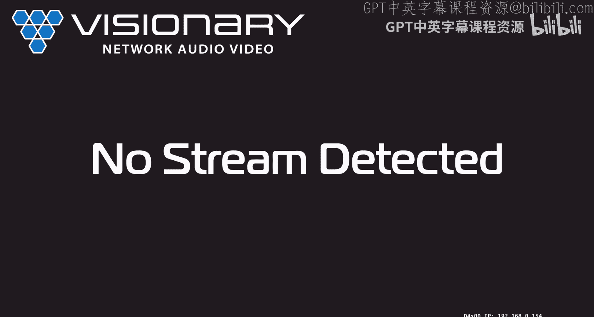
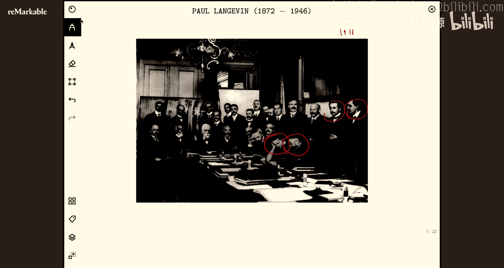
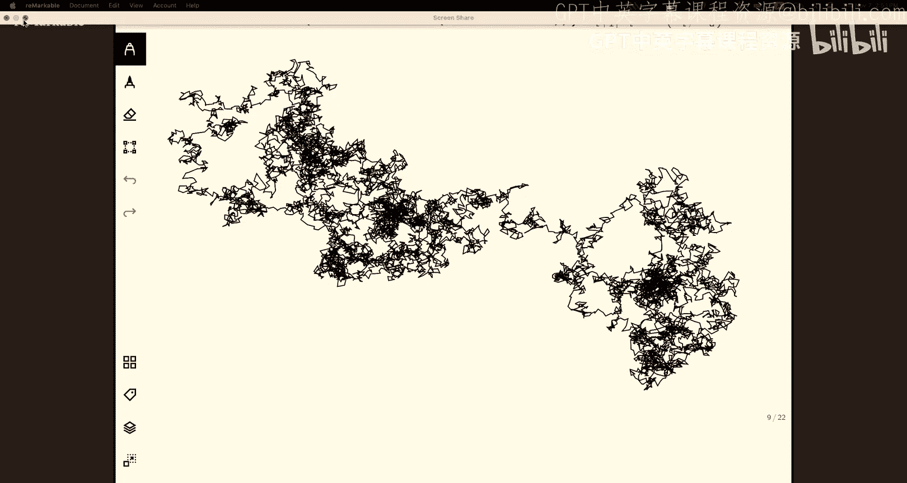
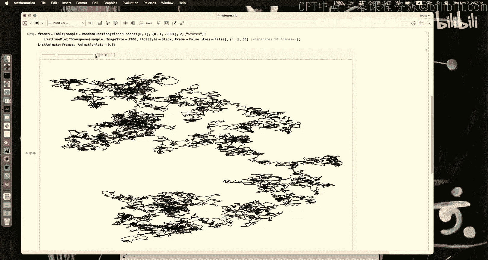
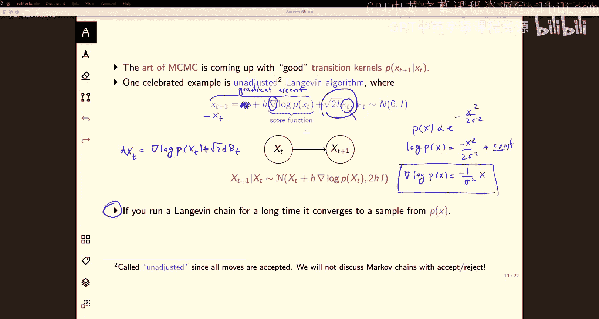
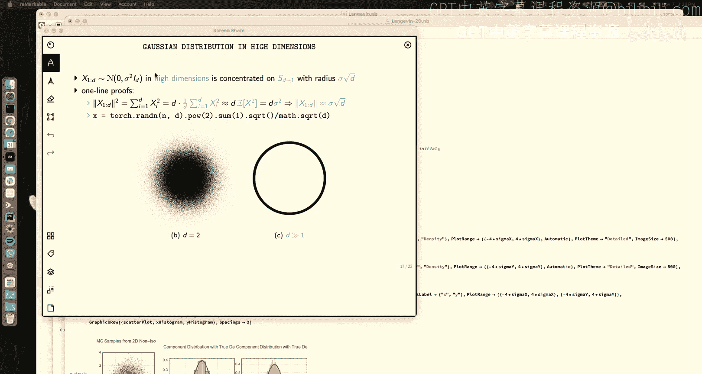
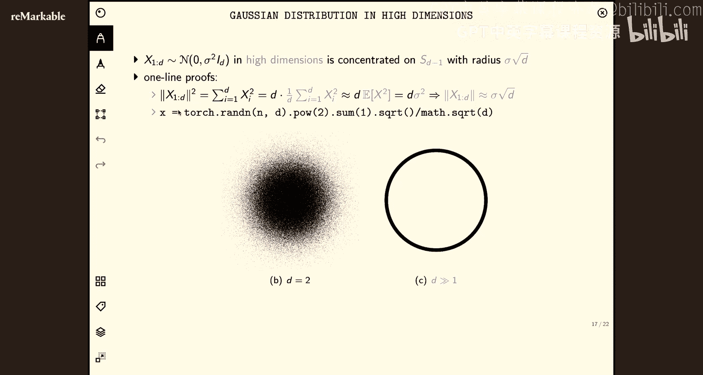

# 21：生成模型 1 🧠

在本节课中，我们将要学习生成模型的基础知识，特别是用于从复杂概率分布中采样的方法。我们将从回顾维特比算法开始，然后深入探讨朗之万动力学，这是一种仅需知道概率分布的“分数函数”（梯度对数概率）即可进行采样的强大算法。

## 维特比算法回顾 ✈️

上一节我们介绍了用于寻找隐马尔可夫模型中最可能状态序列的维特比算法。本节中，我们来看看该算法的另一种表述，它更贴近作业的实现方式。

首先，快速回顾一下“最廉价航班”问题。我们通过动态规划，计算了从起点到每个中间城市的最廉价路径，最终找到抵达东海岸的最优方案。算法的核心在于，每个阶段的计算只依赖于前一阶段的结果，总计算复杂度为 **O(TK²)**，其中 T 是阶段数，K 是每个阶段的选项数。

对于隐马尔可夫模型，我们面临类似问题：给定观测序列（例如，某人每天吃的冰淇淋数量：1, 3, 1），我们希望找到最可能的隐藏状态序列（例如，天气是热还是冷）。暴力枚举所有可能的隐藏状态序列需要 **O(2^T)** 次计算，当 T 很大时（例如 T=100），这是不可行的。

维特比算法通过动态规划将复杂度降低到 **O(TK²)**。其核心思想是递归地计算一个“消息”函数。对于我们的三天气候例子（T=3，状态 K=2：热或冷），算法步骤如下：

1.  **初始化**：对于第一个隐藏状态 x₁，计算其联合概率（先验概率 × 发射概率）。
    *   `ν(x₁) = P(x₁) * P(y₁ | x₁)`
2.  **递归**：对于后续的每个时间点 t（从 2 到 T），计算：
    *   `ν(x_t) = max_{x_{t-1}} [ ν(x_{t-1}) * P(x_t | x_{t-1}) * P(y_t | x_t) ]`
    *   这个计算为每个可能的 x_t 值，找到能使其概率最大的前一个状态 x_{t-1}，并记录下这个最大值以及对应的 `argmax`（即最优的 x_{t-1}）。
3.  **终止**：在最后一个时间点 T，选择使 `ν(x_T)` 最大的 x_T。
4.  **回溯**：根据每一步记录的 `argmax`，从最终状态 x_T* 反向追溯，得到整个最可能的状态序列 (x₁*, x₂*, x₃*)。

这种算法形式是从前向后计算消息 `ν`，然后再回溯。它等价于从后向前最大化并传递消息的另一种表述。关键在于理解，每一步我们都在处理一个关于前一个状态的 **最大化** 操作，从而避免了枚举所有序列。

以下是该算法的另一种常见数学记号，在作业中可能会遇到：
*   用索引 i, j ∈ {1, ..., K} 表示离散状态。
*   转移概率 `P(x_t = j | x_{t-1} = i)` 记为 **a_{ij}**。
*   发射概率 `P(y_t | x_t = j)` 记为 **b_j(y_t)**。
*   递归步骤写作：`ν_t(j) = max_{i=1 to K} [ ν_{t-1}(i) * a_{ij} * b_j(y_t) ]`

无论哪种表述，其本质都是利用动态规划，将指数级复杂度的搜索问题，转化为多项式复杂度的计算问题。

## 生成模型与采样简介 🎨

现在，让我们转向生成模型的核心问题。生成模型的目标很简单，但实现起来很有挑战性。

**生成模型定义**：我们有一些来自未知分布 P_data(x) 的样本。我们的目标是学习一个模型，使得能够从该分布中**抽取新的、独立的样本**。理想情况下，生成的新样本应该与真实数据样本在统计上无法区分。

这是一个无监督学习问题，因为我们只需要数据样本本身，而不需要标签。这使得我们可以利用海量的无标签数据（如整个互联网的文本或所有YouTube视频）进行训练。

本节课，我们首先关注一个更基础的问题：**假设我们已经知道了一个概率分布 P(x)，如何从中进行采样？** 采样意味着按照 P(x) 的概率密度随机生成数据点。例如，对于一个二维高斯分布，采样就是生成一堆点，这些点在密度高的区域更集中，在密度低的区域更稀疏。

这与优化（寻找概率最高的点，即众数）完全不同。采样要求我们捕获整个分布的特性，包括其尾部。

## 马尔可夫链蒙特卡洛与朗之万动力学 🔄

一种强大的采样方法是**马尔可夫链蒙特卡洛**。其核心思想是：构造一个马尔可夫链，其转移核经过足够多次迭代后，链的状态分布会收敛到我们想要的目标分布 P(x)。这样，我们只需运行这个链，并将其最终状态作为样本。

MCMC 方法有很多，本节课我们聚焦于**朗之万动力学**，它是许多现代生成模型（如扩散模型）的基础。其更新规则非常优雅：

`x_{t+1} = x_t + η * ∇_x log P(x_t) + √(2η) * ε_t`

其中：
*   `x_t` 是当前状态（一个向量）。
*   `η` 是步长（学习率）。
*   `∇_x log P(x_t)` 是目标分布对数概率在 `x_t` 处的梯度，称为**分数函数**。
*   `ε_t ~ N(0, I)` 是标准高斯噪声。

**算法直观理解**：
1.  **梯度上升项 (`η * ∇_x log P(x_t)`)**: 这一项推动粒子向概率更高的区域移动（因为梯度指向概率增加最快的方向）。可以看作是“利用”当前知识，向高概率区域靠拢。
2.  **噪声项 (`√(2η) * ε_t`)**: 这一项添加随机噪声，使粒子能够探索空间，避免永远困在局部高概率区域。可以看作是“探索”整个分布。

**噪声项中 √(2η) 的由来**：可以通过量纲分析简单理解。假设 x 具有长度量纲 L。梯度项 `∇ log P(x)` 的量纲是 1/L（因为 log P 无量纲）。为了使等式两边量纲一致（都是 L），噪声系数必须是 `√η` 的量纲（因为 η 的量纲是 L²，√η 的量纲是 L）。系数 √2 则来自更严格的连续时间推导，确保在连续极限下，链的稳态分布恰好是 P(x)。

当步长 η 很小时，朗之万更新可以近似为一个随机微分方程：
`dx_t = ∇_x log P(x_t) dt + √2 dW_t`
其中 `dW_t` 是维纳过程（布朗运动）。理论保证，在温和条件下，运行此链足够长时间后，`x_t` 的分布会收敛到 P(x)。

## 朗之万动力学实践演示 📊

让我们通过模拟来直观理解朗之万算法。我们从一个简单的目标分布开始：标准高斯分布 `P(x) = N(0, 1)`。其分数函数为 `∇ log P(x) = -x`。

我们运行朗之万链：`x_{t+1} = x_t - η * x_t + √(2η) * ε_t`。

**关键观察**：
*   **步长 η 的选择至关重要**：
    *   **η 太大**：更新过于激进，粒子容易“冲过头”，导致采样偏差大，样本分布与目标分布差异明显。
    *   **η 太小**：更新步幅小，粒子移动缓慢，需要极长的迭代步数才能探索完整个分布，效率低下，且初始阶段样本会过度集中在起点附近。
    *   需要调优 η 以在偏差和效率之间取得平衡。
*   **初始化**：理论上，从任意点初始化，链最终都会收敛到目标分布。但在高维问题中，糟糕的初始化可能需要更长的“预热”时间才能进入典型集。
*   **各向异性分布的挑战**：对于协方差矩阵各向异性的高斯分布（例如，在一个方向上拉伸得很长），朗之万采样会遇到困难。步长 η 受限于分布最窄的方向（以确保稳定性），但这会导致在拉伸方向上的探索极其缓慢。这类似于优化中病态条件数问题。

以下是一个各向异性高斯分布的采样示例。假设分布在 x 方向的标准差远大于 y 方向。朗之万算法可以很好地捕捉 y 方向的分布，但在 x 方向的探索不足，导致采样得到的分布比真实分布更“瘦”。这揭示了朴素朗之万动力学的一个主要局限。

## 下节课预告与总结 🚀

本节课中，我们一起学习了：
1.  **维特比算法**的另一种实用表述，用于高效计算隐马尔可夫模型的最可能状态序列。
2.  **生成模型**的基本目标：从未知数据分布中生成新样本。
3.  **采样**的核心挑战，以及如何通过构造马尔可夫链来解决它。
4.  **朗之万动力学**算法：一种仅需分数函数 `∇ log P(x)` 即可进行采样的强大 MCMC 方法。我们分析了其更新规则、步长的影响，并通过模拟观察了其行为和局限，特别是在各向异性分布上的困难。

然而，我们遗留了两个关键问题：
1.  在现实中，我们并不知道真实数据分布 P_data(x)，因此也就不知道其分数函数。**如何从数据中学习这个分数函数？**
2.  朗之万动力学在处理复杂、高维、多模态分布时可能收敛很慢。**如何加速采样过程？**

下节课，我们将看到**噪声如何成为救星**。通过向数据中逐步添加噪声，我们可以将复杂的分布逐渐平滑成简单的高斯分布。学习去噪的过程，恰好等价于学习分数函数！这就是**去噪分数匹配**和**扩散模型**的核心思想。我们将学习如何利用这一原理，构建能够高效生成高质量样本的现代生成模型。