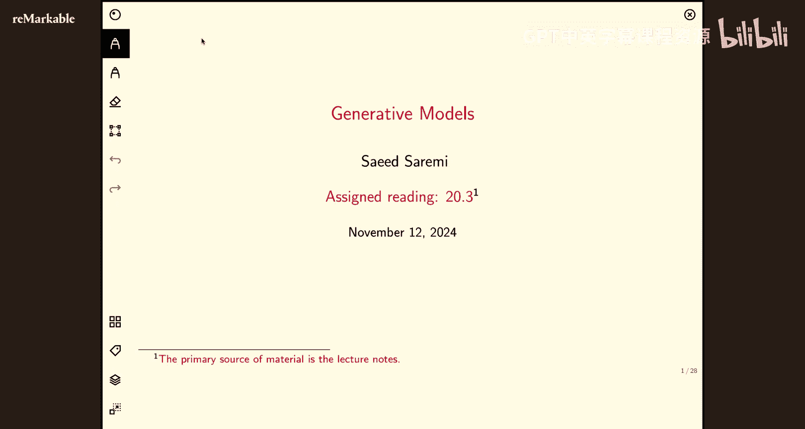
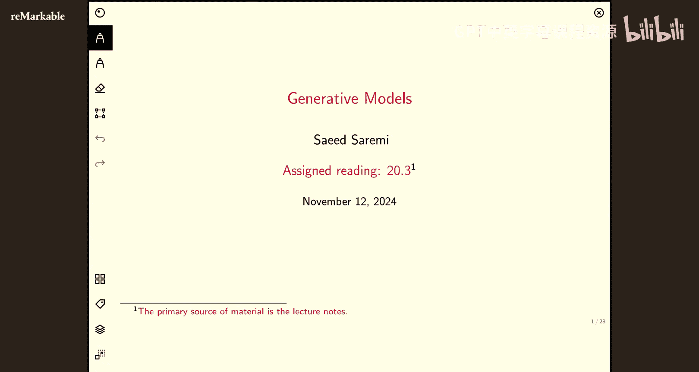
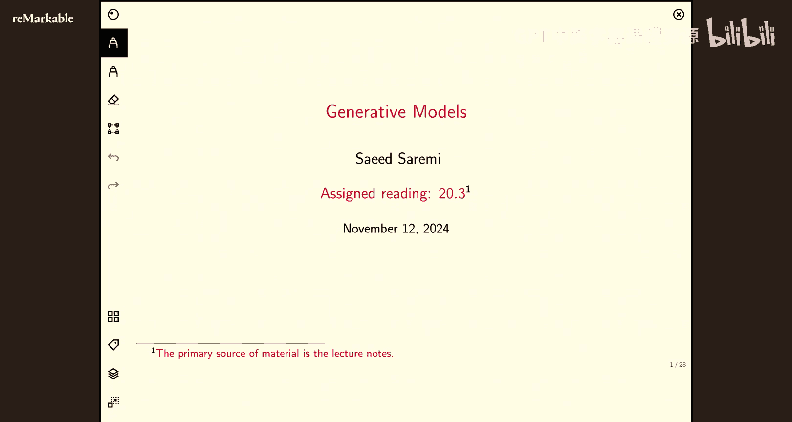
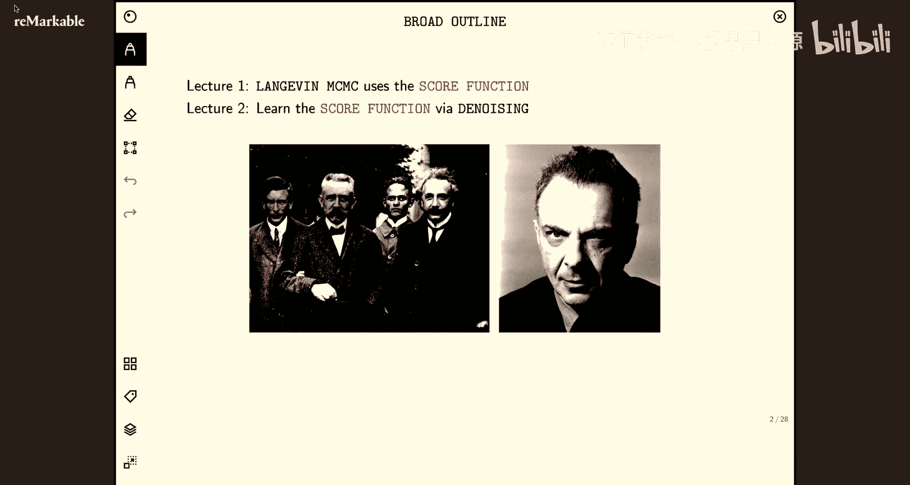
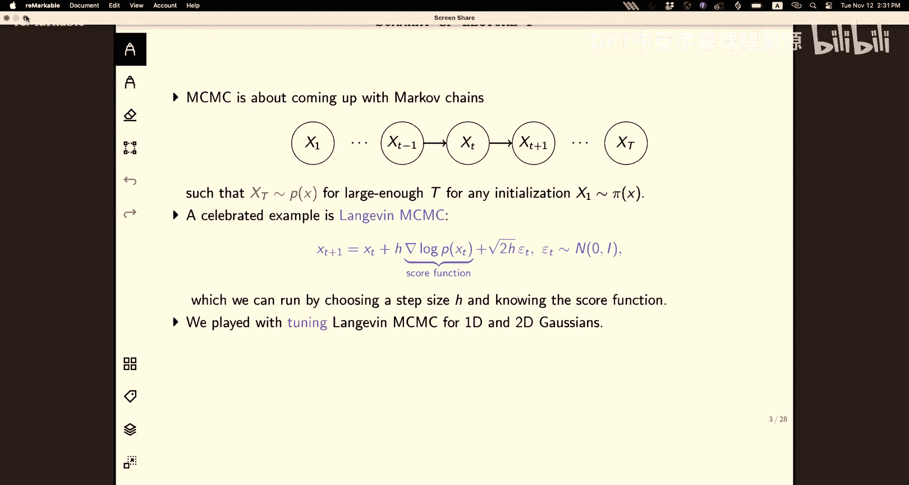
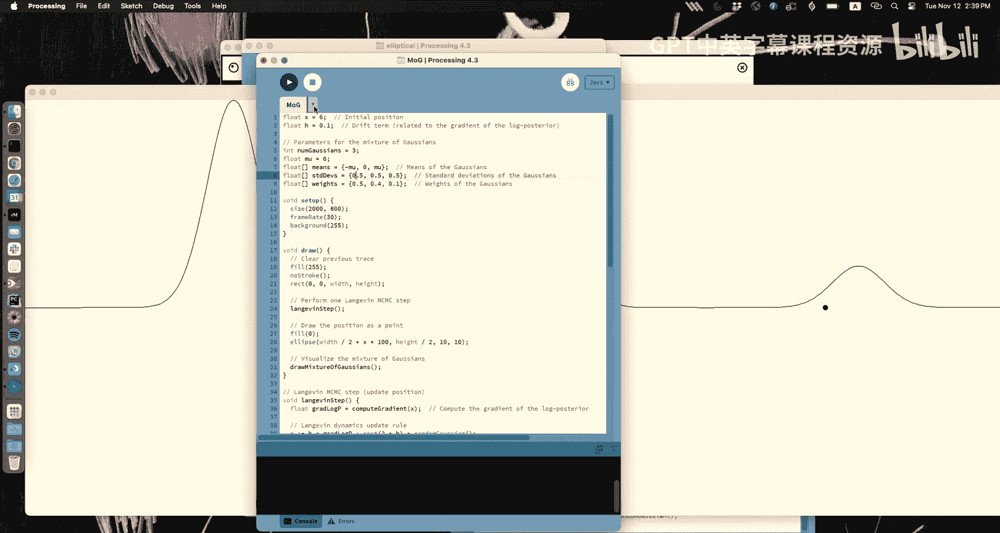
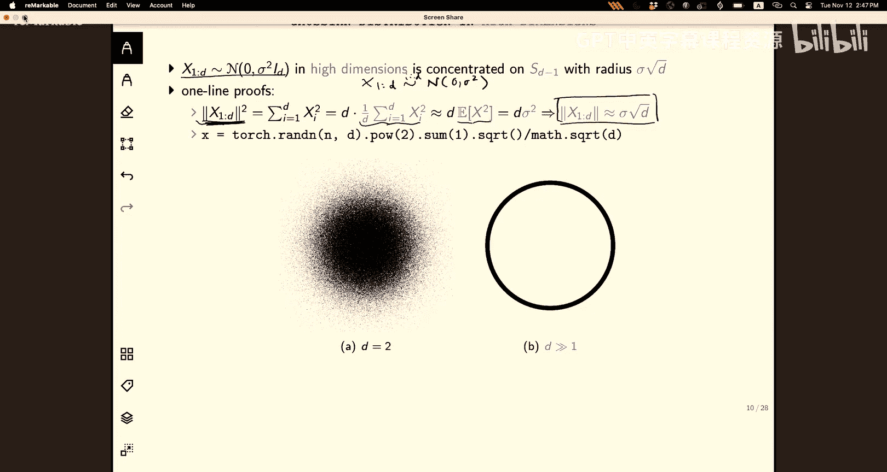
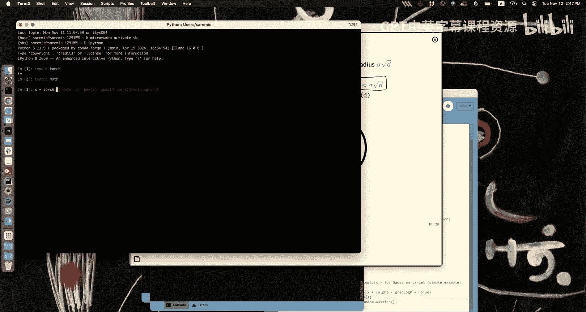
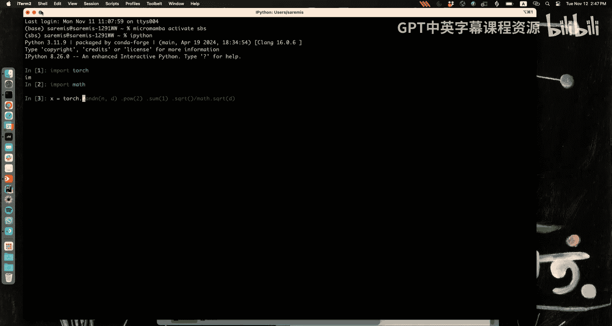
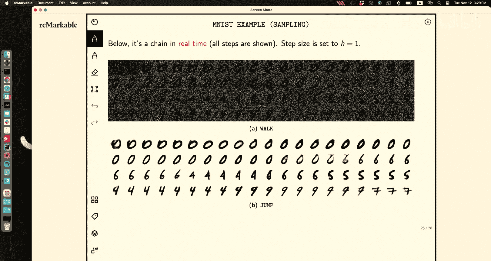

# 22：生成模型 2 🧠














在本节课中，我们将继续学习生成模型。上一讲我们介绍了朗之万动力学，这是一种仅需知道分布的**得分函数**（即对数概率密度的梯度）即可从中采样的方法。然而，该方法在处理多峰分布时可能面临混合缓慢的问题。本节我们将探讨如何**学习得分函数**，并介绍一种通过添加噪声来平滑分布、从而解决采样难题的强大技术。

---

## 朗之万动力学回顾 🔄

上一节我们介绍了朗之万动力学，其核心迭代公式如下：




**公式：朗之万更新规则**
```
x_{t+1} = x_t + η * ∇_x log p(x_t) + √(2η) * z_t
```
其中，`η` 是步长，`z_t ~ N(0, I)` 是标准高斯噪声。

这个公式结合了两种力量：
1.  **梯度项 `∇_x log p(x_t)`**：将粒子拉向高概率区域（模式）。
2.  **噪声项 `√(2η) * z_t`**：提供随机探索，使采样能够覆盖分布的尾部。

我们通过量纲分析理解了公式中 `√(2η)` 的由来：为了保持算法的物理一致性，噪声的幅度必须是步长的平方根。

---

## 朗之万动力学面临的挑战 ⚠️



尽管朗之万动力学在理论上可以采样任意分布，但在实践中，当目标分布具有**分离良好的多峰结构**时，它会遇到严重问题。

以下是朗之万动力学面临的两个主要挑战：

1.  **各向异性协方差问题**：当分布在不同方向上的尺度差异很大时（例如一个被拉长的椭圆高斯分布），为某个方向调优的步长可能使在其他方向上的探索变得极其缓慢。
2.  **多峰混合问题**：这是更关键的问题。当分布有多个被低概率区域（“沙漠”）隔开的峰（模式）时，朗之万链可能被困在其中一个模式中，无法感知和转移到其他模式。这是因为在低概率区域，梯度几乎为零，仅靠噪声难以跨越巨大的概率鸿沟。







为了直观理解，想象一个由三个相距很远、方差很小的高斯分布组成的混合模型。如果一个粒子初始化在其中一个峰上，它很可能永远无法发现另外两个峰的存在。

---

## 解决方案：对数据添加噪声 🌫️

如何解决多峰混合的难题呢？一个巧妙的思路是：**不去直接对复杂的原始数据分布 `p(x)` 进行采样，而是对一个平滑后的、更容易采样的分布进行采样**。

最常用的平滑方法是向原始数据 `x` 添加高斯噪声，得到噪声数据 `y`：
**公式：添加噪声**
```
y = x + σ * ε, 其中 ε ~ N(0, I)
```
这等价于用高斯核与原始分布进行卷积：
**公式：噪声数据分布**
```
p(y) = ∫ p(y|x) p(x) dx = (p * N(0, σ²I))(y)
```

添加噪声的效果有兩種理解方式：

### 几何视角 🌐
在高维空间中，各向同性高斯噪声的样本几乎全部分布在一个以原点为中心、半径为 `σ√d` 的薄球壳上。向数据添加这种噪声，相当于在每个数据点周围放置这样一个“概率球”。当噪声足够大时，这些球壳会相互重叠，从而在原本是“概率沙漠”的区域创造出概率质量，连接起原本分离的模式，使得朗之万动力学更容易在不同模式间穿梭。

### 代数（频谱）视角 📊
从傅里叶变换的角度看，卷积在频域中对应于乘法。高斯噪声的傅里叶变换本身也是一个高斯函数，它会衰减信号的高频成分。
**核心洞察**：添加高斯噪声会**抑制原始分布中的高频振荡**（即那些尖锐的峰和谷），从而产生一个更平滑、低频的分布 `p(y)`。平滑后的分布自然更容易采样。

---

## 罗宾斯定理：从噪声中恢复信号 🔄

现在我们已经有了平滑的噪声数据分布 `p(y)`，并且可以从中相对容易地采样。但我们的最终目标是获得**干净数据** `x` 的样本。如何从噪声样本 `y` 中恢复出 `x` 呢？

这就是赫伯特·罗宾斯在1956年提出的深刻见解。他考虑了一个去噪问题：给定一个噪声观测 `y`，想要估计原始信号 `x`。在均方误差准则下，最优估计器是条件期望：
**公式：最优去噪估计器**
```
x̂(y) = E[x | y]
```
令人惊讶的是，罗宾斯证明了这个条件期望可以**仅用噪声数据的分布 `p(y)` 来表达**，而无需知道真实的干净数据分布 `p(x)`。

对于加性高斯噪声的特殊情况，推导非常优雅：
**推导：得分函数与去噪的关系**
```
∇_y log p(y) = ∇_y p(y) / p(y)
             = ∫ ∇_y p(y|x) p(x) dx / p(y)
             = ∫ [(x - y)/σ²] p(y|x) p(x) dx / p(y)  // 高斯分布梯度性质
             = (1/σ²) [E[x|y] - y]
```
整理后得到关键公式：
**核心公式：得分函数去噪恒等式**
```
x̂(y) = E[x | y] = y + σ² ∇_y log p(y)
```
这个公式表明，**噪声数据分布 `p(y)` 的得分函数直接给出了最优去噪的方向**。我们只需要将当前噪声点 `y` 沿着得分函数的方向移动 `σ²` 倍，就能得到对干净数据 `x` 的最佳估计。

---

## 构建生成模型：去噪得分匹配 🏗️

罗宾斯定理为我们搭建生成模型提供了蓝图：

1.  **学习得分函数**：我们不需要直接建模复杂的 `p(x)`，而是去学习平滑后分布 `p(y)` 的得分函数 `s_θ(y) ≈ ∇_y log p(y)`。这可以通过“去噪得分匹配”目标来实现：
    **训练目标**：训练一个神经网络 `s_θ(y)`，使其预测最优去噪的方向 `(x̂(y) - y)/σ²`。
    在实践中，我们从一个干净数据集中采样 `x`，人工添加噪声得到 `y`，然后训练网络最小化以下损失：
    **代码：去噪得分匹配损失**
    ```python
    # 假设：x_clean 是干净样本，sigma 是噪声水平
    noise = torch.randn_like(x_clean) * sigma
    y_noisy = x_clean + noise
    # 网络 s_theta 试图预测得分
    predicted_score = s_theta(y_noisy)
    # 目标得分是 (x_clean - y_noisy) / sigma**2
    target_score = (x_clean - y_noisy) / sigma**2
    loss = torch.mean((predicted_score - target_score)**2)
    ```

2.  **采样流程**：
    *   **行走（Walk）**：使用学习到的得分函数 `s_θ(y)`，运行朗之万动力学对平滑的噪声分布 `p(y)` 进行采样。这个过程相对高效，因为分布是平滑的。
    *   **跳跃（Jump）**：在行走过程中，我们可以定期（例如每10步）对得到的噪声样本 `y_t` 应用一步去噪操作：`x̂_t = y_t + σ² s_θ(y_t)`，从而获得干净数据样本的估计。

这种“行走-跳跃”的范式解耦了采样和去噪过程。行走阶段专注于从平滑分布中探索，跳跃阶段则利用训练好的网络进行一次性去噪，避免了在耦合的“加噪-去噪”链中误差累积的问题。

---

## 总结 📝

本节课我们一起深入探讨了生成模型中的关键进展：

1.  **回顾了朗之万动力学**，它利用得分函数进行采样，但在多峰分布上存在混合难题。
2.  **引入了添加高斯噪声的思想**作为解决方案，它从几何（连接模式）和频谱（平滑分布）两个角度平滑了目标分布，使采样变得可行。
3.  **介绍了罗宾斯定理**，该定理揭示了噪声数据分布的得分函数与最优去噪估计器之间的等价关系，使我们能够从噪声样本中恢复干净信号。
4.  **构建了完整的生成模型框架**：通过去噪得分匹配学习得分函数，然后采用“行走-跳跃”策略，先对平滑的噪声分布进行朗之万采样，再对结果进行去噪，最终生成高质量的数据样本。



这套方法构成了许多现代扩散模型或基于得分的生成模型的核心思想。通过巧妙地转换问题——从学习复杂分布到学习平滑分布的得分函数，我们成功地绕过了直接采样的困难，开辟了生成建模的新路径。