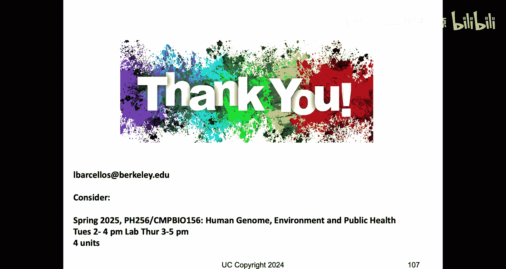
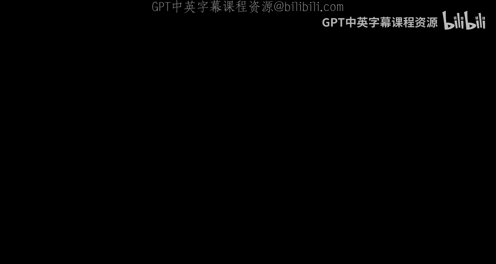
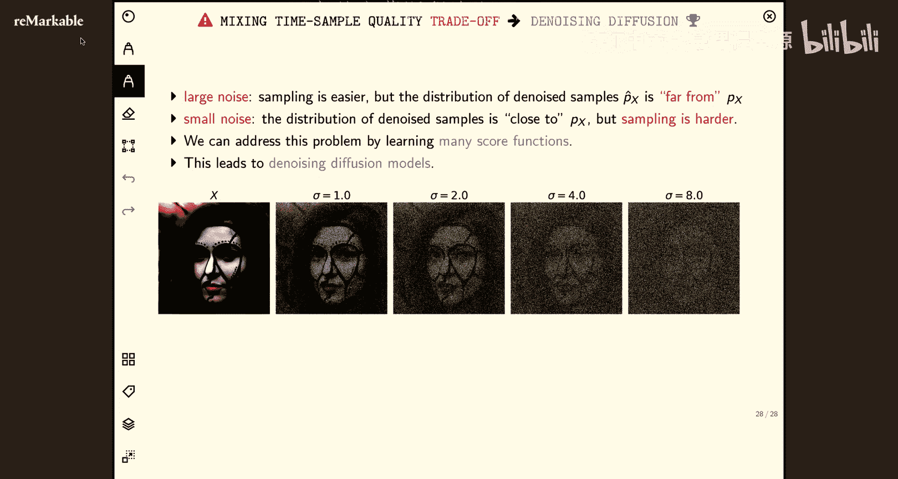
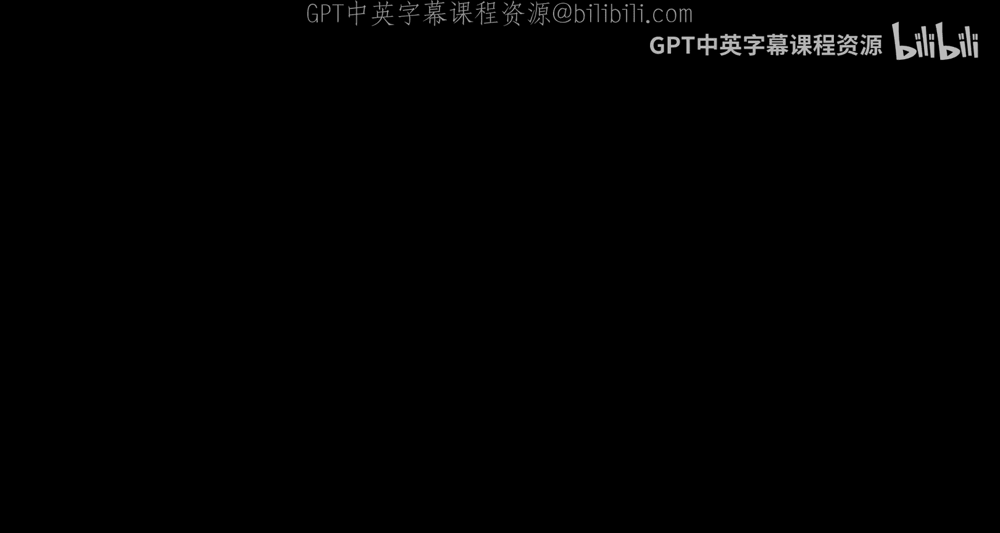
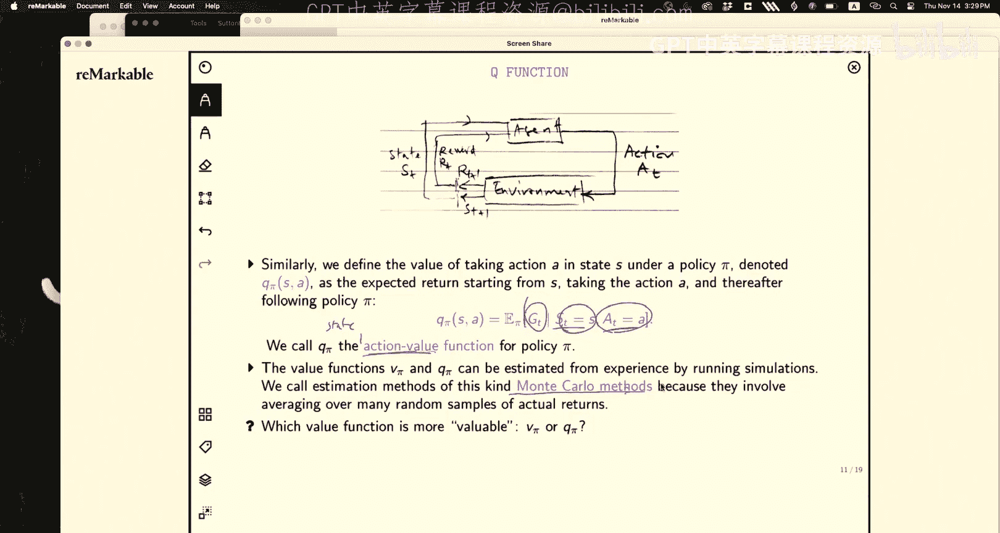

# 23：马尔可夫决策过程与强化学习

在本节课中，我们将学习马尔可夫决策过程的基本概念，这是强化学习的核心框架。我们将从一个简单的网格世界示例开始，逐步理解状态、动作、策略、奖励和价值函数等核心概念，并探讨如何寻找最优策略。

---

## 概述

上一节我们介绍了扩散模型和朗之万动力学采样。本节中，我们将转向一个全新的主题：**马尔可夫决策过程**。这是一种用于建模**顺序决策**问题的数学框架，是强化学习的基础。我们将从一个具体的网格世界示例入手，直观地理解智能体如何与环境交互以最大化累积奖励。

---

## 马尔可夫决策过程：一个直观示例

为了理解MDP，我们首先考虑一个简单的网格世界环境。这是一个4行3列（4x3）的网格。

*   **状态**：网格中的每个单元格（除了墙壁和终点）都是一个状态 `s`。智能体从指定的起始状态开始。
*   **动作**：在每个状态，智能体可以采取的动作集合是 `{上， 下， 左， 右}`。
*   **转移模型**：环境是随机的。当智能体选择一个方向（例如“右”）时：
    *   以 **0.8** 的概率成功移动到目标单元格。
    *   以 **0.1** 的概率滑到垂直方向（例如“上”或“下”）。
    *   以 **0.1** 的概率滑到相反方向（例如“左”）。
    *   如果移动会导致撞墙，则智能体停留在原地。
*   **奖励**：智能体在每次状态转移时会获得即时奖励 `r`。大多数单元格的奖励是一个小的负值（例如 `-0.04`），表示“生存成本”。有两个特殊的**终止状态**：
    *   **+1** 奖励状态（目标）。
    *   **-1** 奖励状态（陷阱）。
    进入终止状态后，游戏结束。
*   **策略**：策略 `π` 是一个从状态到动作的映射。它告诉智能体在每个状态下应该做什么。对于这个有限网格，可能的确定性策略数量是 `4^(状态数)`。

智能体的目标是找到一个策略，使得从起始状态开始所获得的**期望累积奖励**最大化。

---

## 形式化定义与核心概念

上一节我们通过网格世界直观感受了MDP。本节中我们来看看如何形式化地定义它。

一个马尔可夫决策过程由以下五元组定义：`(S, A, P, R, γ)`。

*   **S**: 状态集合。
*   **A**: 动作集合。
*   **P**: 转移概率。`P(s' | s, a)` 表示在状态 `s` 执行动作 `a` 后，转移到状态 `s'` 的概率。这体现了环境的随机性。
*   **R**: 奖励函数。`R(s, a, s')` 表示在状态 `s` 执行动作 `a` 并到达状态 `s'` 后获得的即时奖励。
*   **γ**: 折扣因子，范围在 `[0, 1]` 之间。用于对未来奖励进行折现，保证无限时间步的累积奖励有限。

**马尔可夫性质**是核心假设：下一时刻的状态 `s_{t+1}` 和奖励 `r_{t+1}` 仅依赖于当前状态 `s_t` 和当前动作 `a_t`，而与历史无关。即：
`P(s_{t+1}, r_{t+1} | s_t, a_t, s_{t-1}, a_{t-1}, ...) = P(s_{t+1}, r_{t+1} | s_t, a_t)`

---

## 策略与价值函数

理解了MDP的基本构成后，我们需要定义智能体的行为准则以及如何评估其好坏。

*   **策略**：策略 `π` 定义了智能体的行为方式。它可以是确定性的（`a = π(s)`），也可以是随机性的（`π(a|s)` 表示在状态 `s` 下选择动作 `a` 的概率）。
*   **回报**：从时间 `t` 开始的累积折现奖励称为回报 `G_t`：
    `G_t = r_{t+1} + γ * r_{t+2} + γ^2 * r_{t+3} + ...`
*   **状态价值函数**：在策略 `π` 下，状态 `s` 的价值 `V^π(s)` 是从状态 `s` 开始，遵循策略 `π` 所能获得的**期望回报**。
    `V^π(s) = E_π[ G_t | s_t = s ]`
    它衡量了处于某个状态的“长期”好坏。
*   **动作价值函数**：在策略 `π` 下，在状态 `s` 执行动作 `a` 的价值 `Q^π(s, a)` 是执行动作 `a` 后，再遵循策略 `π` 所能获得的**期望回报**。
    `Q^π(s, a) = E_π[ G_t | s_t = s, a_t = a ]`
    它衡量了在某个状态下执行某个特定动作的“长期”价值。

`V^π(s)` 和 `Q^π(s, a)` 的关系是：`V^π(s)` 是 `Q^π(s, a)` 在策略 `π` 下的期望值。
`V^π(s) = Σ_{a ∈ A} π(a|s) * Q^π(s, a)`

---

## 最优策略与贝尔曼方程

我们知道了如何评估一个给定策略。那么，如何找到最优策略 `π*` 呢？

最优策略是能够最大化所有状态价值函数的策略。对应的最优状态价值函数和最优动作价值函数定义为：
`V*(s) = max_π V^π(s)`
`Q*(s, a) = max_π Q^π(s, a)`

这些最优价值函数满足著名的**贝尔曼最优性方程**：

对于 `V*(s)`：
`V*(s) = max_a Σ_{s'} P(s'|s, a) * [ R(s, a, s') + γ * V*(s') ]`

对于 `Q*(s, a)`：
`Q*(s, a) = Σ_{s'} P(s'|s, a) * [ R(s, a, s') + γ * max_{a'} Q*(s', a') ]`

这些方程是递归的，指出一个状态（或状态-动作对）的最优价值，等于所有可能后续状态的最优价值的折现期望加上即时奖励，并在当前动作（对 `V*`）或下一动作（对 `Q*`）上取最大值。

一旦我们知道了 `Q*(s, a)`，最优策略就很容易得到：在每个状态 `s`，选择使 `Q*(s, a)` 最大的动作 `a`。
`π*(s) = argmax_a Q*(s, a)`

---

## 总结

本节课中我们一起学习了**马尔可夫决策过程**的基础知识。我们从网格世界的例子出发，理解了状态、动作、转移概率、奖励等基本要素。然后，我们定义了策略、回报以及核心的**状态价值函数 `V^π(s)`** 和**动作价值函数 `Q^π(s, a)`**。最后，我们引入了最优策略的概念，并介绍了**贝尔曼最优性方程**，该方程为求解最优策略提供了理论基础。

下一讲，我们将探讨如何利用动态规划等方法来实际求解这些方程，从而找到最优策略。